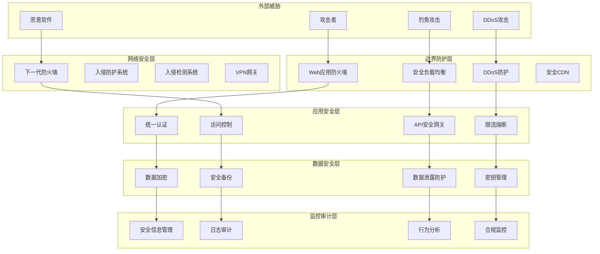

# 安全策略和最佳实践

## 目录
- [安全架构概述](#安全架构概述)
- [身份认证和授权](#身份认证和授权)
- [数据安全保护](#数据安全保护)
- [网络安全防护](#网络安全防护)
- [应用安全开发](#应用安全开发)
- [基础设施安全](#基础设施安全)
- [数据传输安全](#数据传输安全)
- [安全监控和审计](#安全监控和审计)
- [安全合规要求](#安全合规要求)
- [应急响应流程](#应急响应流程)

## 安全架构概述

统一幼儿园管理系统采用多层次安全防护体系，确保系统和数据的完整性、机密性和可用性。

### 安全架构图



### 安全原则

1. **纵深防御**: 多层防护机制
2. **最小权限**: 最小化访问权限
3. **零信任**: 不信任任何内部网络
4. **默认安全**: 默认启用安全配置
5. **持续监控**: 实时安全监控
6. **快速响应**: 快速检测和响应安全事件

## 身份认证和授权

### 认证安全策略

**多因素认证(MFA):**
```typescript
// src/auth/mfa.service.ts
import speakeasy from 'speakeasy';
import qrcode from 'qrcode';

@Injectable()
export class MFAService {
  // 生成MFA密钥
  generateSecret(user: User): MFASetupResponse {
    const secret = speakeasy.generateSecret({
      name: `Kindergarten (${user.email})`,
      issuer: 'Kindergarten System',
      length: 32,
    });

    return {
      secret: secret.base32,
      qrCode: null,
      backupCodes: this.generateBackupCodes(),
    };
  }

  // 生成二维码
  async generateQRCode(secret: string): Promise<string> {
    const otpauthUrl = speakeasy.otpauthURL({
      secret,
      label: 'Kindergarten System',
      issuer: 'Kindergarten System',
    });

    return await qrcode.toDataURL(otpauthUrl);
  }

  // 验证MFA代码
  verifyToken(secret: string, token: string): boolean {
    return speakeasy.totp.verify({
      secret,
      encoding: 'base32',
      token,
      window: 2, // 允许时间窗口
    });
  }

  // 生成备用恢复代码
  private generateBackupCodes(): string[] {
    const codes = [];
    for (let i = 0; i < 10; i++) {
      codes.push(crypto.randomBytes(4).toString('hex'));
    }
    return codes;
  }
}
```

**JWT安全配置:**
```typescript
// src/auth/jwt.service.ts
import jwt from 'jsonwebtoken';
import { ConfigService } from '@nestjs/config';

@Injectable()
export class JWTService {
  private readonly secret: string;
  private readonly issuer: string;
  private readonly audience: string;

  constructor(private readonly configService: ConfigService) {
    this.secret = this.configService.get<string>('JWT_SECRET');
    this.issuer = this.configService.get<string>('JWT_ISSUER');
    this.audience = this.configService.get<string>('JWT_AUDIENCE');
  }

  // 生成访问令牌
  generateAccessToken(user: User): string {
    return jwt.sign(
      {
        sub: user.id,
        tenantId: user.tenantId,
        roles: user.roles,
        permissions: user.permissions,
        type: 'access',
      },
      this.secret,
      {
        expiresIn: this.configService.get<string>('JWT_EXPIRES_IN'),
        issuer: this.issuer,
        audience: this.audience,
        algorithm: 'HS256',
        keyid: this.getKeyId(),
      }
    );
  }

  // 生成刷新令牌
  generateRefreshToken(user: User): string {
    return jwt.sign(
      {
        sub: user.id,
        tenantId: user.tenantId,
        type: 'refresh',
      },
      this.secret,
      {
        expiresIn: this.configService.get<string>('JWT_REFRESH_EXPIRES_IN'),
        issuer: this.issuer,
        audience: this.audience,
        algorithm: 'HS256',
        keyid: this.getKeyId(),
      }
    );
  }

  // 验证令牌
  verifyToken(token: string): any {
    try {
      return jwt.verify(token, this.secret, {
        issuer: this.issuer,
        audience: this.audience,
        algorithms: ['HS256'],
      });
    } catch (error) {
      throw new UnauthorizedException('无效的访问令牌');
    }
  }

  // 令牌黑名单检查
  async isTokenBlacklisted(jti: string): Promise<boolean> {
    const result = await this.redis.get(`blacklist:${jti}`);
    return !!result;
  }

  // 将令牌加入黑名单
  async blacklistToken(jti: string, exp: number): Promise<void> {
    const ttl = Math.max(exp - Math.floor(Date.now() / 1000), 0);
    await this.redis.setex(`blacklist:${jti}`, ttl, '1');
  }

  private getKeyId(): string {
    return crypto.createHash('sha256')
      .update(this.secret)
      .digest('hex')
      .substring(0, 8);
  }
}
```

### 授权安全控制

**RBAC权限控制:**
```typescript
// src/auth/rbac.decorator.ts
import { SetMetadata } from '@nestjs/common';

// 权限装饰器
export const Permissions = (...permissions: string[]) =>
  SetMetadata('permissions', permissions);

// 角色装饰器
export const Roles = (...roles: string[]) =>
  SetMetadata('roles', roles);

// 租户权限装饰器
export const TenantPermission = (permission: string) =>
  SetMetadata('tenantPermission', permission);
```

**权限检查守卫:**
```typescript
// src/auth/permissions.guard.ts
import { CanActivate, ExecutionContext, Injectable } from '@nestjs/common';
import { Reflector } from '@nestjs/core';

@Injectable()
export class PermissionsGuard implements CanActivate {
  constructor(private readonly reflector: Reflector) {}

  async canActivate(context: ExecutionContext): Promise<boolean> {
    const requiredPermissions = this.reflector.get<string[]>(
      'permissions',
      context.getHandler()
    );

    const requiredRoles = this.reflector.get<string[]>(
      'roles',
      context.getHandler()
    );

    if (!requiredPermissions && !requiredRoles) {
      return true;
    }

    const request = context.switchToHttp().getRequest();
    const user = request.user;

    if (!user) {
      throw new UnauthorizedException('用户未认证');
    }

    // 检查角色
    if (requiredRoles) {
      const hasRole = requiredRoles.some(role =>
        user.roles.includes(role)
      );
      if (!hasRole) {
        throw new ForbiddenException('权限不足');
      }
    }

    // 检查权限
    if (requiredPermissions) {
      const hasPermission = requiredPermissions.some(permission =>
        user.permissions.includes(permission)
      );
      if (!hasPermission) {
        throw new ForbiddenException('权限不足');
      }
    }

    return true;
  }
}
```

### 会话安全

**会话管理:**
```typescript
// src/auth/session.service.ts
import { Redis } from 'ioredis';

@Injectable()
export class SessionService {
  constructor(private readonly redis: Redis) {}

  // 创建会话
  async createSession(user: User, deviceInfo: any): Promise<string> {
    const sessionId = crypto.randomUUID();
    const sessionData = {
      userId: user.id,
      tenantId: user.tenantId,
      roles: user.roles,
      permissions: user.permissions,
      deviceInfo,
      createdAt: new Date(),
      lastActivity: new Date(),
    };

    // 存储会话信息，有效期24小时
    await this.redis.setex(
      `session:${sessionId}`,
      24 * 60 * 60,
      JSON.stringify(sessionData)
    );

    return sessionId;
  }

  // 验证会话
  async validateSession(sessionId: string): Promise<any> {
    const sessionData = await this.redis.get(`session:${sessionId}`);

    if (!sessionData) {
      throw new UnauthorizedException('会话已过期');
    }

    const session = JSON.parse(sessionData);

    // 更新最后活动时间
    session.lastActivity = new Date();
    await this.redis.setex(
      `session:${sessionId}`,
      24 * 60 * 60,
      JSON.stringify(session)
    );

    return session;
  }

  // 撤销会话
  async revokeSession(sessionId: string): Promise<void> {
    await this.redis.del(`session:${sessionId}`);
  }

  // 撤销用户所有会话
  async revokeAllUserSessions(userId: string): Promise<void> {
    const keys = await this.redis.keys('session:*');

    for (const key of keys) {
      const sessionData = await this.redis.get(key);
      if (sessionData) {
        const session = JSON.parse(sessionData);
        if (session.userId === userId) {
          await this.redis.del(key);
        }
      }
    }
  }

  // 获取用户活跃会话
  async getUserActiveSessions(userId: string): Promise<any[]> {
    const keys = await this.redis.keys('session:*');
    const userSessions = [];

    for (const key of keys) {
      const sessionData = await this.redis.get(key);
      if (sessionData) {
        const session = JSON.parse(sessionData);
        if (session.userId === userId) {
          userSessions.push({
            sessionId: key.replace('session:', ''),
            ...session,
          });
        }
      }
    }

    return userSessions;
  }
}
```

## 数据安全保护

### 敏感数据加密

**数据加密服务:**
```typescript
// src/security/encryption.service.ts
import crypto from 'crypto';
import { ConfigService } from '@nestjs/config';

@Injectable()
export class EncryptionService {
  private readonly algorithm = 'aes-256-gcm';
  private readonly keyLength = 32;
  private readonly ivLength = 16;
  private readonly tagLength = 16;

  constructor(private readonly configService: ConfigService) {
    this.masterKey = this.getMasterKey();
  }

  private masterKey: Buffer;

  // 加密敏感数据
  encrypt(plaintext: string): EncryptedData {
    const iv = crypto.randomBytes(this.ivLength);
    const cipher = crypto.createCipher(this.algorithm, this.masterKey);
    cipher.setAAD(Buffer.from('kindergarten'));

    let encrypted = cipher.update(plaintext, 'utf8', 'hex');
    encrypted += cipher.final('hex');

    const tag = cipher.getAuthTag();

    return {
      encrypted,
      iv: iv.toString('hex'),
      tag: tag.toString('hex'),
    };
  }

  // 解密敏感数据
  decrypt(data: EncryptedData): string {
    const decipher = crypto.createDecipher(this.algorithm, this.masterKey);
    decipher.setAAD(Buffer.from('kindergarten'));
    decipher.setAuthTag(Buffer.from(data.tag, 'hex'));

    let decrypted = decipher.update(data.encrypted, 'hex', 'utf8');
    decrypted += decipher.final('utf8');

    return decrypted;
  }

  // 哈希密码
  hashPassword(password: string): string {
    const salt = crypto.randomBytes(16).toString('hex');
    const hash = crypto.pbkdf2Sync(password, salt, 100000, 64, 'sha512');
    return `${salt}:${hash.toString('hex')}`;
  }

  // 验证密码
  verifyPassword(password: string, hashedPassword: string): boolean {
    const [salt, hash] = hashedPassword.split(':');
    const hashVerify = crypto.pbkdf2Sync(password, salt, 100000, 64, 'sha512');
    return hashVerify.toString('hex') === hash;
  }

  private getMasterKey(): Buffer {
    const keySource = this.configService.get<string>('MASTER_KEY_SOURCE');

    switch (keySource) {
      case 'kms':
        return this.getKMSKey();
      case 'vault':
        return this.getVaultKey();
      case 'env':
      default:
        const key = this.configService.get<string>('MASTER_KEY');
        if (!key) {
          throw new Error('MASTER_KEY未配置');
        }
        return Buffer.from(key, 'hex');
    }
  }

  private async getKMSKey(): Promise<Buffer> {
    // 从AWS KMS获取密钥
    // 实现KMS集成逻辑
    return Buffer.from('kms-key-here', 'hex');
  }

  private async getVaultKey(): Promise<Buffer> {
    // 从HashiCorp Vault获取密钥
    // 实现Vault集成逻辑
    return Buffer.from('vault-key-here', 'hex');
  }
}

interface EncryptedData {
  encrypted: string;
  iv: string;
  tag: string;
}
```

**数据脱敏处理:**
```typescript
// src/security/masking.service.ts
@Injectable()
export class MaskingService {
  // 脱敏手机号
  maskPhone(phone: string): string {
    if (!phone || phone.length < 11) return phone;
    return phone.replace(/(\d{3})\d{4}(\d{4})/, '$1****$2');
  }

  // 脱敏邮箱
  maskEmail(email: string): string {
    if (!email || !email.includes('@')) return email;
    const [username, domain] = email.split('@');
    if (username.length <= 2) return email;
    return `${username.substring(0, 2)}****@${domain}`;
  }

  // 脱敏身份证号
  maskIdCard(idCard: string): string {
    if (!idCard || idCard.length < 18) return idCard;
    return idCard.replace(/(\d{6})\d{8}(\d{4})/, '$1********$2');
  }

  // 脱敏姓名
  maskName(name: string): string {
    if (!name || name.length <= 2) return name;
    return name.substring(0, 1) + '*'.repeat(name.length - 2) + name.substring(name.length - 1);
  }

  // 通用脱敏
  maskData(data: any, sensitiveFields: string[]): any {
    if (!data || typeof data !== 'object') return data;

    const maskedData = { ...data };

    for (const field of sensitiveFields) {
      if (maskedData[field]) {
        switch (field) {
          case 'phone':
            maskedData[field] = this.maskPhone(maskedData[field]);
            break;
          case 'email':
            maskedData[field] = this.maskEmail(maskedData[field]);
            break;
          case 'idCard':
            maskedData[field] = this.maskIdCard(maskedData[field]);
            break;
          case 'name':
            maskedData[field] = this.maskName(maskedData[field]);
            break;
          default:
            maskedData[field] = '***';
        }
      }
    }

    return maskedData;
  }
}
```

### 数据库安全

**数据库安全配置:**
```sql
-- 创建专用数据库用户
CREATE USER 'app_user'@'%' IDENTIFIED BY 'StrongPassword123!';
CREATE USER 'readonly_user'@'%' IDENTIFIED BY 'ReadOnlyPassword123!';

-- 授权原则
GRANT SELECT, INSERT, UPDATE, DELETE ON kindergarten.* TO 'app_user'@'%';
GRANT SELECT ON kindergarten.* TO 'readonly_user'@'%';

-- 禁止危险操作
REVOKE ALL PRIVILEGES ON mysql.* FROM 'app_user'@'%';
REVOKE ALL PRIVILEGES ON information_schema.* FROM 'app_user'@'%';
REVOKE ALL PRIVILEGES ON performance_schema.* FROM 'app_user'@'%';

-- 行级安全策略
CREATE DATABASE kindergarten
CHARACTER SET utf8mb4 COLLATE utf8mb4_unicode_ci
DEFAULT ENCRYPTION='Y';
```

**SQL注入防护:**
```typescript
// src/database/sql-injection.guard.ts
@Injectable()
export class SqlInjectionGuard {
  private readonly dangerousPatterns = [
    /(\b(SELECT|INSERT|UPDATE|DELETE|DROP|CREATE|ALTER|EXEC|UNION|SCRIPT)\b)/gi,
    /(\b(OR|AND)\s+\d+\s*=\s*\d+)/gi,
    /(\b(OR|AND)\s+\d+\s*=\s*\d+)/gi,
    /(--|\/\*|\*\/|;|'|")/g,
  ];

  // 检测SQL注入
  detectSqlInjection(input: string): boolean {
    if (!input || typeof input !== 'string') return false;

    return this.dangerousPatterns.some(pattern => pattern.test(input));
  }

  // 清理输入参数
  sanitizeInput(input: any): any {
    if (typeof input === 'string') {
      return this.sanitizeString(input);
    }

    if (Array.isArray(input)) {
      return input.map(item => this.sanitizeInput(item));
    }

    if (typeof input === 'object' && input !== null) {
      const sanitized = {};
      for (const [key, value] of Object.entries(input)) {
        sanitized[key] = this.sanitizeInput(value);
      }
      return sanitized;
    }

    return input;
  }

  private sanitizeString(str: string): string {
    // 移除危险字符
    return str
      .replace(/['"]/g, '')
      .replace(/--/g, '')
      .replace(/\/\*/g, '')
      .replace(/\*\//g, '')
      .replace(/;/g, '')
      .trim();
  }
}
```

## 网络安全防护

### API安全网关

**API安全中间件:**
```typescript
// src/gateway/security.middleware.ts
import { Injectable, NestMiddleware } from '@nestjs/common';
import { Request, Response, NextFunction } from 'express';

@Injectable()
export class SecurityMiddleware implements NestMiddleware {
  use(req: Request, res: Response, next: NextFunction) {
    // 设置安全头
    res.setHeader('X-Content-Type-Options', 'nosniff');
    res.setHeader('X-Frame-Options', 'DENY');
    res.setHeader('X-XSS-Protection', '1; mode=block');
    res.setHeader('Strict-Transport-Security', 'max-age=31536000; includeSubDomains');
    res.setHeader('Content-Security-Policy', "default-src 'self'");
    res.setHeader('Referrer-Policy', 'strict-origin-when-cross-origin');

    // 移除服务器信息
    res.removeHeader('Server');
    res.removeHeader('X-Powered-By');

    next();
  }
}
```

**IP白名单控制:**
```typescript
// src/gateway/ip-whitelist.guard.ts
@Injectable()
export class IpWhitelistGuard implements CanActivate {
  private readonly whitelistedIPs = [
    '192.168.1.0/24',
    '10.0.0.0/8',
    '127.0.0.1',
  ];

  constructor() {
    this.loadWhitelist();
  }

  async canActivate(context: ExecutionContext): Promise<boolean> {
    const request = context.switchToHttp().getRequest();
    const clientIP = this.getClientIP(request);

    if (this.isIPAllowed(clientIP)) {
      return true;
    }

    throw new ForbiddenException(`IP ${clientIP} 不在白名单中`);
  }

  private getClientIP(request: Request): string {
    return request.headers['x-forwarded-for'] as string ||
           request.headers['x-real-ip'] as string ||
           request.connection.remoteAddress ||
           request.socket.remoteAddress ||
           '';
  }

  private isIPAllowed(ip: string): boolean {
    for (const allowed of this.whitelistedIPs) {
      if (this.ipInCIDR(ip, allowed)) {
        return true;
      }
    }
    return false;
  }

  private ipInCIDR(ip: string, cidr: string): boolean {
    const [network, prefixLength] = cidr.split('/');
    const networkLong = this.ipToLong(network);
    const ipLong = this.ipToLong(ip);
    const mask = (0xffffffff << (32 - parseInt(prefixLength))) >>> 0;

    return (networkLong & mask) === (ipLong & mask);
  }

  private ipToLong(ip: string): number {
    return ip.split('.').reduce((acc, octet) => (acc << 8) + parseInt(octet), 0) >>> 0;
  }

  private loadWhitelist(): void {
    // 从配置文件或数据库加载白名单
    const whitelist = process.env.IP_WHITELIST;
    if (whitelist) {
      this.whitelistedIPs.push(...whitelist.split(','));
    }
  }
}
```

### DDoS防护

**限流配置:**
```typescript
// src/gateway/rate-limit.service.ts
import { Redis } from 'ioredis';

@Injectable()
export class RateLimitService {
  constructor(private readonly redis: Redis) {}

  // 滑动窗口限流
  async isAllowed(
    key: string,
    limit: number,
    window: number
  ): Promise<{ allowed: boolean; remaining: number; resetTime: number }> {
    const now = Date.now();
    const windowStart = now - window * 1000;

    // 移除过期的请求记录
    await this.redis.zremrangebyscore(key, 0, windowStart);

    // 获取当前窗口内的请求数
    const requests = await this.redis.zcard(key);

    if (requests >= limit) {
      const oldestRequest = await this.redis.zrange(key, 0, 0, 'WITHSCORES');
      const resetTime = parseInt(oldestRequest[1]) + window * 1000;

      return {
        allowed: false,
        remaining: 0,
        resetTime,
      };
    }

    // 记录当前请求
    await this.redis.zadd(key, now, `${now}-${Math.random()}`);
    await this.redis.expire(key, window);

    return {
      allowed: true,
      remaining: limit - requests - 1,
      resetTime: now + window * 1000,
    };
  }

  // 令牌桶限流
  async tokenBucket(
    key: string,
    capacity: number,
    refillRate: number
  ): Promise<{ allowed: boolean; tokens: number }> {
    const now = Date.now();

    // 获取当前令牌数量和上次更新时间
    const result = await this.redis.hmget(key, 'tokens', 'lastRefill');
    let tokens = parseFloat(result[0] || capacity.toString());
    let lastRefill = parseInt(result[1] || now.toString());

    // 计算需要补充的令牌
    const elapsed = (now - lastRefill) / 1000;
    const tokensToAdd = elapsed * refillRate;
    tokens = Math.min(capacity, tokens + tokensToAdd);

    if (tokens >= 1) {
      tokens -= 1;
      await this.redis.hmset(key, {
        tokens: tokens.toString(),
        lastRefill: now.toString(),
      });
      await this.redis.expire(key, Math.ceil(capacity / refillRate));

      return { allowed: true, tokens };
    }

    await this.redis.hmset(key, {
      tokens: tokens.toString(),
      lastRefill: now.toString(),
    });

    return { allowed: false, tokens };
  }
}
```

## 应用安全开发

### 输入验证

**输入验证中间件:**
```typescript
// src/security/validation.middleware.ts
import { Request, Response, NextFunction } from 'express';

export class ValidationMiddleware {
  // XSS防护
  static xssProtection(req: Request, res: Response, next: NextFunction) {
    const sanitize = (obj: any): any => {
      if (typeof obj === 'string') {
        return obj
          .replace(/&/g, '&amp;')
          .replace(/</g, '&lt;')
          .replace(/>/g, '&gt;')
          .replace(/"/g, '&quot;')
          .replace(/'/g, '&#x27;');
      }

      if (Array.isArray(obj)) {
        return obj.map(sanitize);
      }

      if (typeof obj === 'object' && obj !== null) {
        const sanitized = {};
        for (const [key, value] of Object.entries(obj)) {
          sanitized[key] = sanitize(value);
        }
        return sanitized;
      }

      return obj;
    };

    req.body = sanitize(req.body);
    req.query = sanitize(req.query);
    req.params = sanitize(req.params);

    next();
  }

  // 文件上传安全检查
  static fileUploadSecurity(req: Request, res: Response, next: NextFunction) {
    if (req.file) {
      const file = req.file;

      // 检查文件类型
      const allowedTypes = ['image/jpeg', 'image/png', 'image/gif', 'application/pdf'];
      if (!allowedTypes.includes(file.mimetype)) {
        return res.status(400).json({ error: '不允许的文件类型' });
      }

      // 检查文件大小
      const maxSize = 10 * 1024 * 1024; // 10MB
      if (file.size > maxSize) {
        return res.status(400).json({ error: '文件大小超出限制' });
      }

      // 检查文件扩展名
      const allowedExtensions = ['.jpg', '.jpeg', '.png', '.gif', '.pdf'];
      const fileExtension = file.originalname.toLowerCase().substring(file.originalname.lastIndexOf('.'));
      if (!allowedExtensions.includes(fileExtension)) {
        return res.status(400).json({ error: '不允许的文件扩展名' });
      }

      // 重新命名文件
      const randomName = crypto.randomBytes(16).toString('hex') + fileExtension;
      file.filename = randomName;
    }

    next();
  }
}
```

### 安全编码实践

**安全编码规范:**
```typescript
// src/security/secure-coding.service.ts
@Injectable()
export class SecureCodingService {
  // 安全的密码生成
  generateSecurePassword(length: number = 12): string {
    const charset = 'ABCDEFGHIJKLMNOPQRSTUVWXYZabcdefghijklmnopqrstuvwxyz0123456789!@#$%^&*';
    let password = '';

    // 确保包含大写字母、小写字母、数字和特殊字符
    const uppercase = 'ABCDEFGHIJKLMNOPQRSTUVWXYZ';
    const lowercase = 'abcdefghijklmnopqrstuvwxyz';
    const numbers = '0123456789';
    const special = '!@#$%^&*';

    password += uppercase[Math.floor(Math.random() * uppercase.length)];
    password += lowercase[Math.floor(Math.random() * lowercase.length)];
    password += numbers[Math.floor(Math.random() * numbers.length)];
    password += special[Math.floor(Math.random() * special.length)];

    // 填充剩余长度
    for (let i = 4; i < length; i++) {
      password += charset[Math.floor(Math.random() * charset.length)];
    }

    // 打乱字符顺序
    return password.split('').sort(() => Math.random() - 0.5).join('');
  }

  // 安全的随机数生成
  generateSecureRandom(length: number): string {
    return crypto.randomBytes(length).toString('hex');
  }

  // 安全的Token生成
  generateSecureToken(): string {
    return crypto.randomBytes(32).toString('hex');
  }

  // 防止时序攻击的比较
  timingSafeEqual(a: string, b: string): boolean {
    if (a.length !== b.length) {
      return false;
    }

    let result = 0;
    for (let i = 0; i < a.length; i++) {
      result |= a.charCodeAt(i) ^ b.charCodeAt(i);
    }

    return result === 0;
  }

  // 安全的重定向
  safeRedirect(url: string, allowedDomains: string[]): boolean {
    try {
      const parsedUrl = new URL(url);

      // 只允许http和https协议
      if (!['http:', 'https:'].includes(parsedUrl.protocol)) {
        return false;
      }

      // 检查域名白名单
      if (allowedDomains.length > 0) {
        return allowedDomains.some(domain =>
          parsedUrl.hostname === domain ||
          parsedUrl.hostname.endsWith(`.${domain}`)
        );
      }

      return true;
    } catch {
      return false;
    }
  }
}
```

## 基础设施安全

### 容器安全

**Docker安全配置:**
```dockerfile
# 使用最小基础镜像
FROM node:18-alpine AS builder

# 创建非root用户
RUN addgroup -g 1001 -S nodejs && \
    adduser -S nodejs -u 1001

# 复制依赖文件
COPY package*.json ./
RUN npm ci --only=production && npm cache clean --force

# 复制源代码
COPY . .

# 构建应用
RUN npm run build

# 生产镜像
FROM node:18-alpine AS production

# 安装安全更新
RUN apk update && apk upgrade && \
    apk add --no-cache dumb-init

# 创建非root用户
RUN addgroup -g 1001 -S nodejs && \
    adduser -S nodejs -u 1001

# 设置工作目录
WORKDIR /app

# 复制构建产物
COPY --from=builder --chown=nodejs:nodejs /app/dist ./dist
COPY --from=builder --chown=nodejs:nodejs /app/node_modules ./node_modules
COPY --from=builder --chown=nodejs:nodejs /app/package.json ./

# 切换到非root用户
USER nodejs

# 健康检查
HEALTHCHECK --interval=30s --timeout=3s --start-period=5s --retries=3 \
  CMD curl -f http://localhost:3000/health || exit 1

# 使用dumb-init启动
ENTRYPOINT ["dumb-init", "--"]
CMD ["node", "dist/index.js"]
```

**Kubernetes安全配置:**
```yaml
# k8s/security-context.yaml
apiVersion: v1
kind: Pod
metadata:
  name: secure-app
spec:
  securityContext:
    runAsNonRoot: true
    runAsUser: 1001
    runAsGroup: 1001
    fsGroup: 1001
  containers:
  - name: app
    image: registry.example.com/secure-app:latest
    securityContext:
      allowPrivilegeEscalation: false
      readOnlyRootFilesystem: true
      capabilities:
        drop:
        - ALL
      runAsNonRoot: true
      runAsUser: 1001
    volumeMounts:
    - name: tmp
      mountPath: /tmp
    - name: logs
      mountPath: /app/logs
  volumes:
  - name: tmp
    emptyDir: {}
  - name: logs
    emptyDir: {}
```

### 网络安全

**NetworkPolicy配置:**
```yaml
# k8s/network-policy.yaml
apiVersion: networking.k8s.io/v1
kind: NetworkPolicy
metadata:
  name: kindergarten-network-policy
  namespace: kindergarten
spec:
  podSelector: {}
  policyTypes:
  - Ingress
  - Egress
  ingress:
  - from:
    - namespaceSelector:
        matchLabels:
          name: ingress-nginx
    - podSelector:
        matchLabels:
          app: auth-service
    - podSelector:
        matchLabels:
          app: tenant-service
    ports:
    - protocol: TCP
      port: 3000
  egress:
  - to:
    - podSelector:
        matchLabels:
          app: mysql
    ports:
    - protocol: TCP
      port: 3306
  - to:
    - podSelector:
        matchLabels:
          app: redis
    ports:
    - protocol: TCP
      port: 6379
  - to: []
    ports:
    - protocol: TCP
      port: 53
    - protocol: UDP
      port: 53
    - protocol: TCP
      port: 443
```

## 数据传输安全

### TLS/SSL配置

**HTTPS配置:**
```typescript
// src/https/https.service.ts
import * as https from 'https';
import * as fs from 'fs';

@Injectable()
export class HttpsService {
  createHttpsServer(app: any): https.Server {
    const options = {
      key: fs.readFileSync(process.env.SSL_KEY_PATH),
      cert: fs.readFileSync(process.env.SSL_CERT_PATH),
      ca: fs.readFileSync(process.env.SSL_CA_PATH),

      // 安全配置
      minVersion: 'TLSv1.2',
      ciphers: [
        'ECDHE-RSA-AES256-GCM-SHA512',
        'ECDHE-RSA-AES256-GCM-SHA384',
        'ECDHE-RSA-AES256-SHA384',
        'ECDHE-RSA-AES256-SHA',
        'DHE-RSA-AES256-GCM-SHA512',
        'DHE-RSA-AES256-GCM-SHA384',
        'DHE-RSA-AES256-SHA256',
        'DHE-RSA-AES256-SHA',
        'ECDHE-ECDSA-AES256-GCM-SHA512',
        'ECDHE-ECDSA-AES256-GCM-SHA384',
        'ECDHE-ECDSA-AES256-SHA384',
        'ECDHE-ECDSA-AES256-SHA',
        'HIGH:!aNULL:!MD5:!RC4',
      ].join(':'),

      honorCipherOrder: true,
      rejectUnauthorized: false,

      // HSTS
      hsts: {
        maxAge: 31536000,
        includeSubDomains: true,
        preload: true,
      },
    };

    return https.createServer(options, app);
  }
}
```

### 数据库连接安全

**SSL连接配置:**
```typescript
// src/database/secure-connection.ts
import { DataSource } from 'typeorm';

export const secureDataSource = new DataSource({
  type: 'mysql',
  host: process.env.DB_HOST,
  port: parseInt(process.env.DB_PORT),
  username: process.env.DB_USERNAME,
  password: process.env.DB_PASSWORD,
  database: process.env.DB_DATABASE,

  // SSL配置
  ssl: {
    rejectUnauthorized: true,
    ca: fs.readFileSync(process.env.DB_SSL_CA),
    key: fs.readFileSync(process.env.DB_SSL_KEY),
    cert: fs.readFileSync(process.env.DB_SSL_CERT),
  },

  // 连接池配置
  pool: {
    min: 5,
    max: 20,
    acquireTimeoutMillis: 60000,
    idleTimeoutMillis: 30000,
  },

  // 安全设置
  charset: 'utf8mb4',
  timezone: '+08:00',
  synchronize: false,
  logging: false,
});
```

## 安全监控和审计

### 安全事件监控

**安全监控服务:**
```typescript
// src/security/security-monitoring.service.ts
@Injectable()
export class SecurityMonitoringService {
  constructor(
    @InjectRepository(SecurityEvent)
    private readonly securityEventRepository: Repository<SecurityEvent>,
  ) {}

  // 记录安全事件
  async logSecurityEvent(event: SecurityEventDto): Promise<void> {
    const securityEvent = this.securityEventRepository.create({
      type: event.type,
      severity: event.severity,
      userId: event.userId,
      tenantId: event.tenantId,
      ipAddress: event.ipAddress,
      userAgent: event.userAgent,
      description: event.description,
      metadata: event.metadata,
      timestamp: new Date(),
    });

    await this.securityEventRepository.save(securityEvent);

    // 高危事件立即告警
    if (event.severity === 'HIGH' || event.severity === 'CRITICAL') {
      await this.triggerSecurityAlert(securityEvent);
    }
  }

  // 检测异常登录
  async detectAnomalousLogin(loginAttempt: LoginAttemptDto): Promise<boolean> {
    const oneHourAgo = new Date(Date.now() - 60 * 60 * 1000);

    // 检查最近一小时的失败登录次数
    const failedAttempts = await this.securityEventRepository.count({
      where: {
        type: 'LOGIN_FAILED',
        ipAddress: loginAttempt.ipAddress,
        timestamp: oneHourAgo,
      },
    });

    // 如果失败次数超过阈值，认为是异常
    if (failedAttempts > 10) {
      await this.logSecurityEvent({
        type: 'SUSPICIOUS_LOGIN_PATTERN',
        severity: 'HIGH',
        userId: loginAttempt.userId,
        tenantId: loginAttempt.tenantId,
        ipAddress: loginAttempt.ipAddress,
        userAgent: loginAttempt.userAgent,
        description: `检测到来自IP ${loginAttempt.ipAddress} 的可疑登录模式`,
        metadata: {
          failedAttempts,
          timeWindow: '1小时',
        },
      });

      return true;
    }

    return false;
  }

  // 检测暴力破解攻击
  async detectBruteForceAttack(ipAddress: string): Promise<boolean> {
    const fiveMinutesAgo = new Date(Date.now() - 5 * 60 * 1000);

    const failedAttempts = await this.securityEventRepository.count({
      where: {
        type: 'LOGIN_FAILED',
        ipAddress,
        timestamp: fiveMinutesAgo,
      },
    });

    if (failedAttempts > 20) {
      await this.logSecurityEvent({
        type: 'BRUTE_FORCE_ATTACK',
        severity: 'CRITICAL',
        ipAddress,
        description: `检测到来自IP ${ipAddress} 的暴力破解攻击`,
        metadata: {
          failedAttempts,
          timeWindow: '5分钟',
        },
      });

      // 自动封禁IP
      await this.blockIP(ipAddress, 3600); // 封禁1小时

      return true;
    }

    return false;
  }

  // IP封禁
  private async blockIP(ipAddress: string, duration: number): Promise<void> {
    await this.redis.setex(`blocked:${ipAddress}`, duration, '1');

    // 通知防火墙
    await this.notifyFirewall(ipAddress);
  }

  // 通知安全团队
  private async triggerSecurityAlert(event: SecurityEvent): Promise<void> {
    // 发送邮件告警
    await this.emailService.send({
      to: 'security-team@kindergarten.com',
      subject: `安全告警: ${event.type}`,
      template: 'security-alert',
      data: event,
    });

    // 发送Slack通知
    await this.slackService.sendMessage({
      channel: '#security-alerts',
      message: `🚨 安全告警: ${event.type}`,
      attachments: [{
        color: 'danger',
        fields: [
          { title: '类型', value: event.type, short: true },
          { title: '严重程度', value: event.severity, short: true },
          { title: 'IP地址', value: event.ipAddress, short: true },
          { title: '描述', value: event.description },
        ],
      }],
    });
  }
}
```

### 审计日志

**审计日志服务:**
```typescript
// src/security/audit.service.ts
@Injectable()
export class AuditService {
  constructor(
    @InjectRepository(AuditLog)
    private readonly auditLogRepository: Repository<AuditLog>,
  ) {}

  // 记录审计日志
  async logAction(action: AuditActionDto): Promise<void> {
    const auditLog = this.auditLogRepository.create({
      userId: action.userId,
      tenantId: action.tenantId,
      action: action.action,
      resource: action.resource,
      resourceId: action.resourceId,
      ipAddress: action.ipAddress,
      userAgent: action.userAgent,
      changes: action.changes,
      timestamp: new Date(),
    });

    await this.auditLogRepository.save(auditLog);
  }

  // 获取用户审计日志
  async getUserAuditLogs(
    userId: string,
    options: {
      startDate?: Date;
      endDate?: Date;
      action?: string;
      limit?: number;
      offset?: number;
    } = {}
  ): Promise<AuditLog[]> {
    const queryBuilder = this.auditLogRepository
      .createQueryBuilder('audit')
      .where('audit.userId = :userId', { userId });

    if (options.startDate) {
      queryBuilder.andWhere('audit.timestamp >= :startDate', { startDate: options.startDate });
    }

    if (options.endDate) {
      queryBuilder.andWhere('audit.timestamp <= :endDate', { endDate: options.endDate });
    }

    if (options.action) {
      queryBuilder.andWhere('audit.action = :action', { action: options.action });
    }

    queryBuilder
      .orderBy('audit.timestamp', 'DESC')
      .limit(options.limit || 100)
      .offset(options.offset || 0);

    return queryBuilder.getMany();
  }

  // 数据变更追踪
  async trackDataChanges(
    entity: any,
    oldData: any,
    newData: any,
    userId: string,
    tenantId: string
  ): Promise<void> {
    const changes = this.detectChanges(oldData, newData);

    if (Object.keys(changes).length > 0) {
      await this.logAction({
        userId,
        tenantId,
        action: 'DATA_UPDATE',
        resource: entity.constructor.name,
        resourceId: entity.id,
        changes,
        ipAddress: null, // 从上下文获取
        userAgent: null, // 从上下文获取
      });
    }
  }

  private detectChanges(oldData: any, newData: any): any {
    const changes = {};

    for (const key in newData) {
      if (oldData[key] !== newData[key]) {
        changes[key] = {
          old: oldData[key],
          new: newData[key],
        };
      }
    }

    return changes;
  }
}
```

## 安全合规要求

### 数据保护合规

**GDPR合规实现:**
```typescript
// src/compliance/gdpr.service.ts
@Injectable()
export class GDPRService {
  constructor(
    @InjectRepository(User)
    private readonly userRepository: Repository<User>,
  ) {}

  // 数据可携带性 - 导出用户数据
  async exportUserData(userId: string): Promise<UserDataExport> {
    const user = await this.userRepository.findOne({
      where: { id: userId },
      relations: ['student', 'attendanceRecords'],
    });

    if (!user) {
      throw new NotFoundException('用户不存在');
    }

    return {
      personalInfo: {
        id: user.id,
        name: user.name,
        email: user.email,
        phone: user.phone,
        birthday: user.birthday,
        createdAt: user.createdAt,
      },
      relatedData: {
        students: user.student,
        attendanceRecords: user.attendanceRecords,
      },
      exportDate: new Date(),
      format: 'JSON',
    };
  }

  // 被遗忘权 - 删除用户数据
  async deleteUserData(userId: string): Promise<void> {
    // 软删除用户
    await this.userRepository.update(userId, {
      deletedAt: new Date(),
      email: null,
      phone: null,
      // 匿名化其他敏感信息
    });

    // 删除或匿名化相关数据
    await this.anonymizeRelatedData(userId);

    // 记录删除操作
    await this.logDataDeletion(userId);
  }

  // 访问权 - 获取用户数据
  async getUserData(userId: string): Promise<any> {
    return this.exportUserData(userId);
  }

  // 更正权 - 更新用户数据
  async updateUserData(userId: string, updates: any): Promise<void> {
    await this.userRepository.update(userId, updates);
    await this.logDataUpdate(userId, updates);
  }

  // 处理限制权 - 限制数据处理
  async limitDataProcessing(userId: string): Promise<void> {
    // 设置用户标记，限制其数据处理
    await this.userRepository.update(userId, {
      processingLimited: true,
    });
  }

  private async anonymizeRelatedData(userId: string): Promise<void> {
    // 实现相关数据匿名化逻辑
  }

  private async logDataDeletion(userId: string): Promise<void> {
    // 记录数据删除日志
  }

  private async logDataUpdate(userId: string, updates: any): Promise<void> {
    // 记录数据更新日志
  }
}
```

### 等保合规

**等保2.0安全配置:**
```typescript
// src/compliance/security-baseline.service.ts
@Injectable()
export class SecurityBaselineService {
  // 身份鉴别
  async enforceIdentityAuthentication(): Promise<void> {
    // 实施多因素认证
    // 定期更换密码
    // 会话超时控制
  }

  // 访问控制
  async enforceAccessControl(): Promise<void> {
    // 最小权限原则
    // 角色基础访问控制
    // 权限分离
  }

  // 安全审计
  async enforceSecurityAudit(): Promise<void> {
    // 启用详细审计日志
    // 日志完整性保护
    // 审计数据备份
  }

  // 入侵防范
  async enforceIntrusionPrevention(): Promise<void> {
    // 入侵检测系统
    // 异常行为检测
    // 自动响应机制
  }

  // 数据备份与恢复
  async enforceDataBackup(): Promise<void> {
    // 定期数据备份
    // 备份完整性验证
    // 恢复测试
  }
}
```

## 应急响应流程

### 安全事件响应

**应急响应计划:**
```typescript
// src/security/incident-response.service.ts
@Injectable()
export class IncidentResponseService {
  // 事件分类
  private readonly incidentClassification = {
    DATA_BREACH: { severity: 'CRITICAL', responseTime: '15分钟' },
    SYSTEM_COMPROMISE: { severity: 'CRITICAL', responseTime: '30分钟' },
    DDOS_ATTACK: { severity: 'HIGH', responseTime: '1小时' },
    MALWARE: { severity: 'HIGH', responseTime: '2小时' },
    PHISHING: { severity: 'MEDIUM', responseTime: '4小时' },
  };

  // 创建安全事件
  async createIncident(incident: CreateIncidentDto): Promise<SecurityIncident> {
    const securityIncident = await this.securityIncidentRepository.create({
      title: incident.title,
      description: incident.description,
      type: incident.type,
      severity: incident.severity,
      status: 'OPEN',
      reportedBy: incident.reportedBy,
      reportedAt: new Date(),
      assignedTo: null,
      resolvedAt: null,
    });

    await this.securityIncidentRepository.save(securityIncident);

    // 触发应急响应流程
    await this.triggerIncidentResponse(securityIncident);

    return securityIncident;
  }

  // 应急响应流程
  private async triggerIncidentResponse(incident: SecurityIncident): Promise<void> {
    // 1. 立即通知相关人员
    await this.notifyResponseTeam(incident);

    // 2. 启动 containment 措施
    await this.initiateContainment(incident);

    // 3. 证据收集
    await this.collectEvidence(incident);

    // 4. 根除威胁
    await this.eradicateThreat(incident);

    // 5. 恢复系统
    await this.recoverSystems(incident);

    // 6. 事后分析
    await this.postIncidentAnalysis(incident);
  }

  // 隔离措施
  private async initiateContainment(incident: SecurityIncident): Promise<void> {
    switch (incident.type) {
      case 'DATA_BREACH':
        await this.containDataBreach(incident);
        break;
      case 'SYSTEM_COMPROMISE':
        await this.containSystemCompromise(incident);
        break;
      case 'DDOS_ATTACK':
        await this.containDDoSAttack(incident);
        break;
      default:
        break;
    }
  }

  // 数据泄露隔离
  private async containDataBreach(incident: SecurityIncident): Promise<void> {
    // 1. 立即更改所有相关凭证
    await this.rotateCredentials();

    // 2. 隔离受影响的系统
    await this.isolateAffectedSystems();

    // 3. 启用增强监控
    await this.enableEnhancedMonitoring();
  }

  // 系统入侵隔离
  private async containSystemCompromise(incident: SecurityIncident): Promise<void> {
    // 1. 断开受感染主机的网络连接
    await this.disconnectCompromisedHosts();

    // 2. 创建系统快照
    await this.createSystemSnapshots();

    // 3. 启用仅限核心服务模式
    await this.enableEssentialServicesOnly();
  }

  // DDoS攻击缓解
  private async containDDoSAttack(incident: SecurityIncident): Promise<void> {
    // 1. 启用流量清洗
    await this.enableTrafficScrubbing();

    // 2. 更新防火墙规则
    await this.updateFirewallRules();

    // 3. 启用CDN保护
    await this.enableCDNProtection();
  }

  // 证据收集
  private async collectEvidence(incident: SecurityIncident): Promise<void> {
    // 1. 收集系统日志
    await this.collectSystemLogs(incident);

    // 2. 收集网络流量
    await this.collectNetworkTraffic(incident);

    // 3. 收集内存转储
    await this.collectMemoryDumps(incident);

    // 4. 收集磁盘镜像
    await this.collectDiskImages(incident);
  }

  // 事后分析
  private async postIncidentAnalysis(incident: SecurityIncident): Promise<void> {
    // 1. 分析根本原因
    const rootCause = await this.analyzeRootCause(incident);

    // 2. 评估影响范围
    const impactAssessment = await this.assessImpact(incident);

    // 3. 制定改进措施
    const improvementPlan = await this.createImprovementPlan(incident);

    // 4. 更新安全策略
    await this.updateSecurityPolicies(incident);

    // 5. 员工培训
    await this.conductSecurityTraining(incident);
  }

  // 生成安全报告
  async generateSecurityReport(startDate: Date, endDate: Date): Promise<SecurityReport> {
    const incidents = await this.securityIncidentRepository.find({
      where: {
        reportedAt: Between(startDate, endDate),
      },
    });

    const metrics = this.calculateSecurityMetrics(incidents);

    return {
      period: { startDate, endDate },
      totalIncidents: incidents.length,
      incidentsByType: metrics.incidentsByType,
      incidentsBySeverity: metrics.incidentsBySeverity,
      averageResponseTime: metrics.averageResponseTime,
      resolvedIncidents: incidents.filter(i => i.status === 'RESOLVED').length,
      recommendations: this.generateRecommendations(metrics),
    };
  }
}
```

### 安全演练

**安全演练脚本:**
```typescript
// src/security/security-drill.service.ts
@Injectable()
export class SecurityDrillService {
  // 模拟钓鱼攻击演练
  async conductPhishingDrill(): Promise<void> {
    // 1. 发送模拟钓鱼邮件
    await this.sendPhishingEmails();

    // 2. 监控用户响应
    await this.monitorUserResponses();

    // 3. 分析结果
    const results = await this.analyzePhishingResults();

    // 4. 提供安全培训
    await this.provideSecurityTraining(results);
  }

  // 数据泄露演练
  async conductDataBreachDrill(): Promise<void> {
    // 1. 模拟数据泄露事件
    await this.simulateDataBreach();

    // 2. 测试响应流程
    await this.testResponseProcedure();

    // 3. 验证隔离措施
    await this.validateContainmentMeasures();

    // 4. 评估恢复能力
    await this.assessRecoveryCapability();
  }

  // DDoS攻击演练
  async conductDDoSDrill(): Promise<void> {
    // 1. 模拟DDoS攻击
    await this.simulateDDoSAttack();

    // 2. 测试缓解措施
    await this.testMitigationMeasures();

    // 3. 验证服务可用性
    await this.validateServiceAvailability();

    // 4. 评估防护效果
    await this.assessProtectionEffectiveness();
  }
}
```

---

*本文档持续更新中，最后更新时间: 2025-11-29*