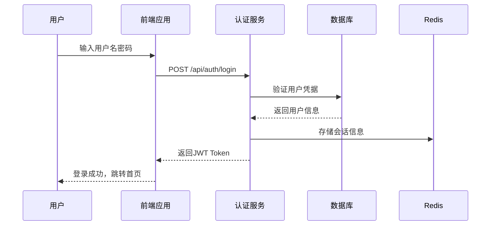

# 系统概述

## 🎯 项目简介

统一认证管理系统（k.yyup.com）是一个基于现代微服务架构的企业级多租户身份认证与授权管理平台。系统采用NestJS + Vue.js技术栈，为幼儿园管理系统提供统一的用户认证、权限管理、租户管理和AI智能服务。

## 🏢 业务背景

### 需求背景
随着教育信息化的发展，幼儿园管理面临着以下挑战：
- **多系统集成困难**：各个子系统独立运行，用户需要多次登录
- **权限管理复杂**：不同角色（管理员、教师、家长）权限需求差异大
- **数据安全要求高**：儿童信息、家长隐私等敏感数据需要严格保护
- **系统扩展性要求**：支持多个幼儿园的独立运营和数据隔离

### 解决方案
统一认证管理系统通过以下方式解决上述问题：
- **单点登录（SSO）**：一次登录，访问所有授权系统
- **精细化权限控制**：基于RBAC模型的细粒度权限管理
- **多租户架构**：支持多个幼儿园的独立运营和数据隔离
- **AI智能服务**：提供智能分析和决策支持

## 🎨 核心功能

### 1. 用户认证管理


**核心特性：**
- 🔐 **多重认证**：支持用户名密码、手机验证码、第三方登录
- 🛡️ **安全机制**：JWT令牌、密码加密、登录限制、会话管理
- 🔄 **自动续期**：Token自动刷新机制
- 📱 **多端支持**：Web端、移动端、小程序统一认证

### 2. 权限管理系统
基于RBAC（Role-Based Access Control）模型的权限控制系统：

**权限层次结构：**
```
系统权限
├── 租户管理权限
│   ├── 租户创建/删除
│   ├── 租户配置管理
│   └── 租户用户管理
├── 用户管理权限
│   ├── 用户CRUD操作
│   ├── 角色分配
│   └── 权限授予
├── 业务功能权限
│   ├── 教师管理
│   ├── 学生管理
│   ├── 家长管理
│   └── 课程管理
└── 系统配置权限
    ├── 系统参数配置
    ├── 日志查看
    └── 监控数据访问
```

### 3. 多租户管理
支持SaaS模式的多租户架构：

**租户隔离机制：**
- **数据隔离**：每个租户拥有独立的数据库schema
- **配置隔离**：租户可自定义系统配置
- **资源隔离**：独立的文件存储空间
- **权限隔离**：跨租户访问严格控制

### 4. AI智能服务
集成多种AI能力，提供智能化支持：

**AI服务模块：**
- 🤖 **智能客服**：基于大语言模型的自动问答
- 📊 **数据分析**：用户行为分析、趋势预测
- 🔍 **智能搜索**：语义化搜索和推荐
- 📈 **决策支持**：业务智能分析和建议

### 5. 系统监控与审计
全面的系统监控和操作审计功能：

**监控指标：**
- 系统性能指标（CPU、内存、网络）
- 业务指标（登录成功率、API响应时间）
- 安全指标（登录失败次数、异常访问）

**审计功能：**
- 用户操作日志记录
- 系统事件追踪
- 数据变更历史
- 安全事件告警

## 📊 系统规模

### 技术规模统计
基于源码分析的系统规模：

| 项目 | 数量 | 说明 |
|------|------|------|
| **后端API端点** | 312+ | 包含认证、用户、租户、AI等服务 |
| **前端组件** | 2,268+ | Vue组件和页面 |
| **数据表** | 94+ | PostgreSQL数据表 |
| **权限项** | 156+ | 系统权限控制点 |
| **AI服务接口** | 28+ | 智能分析和服务接口 |
| **代码行数** | 500,000+ | 包含前后端代码 |

### 业务规模支持
- **并发用户**: 支持10,000+并发用户
- **租户数量**: 支持1,000+租户
- **数据容量**: 支持TB级数据存储
- **API吞吐**: 支持100,000+ QPS

## 🏗️ 技术特点

### 1. 现代化技术栈
- **后端**: NestJS + TypeScript + PostgreSQL
- **前端**: Vue 3 + TypeScript + Vite
- **缓存**: Redis集群
- **消息队列**: RabbitMQ
- **容器化**: Docker + Kubernetes

### 2. 微服务架构
采用模块化设计，支持独立部署和扩展：
- **认证服务**：用户认证和授权
- **用户服务**：用户信息管理
- **租户服务**：多租户管理
- **AI服务**：智能分析和处理
- **文件服务**：文件上传和管理
- **通知服务**：消息推送和通知

### 3. 高可用设计
- **负载均衡**：多实例部署，请求分发
- **故障转移**：自动故障检测和切换
- **数据备份**：定时数据备份和恢复
- **监控告警**：实时监控和异常告警

### 4. 安全防护
- **数据加密**：敏感数据加密存储
- **访问控制**：细粒度权限控制
- **安全审计**：完整的安全事件记录
- **漏洞防护**：定期安全扫描和更新

## 🎯 应用场景

### 1. 教育集团管理
适合大型教育集团的统一身份管理：
- 多园所统一管理
- 集中权限控制
- 数据统计分析
- 跨园所协作

### 2. SaaS服务平台
为SaaS服务提供认证基础设施：
- 多租户支持
- 按需计费
- 弹性扩展
- 快速接入

### 3. 企业内部系统
企业内部系统的统一认证入口：
- 单点登录
- 统一用户管理
- 权限集中控制
- 安全审计

## 📈 发展规划

### 短期目标（3个月）
- [ ] 完善核心认证功能
- [ ] 优化系统性能
- [ ] 增强安全防护
- [ ] 完善监控体系

### 中期目标（6个月）
- [ ] 扩展AI服务能力
- [ ] 支持更多认证方式
- [ ] 增强数据分析功能
- [ ] 优化用户体验

### 长期目标（1年）
- [ ] 构建生态系统
- [ ] 支持国际化
- [ ] 云原生架构升级
- [ ] 边缘计算支持

## 🔗 相关文档

- [技术架构详解](./02-technical-architecture.md)
- [API接口文档](./04-api-overview.md)
- [数据库设计](./15-database-architecture.md)
- [部署指南](./38-deployment-guide.md)

---

**最后更新**: 2025-11-29
**文档版本**: v1.0.0