# 系统设计文档

## 🏗️ 系统架构概述

统一认证管理系统采用前后端分离的微服务架构设计，基于领域驱动设计(DDD)思想，将复杂的业务系统划分为多个独立的业务域，每个域负责特定的业务功能。

## 🎯 设计原则

### 1. 单一职责原则 (SRP)
每个模块、类、函数只负责一个明确的职责，确保系统的可维护性和可测试性。

### 2. 开放封闭原则 (OCP)
系统对扩展开放，对修改封闭。通过接口和抽象类，支持功能的扩展而不影响现有代码。

### 3. 依赖倒置原则 (DIP)
高层模块不依赖低层模块，两者都依赖于抽象。通过依赖注入实现松耦合。

### 4. 高内聚低耦合
模块内部功能高度相关，模块之间依赖性最小，提高系统的可维护性。

## 📐 整体架构设计

### 系统分层架构

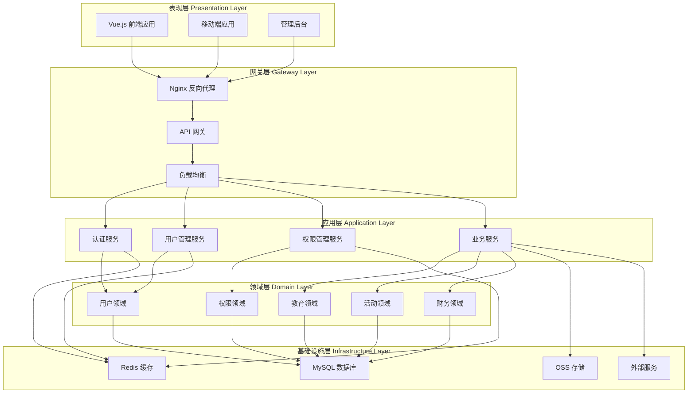

### 前端架构设计

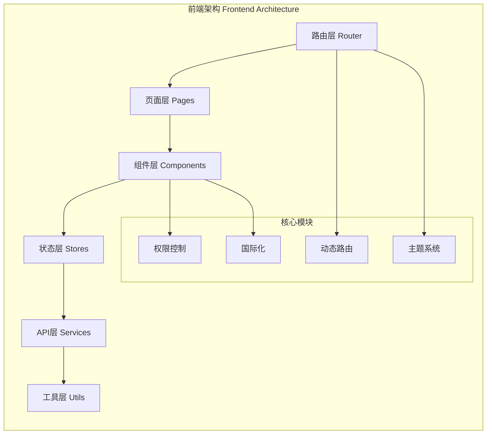

### 后端架构设计

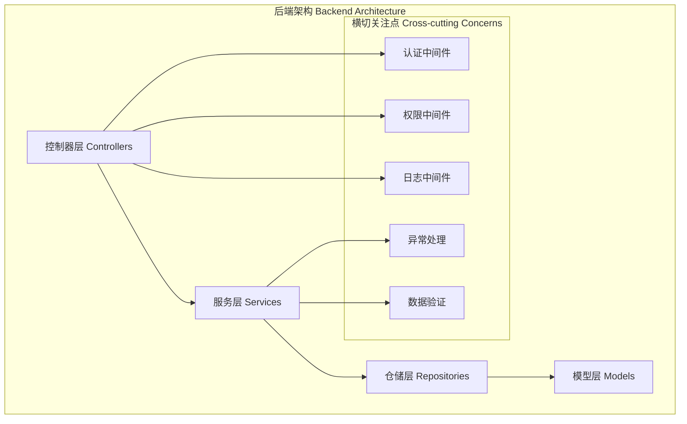

## 🔐 认证与授权设计

### JWT认证流程

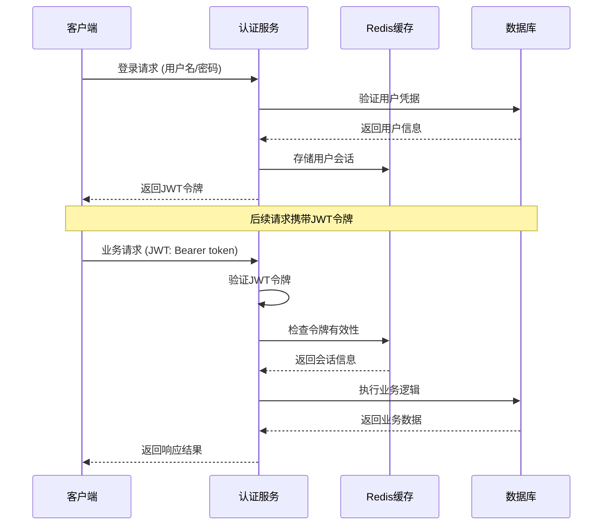

### RBAC权限模型

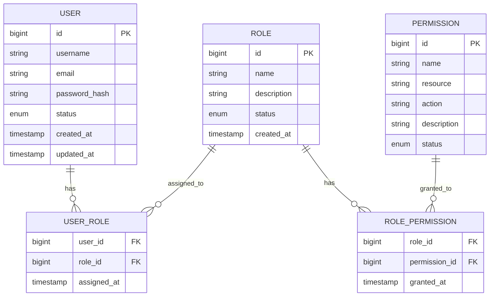

### 动态权限路由系统

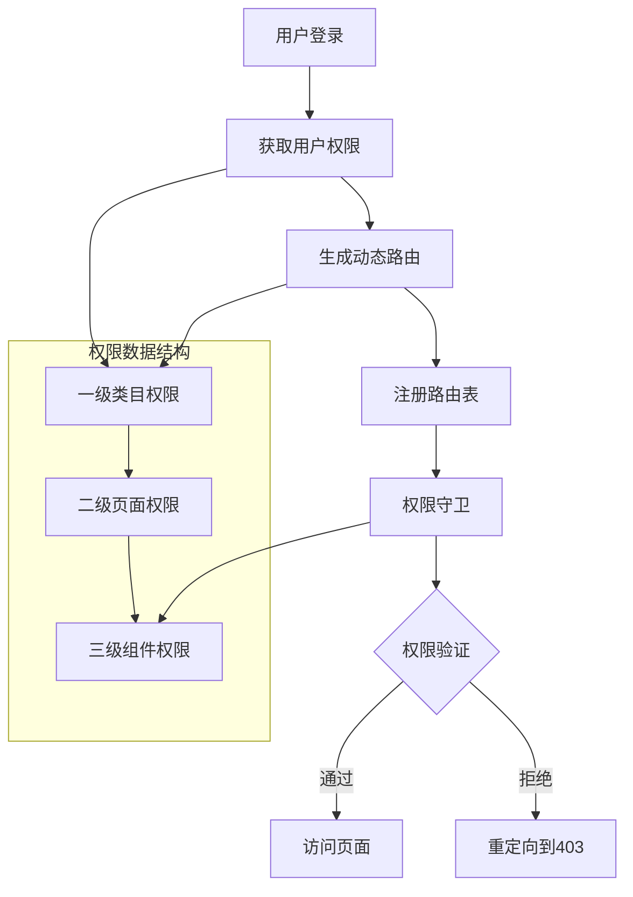

## 🗄️ 数据库设计

### 核心数据模型

```mermaid
erDiagram
    USER ||--o{ USER_ROLE : "拥有"
    ROLE ||--o{ USER_ROLE : "分配给"
    ROLE ||--o{ ROLE_PERMISSION : "包含"
    PERMISSION ||--o{ ROLE_PERMISSION : "授予"

    USER ||--o{ TEACHER : "是"
    USER ||--o{ PARENT : "是"
    USER ||--o{ STUDENT : "是"

    KINDERGARTEN ||--o{ CLASS : "包含"
    CLASS ||--o{ STUDENT : "包含"
    TEACHER ||--o{ CLASS_TEACHER : "任教"
    CLASS ||--o{ CLASS_TEACHER : "有教师"

    ACTIVITY ||--o{ ACTIVITY_REGISTRATION : "报名"
    USER ||--o{ ACTIVITY_REGISTRATION : "参与"

    ENROLLMENT_PLAN ||--o{ ENROLLMENT_APPLICATION : "申请"
    USER ||--o{ ENROLLMENT_APPLICATION : "提交"
```

### 数据库优化策略

#### 1. 索引优化
```sql
-- 用户表索引
CREATE INDEX idx_user_email ON users(email);
CREATE INDEX idx_user_status ON users(status);
CREATE INDEX idx_user_created_at ON users(created_at);

-- 角色权限关联表索引
CREATE INDEX idx_user_role_user_id ON user_roles(user_id);
CREATE INDEX idx_user_role_role_id ON user_roles(role_id);
CREATE INDEX idx_role_permission_role_id ON role_permissions(role_id);
CREATE INDEX idx_role_permission_permission_id ON role_permissions(permission_id);

-- 业务表索引
CREATE INDEX idx_activity_status ON activities(status);
CREATE INDEX idx_activity_created_at ON activities(created_at);
CREATE INDEX idx_enrollment_application_status ON enrollment_applications(status);
```

#### 2. 分表分库策略
```sql
-- 按年份分表的日志表
CREATE TABLE system_logs_2024 LIKE system_logs;
CREATE TABLE system_logs_2025 LIKE system_logs;

-- 按园所分表的业务数据
CREATE TABLE students_kindergarten_1 LIKE students;
CREATE TABLE students_kindergarten_2 LIKE students;
```

## 🔄 业务流程设计

### 用户注册与激活流程

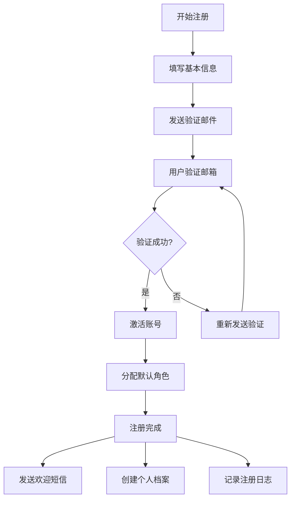

### 活动创建与管理流程

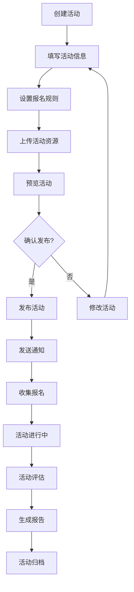

### 招生管理流程

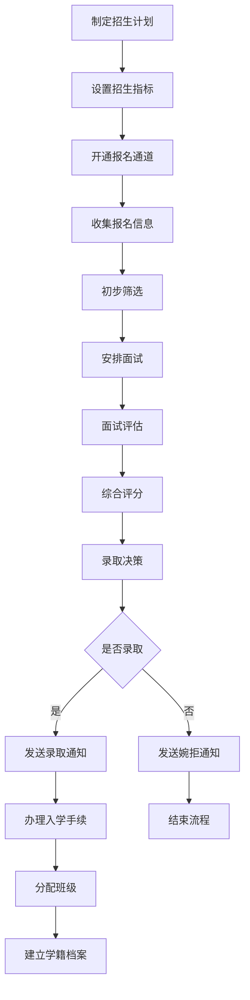

## 🌐 API设计规范

### RESTful API设计

#### URL命名规范
```
GET    /api/users              # 获取用户列表
GET    /api/users/:id          # 获取特定用户
POST   /api/users              # 创建用户
PUT    /api/users/:id          # 更新用户
DELETE /api/users/:id          # 删除用户

GET    /api/users/:id/roles    # 获取用户角色
POST   /api/users/:id/roles    # 分配角色
DELETE /api/users/:id/roles/:roleId  # 移除角色
```

#### 统一响应格式
```typescript
// 成功响应
interface ApiResponse<T> {
  success: true;
  data: T;
  message: string;
  timestamp: string;
  requestId: string;
}

// 错误响应
interface ApiError {
  success: false;
  error: {
    code: string;
    message: string;
    details?: any;
  };
  timestamp: string;
  requestId: string;
}
```

#### 分页响应格式
```typescript
interface PaginatedResponse<T> {
  success: true;
  data: T[];
  pagination: {
    page: number;
    pageSize: number;
    total: number;
    totalPages: number;
    hasNext: boolean;
    hasPrev: boolean;
  };
  message: string;
  timestamp: string;
}
```

## 🔧 缓存策略设计

### 多级缓存架构

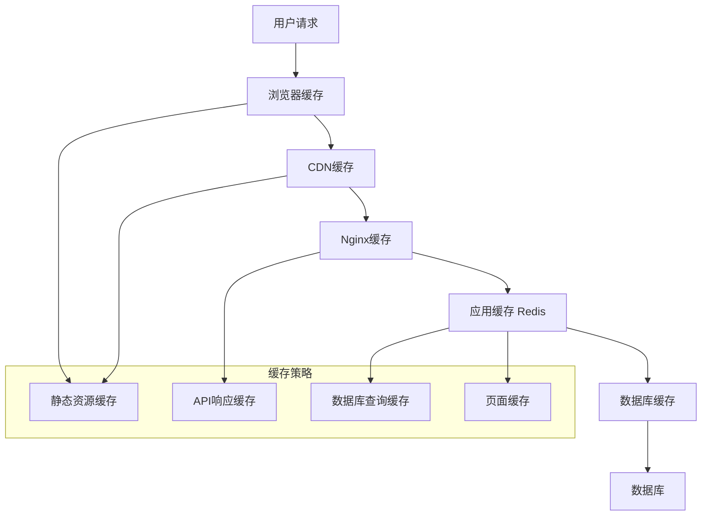

### 缓存键命名规范
```typescript
// 缓存键命名规范
const CacheKeys = {
  // 用户相关
  USER_INFO: (userId: number) => `user:info:${userId}`,
  USER_PERMISSIONS: (userId: number) => `user:permissions:${userId}`,
  USER_ROLES: (userId: number) => `user:roles:${userId}`,

  // 系统配置
  SYSTEM_CONFIG: 'system:config',
  PERMISSION_TREE: 'system:permissions:tree',

  // 业务数据
  ACTIVITY_LIST: (page: number) => `activities:list:${page}`,
  ENROLLMENT_STATS: (date: string) => `enrollment:stats:${date}`,

  // 会话管理
  USER_SESSION: (token: string) => `session:${token}`,

  // 缓存时间设置
  TTL: {
    SHORT: 5 * 60,      // 5分钟
    MEDIUM: 30 * 60,    // 30分钟
    LONG: 2 * 60 * 60,  // 2小时
    DAILY: 24 * 60 * 60 // 1天
  }
};
```

## 📊 监控与日志设计

### 日志分级策略
```typescript
enum LogLevel {
  ERROR = 'ERROR',    // 系统错误，需要立即处理
  WARN = 'WARN',      // 警告信息，可能影响功能
  INFO = 'INFO',      // 一般信息，业务流程记录
  DEBUG = 'DEBUG',    // 调试信息，开发和排错使用
  TRACE = 'TRACE'     // 详细跟踪信息，性能分析使用
}

interface LogEntry {
  timestamp: string;
  level: LogLevel;
  service: string;
  module: string;
  message: string;
  data?: any;
  userId?: number;
  requestId?: string;
  ip?: string;
  userAgent?: string;
}
```

### 监控指标设计
```typescript
// 业务监控指标
interface BusinessMetrics {
  // 用户相关
  userRegistrations: number;
  activeUsers: number;
  userRetention: number;

  // 业务相关
  enrollmentConversion: number;
  activityParticipation: number;
  aiAssistantUsage: number;

  // 系统相关
  apiResponseTime: number;
  errorRate: number;
  cacheHitRate: number;
}
```

## 🚀 性能优化设计

### 前端性能优化

#### 1. 代码分割策略
```typescript
// 路由懒加载
const routes = [
  {
    path: '/dashboard',
    component: () => import('@/pages/Dashboard.vue'),
    meta: { requiresAuth: true }
  },
  {
    path: '/users',
    component: () => import('@/pages/user-management.vue'),
    meta: { requiresAuth: true, roles: ['admin'] }
  }
];

// 组件懒加载
const HeavyComponent = defineAsyncComponent({
  loader: () => import('@/components/HeavyComponent.vue'),
  loadingComponent: LoadingComponent,
  errorComponent: ErrorComponent,
  delay: 200,
  timeout: 3000
});
```

#### 2. 虚拟滚动
```vue
<template>
  <div class="virtual-list" :style="{ height: containerHeight + 'px' }">
    <div class="virtual-list-phantom" :style="{ height: totalHeight + 'px' }"></div>
    <div class="virtual-list-content" :style="{ transform: `translateY(${offsetY}px)` }">
      <div v-for="item in visibleItems" :key="item.id" class="list-item">
        {{ item.content }}
      </div>
    </div>
  </div>
</template>
```

### 后端性能优化

#### 1. 数据库查询优化
```typescript
// 使用索引优化查询
const users = await User.findAll({
  where: {
    status: 'active',
    created_at: {
      [Op.gte]: new Date('2024-01-01')
    }
  },
  include: [
    {
      model: Role,
      as: 'roles',
      attributes: ['id', 'name'],
      through: { attributes: [] }
    }
  ],
  attributes: ['id', 'username', 'email', 'created_at'],
  order: [['created_at', 'DESC']],
  limit: 20,
  offset: (page - 1) * 20
});
```

#### 2. 连接池配置
```typescript
// 数据库连接池配置
const sequelize = new Sequelize({
  database: process.env.DB_NAME,
  username: process.env.DB_USER,
  password: process.env.DB_PASSWORD,
  host: process.env.DB_HOST,
  dialect: 'mysql',
  pool: {
    max: 20,        // 最大连接数
    min: 5,         // 最小连接数
    acquire: 30000, // 获取连接超时时间
    idle: 10000     // 连接空闲时间
  },
  logging: process.env.NODE_ENV === 'development'
});
```

## 🔄 扩展性设计

### 微服务拆分策略

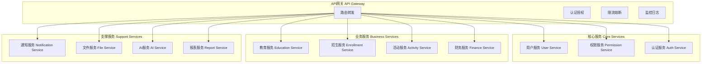

### 配置管理设计
```typescript
// 分层配置管理
interface AppConfig {
  // 数据库配置
  database: {
    host: string;
    port: number;
    name: string;
    username: string;
    password: string;
  };

  // Redis配置
  redis: {
    host: string;
    port: number;
    password?: string;
    db: number;
  };

  // 外部服务配置
  external: {
    ai: {
      apiUrl: string;
      apiKey: string;
      timeout: number;
    };
    sms: {
      provider: string;
      apiKey: string;
      secretKey: string;
    };
    email: {
      smtp: {
        host: string;
        port: number;
        secure: boolean;
        auth: {
          user: string;
          pass: string;
        };
      };
    };
  };

  // 业务配置
  business: {
    maxFileSize: number;
    allowedFileTypes: string[];
    sessionTimeout: number;
    passwordPolicy: {
      minLength: number;
      requireNumbers: boolean;
      requireSpecialChars: boolean;
    };
  };
}
```

---

**最后更新**: 2025-11-29
**文档版本**: v1.0.0
**维护团队**: 统一认证管理系统开发团队