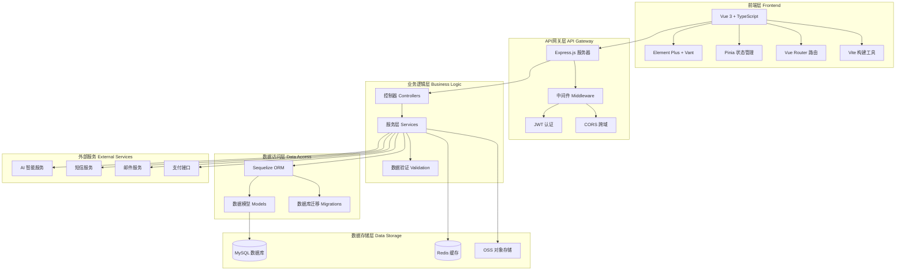

# 技术栈详解

## 🎯 技术选型概述

统一认证管理系统采用现代化的前后端分离架构，基于业界成熟的开源技术栈构建，确保系统的稳定性、可扩展性和维护性。

## 📱 前端技术栈

### 核心框架与库

| 技术栈 | 版本 | 用途 | 选型理由 |
|--------|------|------|----------|
| **Vue.js** | 3.5.16 | 核心框架 | 渐进式框架，学习曲线平缓，生态丰富 |
| **TypeScript** | 4.8.3 | 类型安全 | 提供静态类型检查，提高代码质量 |
| **Vite** | 4.5.14 | 构建工具 | 快速的开发服务器和构建性能 |
| **Vue Router** | 4.1.5 | 路由管理 | 支持动态路由和权限控制 |
| **Pinia** | 2.0.22 | 状态管理 | Vue 3官方推荐的状态管理库 |

### UI组件库

| 组件库 | 版本 | 用途 | 特色功能 |
|--------|------|------|----------|
| **Element Plus** | 2.2.16 | 桌面端UI | 丰富的组件，主题定制，国际化 |
| **Vant** | 4.9.21 | 移动端UI | 轻量级，移动端优化 |
| **Ant Design Vue** | 5.25.4 | 补充UI | 企业级组件，设计规范 |
| **@vueuse/core** | 13.3.0 | 组合式工具 | 丰富的组合式API工具集 |

### 开发与测试工具

| 工具 | 版本 | 用途 | 说明 |
|------|------|------|------|
| **ESLint** | 配置化 | 代码检查 | 统一代码风格，检查潜在问题 |
| **Prettier** | 配置化 | 代码格式化 | 自动格式化代码，保持一致性 |
| **Vitest** | 3.2.0 | 单元测试 | 快速的单元测试框架 |
| **Playwright** | 1.56.1 | E2E测试 | 跨浏览器自动化测试 |
| **Sass** | 1.54.9 | CSS预处理 | 支持变量、嵌套、混入等功能 |

### 第三方服务集成

| 服务 | 库/SDK | 用途 |
|------|---------|------|
| **Axios** | 1.6.7 | HTTP客户端 |
| **ECharts** | 5.6.0 | 数据可视化 |
| **Day.js** | 1.11.13 | 日期处理 |
| **QRCode** | 1.5.4 | 二维码生成 |
| **HTML2PDF** | 0.12.1 | PDF生成 |
| **GSAP** | 3.13.0 | 动画库 |
| **Marked** | 15.0.12 | Markdown解析 |

### 前端配置文件

```typescript
// vite.config.ts - Vite配置
import { defineConfig } from 'vite'
import vue from '@vitejs/plugin-vue'
import { resolve } from 'path'

export default defineConfig({
  plugins: [vue()],
  resolve: {
    alias: {
      '@': resolve(__dirname, 'src'),
      '@components': resolve(__dirname, 'src/components'),
      '@pages': resolve(__dirname, 'src/pages'),
      '@utils': resolve(__dirname, 'src/utils'),
      '@api': resolve(__dirname, 'src/api'),
      '@stores': resolve(__dirname, 'src/stores')
    }
  },
  server: {
    host: '0.0.0.0',
    port: 5173,
    proxy: {
      '/api': {
        target: 'http://localhost:3000',
        changeOrigin: true
      }
    }
  }
})
```

```typescript
// tsconfig.json - TypeScript配置
{
  "compilerOptions": {
    "target": "ES2020",
    "useDefineForClassFields": true,
    "lib": ["ES2020", "DOM", "DOM.Iterable"],
    "module": "ESNext",
    "skipLibCheck": true,
    "moduleResolution": "bundler",
    "allowImportingTsExtensions": true,
    "resolveJsonModule": true,
    "isolatedModules": true,
    "noEmit": true,
    "jsx": "preserve",
    "strict": true,
    "noUnusedLocals": true,
    "noUnusedParameters": true,
    "noFallthroughCasesInSwitch": true,
    "baseUrl": ".",
    "paths": {
      "@/*": ["src/*"],
      "@components/*": ["src/components/*"],
      "@pages/*": ["src/pages/*"],
      "@utils/*": ["src/utils/*"],
      "@api/*": ["src/api/*"],
      "@stores/*": ["src/stores/*"]
    }
  },
  "include": ["src/**/*.ts", "src/**/*.d.ts", "src/**/*.tsx", "src/**/*.vue"],
  "references": [{ "path": "./tsconfig.node.json" }]
}
```

## 🖥️ 后端技术栈

### 核心框架与数据库

| 技术 | 版本 | 用途 | 选型理由 |
|------|------|------|----------|
| **Node.js** | >=18.0.0 | 运行时环境 | 高性能JavaScript运行时 |
| **Express.js** | 4.x | Web框架 | 轻量级、灵活、生态丰富 |
| **TypeScript** | 5.0.0 | 类型安全 | 提供类型检查和现代JS特性 |
| **MySQL** | >=8.0 | 关系型数据库 | 成熟稳定，事务支持完善 |
| **Sequelize** | 6.35.0 | ORM框架 | 数据库抽象，支持多种数据库 |

### 认证与安全

| 技术 | 版本 | 用途 | 说明 |
|------|------|------|------|
| **JWT** | - | 身份认证 | 无状态令牌认证 |
| **BCrypt** | 6.0.0 | 密码加密 | 安全的密码哈希算法 |
| **Helmet** | - | 安全头设置 | 设置安全相关的HTTP头 |
| **CORS** | - | 跨域处理 | 处理跨域请求 |

### 开发与测试工具

| 工具 | 版本 | 用途 | 说明 |
|------|------|------|------|
| **Jest** | 29.7.0 | 单元测试 | 功能完整的测试框架 |
| **Supertest** | 6.3.3 | API测试 | HTTP断言测试库 |
| **Nodemon** | - | 开发热重载 | 自动重启开发服务器 |
| **Swagger** | - | API文档 | 自动生成API文档 |

### 第三方服务

| 服务 | 集成方式 | 用途 |
|------|----------|------|
| **Redis** | 可选 | 缓存和会话存储 |
| **OSS** | SDK | 对象存储服务 |
| **AI服务** | HTTP API | 智能分析和预测 |
| **短信服务** | HTTP API | 短信通知 |
| **邮件服务** | Nodemailer | 邮件通知 |

### 后端项目结构

```
server/
├── src/
│   ├── controllers/          # 控制器层 - 处理HTTP请求
│   ├── services/            # 服务层 - 业务逻辑
│   ├── models/              # 模型层 - 数据库模型
│   ├── routes/              # 路由层 - API路由定义
│   ├── middlewares/         # 中间件 - 请求处理中间件
│   ├── utils/               # 工具函数
│   ├── config/              # 配置文件
│   └── types/               # TypeScript类型定义
├── tests/                   # 测试文件
├── migrations/              # 数据库迁移文件
├── seeders/                 # 数据库种子文件
├── package.json
├── tsconfig.json
└── jest.config.js
```

## 🔧 开发环境配置

### 系统要求

| 环境 | 最低要求 | 推荐配置 |
|------|----------|----------|
| **操作系统** | Windows 10/macOS 10.15/Ubuntu 18.04 | Windows 11/macOS 12/Ubuntu 20.04 |
| **Node.js** | 18.0.0 | 20.x LTS |
| **npm** | 8.0.0 | 10.x |
| **内存** | 8GB | 16GB |
| **存储** | 10GB可用空间 | 20GB+ SSD |

### 开发工具推荐

| 工具类型 | 推荐工具 | 说明 |
|----------|----------|------|
| **IDE** | VS Code | 轻量级，插件丰富 |
| **数据库工具** | MySQL Workbench/DBeaver | 数据库管理和查询 |
| **API测试** | Postman/Insomnia | API接口测试 |
| **版本控制** | Git | 源代码版本管理 |
| **容器化** | Docker | 环境一致性保障 |

### VS Code插件推荐

```json
{
  "recommendations": [
    "vue.volar",              // Vue 3支持
    "bradlc.vscode-tailwindcss", // Tailwind CSS
    "esbenp.prettier-vscode", // 代码格式化
    "dbaeumer.vscode-eslint", // ESLint检查
    "ms-vscode.vscode-typescript-next", // TypeScript
    "formulahendry.auto-rename-tag", // 标签重命名
    "christian-kohler.path-intellisense", // 路径智能提示
    "ms-vscode.vscode-json", // JSON支持
    "redhat.vscode-yaml", // YAML支持
    "ms-vscode-remote.remote-containers", // Docker支持
    "ms-vscode.test-adapter-converter", // 测试适配器
    "humao.rest-client" // REST Client
  ]
}
```

## 📊 技术架构图



## 🚀 性能优化技术

### 前端性能优化

| 优化技术 | 实现方式 | 效果 |
|----------|----------|------|
| **代码分割** | 动态import() | 减少初始加载大小 |
| **懒加载** | 路由懒加载 | 按需加载页面组件 |
| **缓存策略** | HTTP缓存 | 减少重复请求 |
| **图片优化** | WebP格式 | 减少图片体积 |
| **Tree Shaking** | Vite构建 | 移除未使用代码 |
| **压缩** | Gzip/Brotli | 减少传输大小 |

### 后端性能优化

| 优化技术 | 实现方式 | 效果 |
|----------|----------|------|
| **数据库索引** | MySQL索引 | 提升查询速度 |
| **连接池** | Sequelize连接池 | 优化数据库连接 |
| **缓存** | Redis缓存 | 减少数据库访问 |
| **查询优化** | SQL优化 | 提升查询性能 |
| **分页** | LIMIT/OFFSET | 减少数据传输量 |
| **压缩** | Gzip压缩 | 减少响应大小 |

## 🔒 安全技术栈

### 前端安全

| 安全措施 | 实现方式 | 防护目标 |
|----------|----------|----------|
| **XSS防护** | DOMPurify | 防止跨站脚本攻击 |
| **CSRF防护** | Token验证 | 防止跨站请求伪造 |
| **输入验证** | 表单验证 | 防止恶意输入 |
| **HTTPS** | SSL证书 | 加密数据传输 |

### 后端安全

| 安全措施 | 实现方式 | 防护目标 |
|----------|----------|----------|
| **JWT认证** | 令牌验证 | 身份认证和授权 |
| **密码加密** | BCrypt | 安全的密码存储 |
| **SQL注入防护** | Sequelize ORM | 防止SQL注入攻击 |
| **Rate Limiting** | 请求频率限制 | 防止API滥用 |
| **安全头设置** | Helmet | 设置安全HTTP头 |

## 📈 监控与日志

### 前端监控

| 监控项 | 工具/技术 | 说明 |
|--------|------------|------|
| **性能监控** | Web Vitals | 页面性能指标 |
| **错误监控** | Error Boundary | JavaScript错误捕获 |
| **用户行为** | 自定义埋点 | 用户操作跟踪 |
| **API监控** | Axios拦截器 | 请求响应监控 |

### 后端监控

| 监控项 | 工具/技术 | 说明 |
|--------|------------|------|
| **应用性能** | APM工具 | 应用性能监控 |
| **错误日志** | Winston | 结构化日志记录 |
| **数据库监控** | 慢查询日志 | 数据库性能监控 |
| **系统资源** | 系统监控 | CPU、内存、磁盘监控 |

## 🔄 CI/CD技术栈

| 阶段 | 工具/技术 | 说明 |
|------|------------|------|
| **代码检查** | ESLint + Prettier | 代码质量和风格检查 |
| **类型检查** | TypeScript | 静态类型检查 |
| **单元测试** | Vitest + Jest | 自动化测试 |
| **集成测试** | Playwright | E2E测试 |
| **构建** | Vite + Webpack | 前端构建 |
| **部署** | Docker + Nginx | 容器化部署 |

---

**最后更新**: 2025-11-29
**文档版本**: v1.0.0
**维护团队**: 统一认证管理系统开发团队