# 技术架构

## 🏗️ 整体架构设计

统一认证管理系统采用现代化的微服务架构，基于分层设计和领域驱动开发（DDD）原则，确保系统的可扩展性、可维护性和高性能。

### 架构层次图

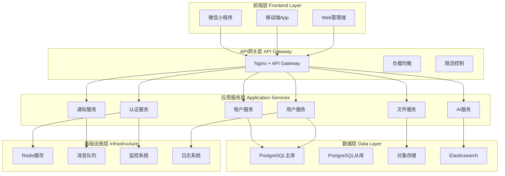

## 🛠️ 技术栈选型

### 后端技术栈

| 技术领域 | 选型 | 版本 | 说明 |
|---------|------|------|------|
| **运行时** | Node.js | 18.x LTS | 高性能JavaScript运行时 |
| **框架** | NestJS | 10.x | 企业级Node.js框架 |
| **语言** | TypeScript | 5.x | 类型安全的JavaScript超集 |
| **数据库** | PostgreSQL | 15.x | 企业级关系型数据库 |
| **ORM** | Prisma | 5.x | 现代化数据库ORM |
| **缓存** | Redis | 7.x | 内存数据库缓存 |
| **消息队列** | RabbitMQ | 3.12 | 可靠的消息中间件 |
| **文档** | Swagger | 3.x | API文档自动生成 |
| **测试** | Jest | 29.x | 单元测试和集成测试 |

### 前端技术栈

| 技术领域 | 选型 | 版本 | 说明 |
|---------|------|------|------|
| **框架** | Vue.js | 3.3+ | 渐进式JavaScript框架 |
| **语言** | TypeScript | 5.x | 类型安全的JavaScript |
| **构建工具** | Vite | 4.x | 快速构建工具 |
| **UI库** | Element Plus | 2.x | Vue 3组件库 |
| **状态管理** | Pinia | 2.x | Vue状态管理库 |
| **路由** | Vue Router | 4.x | 官方路由管理器 |
| **HTTP客户端** | Axios | 1.x | Promise based HTTP客户端 |
| **图表库** | ECharts | 5.x | 数据可视化图表 |

### 基础设施技术栈

| 技术领域 | 选型 | 版本 | 说明 |
|---------|------|------|------|
| **容器化** | Docker | 24.x | 应用容器化 |
| **编排** | Docker Compose | 2.x | 多容器编排 |
| **反向代理** | Nginx | 1.24 | Web服务器和反向代理 |
| **监控** | Prometheus | 2.x | 时间序列数据库 |
| **可视化** | Grafana | 10.x | 监控数据可视化 |
| **日志** | ELK Stack | 8.x | 日志收集和分析 |
| **对象存储** | MinIO | RELEASE.2023 | S3兼容对象存储 |

## 🏛️ 系统架构设计

### 1. 微服务架构

系统采用微服务架构，将复杂的应用拆分为多个独立的服务：

#### 核心服务模块

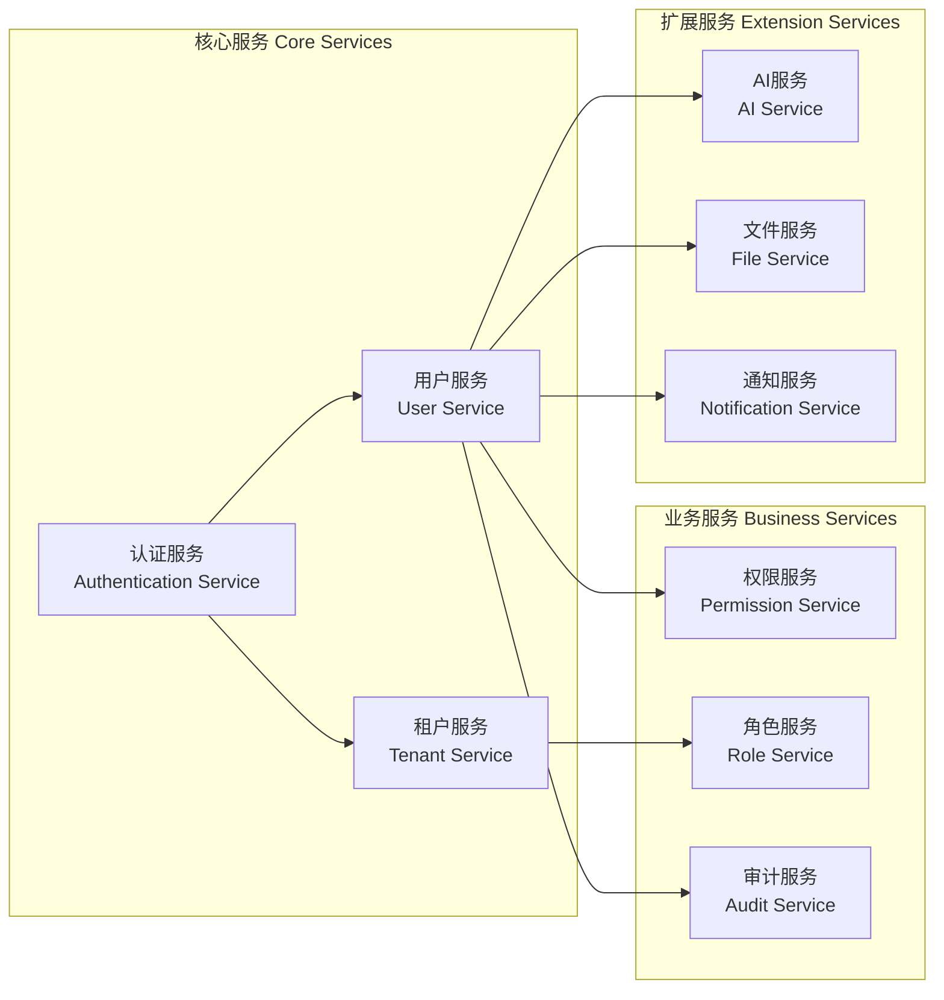

### 2. 分层架构设计

每一层都有明确的职责，层与层之间通过接口进行通信：

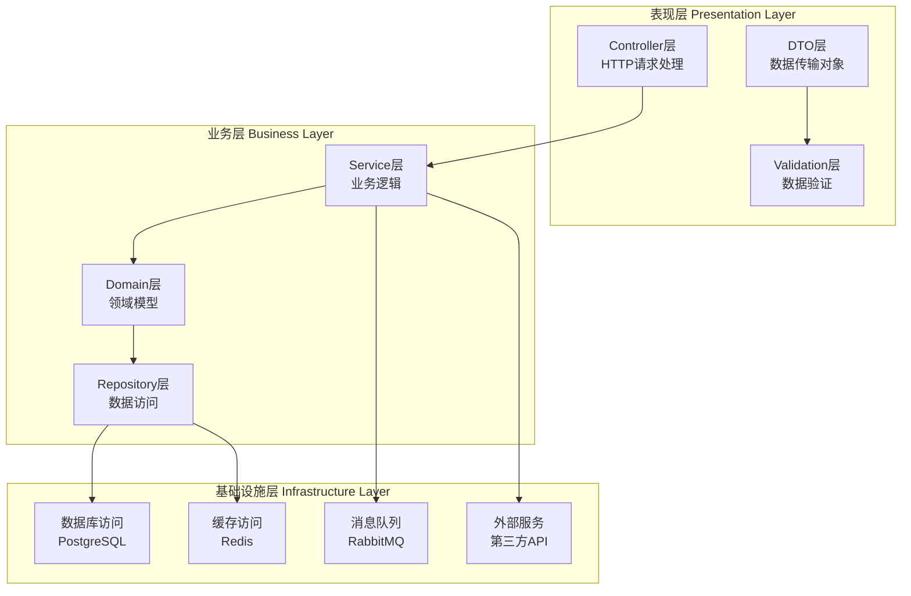

### 3. 多租户架构

采用数据库级别的多租户隔离策略：

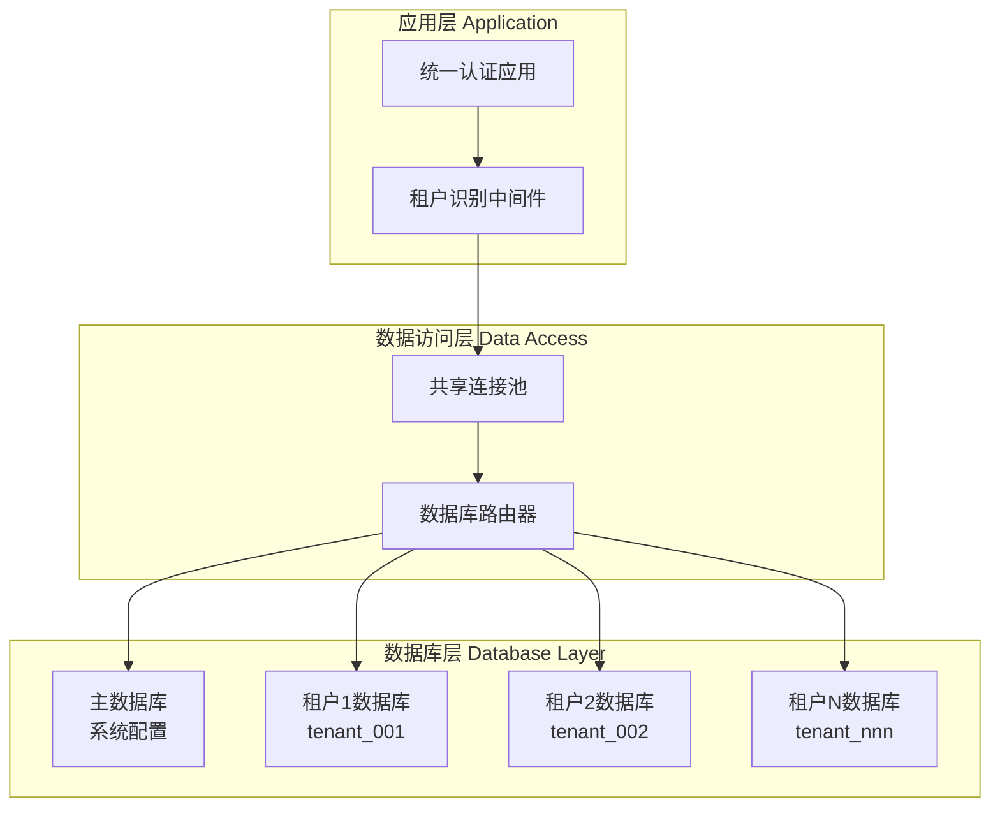

## 🔐 安全架构

### 1. 认证安全

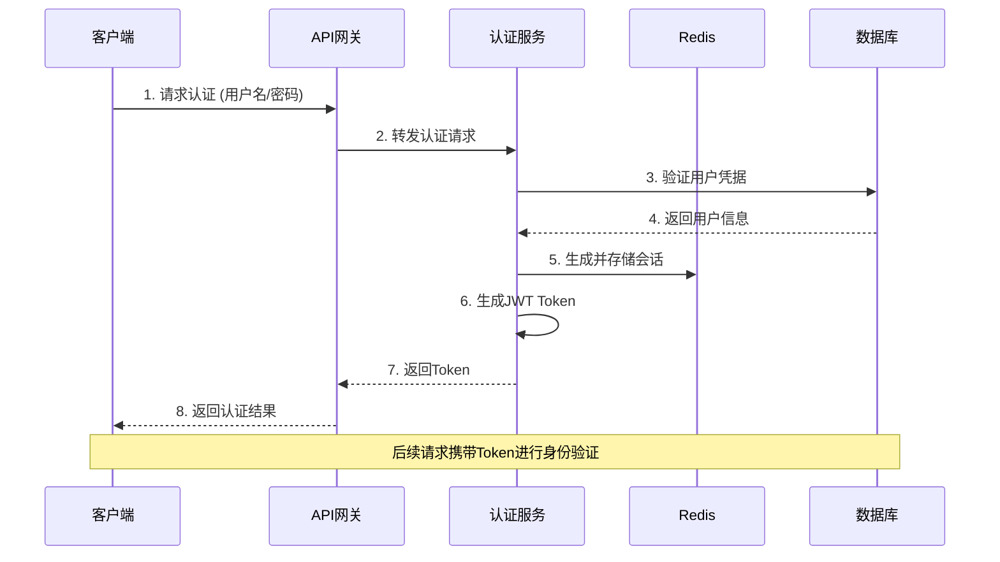

### 2. 权限控制

基于RBAC（Role-Based Access Control）模型的权限控制：

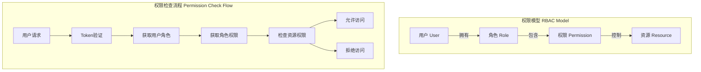

### 3. 数据安全

- **传输加密**: HTTPS/TLS 1.3
- **存储加密**: 敏感字段AES-256加密
- **密码安全**: BCrypt哈希 + Salt
- **会话安全**: JWT + Redis会话管理

## 📊 数据架构

### 1. 数据库设计

采用多数据库架构，根据数据特性选择合适的存储方案：

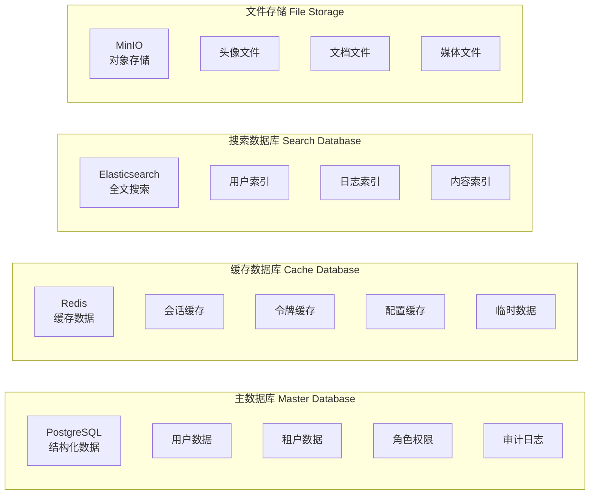

### 2. 数据流设计

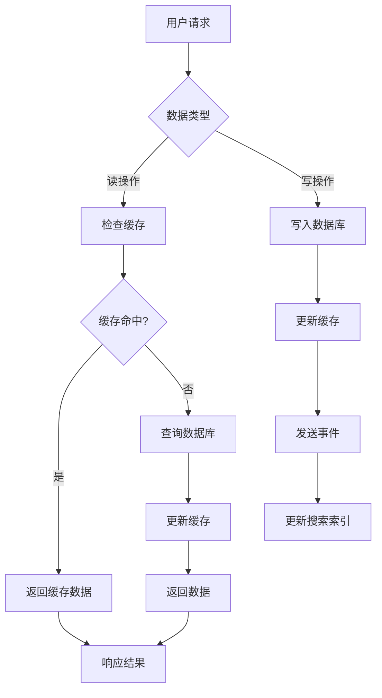

## ⚡ 性能架构

### 1. 缓存策略

多级缓存架构确保系统高性能：

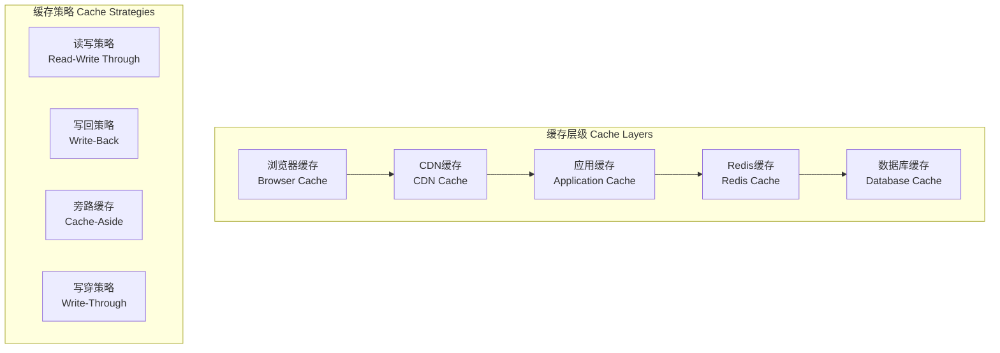

### 2. 负载均衡

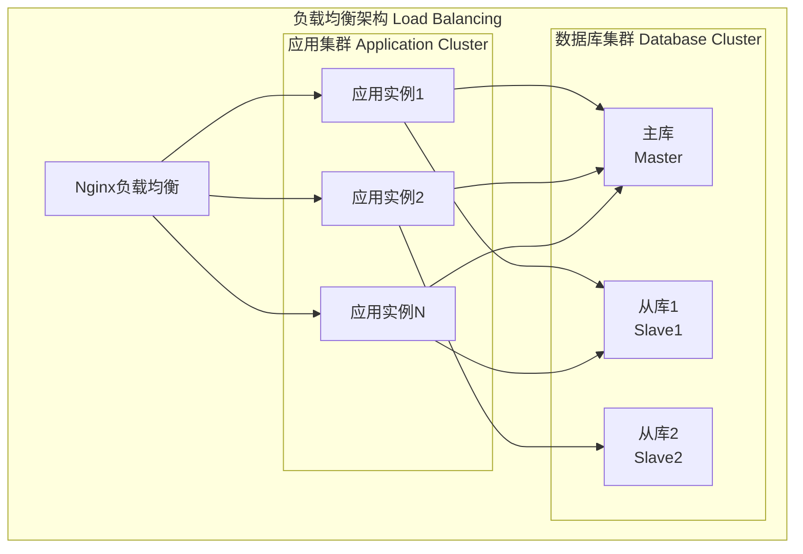

## 🔍 监控架构

### 1. 监控体系

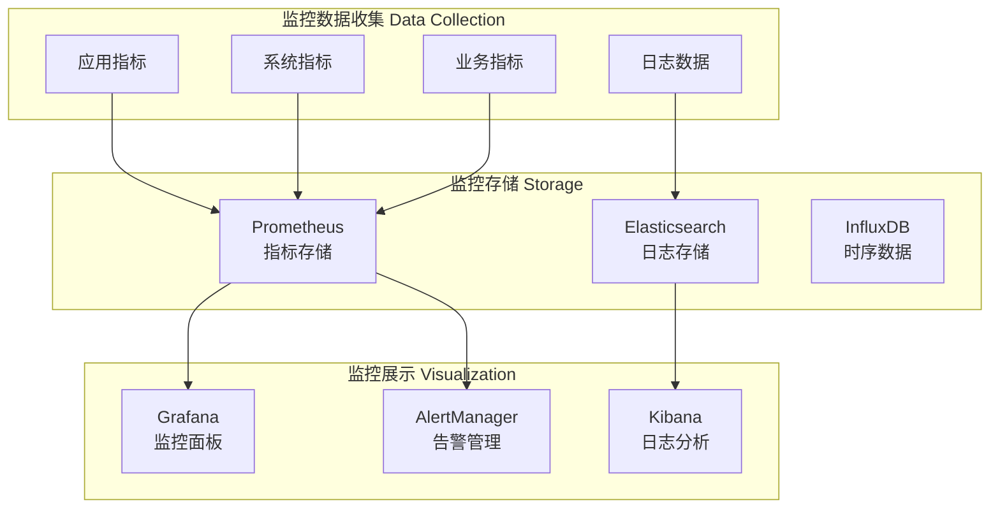

### 2. 告警策略

- **系统告警**: CPU > 80%, 内存 > 85%, 磁盘 > 90%
- **应用告警**: 错误率 > 5%, 响应时间 > 2s
- **业务告警**: 登录失败率 > 10%, API调用量异常

## 🚀 部署架构

### 1. 容器化部署

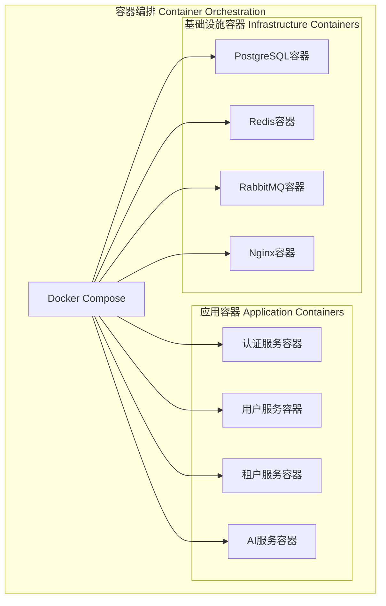

### 2. 环境配置

- **开发环境**: Docker Compose本地部署
- **测试环境**: 容器化部署，模拟生产环境
- **生产环境**: Kubernetes集群部署（未来规划）

## 🔗 相关文档

- [部署架构详解](./03-deployment-architecture.md)
- [API接口文档](./04-api-overview.md)
- [数据库设计](./15-database-architecture.md)
- [安全配置指南](./43-security-configuration.md)

---

**最后更新**: 2025-11-29
**文档版本**: v1.0.0