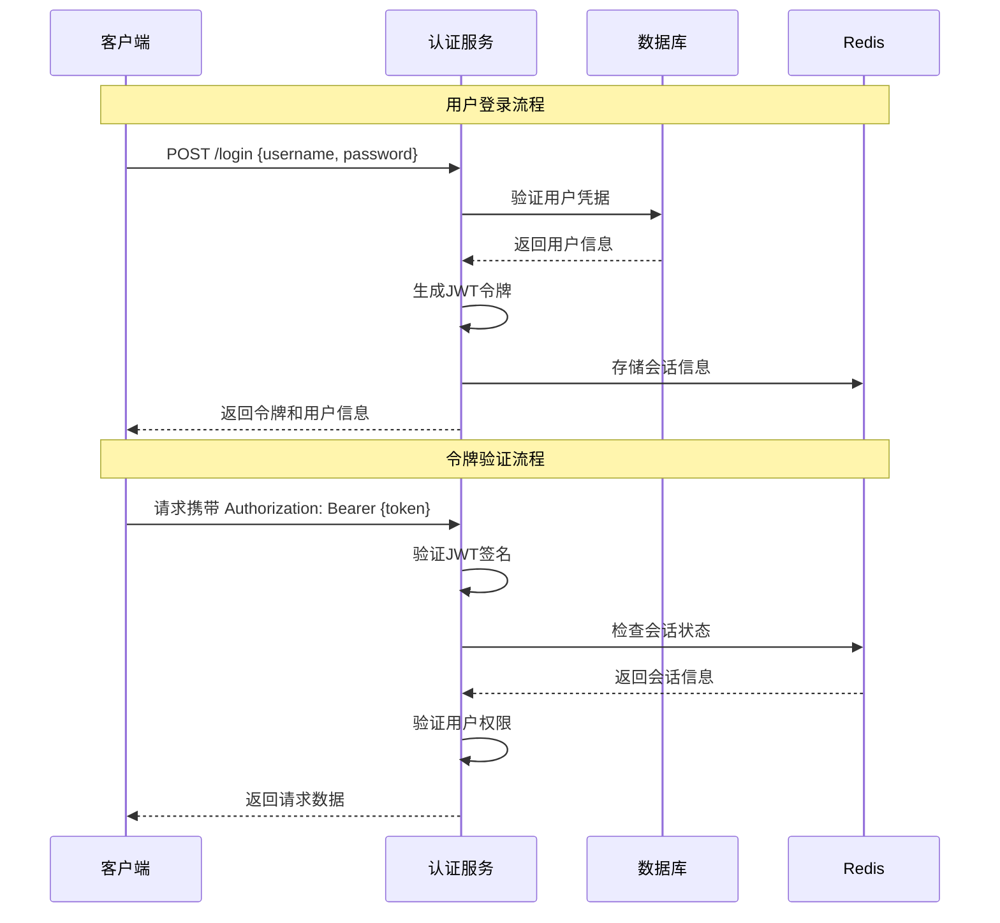

# 认证API文档

## 🔐 认证系统概述

认证系统采用JWT (JSON Web Token) 方案实现无状态身份认证，支持用户登录、注册、密码重置、令牌刷新等功能。系统提供完整的用户生命周期管理，包括账户激活、锁定、解锁等状态管理。

## 📋 API基础信息

- **Base URL**: `http://localhost:3000/api/auth`
- **认证方式**: Bearer Token (JWT)
- **Content-Type**: `application/json`
- **API版本**: v1

## 🎯 认证流程



## 🔑 登录认证

### 用户登录

**接口地址**: `POST /api/auth/login`

**接口描述**: 用户使用用户名/邮箱和密码进行登录认证

**请求参数**:

| 参数名 | 类型 | 必填 | 说明 | 示例 |
|--------|------|------|------|------|
| username | string | 是 | 用户名或邮箱 | "admin@example.com" |
| password | string | 是 | 用户密码 | "password123" |
| captcha | string | 否 | 验证码（连续失败时需要） | "ABC123" |
| remember | boolean | 否 | 记住登录状态 | true |

**请求示例**:
```json
{
  "username": "admin@example.com",
  "password": "password123",
  "remember": true
}
```

**响应示例**:
```json
{
  "success": true,
  "data": {
    "token": "eyJhbGciOiJIUzI1NiIsInR5cCI6IkpXVCJ9...",
    "refreshToken": "refresh_token_here",
    "expiresIn": 3600,
    "user": {
      "id": 1,
      "username": "admin",
      "email": "admin@example.com",
      "nickname": "管理员",
      "avatar": "https://example.com/avatar.jpg",
      "status": "active",
      "roles": ["admin"],
      "permissions": ["user:read", "user:write"],
      "lastLoginAt": "2025-11-29T10:30:00Z",
      "createdAt": "2025-01-01T00:00:00Z"
    }
  },
  "message": "登录成功",
  "timestamp": "2025-11-29T10:30:00Z",
  "requestId": "req_123456789"
}
```

**错误响应**:
```json
{
  "success": false,
  "error": {
    "code": "AUTH_INVALID_CREDENTIALS",
    "message": "用户名或密码错误",
    "details": {
      "remainingAttempts": 4,
      "lockoutTime": null
    }
  },
  "timestamp": "2025-11-29T10:30:00Z",
  "requestId": "req_123456789"
}
```

### 刷新令牌

**接口地址**: `POST /api/auth/refresh`

**接口描述**: 使用刷新令牌获取新的访问令牌

**请求参数**:

| 参数名 | 类型 | 必填 | 说明 |
|--------|------|------|------|
| refreshToken | string | 是 | 刷新令牌 |

**请求示例**:
```json
{
  "refreshToken": "refresh_token_here"
}
```

**响应示例**:
```json
{
  "success": true,
  "data": {
    "token": "new_jwt_token_here",
    "refreshToken": "new_refresh_token_here",
    "expiresIn": 3600
  },
  "message": "令牌刷新成功",
  "timestamp": "2025-11-29T10:30:00Z"
}
```

### 用户登出

**接口地址**: `POST /api/auth/logout`

**接口描述**: 用户登出，使当前令牌失效

**请求头**:
```
Authorization: Bearer {access_token}
```

**响应示例**:
```json
{
  "success": true,
  "data": null,
  "message": "登出成功",
  "timestamp": "2025-11-29T10:30:00Z"
}
```

### 登出所有设备

**接口地址**: `POST /api/auth/logout-all`

**接口描述**: 登出用户的所有设备，使所有令牌失效

**请求头**:
```
Authorization: Bearer {access_token}
```

**响应示例**:
```json
{
  "success": true,
  "data": {
    "logoutDevices": 5
  },
  "message": "已从所有设备登出",
  "timestamp": "2025-11-29T10:30:00Z"
}
```

## 📝 用户注册

### 用户注册

**接口地址**: `POST /api/auth/register`

**接口描述**: 新用户注册账户

**请求参数**:

| 参数名 | 类型 | 必填 | 说明 | 示例 |
|--------|------|------|------|------|
| username | string | 是 | 用户名 | "johndoe" |
| email | string | 是 | 邮箱地址 | "john@example.com" |
| password | string | 是 | 密码 | "password123" |
| confirmPassword | string | 是 | 确认密码 | "password123" |
| phone | string | 否 | 手机号码 | "13800138000" |
| nickname | string | 否 | 昵称 | "约翰" |
| captcha | string | 是 | 验证码 | "ABC123" |
| agreement | boolean | 是 | 同意用户协议 | true |

**密码要求**:
- 最少8位字符
- 必须包含字母和数字
- 可包含特殊字符
- 不能与用户名相同

**请求示例**:
```json
{
  "username": "johndoe",
  "email": "john@example.com",
  "password": "password123",
  "confirmPassword": "password123",
  "phone": "13800138000",
  "nickname": "约翰",
  "captcha": "ABC123",
  "agreement": true
}
```

**响应示例**:
```json
{
  "success": true,
  "data": {
    "userId": 123,
    "username": "johndoe",
    "email": "john@example.com",
    "status": "pending_activation",
    "activationToken": "activation_token_here",
    "expiresAt": "2025-11-30T10:30:00Z"
  },
  "message": "注册成功，请查收激活邮件",
  "timestamp": "2025-11-29T10:30:00Z"
}
```

### 邮箱激活

**接口地址**: `POST /api/auth/activate`

**接口描述**: 激活用户邮箱账户

**请求参数**:

| 参数名 | 类型 | 必填 | 说明 |
|--------|------|------|------|
| token | string | 是 | 激活令牌 |

**请求示例**:
```json
{
  "token": "activation_token_here"
}
```

**响应示例**:
```json
{
  "success": true,
  "data": {
    "userId": 123,
    "status": "active",
    "activatedAt": "2025-11-29T10:30:00Z"
  },
  "message": "账户激活成功",
  "timestamp": "2025-11-29T10:30:00Z"
}
```

### 重发激活邮件

**接口地址**: `POST /api/auth/resend-activation`

**接口描述**: 重新发送账户激活邮件

**请求参数**:

| 参数名 | 类型 | 必填 | 说明 |
|--------|------|------|------|
| email | string | 是 | 邮箱地址 |

**请求示例**:
```json
{
  "email": "john@example.com"
}
```

## 🔐 密码管理

### 忘记密码

**接口地址**: `POST /api/auth/forgot-password`

**接口描述**: 发送密码重置邮件

**请求参数**:

| 参数名 | 类型 | 必填 | 说明 |
|--------|------|------|------|
| email | string | 是 | 邮箱地址 |
| captcha | string | 是 | 验证码 |

**请求示例**:
```json
{
  "email": "john@example.com",
  "captcha": "ABC123"
}
```

**响应示例**:
```json
{
  "success": true,
  "data": {
    "resetToken": "reset_token_here",
    "expiresAt": "2025-11-29T11:30:00Z"
  },
  "message": "密码重置邮件已发送",
  "timestamp": "2025-11-29T10:30:00Z"
}
```

### 重置密码

**接口地址**: `POST /api/auth/reset-password`

**接口描述**: 使用重置令牌重置密码

**请求参数**:

| 参数名 | 类型 | 必填 | 说明 |
|--------|------|------|------|
| token | string | 是 | 重置令牌 |
| password | string | 是 | 新密码 |
| confirmPassword | string | 是 | 确认新密码 |

**请求示例**:
```json
{
  "token": "reset_token_here",
  "password": "newpassword123",
  "confirmPassword": "newpassword123"
}
```

**响应示例**:
```json
{
  "success": true,
  "data": null,
  "message": "密码重置成功",
  "timestamp": "2025-11-29T10:30:00Z"
}
```

### 修改密码

**接口地址**: `POST /api/auth/change-password`

**接口描述**: 已登录用户修改密码

**请求头**:
```
Authorization: Bearer {access_token}
```

**请求参数**:

| 参数名 | 类型 | 必填 | 说明 |
|--------|------|------|------|
| currentPassword | string | 是 | 当前密码 |
| newPassword | string | 是 | 新密码 |
| confirmPassword | string | 是 | 确认新密码 |

**请求示例**:
```json
{
  "currentPassword": "oldpassword123",
  "newPassword": "newpassword123",
  "confirmPassword": "newpassword123"
}
```

**响应示例**:
```json
{
  "success": true,
  "data": null,
  "message": "密码修改成功",
  "timestamp": "2025-11-29T10:30:00Z"
}
```

## 🔍 验证码服务

### 获取图形验证码

**接口地址**: `GET /api/auth/captcha`

**接口描述**: 获取图形验证码

**响应示例**:
```json
{
  "success": true,
  "data": {
    "captchaId": "cap_123456789",
    "captchaImage": "data:image/png;base64,iVBORw0KGgoAAAANSUhEUgAA...",
    "expiresIn": 300
  },
  "message": "验证码生成成功",
  "timestamp": "2025-11-29T10:30:00Z"
}
```

### 发送短信验证码

**接口地址**: `POST /api/auth/sms-code`

**接口描述**: 发送短信验证码

**请求参数**:

| 参数名 | 类型 | 必填 | 说明 | 枚举值 |
|--------|------|------|------|--------|
| phone | string | 是 | 手机号码 | - |
| type | string | 是 | 验证码类型 | "register", "login", "reset_password", "bind_phone" |

**请求示例**:
```json
{
  "phone": "13800138000",
  "type": "register"
}
```

**响应示例**:
```json
{
  "success": true,
  "data": {
    "codeId": "sms_123456789",
    "expiresIn": 60
  },
  "message": "短信验证码已发送",
  "timestamp": "2025-11-29T10:30:00Z"
}
```

### 验证短信验证码

**接口地址**: `POST /api/auth/verify-sms-code`

**接口描述**: 验证短信验证码

**请求参数**:

| 参数名 | 类型 | 必填 | 说明 |
|--------|------|------|------|
| phone | string | 是 | 手机号码 |
| code | string | 是 | 验证码 |
| codeId | string | 是 | 验证码ID |

**请求示例**:
```json
{
  "phone": "13800138000",
  "code": "123456",
  "codeId": "sms_123456789"
}
```

**响应示例**:
```json
{
  "success": true,
  "data": {
    "verified": true,
    "verifyToken": "verify_token_here"
  },
  "message": "验证码验证成功",
  "timestamp": "2025-11-29T10:30:00Z"
}
```

## 📊 认证状态查询

### 检查登录状态

**接口地址**: `GET /api/auth/status`

**接口描述**: 检查当前用户的登录状态

**请求头**:
```
Authorization: Bearer {access_token}
```

**响应示例**:
```json
{
  "success": true,
  "data": {
    "isAuthenticated": true,
    "user": {
      "id": 1,
      "username": "admin",
      "email": "admin@example.com",
      "nickname": "管理员",
      "status": "active"
    },
    "sessionInfo": {
      "loginTime": "2025-11-29T09:00:00Z",
      "lastActivity": "2025-11-29T10:30:00Z",
      "expiresAt": "2025-11-29T11:00:00Z",
      "deviceInfo": {
        "ip": "192.168.1.100",
        "userAgent": "Mozilla/5.0...",
        "deviceType": "desktop"
      }
    }
  },
  "message": "用户已登录",
  "timestamp": "2025-11-29T10:30:00Z"
}
```

### 获取登录设备列表

**接口地址**: `GET /api/auth/devices`

**接口描述**: 获取用户当前登录的设备列表

**请求头**:
```
Authorization: Bearer {access_token}
```

**响应示例**:
```json
{
  "success": true,
  "data": {
    "devices": [
      {
        "id": "device_001",
        "deviceName": "Chrome浏览器 - Windows",
        "ip": "192.168.1.100",
        "location": "北京市",
        "loginTime": "2025-11-29T09:00:00Z",
        "lastActivity": "2025-11-29T10:30:00Z",
        "currentDevice": true
      },
      {
        "id": "device_002",
        "deviceName": "Safari浏览器 - iPhone",
        "ip": "192.168.1.101",
        "location": "北京市",
        "loginTime": "2025-11-28T20:00:00Z",
        "lastActivity": "2025-11-28T22:30:00Z",
        "currentDevice": false
      }
    ],
    "total": 2
  },
  "message": "获取设备列表成功",
  "timestamp": "2025-11-29T10:30:00Z"
}
```

### 下线指定设备

**接口地址**: `DELETE /api/auth/devices/:deviceId`

**接口描述**: 下线指定设备的登录状态

**请求头**:
```
Authorization: Bearer {access_token}
```

**响应示例**:
```json
{
  "success": true,
  "data": null,
  "message": "设备已下线",
  "timestamp": "2025-11-29T10:30:00Z"
}
```

## 🛡️ 安全策略

### 账户锁定策略

当用户连续登录失败达到阈值时，账户将被临时锁定：

- **失败次数阈值**: 5次
- **锁定时间**: 30分钟（可配置）
- **锁定状态**: 用户状态变为 `locked`

### 密码安全策略

- **最小长度**: 8位
- **复杂度要求**: 必须包含字母和数字
- **历史密码**: 不能使用最近3次的密码
- **定期更换**: 建议90天更换一次

### 会话管理

- **会话超时**: 2小时无活动自动登出
- **并发登录**: 同一账户最多5个设备同时在线
- **令牌刷新**: 访问令牌1小时有效期，刷新令牌7天有效期

## 📋 错误码说明

| 错误码 | 说明 | HTTP状态码 |
|--------|------|------------|
| AUTH_INVALID_CREDENTIALS | 用户名或密码错误 | 401 |
| AUTH_USER_NOT_FOUND | 用户不存在 | 404 |
| AUTH_USER_LOCKED | 用户账户已锁定 | 423 |
| AUTH_USER_INACTIVE | 用户账户未激活 | 403 |
| AUTH_TOKEN_EXPIRED | 令牌已过期 | 401 |
| AUTH_TOKEN_INVALID | 令牌无效 | 401 |
| AUTH_PASSWORD_WEAK | 密码强度不足 | 400 |
| AUTH_EMAIL_EXISTS | 邮箱已存在 | 409 |
| AUTH_USERNAME_EXISTS | 用户名已存在 | 409 |
| AUTH_CAPTCHA_INVALID | 验证码错误 | 400 |
| AUTH_CAPTCHA_EXPIRED | 验证码已过期 | 400 |
| AUTH_SMS_CODE_INVALID | 短信验证码错误 | 400 |
| AUTH_SMS_CODE_EXPIRED | 短信验证码已过期 | 400 |
| AUTH_TOO_MANY_ATTEMPTS | 尝试次数过多 | 429 |
| AUTH_DEVICE_NOT_FOUND | 设备不存在 | 404 |

## 🧪 测试用例

### 登录成功测试
```bash
curl -X POST http://localhost:3000/api/auth/login \
  -H "Content-Type: application/json" \
  -d '{
    "username": "admin@example.com",
    "password": "password123"
  }'
```

### 令牌刷新测试
```bash
curl -X POST http://localhost:3000/api/auth/refresh \
  -H "Content-Type: application/json" \
  -d '{
    "refreshToken": "your_refresh_token_here"
  }'
```

### 用户注册测试
```bash
curl -X POST http://localhost:3000/api/auth/register \
  -H "Content-Type: application/json" \
  -d '{
    "username": "testuser",
    "email": "test@example.com",
    "password": "password123",
    "confirmPassword": "password123",
    "captcha": "ABC123",
    "agreement": true
  }'
```

---

**最后更新**: 2025-11-29
**文档版本**: v1.0.0
**维护团队**: 统一认证管理系统开发团队