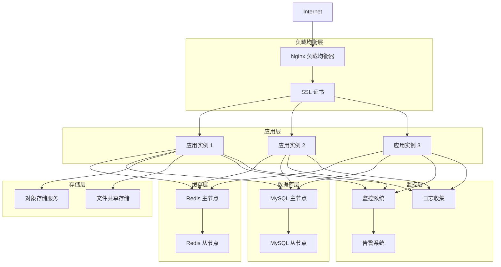

# 部署指南

## 🚀 部署概述

本指南详细说明了统一认证管理系统在不同环境下的部署方案，包括开发环境、测试环境、生产环境的部署流程，以及 Docker 容器化部署和云服务器部署的最佳实践。

## 📋 部署架构设计

### 整体部署架构



## 🖥️ 开发环境部署

### 快速启动

```bash
# 1. 克隆项目
git clone https://github.com/your-repo/k.yyup.com.git
cd k.yyup.com

# 2. 安装依赖
npm install

# 3. 配置环境变量
cp .env.example .env
# 编辑 .env 文件配置数据库等信息

# 4. 初始化数据库
npm run db:migrate
npm run db:seed

# 5. 启动开发服务
npm run start:all
```

### 手动分步启动

#### 启动数据库服务
```bash
# 启动 MySQL
sudo systemctl start mysql
sudo systemctl enable mysql

# 启动 Redis
sudo systemctl start redis
sudo systemctl enable redis

# 验证服务状态
sudo systemctl status mysql
sudo systemctl status redis
```

#### 初始化数据库
```bash
# 进入服务目录
cd server

# 运行数据库迁移
npx sequelize-cli db:migrate

# 导入初始数据
npm run seed-data:complete

# 验证数据库
mysql -u kyyup_user -p kindergarten -e "SHOW TABLES;"
```

#### 启动后端服务
```bash
# 在 server 目录下
npm run dev

# 或使用 PM2 管理
pm2 start ecosystem.config.js --env development
pm2 logs
pm2 status
```

#### 启动前端服务
```bash
# 在新终端进入 client 目录
cd client

# 启动开发服务器
npm run dev

# 或启动构建版本
npm run build
npm run preview
```

### 开发环境验证
```bash
# 检查服务状态
curl http://localhost:3000/api/health
curl http://localhost:5173

# 检查 API 文档
open http://localhost:3000/api-docs

# 运行测试套件
npm run test
```

## 🧪 测试环境部署

### 1. 服务器准备

#### 系统要求
- **CPU**: 4核心
- **内存**: 16GB
- **存储**: 50GB SSD
- **网络**: 1Gbps 带宽

#### 系统初始化
```bash
# 更新系统
sudo apt update && sudo apt upgrade -y

# 安装必要软件
sudo apt install -y curl wget git nginx

# 创建应用用户
sudo useradd -m -s /bin/bash deploy
sudo usermod -aG sudo deploy

# 切换到部署用户
su - deploy
```

### 2. 环境配置

#### Node.js 安装
```bash
# 使用 NodeSource 仓库
curl -fsSL https://deb.nodesource.com/setup_20.x | sudo -E bash -
sudo apt-get install -y nodejs

# 验证安装
node --version
npm --version

# 配置 npm 镜像
npm config set registry https://registry.npmmirror.com
```

#### 数据库配置
```bash
# 安装 MySQL
sudo apt install -y mysql-server

# 安全配置
sudo mysql_secure_installation

# 创建数据库和用户
sudo mysql -e "
CREATE DATABASE kindergarten CHARACTER SET utf8mb4 COLLATE utf8mb4_unicode_ci;
CREATE USER 'kyyup_test'@'localhost' IDENTIFIED BY 'secure_test_password';
GRANT ALL PRIVILEGES ON kindergarten.* TO 'kyyup_test'@'localhost';
FLUSH PRIVILEGES;
"

# 安装 Redis
sudo apt install -y redis-server

# 配置 Redis
sudo sed -i 's/supervised no/supervised systemd/' /etc/redis/redis.conf
sudo systemctl restart redis
```

### 3. 应用部署

#### 代码部署
```bash
# 克隆代码
git clone https://github.com/your-repo/k.yyup.com.git
cd k.yyup.com

# 安装依赖
npm install
cd client && npm install && cd ..
cd server && npm install && cd ..

# 配置环境变量
cp server/.env.example server/.env.production
cp client/.env.example client/.env.production

# 编辑配置文件
vim server/.env.production
vim client/.env.production
```

#### 后端部署
```bash
# 构建应用
cd server
npm run build

# 使用 PM2 管理
npm install -g pm2
pm2 start ecosystem.config.js --env production

# 保存 PM2 配置
pm2 save
pm2 startup
```

#### 前端部署
```bash
# 构建前端
cd client
npm run build

# 配置 Nginx
sudo vim /etc/nginx/sites-available/kyyup.com
```

#### Nginx 配置
```nginx
server {
    listen 80;
    server_name test.kyyup.com;

    # 前端静态文件
    location / {
        root /home/deploy/k.yyup.com/client/dist;
        index index.html;
        try_files $uri $uri/ /index.html;
    }

    # API 代理
    location /api/ {
        proxy_pass http://localhost:3000;
        proxy_http_version 1.1;
        proxy_set_header Upgrade $http_upgrade;
        proxy_set_header Connection 'upgrade';
        proxy_set_header Host $host;
        proxy_set_header X-Real-IP $remote_addr;
        proxy_set_header X-Forwarded-For $proxy_add_x_forwarded_for;
        proxy_set_header X-Forwarded-Proto $scheme;
        proxy_cache_bypass $http_upgrade;
        proxy_read_timeout 300s;
        proxy_connect_timeout 75s;
    }

    # 文件上传
    location /uploads/ {
        alias /home/deploy/k.yyup.com/uploads/;
        expires 30d;
        add_header Cache-Control "public, immutable";
    }
}
```

### 4. SSL 证书配置

#### Let's Encrypt 证书
```bash
# 安装 Certbot
sudo apt install -y certbot python3-certbot-nginx

# 获取证书
sudo certbot --nginx -d test.kyyup.com

# 设置自动续期
sudo crontab -e
# 添加以下行
0 12 * * * /usr/bin/certbot renew --quiet
```

## 🏭 生产环境部署

### 1. 服务器架构

#### 高可用架构
- **负载均衡**: 多台 Nginx 实例
- **应用集群**: 3+ 应用实例
- **数据库**: MySQL 主从复制
- **缓存**: Redis 集群
- **监控**: Prometheus + Grafana
- **日志**: ELK Stack

### 2. 负载均衡配置

#### Nginx 主配置
```nginx
upstream backend {
    least_conn;
    server 10.0.1.101:3000 max_fails=3 fail_timeout=30s;
    server 10.0.1.102:3000 max_fails=3 fail_timeout=30s;
    server 10.0.1.103:3000 max_fails=3 fail_timeout=30s;
}

server {
    listen 80;
    server_name kyyup.com www.kyyup.com;
    return 301 https://$server_name$request_uri;
}

server {
    listen 443 ssl http2;
    server_name kyyup.com www.kyyup.com;

    ssl_certificate /etc/ssl/certs/kyyup.com.crt;
    ssl_certificate_key /etc/ssl/private/kyyup.com.key;
    ssl_protocols TLSv1.2 TLSv1.3;
    ssl_ciphers ECDHE-RSA-AES256-GCM-SHA512:DHE-RSA-AES256-GCM-SHA512;
    ssl_prefer_server_ciphers off;

    # 前端静态资源
    location / {
        root /var/www/kyyup.com/current/client/dist;
        index index.html;
        try_files $uri $uri/ /index.html;

        # 缓存策略
        location ~* \.(js|css|png|jpg|jpeg|gif|ico|svg)$ {
            expires 1y;
            add_header Cache-Control "public, immutable";
        }
    }

    # API 代理
    location /api/ {
        proxy_pass http://backend;
        proxy_http_version 1.1;
        proxy_set_header Upgrade $http_upgrade;
        proxy_set_header Connection 'upgrade';
        proxy_set_header Host $host;
        proxy_set_header X-Real-IP $remote_addr;
        proxy_set_header X-Forwarded-For $proxy_add_x_forwarded_for;
        proxy_set_header X-Forwarded-Proto $scheme;
        proxy_cache_bypass $http_upgrade;

        # 超时设置
        proxy_connect_timeout 5s;
        proxy_send_timeout 60s;
        proxy_read_timeout 60s;
    }

    # 健康检查
    location /health {
        access_log off;
        return 200 "healthy\n";
        add_header Content-Type text/plain;
    }
}
```

### 3. 数据库高可用

#### MySQL 主从配置

**主服务器配置 (`/etc/mysql/mysql.conf.d/mysqld.cnf`)**:
```ini
[mysqld]
server-id = 1
log-bin = mysql-bin
binlog-format = ROW
expire_logs_days = 7
max_binlog_size = 100M

# 性能优化
innodb_buffer_pool_size = 2G
innodb_log_file_size = 256M
max_connections = 1000
query_cache_type = 1
query_cache_size = 64M
```

**从服务器配置**:
```ini
[mysqld]
server-id = 2
relay-log = mysql-relay
read-only = 1

# 性能优化
innodb_buffer_pool_size = 2G
```

**设置主从复制**:
```sql
-- 主服务器创建复制用户
CREATE USER 'repl_user'@'%' IDENTIFIED BY 'repl_password';
GRANT REPLICATION SLAVE ON *.* TO 'repl_user'@'%';
FLUSH PRIVILEGES;

-- 获取主服务器状态
SHOW MASTER STATUS;

-- 从服务器配置
CHANGE MASTER TO
  MASTER_HOST='master_ip',
  MASTER_USER='repl_user',
  MASTER_PASSWORD='repl_password',
  MASTER_LOG_FILE='mysql-bin.000001',
  MASTER_LOG_POS=154;

START SLAVE;
SHOW SLAVE STATUS\G
```

### 4. Redis 集群配置

#### Redis 配置 (`/etc/redis/redis.conf`)
```conf
# 网络配置
bind 0.0.0.0
port 6379
protected-mode yes

# 内存配置
maxmemory 2gb
maxmemory-policy allkeys-lru

# 持久化配置
save 900 1
save 300 10
save 60 10000
rdbcompression yes
rdbchecksum yes

# AOF 配置
appendonly yes
appendfsync everysec

# 集群配置
cluster-enabled yes
cluster-config-file nodes.conf
cluster-node-timeout 5000
```

## 🐳 Docker 部署

### 1. 生产环境 Docker Compose

```yaml
version: '3.8'

services:
  # 负载均衡
  nginx:
    image: nginx:alpine
    ports:
      - "80:80"
      - "443:443"
    volumes:
      - ./nginx/nginx.conf:/etc/nginx/nginx.conf
      - ./nginx/ssl:/etc/nginx/ssl
      - ./uploads:/var/www/uploads
      - ./logs/nginx:/var/log/nginx
    depends_on:
      - app1
      - app2
      - app3
    networks:
      - frontend
      - backend
    restart: unless-stopped

  # 应用实例
  app1:
    build:
      context: .
      dockerfile: Dockerfile.prod
    environment:
      - NODE_ENV=production
      - DB_HOST=mysql-master
      - REDIS_HOST=redis-master
      - INSTANCE_ID=1
    volumes:
      - ./uploads:/app/uploads
      - ./logs/app1:/app/logs
    depends_on:
      - mysql-master
      - redis-master
    networks:
      - backend
    restart: unless-stopped
    deploy:
      resources:
        limits:
          memory: 1G
        reservations:
          memory: 512M

  app2:
    build:
      context: .
      dockerfile: Dockerfile.prod
    environment:
      - NODE_ENV=production
      - DB_HOST=mysql-master
      - REDIS_HOST=redis-master
      - INSTANCE_ID=2
    volumes:
      - ./uploads:/app/uploads
      - ./logs/app2:/app/logs
    depends_on:
      - mysql-master
      - redis-master
    networks:
      - backend
    restart: unless-stopped

  app3:
    build:
      context: .
      dockerfile: Dockerfile.prod
    environment:
      - NODE_ENV=production
      - DB_HOST=mysql-master
      - REDIS_HOST=redis-master
      - INSTANCE_ID=3
    volumes:
      - ./uploads:/app/uploads
      - ./logs/app3:/app/logs
    depends_on:
      - mysql-master
      - redis-master
    networks:
      - backend
    restart: unless-stopped

  # MySQL 主节点
  mysql-master:
    image: mysql:8.0
    environment:
      MYSQL_ROOT_PASSWORD: ${MYSQL_ROOT_PASSWORD}
      MYSQL_DATABASE: kindergarten
      MYSQL_USER: ${MYSQL_USER}
      MYSQL_PASSWORD: ${MYSQL_PASSWORD}
    volumes:
      - mysql_master_data:/var/lib/mysql
      - ./mysql/master.cnf:/etc/mysql/conf.d/mysql.cnf
      - ./backups:/backups
    networks:
      - backend
    restart: unless-stopped
    command: --default-authentication-plugin=mysql_native_password

  # MySQL 从节点
  mysql-slave:
    image: MySQL:8.0
    environment:
      MYSQL_ROOT_PASSWORD: ${MYSQL_ROOT_PASSWORD}
      MYSQL_DATABASE: kindergarten
      MYSQL_USER: ${MYSQL_USER}
      MYSQL_PASSWORD: ${MYSQL_PASSWORD}
    volumes:
      - mysql_slave_data:/var/lib/mysql
      - ./mysql/slave.cnf:/etc/mysql/conf.d/mysql.cnf
    networks:
      - backend
    restart: unless-stopped
    command: --default-authentication-plugin=mysql_native_password

  # Redis 主节点
  redis-master:
    image: redis:7-alpine
    volumes:
      - redis_master_data:/data
      - ./redis/redis.conf:/etc/redis/redis.conf
    networks:
      - backend
    restart: unless-stopped
    command: redis-server /etc/redis/redis.conf

  # Redis 从节点
  redis-slave:
    image: redis:7-alpine
    volumes:
      - redis_slave_data:/data
    networks:
      - backend
    restart: unless-stopped
    command: redis-server --slaveof redis-master 6379

  # 监控
  prometheus:
    image: prom/prometheus
    ports:
      - "9090:9090"
    volumes:
      - ./monitoring/prometheus.yml:/etc/prometheus/prometheus.yml
      - prometheus_data:/prometheus
    networks:
      - monitoring
    restart: unless-stopped

  grafana:
    image: grafana/grafana
    ports:
      - "3001:3000"
    environment:
      - GF_SECURITY_ADMIN_PASSWORD=${GRAFANA_PASSWORD}
    volumes:
      - grafana_data:/var/lib/grafana
      - ./monitoring/grafana:/etc/grafana/provisioning
    networks:
      - monitoring
    restart: unless-stopped

volumes:
  mysql_master_data:
  mysql_slave_data:
  redis_master_data:
  redis_slave_data:
  prometheus_data:
  grafana_data:

networks:
  frontend:
    driver: bridge
  backend:
    driver: bridge
  monitoring:
    driver: bridge
```

### 2. 生产环境 Dockerfile

```dockerfile
FROM node:20-alpine AS builder

WORKDIR /app

# 复制 package 文件
COPY package*.json ./
COPY client/package*.json ./client/
COPY server/package*.json ./server/

# 安装依赖
RUN npm ci --only=production

# 复制源代码
COPY . .

# 构建前端
RUN cd client && npm run build

# 构建后端
RUN cd server && npm run build

# 生产环境镜像
FROM node:20-alpine

WORKDIR /app

# 安装必要的系统包
RUN apk add --no-cache \
    dumb-init \
    curl \
    && rm -rf /var/cache/apk/*

# 复制构建产物
COPY --from=builder /app/server/dist ./server/dist
COPY --from=builder /app/server/node_modules ./server/node_modules
COPY --from=builder /app/server/package*.json ./server/
COPY --from=builder /app/client/dist ./client/dist

# 创建必要的目录
RUN mkdir -p uploads logs

# 设置权限
RUN addgroup -g 1001 -S nodejs
RUN adduser -S nodejs -u 1001
RUN chown -R nodejs:nodejs /app
USER nodejs

# 健康检查
HEALTHCHECK --interval=30s --timeout=3s --start-period=5s --retries=3 \
    CMD curl -f http://localhost:3000/api/health || exit 1

# 暴露端口
EXPOSE 3000

# 启动应用
ENTRYPOINT ["dumb-init", "--"]
CMD ["node", "server/dist/index.js"]
```

### 3. 容器编排部署

```bash
# 1. 环境变量配置
cp .env.example .env.production
# 编辑生产环境配置

# 2. 构建并启动服务
docker-compose -f docker-compose.prod.yml up -d

# 3. 查看服务状态
docker-compose -f docker-compose.prod.yml ps

# 4. 查看日志
docker-compose -f docker-compose.prod.yml logs -f

# 5. 执行数据库迁移
docker-compose -f docker-compose.prod.yml exec app1 npm run db:migrate

# 6. 导入初始数据
docker-compose -f docker-compose.prod.yml exec app1 npm run db:seed
```

## ☁️ 云服务部署

### 1. AWS 部署

#### EC2 实例配置
```bash
# 创建 EC2 实例
aws ec2 run-instances \
  --image-id ami-0abcdef1234567890 \
  --instance-type t3.large \
  --key-name my-key-pair \
  --security-group-ids sg-903004f8 \
  --subnet-id subnet-6e7f829e \
  --user-data file://user-data.sh \
  --count 3
```

#### 用户数据脚本 (`user-data.sh`)
```bash
#!/bin/bash
yum update -y
yum install -y docker git
systemctl start docker
systemctl enable docker

# 拉取并启动应用
docker pull your-registry/kyyup:latest
docker run -d --name kyyup -p 80:3000 your-registry/kyyup:latest
```

### 2. 阿里云部署

#### ECS 服务器配置
```bash
# 安装 Docker
curl -fsSL https://get.docker.com | bash -s docker --mirror Aliyun
systemctl start docker
systemctl enable docker

# 配置镜像加速器
sudo mkdir -p /etc/docker
sudo tee /etc/docker/daemon.json <<-'EOF'
{
  "registry-mirrors": ["https://mirror.ccs.tencentyun.com"]
}
EOF
sudo systemctl daemon-reload
sudo systemctl restart docker
```

### 3. Kubernetes 部署

#### 应用部署配置
```yaml
apiVersion: apps/v1
kind: Deployment
metadata:
  name: kyyup-app
  labels:
    app: kyyup
spec:
  replicas: 3
  selector:
    matchLabels:
      app: kyyup
  template:
    metadata:
      labels:
        app: kyyup
    spec:
      containers:
      - name: kyyup
        image: kyyup:latest
        ports:
        - containerPort: 3000
        env:
        - name: NODE_ENV
          value: "production"
        - name: DB_HOST
          valueFrom:
            secretKeyRef:
              name: kyyup-secrets
              key: db-host
        resources:
          requests:
            memory: "512Mi"
            cpu: "250m"
          limits:
            memory: "1Gi"
            cpu: "500m"
        livenessProbe:
          httpGet:
            path: /api/health
            port: 3000
          initialDelaySeconds: 30
          periodSeconds: 10
        readinessProbe:
          httpGet:
            path: /api/health
            port: 3000
          initialDelaySeconds: 5
          periodSeconds: 5

---
apiVersion: v1
kind: Service
metadata:
  name: kyyup-service
spec:
  selector:
    app: kyyup
  ports:
    - protocol: TCP
      port: 80
      targetPort: 3000
  type: LoadBalancer
```

## 📊 监控和日志

### 1. Prometheus 监控配置

```yaml
global:
  scrape_interval: 15s

scrape_configs:
  - job_name: 'kyyup-app'
    static_configs:
      - targets: ['app1:3000', 'app2:3000', 'app3:3000']
    metrics_path: '/api/metrics'

  - job_name: 'nginx'
    static_configs:
      - targets: ['nginx:9113']

  - job_name: 'mysql'
    static_configs:
      - targets: ['mysql-exporter:9104']

  - job_name: 'redis'
    static_configs:
      - targets: ['redis-exporter:9121']
```

### 2. 日志收集配置

#### Filebeat 配置
```yaml
filebeat.inputs:
- type: log
  enabled: true
  paths:
    - /app/logs/*.log
  fields:
    service: kyyup-app
    environment: production

output.elasticsearch:
  hosts: ["elasticsearch:9200"]
  index: "kyyup-logs-%{+yyyy.MM.dd}"
```

## 🔄 CI/CD 部署流程

### GitHub Actions 工作流

```yaml
name: Deploy to Production

on:
  push:
    branches: [master]

jobs:
  test:
    runs-on: ubuntu-latest
    steps:
    - uses: actions/checkout@v3
    - uses: actions/setup-node@v3
      with:
        node-version: '20'
    - run: npm ci
    - run: npm run test
    - run: npm run lint

  build:
    needs: test
    runs-on: ubuntu-latest
    steps:
    - uses: actions/checkout@v3
    - name: Build Docker image
      run: |
        docker build -t kyyup:${{ github.sha }} .
        docker tag kyyup:${{ github.sha }} kyyup:latest
    - name: Push to registry
      run: |
        echo ${{ secrets.DOCKER_PASSWORD }} | docker login -u ${{ secrets.DOCKER_USERNAME }} --password-stdin
        docker push kyyup:${{ github.sha }}
        docker push kyyup:latest

  deploy:
    needs: build
    runs-on: ubuntu-latest
    steps:
    - name: Deploy to production
      uses: appleboy/ssh-action@v0.1.4
      with:
        host: ${{ secrets.PROD_HOST }}
        username: ${{ secrets.PROD_USER }}
        key: ${{ secrets.PROD_SSH_KEY }}
        script: |
          cd /opt/kyyup
          docker-compose pull
          docker-compose up -d
          docker system prune -f
```

## 📋 部署检查清单

### 部署前检查
- [ ] 代码已通过所有测试
- [ ] 环境变量已配置
- [ ] 数据库备份已完成
- [ ] SSL 证书已准备
- [ ] 域名 DNS 已配置
- [ ] 防火墙规则已设置
- [ ] 监控系统已配置

### 部署后验证
- [ ] 服务正常启动
- [ ] 健康检查通过
- [ ] 数据库连接正常
- [ ] 缓存服务正常
- [ ] 静态资源可访问
- [ ] API 接口正常响应
- [ ] 日志收集正常
- [ ] 监控指标正常

### 回滚准备
- [ ] 备份数据库
- [ ] 保存当前镜像
- [ ] 准备回滚脚本
- [ ] 通知相关人员

---

**最后更新**: 2025-11-29
**文档版本**: v1.0.0
**维护团队**: 统一认证管理系统开发团队