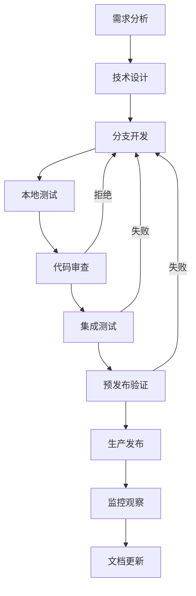
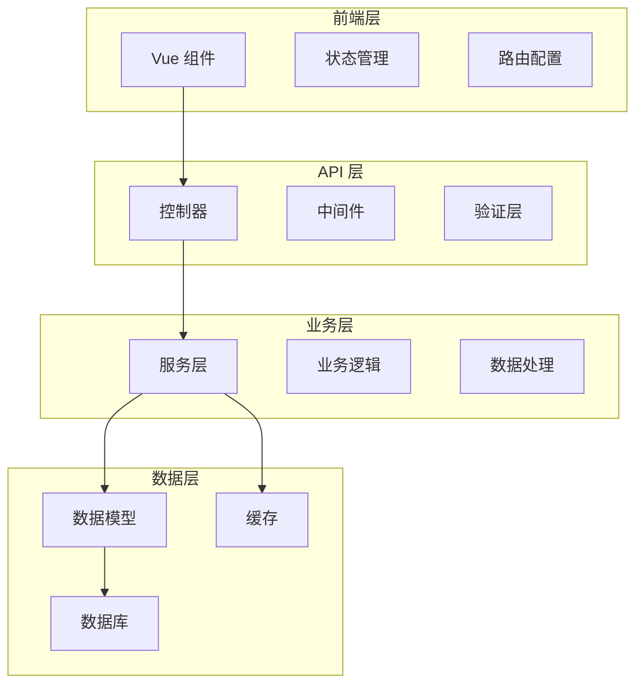
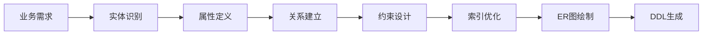
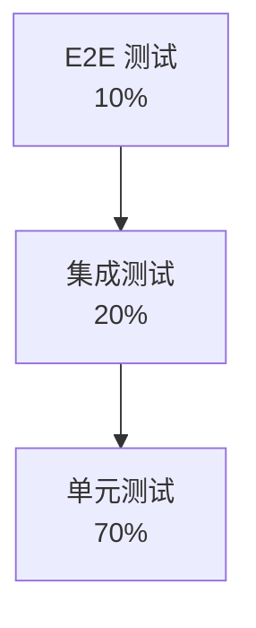
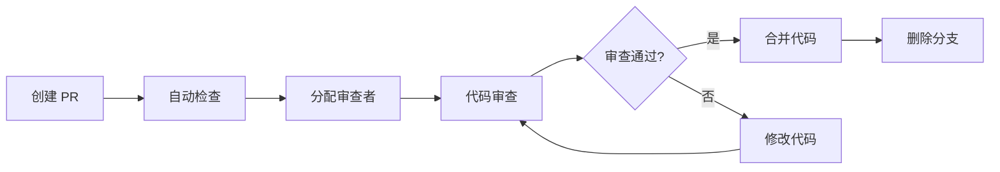

# 开发流程指南

## 🔄 开发流程概述

本指南详细说明了统一认证管理系统的完整开发流程，包括需求分析、功能设计、编码实现、测试验证、代码审查、部署上线等环节的标准流程和最佳实践。

## 📋 开发生命周期

### 完整开发流程图



## 🎯 需求分析阶段

### 1. 需求接收和评估

#### 需求来源
- **产品需求**: 产品经理提出的功能需求
- **技术需求**: 技术改进和优化需求
- **Bug 修复**: 测试发现或用户反馈的问题
- **安全需求**: 安全漏洞修复和安全加固

#### 需求评估标准
```markdown
## 需求评估检查清单

### 功能性
- [ ] 需求描述是否清晰完整
- [ ] 功能边界是否明确
- [ ] 用户场景是否覆盖
- [ ] 验收标准是否可衡量

### 技术性
- [ ] 技术方案是否可行
- [ ] 是否有现成解决方案
- [ ] 是否需要新技术引入
- [ ] 是否影响现有功能

### 资源性
- [ ] 开工工作量是否合理
- [ ] 开发资源是否充足
- [ ] 是否与其他项目冲突
- [ ] 交付时间是否现实

### 价值性
- [ ] 用户价值是否明显
- [ ] 业务价值是否突出
- [ ] ROI 是否合理
- [ ] 优先级是否正确
```

### 2. 需求文档编写

#### 功能需求模板
```markdown
# 功能需求文档

## 需求概述
### 需求名称
### 需求背景
### 业务价值
### 相关方

## 功能描述
### 用户故事
As a [用户角色], I want to [功能描述], so that [业务价值]

### 功能范围
### 功能流程
### 用户界面
### 业务规则

## 验收标准
### 功能验收
- [ ] 功能点 1
- [ ] 功能点 2
- [ ] 功能点 3

### 性能验收
- [ ] 响应时间 < 2s
- [ ] 并发用户数 > 100
- [ ] 页面加载时间 < 3s

### 安全验收
- [ ] 权限控制正确
- [ ] 数据验证完整
- [ ] 安全漏洞扫描通过

## 技术要求
### 技术栈
### 数据库设计
### API 设计
### 前端组件

## 时间计划
### 开发时间
### 测试时间
### 发布时间
### 总体时间

## 风险评估
### 技术风险
### 进度风险
### 资源风险
### 缓解措施
```

## 🏗️ 技术设计阶段

### 1. 技术方案设计

#### 系统架构设计


#### API 设计规范
```typescript
// API 接口设计示例
/**
 * 用户管理 API
 */

// 1. 路由设计
GET    /api/users              // 获取用户列表
GET    /api/users/:id          // 获取用户详情
POST   /api/users              // 创建用户
PUT    /api/users/:id          // 更新用户
DELETE /api/users/:id          // 删除用户

// 2. 请求/响应格式
interface ApiResponse<T> {
  success: boolean
  data: T
  message: string
  timestamp: string
  requestId?: string
}

interface CreateUserRequest {
  username: string
  email: string
  password: string
  userType: 'admin' | 'teacher' | 'parent'
}

interface UserResponse {
  id: number
  username: string
  email: string
  userType: string
  status: string
  createdAt: string
}

// 3. 错误处理
interface ApiError {
  success: false
  error: {
    code: string
    message: string
    details?: any
  }
  timestamp: string
}
```

### 2. 数据库设计

#### 数据模型设计流程


#### 数据库设计文档
```markdown
# 数据库设计文档

## 用户表 (users)
| 字段名 | 类型 | 长度 | 是否空 | 默认值 | 说明 | 索引 |
|--------|------|------|--------|--------|------|------|
| id | BIGINT | - | NO | AUTO_INCREMENT | 主键 | PK |
| username | VARCHAR | 50 | NO | - | 用户名 | UK |
| email | VARCHAR | 255 | NO | - | 邮箱 | UK |
| password | VARCHAR | 255 | NO | - | 密码哈希 | - |
| nickname | VARCHAR | 100 | YES | NULL | 昵称 | - |
| user_type | ENUM | - | NO | 'parent' | 用户类型 | IDX |
| status | ENUM | - | NO | 'pending' | 状态 | IDX |
| created_at | DATETIME | - | NO | CURRENT_TIMESTAMP | 创建时间 | IDX |

## 索引设计
- PRIMARY KEY (id)
- UNIQUE KEY uk_username (username)
- UNIQUE KEY uk_email (email)
- KEY idx_user_type (user_type)
- KEY idx_status (status)
- KEY idx_created_at (created_at)
```

### 3. 设计评审

#### 评审检查清单
```markdown
## 技术设计评审检查清单

### 架构设计
- [ ] 架构是否合理清晰
- [ ] 模块划分是否恰当
- [ ] 依赖关系是否明确
- [ ] 扩展性是否考虑

### API 设计
- [ ] RESTful 设计规范
- [ ] 接口命名是否清晰
- [ ] 参数设计是否合理
- [ ] 响应格式是否统一

### 数据库设计
- [ ] 表结构设计合理
- [ ] 字段类型恰当
- [ ] 索引设计优化
- [ ] 关系设计正确

### 安全设计
- [ ] 认证授权方案
- [ ] 数据验证机制
- [ ] 敏感信息保护
- [ ] API 安全防护

### 性能设计
- [ ] 数据库查询优化
- [ ] 缓存策略设计
- [ ] 并发处理方案
- [ ] 资源使用优化
```

## 💻 开发实现阶段

### 1. 开发环境准备

#### 分支管理策略
```bash
# 主分支
master          # 生产环境分支，只接受来自 release 和 hotfix 的合并
develop         # 开发主分支，功能开发的基础分支

# 功能分支
feature/user-management     # 用户管理功能开发
feature/activity-system    # 活动系统功能开发

# 发布分支
release/v1.2.0            # v1.2.0 版本发布准备

# 修复分支
hotfix/login-bug          # 生产环境紧急修复
```

#### 本地开发环境搭建
```bash
# 1. 克隆项目
git clone https://github.com/your-repo/k.yyup.com.git
cd k.yyup.com

# 2. 创建功能分支
git checkout -b feature/new-feature
git push -u origin feature/new-feature

# 3. 安装依赖
npm install
cd client && npm install && cd ..
cd server && npm install && cd ..

# 4. 配置环境变量
cp .env.example .env.local
# 编辑 .env.local 配置本地开发环境

# 5. 启动开发服务
npm run start:all
```

### 2. 编码实现规范

#### 开发工作流
```bash
# 每日开发流程
git pull origin develop           # 拉取最新代码
npm run lint                     # 代码风格检查
npm run test:unit                # 运行单元测试
npm run dev                      # 启动开发服务器

# 功能开发完成后
git add .                        # 添加修改文件
git commit -m "feat: add user management"  # 提交代码
git push origin feature/user-management    # 推送到远程分支
```

#### 提交信息规范
```bash
# 提交信息格式
<type>(<scope>): <subject>

<body>

<footer>

# 示例
feat(auth): add JWT token refresh mechanism

- Add refresh token endpoint
- Implement automatic token refresh
- Update authentication middleware
- Add token validation utilities

Closes #123
```

#### 提交类型说明
- `feat`: 新功能
- `fix`: Bug 修复
- `docs`: 文档更新
- `style`: 代码格式调整
- `refactor`: 代码重构
- `perf`: 性能优化
- `test`: 测试相关
- `chore`: 构建过程或辅助工具的变动
- `revert`: 代码回滚

### 3. 代码质量控制

#### 代码检查工具配置
```json
{
  "scripts": {
    "lint": "eslint client server --ext .vue,.js,.ts",
    "lint:fix": "eslint client server --ext .vue,.js,.ts --fix",
    "typecheck": "vue-tsc --noEmit",
    "prettier": "prettier --write 'client/**/*.{vue,js,ts}' 'server/**/*.{js,ts}'",
    "test:unit": "vitest",
    "test:coverage": "vitest --coverage"
  }
}
```

#### Git Hooks 配置
```bash
# 安装 husky
npm install --save-dev husky

# 初始化 husky
npx husky install

# 添加 pre-commit hook
npx husky add .husky/pre-commit "npm run lint && npm run test:unit"

# 添加 commit-msg hook
npx husky add .husky/commit-msg "npx commitlint --edit $1"
```

## 🧪 测试验证阶段

### 1. 测试策略

#### 测试金字塔


#### 测试分层说明
```markdown
## 测试分层策略

### 单元测试 (70%)
- **目标**: 函数、类、组件级别的测试
- **工具**: Vitest (前端), Jest (后端)
- **覆盖率**: ≥ 90%
- **执行速度**: 快速 (< 1s)

### 集成测试 (20%)
- **目标**: 模块间接口测试
- **工具**: Supertest, Test Containers
- **覆盖场景**: API 接口、数据库操作
- **执行速度**: 中等 (< 10s)

### E2E 测试 (10%)
- **目标**: 完整业务流程测试
- **工具**: Playwright
- **覆盖场景**: 关键用户路径
- **执行速度**: 慢 (< 60s)
```

### 2. 测试实现

#### 单元测试示例
```typescript
// UserService.test.ts
import { UserService } from '../services/user.service'
import { UserRepository } from '../repositories/user.repository'

describe('UserService', () => {
  let userService: UserService
  let mockUserRepository: jest.Mocked<UserRepository>

  beforeEach(() => {
    mockUserRepository = {
      findOne: jest.fn(),
      create: jest.fn(),
      findAndCountAll: jest.fn()
    } as any

    userService = new UserService(mockUserRepository)
  })

  describe('createUser', () => {
    it('should create user successfully', async () => {
      // Arrange
      const userData = {
        username: 'testuser',
        email: 'test@example.com',
        password: 'password123',
        userType: 'parent'
      }

      const expectedUser = {
        id: 1,
        ...userData,
        status: 'pending_activation'
      }

      mockUserRepository.findOne.mockResolvedValue(null)
      mockUserRepository.create.mockResolvedValue(expectedUser)

      // Act
      const result = await userService.createUser(userData)

      // Assert
      expect(result).toEqual(expectedUser)
      expect(mockUserRepository.create).toHaveBeenCalledWith(
        expect.objectContaining({
          ...userData,
          password: expect.any(String),
          status: 'pending_activation'
        })
      )
    })
  })
})
```

#### 集成测试示例
```typescript
// UserController.integration.test.ts
import request from 'supertest'
import { app } from '../app'
import { setupTestDatabase, cleanupTestDatabase } from '../test-helpers'

describe('UserController Integration', () => {
  beforeAll(async () => {
    await setupTestDatabase()
  })

  afterAll(async () => {
    await cleanupTestDatabase()
  })

  describe('POST /api/users', () => {
    it('should create user and return 201', async () => {
      const userData = {
        username: 'testuser',
        email: 'test@example.com',
        password: 'password123',
        userType: 'parent'
      }

      const response = await request(app)
        .post('/api/users')
        .send(userData)
        .expect(201)

      expect(response.body.success).toBe(true)
      expect(response.body.data.username).toBe(userData.username)
      expect(response.body.data.email).toBe(userData.email)
      expect(response.body.data.password).toBeUndefined() // 密码不应返回
    })
  })
})
```

#### E2E 测试示例
```typescript
// user-management.e2e.test.ts
import { test, expect } from '@playwright/test'

test.describe('User Management E2E', () => {
  test.beforeEach(async ({ page }) => {
    // 登录系统
    await page.goto('/login')
    await page.fill('[data-testid="username"]', 'admin')
    await page.fill('[data-testid="password"]', 'password')
    await page.click('[data-testid="login-button"]')
    await page.waitForURL('/dashboard')
  })

  test('should create new user successfully', async ({ page }) => {
    // 导航到用户管理页面
    await page.goto('/users')

    // 点击创建用户按钮
    await page.click('[data-testid="create-user-button"]')

    // 填写用户信息
    await page.fill('[data-testid="username"]', 'newuser')
    await page.fill('[data-testid="email"]', 'newuser@example.com')
    await page.fill('[data-testid="password"]', 'password123')
    await page.selectOption('[data-testid="user-type"]', 'parent')

    // 提交表单
    await page.click('[data-testid="submit-button"]')

    // 验证用户创建成功
    await expect(page.locator('[data-testid="success-message"]')).toBeVisible()
    await expect(page.locator('text=newuser')).toBeVisible()
  })
})
```

### 3. 测试自动化

#### CI/CD 测试流水线
```yaml
name: Test Pipeline

on:
  push:
    branches: [main, develop]
  pull_request:
    branches: [main, develop]

jobs:
  test:
    runs-on: ubuntu-latest

    services:
      mysql:
        image: mysql:8.0
        env:
          MYSQL_ROOT_PASSWORD: password
          MYSQL_DATABASE: test_db
        ports:
          - 3306:3306
        options: --health-cmd="mysqladmin ping" --health-interval=10s --health-timeout=5s --health-retries=3

      redis:
        image: redis:7
        ports:
          - 6379:6379
        options: --health-cmd="redis-cli ping" --health-interval=10s --health-timeout=5s --health-retries=3

    steps:
    - uses: actions/checkout@v3

    - name: Setup Node.js
      uses: actions/setup-node@v3
      with:
        node-version: '20'
        cache: 'npm'

    - name: Install dependencies
      run: |
        npm ci
        cd client && npm ci
        cd ../server && npm ci

    - name: Run linting
      run: npm run lint

    - name: Run type checking
      run: npm run typecheck

    - name: Run unit tests
      run: npm run test:unit

    - name: Run integration tests
      run: npm run test:integration
      env:
        NODE_ENV: test
        DB_HOST: localhost
        DB_PORT: 3306
        DB_NAME: test_db
        DB_USER: root
        DB_PASSWORD: password
        REDIS_HOST: localhost
        REDIS_PORT: 6379

    - name: Run E2E tests
      run: npm run test:e2e
      env:
        BASE_URL: http://localhost:5173

    - name: Upload coverage reports
      uses: codecov/codecov-action@v3
      with:
        file: ./coverage/lcov.info
```

## 🔍 代码审查阶段

### 1. Pull Request 流程

#### PR 创建规范
```markdown
# Pull Request 模板

## 变更描述
简要描述本次变更的内容和目的

## 变更类型
- [ ] 新功能 (feature)
- [ ] Bug 修复 (bugfix)
- [ ] 文档更新 (docs)
- [ ] 样式调整 (style)
- [ ] 重构 (refactor)
- [ ] 性能优化 (perf)
- [ ] 测试 (test)
- [ ] 构建 (build)
- [ ] 其他 (chore)

## 测试
- [ ] 单元测试通过
- [ ] 集成测试通过
- [ ] 手动测试通过
- [ ] 测试覆盖率达标

## 检查清单
- [ ] 代码遵循项目规范
- [ ] 添加了必要的测试
- [ ] 更新了相关文档
- [ ] 自我审查了代码
- [ ] 没有引入破坏性变更

## 相关问题
Closes #(issue number)
Related to #(issue number)

## 截图
如果是 UI 变更，请提供前后对比截图

## 如何测试
详细说明如何测试本次变更

## 其他说明
其他需要说明的信息
```

### 2. 代码审查标准

#### 审查检查清单
```markdown
## 代码审查检查清单

### 功能性
- [ ] 功能是否按需求实现
- [ ] 边界情况是否考虑
- [ ] 错误处理是否完善
- [ ] 用户体验是否良好

### 代码质量
- [ ] 代码结构清晰合理
- [ ] 命名规范正确
- [ ] 注释充分准确
- [ ] 无重复代码

### 性能
- [ ] 算法复杂度合理
- [ ] 数据库查询优化
- [ ] 内存使用合理
- [ ] 缓存策略正确

### 安全性
- [ ] 输入验证完整
- [ ] 权限控制正确
- [ ] 敏感信息保护
- [ ] SQL 注入防护

### 可维护性
- [ ] 代码可读性好
- [ ] 模块化程度高
- [ ] 依赖关系清晰
- [ ] 测试覆盖充分

### 兼容性
- [ ] 浏览器兼容性
- [ ] API 兼容性
- [ ] 数据库兼容性
- [ ] 向后兼容性
```

### 3. 审查流程

#### 审查角色定义
- **Author**: 代码提交者
- **Reviewer**: 代码审查者 (至少 2 人)
- **Maintainer**: 代码维护者 (最终批准)

#### 审查流程步骤


## 🚀 部署发布阶段

### 1. 版本管理

#### 语义化版本控制
```bash
# 版本格式：MAJOR.MINOR.PATCH
# MAJOR: 不兼容的 API 变更
# MINOR: 向后兼容的功能新增
# PATCH: 向后兼容的问题修正

# 示例版本
1.0.0    # 初始版本
1.1.0    # 新增功能
1.1.1    # Bug 修复
2.0.0    # 重大版本更新
```

#### 发布分支策略
```bash
# 创建发布分支
git checkout -b release/v1.2.0 develop

# 版本号更新
npm version 1.2.0

# 合并到主分支
git checkout main
git merge --no-ff release/v1.2.0
git tag -a v1.2.0 -m "Release version 1.2.0"

# 合并回开发分支
git checkout develop
git merge --no-ff main

# 删除发布分支
git branch -d release/v1.2.0
```

### 2. 部署流程

#### 部署环境管理
```bash
# 环境类型
development    # 开发环境 (本地开发)
testing       # 测试环境 (功能测试)
staging       # 预发布环境 (上线前验证)
production    # 生产环境 (正式环境)

# 环境配置
.env.development    # 开发环境配置
.env.testing       # 测试环境配置
.env.staging       # 预发布环境配置
.env.production    # 生产环境配置
```

#### 自动化部署流程
```yaml
# GitHub Actions 部署流水线
name: Deploy to Production

on:
  push:
    tags:
      - 'v*'

jobs:
  deploy:
    runs-on: ubuntu-latest
    steps:
    - uses: actions/checkout@v3

    - name: Setup Node.js
      uses: actions/setup-node@v3
      with:
        node-version: '20'

    - name: Install dependencies
      run: |
        npm ci
        cd client && npm ci
        cd ../server && npm ci

    - name: Run tests
      run: npm run test:ci

    - name: Build application
      run: |
        cd client && npm run build
        cd ../server && npm run build

    - name: Deploy to production
      uses: appleboy/ssh-action@v0.1.5
      with:
        host: ${{ secrets.PROD_HOST }}
        username: ${{ secrets.PROD_USER }}
        key: ${{ secrets.PROD_SSH_KEY }}
        script: |
          cd /opt/kyyup
          git pull origin main
          npm ci
          npm run build
          pm2 reload all
```

### 3. 发布验证

#### 发布检查清单
```markdown
## 发布检查清单

### 代码质量
- [ ] 所有测试通过
- [ ] 代码审查完成
- [ ] 测试覆盖率达标
- [ ] 性能测试通过

### 部署验证
- [ ] 环境配置正确
- [ ] 数据库迁移成功
- [ ] 服务正常启动
- [ ] 健康检查通过

### 功能验证
- [ ] 核心功能正常
- [ ] 用户登录正常
- [ ] API 接口正常
- [ ] 页面加载正常

### 性能验证
- [ ] 响应时间正常
- [ ] 并发处理正常
- [ ] 内存使用正常
- [ ] 错误率正常

### 监控验证
- [ ] 日志收集正常
- [ ] 监控指标正常
- [ ] 告警配置正确
- [ ] 备份策略有效
```

## 📊 监控和维护

### 1. 发布后监控

#### 监控指标
```typescript
// 关键监控指标
const monitoringMetrics = {
  // 业务指标
  userRegistrations: 'daily_user_registrations',
  activeUsers: 'daily_active_users',
  errorRate: 'api_error_rate',
  responseTime: 'api_response_time',

  // 技术指标
  cpuUsage: 'cpu_usage',
  memoryUsage: 'memory_usage',
  diskUsage: 'disk_usage',
  networkLatency: 'network_latency',

  // 安全指标
  failedLogins: 'failed_login_attempts',
  securityEvents: 'security_events',
  dataBreaches: 'data_breach_attempts'
}
```

#### 告警配置
```yaml
# 告警规则示例
alerts:
  - name: high_error_rate
    condition: error_rate > 5%
    duration: 5m
    severity: critical
    channels: [slack, email]

  - name: slow_response_time
    condition: response_time > 2s
    duration: 10m
    severity: warning
    channels: [slack]

  - name: high_cpu_usage
    condition: cpu_usage > 80%
    duration: 15m
    severity: warning
    channels: [slack]
```

### 2. 问题处理流程

#### 问题分级和处理
```markdown
## 问题分级和处理流程

### P0 - 紧急问题
- **定义**: 系统不可用，数据丢失，安全漏洞
- **响应时间**: 15分钟内响应
- **处理流程**: 立即通知所有相关人员 → 启动应急预案 → 紧急修复 → 发布补丁

### P1 - 高优先级
- **定义**: 核心功能不可用，严重影响用户体验
- **响应时间**: 1小时内响应
- **处理流程**: 通知开发团队 → 评估影响 → 制定修复方案 → 发布修复

### P2 - 中优先级
- **定义**: 部分功能异常，影响部分用户
- **响应时间**: 4小时内响应
- **处理流程**: 纳入开发计划 → 正常开发流程 → 下个版本修复

### P3 - 低优先级
- **定义**: 轻微问题，不影响核心功能
- **响应时间**: 24小时内响应
- **处理流程**: 记录问题 → 产品评估 → 纳入产品路线图
```

## 📚 文档维护

### 1. 技术文档更新

#### 文档类型和更新时机
```markdown
## 技术文档维护

### API 文档
- **更新时机**: API 变更时
- **更新内容**: 接口变更、参数变更、响应变更
- **责任人**: 开发工程师

### 架构文档
- **更新时机**: 架构变更时
- **更新内容**: 系统架构、技术选型、部署架构
- **责任人**: 架构师

### 开发文档
- **更新时机**: 开发流程变更时
- **更新内容**: 编码规范、开发指南、工具配置
- **责任人**: 技术负责人

### 运维文档
- **更新时机**: 部署流程变更时
- **更新内容**: 部署指南、监控配置、故障处理
- **责任人**: 运维工程师
```

### 2. 知识分享

#### 技术分享机制
```markdown
## 技术分享机制

### 每周技术分享
- **时间**: 每周五下午
- **参与者**: 全体技术团队
- **主题**: 技术难点、最佳实践、新技术介绍

### 月度技术总结
- **时间**: 每月末
- **参与者**: 技术负责人
- **内容**: 项目进展、技术债务、改进计划

### 季度技术回顾
- **时间**: 每季度末
- **参与者**: 管理层和技术团队
- **内容**: 技术战略、架构演进、团队能力建设
```

---

**最后更新**: 2025-11-29
**文档版本**: v1.0.0
**维护团队**: 统一认证管理系统开发团队