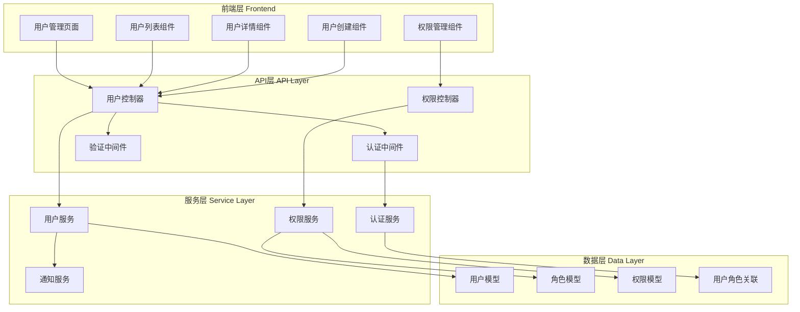

# 用户管理模块详细说明

## 👥 模块概述

用户管理模块是统一认证管理系统的核心模块之一，负责管理系统中所有用户的生命周期，包括用户注册、认证、权限管理、个人信息管理等功能。模块采用RBAC（基于角色的访问控制）模型，支持多层级、多角色的权限管理体系。

## 🏗️ 模块架构

### 整体架构设计



### 技术栈

| 层级 | 技术栈 | 说明 |
|------|--------|------|
| **前端** | Vue 3 + TypeScript + Element Plus | 现代化前端框架和UI组件库 |
| **状态管理** | Pinia | Vue 3 官方推荐的状态管理库 |
| **路由** | Vue Router 4 | 动态路由和权限控制 |
| **后端** | Express.js + TypeScript | 高性能的Node.js Web框架 |
| **数据库** | MySQL 8.0 + Sequelize ORM | 关系型数据库和ORM框架 |
| **认证** | JWT + BCrypt | 无状态认证和密码加密 |
| **缓存** | Redis | 会话存储和权限缓存 |

## 📊 数据模型设计

### 核心数据模型

#### 用户模型 (User)
```typescript
interface User {
  id: number;                    // 用户ID
  username: string;              // 用户名（唯一）
  email: string;                 // 邮箱地址（唯一）
  password: string;              // 密码哈希
  phone?: string;                // 手机号码
  nickname?: string;             // 昵称
  avatar?: string;               // 头像URL
  gender?: 'male' | 'female' | 'other'; // 性别
  birthday?: string;             // 生日
  address?: string;              // 地址
  status: UserStatus;            // 用户状态
  userType: UserType;            // 用户类型
  emailVerifiedAt?: string;      // 邮箱验证时间
  phoneVerifiedAt?: string;      // 手机验证时间
  lastLoginAt?: string;          // 最后登录时间
  passwordChangedAt?: string;    // 密码修改时间
  createdAt: string;             // 创建时间
  updatedAt: string;             // 更新时间
  deletedAt?: string;            // 删除时间
}

enum UserStatus {
  Active = 'active',                    // 活跃
  Inactive = 'inactive',                // 非活跃
  Locked = 'locked',                    // 锁定
  PendingActivation = 'pending_activation' // 待激活
}

enum UserType {
  Admin = 'admin',                      // 管理员
  Principal = 'principal',              // 园长
  Teacher = 'teacher',                  // 教师
  Parent = 'parent',                    // 家长
  Student = 'student'                   // 学生
}
```

#### 角色模型 (Role)
```typescript
interface Role {
  id: number;                    // 角色ID
  name: string;                  // 角色名称（唯一）
  displayName: string;           // 显示名称
  description?: string;          // 角色描述
  status: RoleStatus;            // 角色状态
  isSystem: boolean;             // 是否系统角色
  createdAt: string;             // 创建时间
  updatedAt: string;             // 更新时间
}

enum RoleStatus {
  Active = 'active',              // 启用
  Inactive = 'inactive'          // 禁用
}
```

#### 权限模型 (Permission)
```typescript
interface Permission {
  id: number;                    // 权限ID
  name: string;                  // 权限名称（唯一）
  resource: string;              // 资源名称
  action: string;                // 操作名称
  description?: string;          // 权限描述
  status: PermissionStatus;      // 权限状态
  createdAt: string;             // 创建时间
  updatedAt: string;             // 更新时间
}

enum PermissionStatus {
  Active = 'active',              // 启用
  Inactive = 'inactive'          // 禁用
}
```

#### 关联模型
```typescript
// 用户角色关联
interface UserRole {
  userId: number;                // 用户ID
  roleId: number;                // 角色ID
  assignedAt: string;            // 分配时间
  assignedBy: number;            // 分配人ID
  expiresAt?: string;            // 过期时间
}

// 角色权限关联
interface RolePermission {
  roleId: number;                // 角色ID
  permissionId: number;          // 权限ID
  grantedAt: string;             // 授权时间
  grantedBy: number;             // 授权人ID
}
```

### 数据库表结构

```sql
-- 用户表
CREATE TABLE users (
  id BIGINT PRIMARY KEY AUTO_INCREMENT,
  username VARCHAR(50) NOT NULL UNIQUE,
  email VARCHAR(255) NOT NULL UNIQUE,
  password VARCHAR(255) NOT NULL,
  phone VARCHAR(20) UNIQUE,
  nickname VARCHAR(100),
  avatar VARCHAR(500),
  gender ENUM('male', 'female', 'other'),
  birthday DATE,
  address VARCHAR(500),
  status ENUM('active', 'inactive', 'locked', 'pending_activation') NOT NULL DEFAULT 'pending_activation',
  user_type ENUM('admin', 'principal', 'teacher', 'parent', 'student') NOT NULL,
  email_verified_at TIMESTAMP NULL,
  phone_verified_at TIMESTAMP NULL,
  last_login_at TIMESTAMP NULL,
  password_changed_at TIMESTAMP NULL,
  created_at TIMESTAMP DEFAULT CURRENT_TIMESTAMP,
  updated_at TIMESTAMP DEFAULT CURRENT_TIMESTAMP ON UPDATE CURRENT_TIMESTAMP,
  deleted_at TIMESTAMP NULL,

  INDEX idx_username (username),
  INDEX idx_email (email),
  INDEX idx_phone (phone),
  INDEX idx_status (status),
  INDEX idx_user_type (user_type),
  INDEX idx_created_at (created_at)
);

-- 角色表
CREATE TABLE roles (
  id BIGINT PRIMARY KEY AUTO_INCREMENT,
  name VARCHAR(50) NOT NULL UNIQUE,
  display_name VARCHAR(100) NOT NULL,
  description TEXT,
  status ENUM('active', 'inactive') NOT NULL DEFAULT 'active',
  is_system BOOLEAN NOT NULL DEFAULT FALSE,
  created_at TIMESTAMP DEFAULT CURRENT_TIMESTAMP,
  updated_at TIMESTAMP DEFAULT CURRENT_TIMESTAMP ON UPDATE CURRENT_TIMESTAMP,

  INDEX idx_name (name),
  INDEX idx_status (status)
);

-- 权限表
CREATE TABLE permissions (
  id BIGINT PRIMARY KEY AUTO_INCREMENT,
  name VARCHAR(100) NOT NULL UNIQUE,
  resource VARCHAR(50) NOT NULL,
  action VARCHAR(50) NOT NULL,
  description TEXT,
  status ENUM('active', 'inactive') NOT NULL DEFAULT 'active',
  created_at TIMESTAMP DEFAULT CURRENT_TIMESTAMP,
  updated_at TIMESTAMP DEFAULT CURRENT_TIMESTAMP ON UPDATE CURRENT_TIMESTAMP,

  UNIQUE KEY uk_resource_action (resource, action),
  INDEX idx_name (name),
  INDEX idx_status (status)
);

-- 用户角色关联表
CREATE TABLE user_roles (
  user_id BIGINT NOT NULL,
  role_id BIGINT NOT NULL,
  assigned_at TIMESTAMP DEFAULT CURRENT_TIMESTAMP,
  assigned_by BIGINT,
  expires_at TIMESTAMP NULL,

  PRIMARY KEY (user_id, role_id),
  FOREIGN KEY (user_id) REFERENCES users(id) ON DELETE CASCADE,
  FOREIGN KEY (role_id) REFERENCES roles(id) ON DELETE CASCADE,
  INDEX idx_assigned_at (assigned_at),
  INDEX idx_expires_at (expires_at)
);

-- 角色权限关联表
CREATE TABLE role_permissions (
  role_id BIGINT NOT NULL,
  permission_id BIGINT NOT NULL,
  granted_at TIMESTAMP DEFAULT CURRENT_TIMESTAMP,
  granted_by BIGINT,

  PRIMARY KEY (role_id, permission_id),
  FOREIGN KEY (role_id) REFERENCES roles(id) ON DELETE CASCADE,
  FOREIGN KEY (permission_id) REFERENCES permissions(id) ON DELETE CASCADE,
  INDEX idx_granted_at (granted_at)
);
```

## 🔧 功能特性

### 1. 用户认证功能

#### 用户注册
- **邮箱注册**: 支持邮箱验证注册
- **手机注册**: 支持短信验证注册
- **管理员创建**: 支持管理员直接创建用户
- **批量导入**: 支持Excel/CSV批量导入用户

#### 登录认证
- **用户名密码登录**: 传统登录方式
- **邮箱密码登录**: 使用邮箱登录
- **手机验证码登录**: 短信验证码快速登录
- **第三方登录**: 支持微信、QQ等第三方登录
- **单点登录**: 支持SSO单点登录
- **记住登录状态**: 支持自动登录

#### 密码管理
- **密码重置**: 支持邮箱和短信重置密码
- **密码修改**: 用户自助修改密码
- **密码策略**: 强密码策略和安全要求
- **密码历史**: 防止重复使用历史密码

### 2. 用户信息管理

#### 个人信息
- **基本信息**: 用户名、昵称、性别、生日等
- **联系方式**: 邮箱、手机、地址等
- **头像管理**: 上传和更换头像
- **偏好设置**: 语言、主题、通知设置等

#### 用户状态管理
- **账户激活**: 邮箱或短信激活账户
- **账户锁定**: 违规或安全原因锁定账户
- **账户注销**: 用户主动注销或管理员删除
- **状态变更**: 状态变更记录和通知

### 3. 权限管理系统

#### 角色管理
- **系统角色**: 预定义的系统角色（管理员、教师、家长等）
- **自定义角色**: 支持创建自定义角色
- **角色层级**: 支持角色的层级关系
- **角色状态**: 角色的启用和禁用

#### 权限管理
- **资源权限**: 按资源分配权限（页面、功能、数据）
- **操作权限**: 按操作分配权限（增删改查）
- **数据权限**: 按数据范围分配权限（个人、部门、全部）
- **动态权限**: 支持动态权限配置

#### 权限继承
- **角色继承**: 角色可以继承其他角色的权限
- **权限组合**: 用户可以拥有多个角色的权限组合
- **临时授权**: 支持临时性权限授予
- **权限撤销**: 及时撤销不需要的权限

### 4. 安全功能

#### 安全策略
- **登录限制**: 登录失败次数限制
- **会话管理**: 会话超时和并发登录控制
- **安全审计**: 记录用户操作日志
- **风险评估**: 异常行为检测和预警

#### 数据保护
- **数据加密**: 敏感数据加密存储
- **传输安全**: HTTPS加密传输
- **访问控制**: 细粒度的数据访问控制
- **隐私保护**: 用户隐私数据保护

## 🖥️ 前端实现

### 1. 页面结构

#### 用户管理主页面
```vue
<template>
  <div class="user-management">
    <!-- 页面头部 -->
    <div class="page-header">
      <h1>用户管理</h1>
      <el-button type="primary" @click="handleCreate">
        <el-icon><Plus /></el-icon>
        新建用户
      </el-button>
    </div>

    <!-- 搜索筛选 -->
    <div class="search-section">
      <el-form :model="searchForm" inline>
        <el-form-item label="关键词">
          <el-input
            v-model="searchForm.keyword"
            placeholder="用户名、邮箱、昵称"
            clearable
            @keyup.enter="handleSearch"
          />
        </el-form-item>
        <el-form-item label="用户类型">
          <el-select
            v-model="searchForm.userType"
            placeholder="请选择"
            clearable
          >
            <el-option
              v-for="type in userTypeOptions"
              :key="type.value"
              :label="type.label"
              :value="type.value"
            />
          </el-select>
        </el-form-item>
        <el-form-item label="状态">
          <el-select
            v-model="searchForm.status"
            placeholder="请选择"
            clearable
          >
            <el-option
              v-for="status in statusOptions"
              :key="status.value"
              :label="status.label"
              :value="status.value"
            />
          </el-select>
        </el-form-item>
        <el-form-item>
          <el-button type="primary" @click="handleSearch">搜索</el-button>
          <el-button @click="handleReset">重置</el-button>
        </el-form-item>
      </el-form>
    </div>

    <!-- 操作栏 -->
    <div class="action-section">
      <el-button-group>
        <el-button
          :disabled="selectedUsers.length === 0"
          @click="handleBatchStatus('active')"
        >
          批量启用
        </el-button>
        <el-button
          :disabled="selectedUsers.length === 0"
          @click="handleBatchStatus('inactive')"
        >
          批量禁用
        </el-button>
        <el-button
          :disabled="selectedUsers.length === 0"
          @click="handleBatchDelete"
        >
          批量删除
        </el-button>
      </el-button-group>
      <div class="right-actions">
        <el-button @click="handleExport">导出数据</el-button>
        <el-button @click="handleImport">导入用户</el-button>
      </div>
    </div>

    <!-- 用户列表 -->
    <div class="table-section">
      <el-table
        v-loading="loading"
        :data="userList"
        @selection-change="handleSelectionChange"
      >
        <el-table-column type="selection" width="55" />
        <el-table-column prop="id" label="ID" width="80" />
        <el-table-column prop="username" label="用户名" width="120" />
        <el-table-column prop="email" label="邮箱" width="200" />
        <el-table-column prop="nickname" label="昵称" width="120" />
        <el-table-column prop="userType" label="用户类型" width="100">
          <template #default="{ row }">
            <el-tag :type="getUserTypeTagType(row.userType)">
              {{ getUserTypeLabel(row.userType) }}
            </el-tag>
          </template>
        </el-table-column>
        <el-table-column prop="status" label="状态" width="100">
          <template #default="{ row }">
            <el-tag :type="getStatusTagType(row.status)">
              {{ getStatusLabel(row.status) }}
            </el-tag>
          </template>
        </el-table-column>
        <el-table-column prop="lastLoginAt" label="最后登录" width="180">
          <template #default="{ row }">
            {{ formatDateTime(row.lastLoginAt) }}
          </template>
        </el-table-column>
        <el-table-column prop="createdAt" label="创建时间" width="180">
          <template #default="{ row }">
            {{ formatDateTime(row.createdAt) }}
          </template>
        </el-table-column>
        <el-table-column label="操作" width="200" fixed="right">
          <template #default="{ row }">
            <el-button
              type="primary"
              size="small"
              @click="handleView(row)"
            >
              查看
            </el-button>
            <el-button
              type="warning"
              size="small"
              @click="handleEdit(row)"
            >
              编辑
            </el-button>
            <el-dropdown @command="(command) => handleAction(command, row)">
              <el-button type="info" size="small">
                更多<el-icon><ArrowDown /></el-icon>
              </el-button>
              <template #dropdown>
                <el-dropdown-menu>
                  <el-dropdown-item command="roles">角色管理</el-dropdown-item>
                  <el-dropdown-item command="permissions">权限设置</el-dropdown-item>
                  <el-dropdown-item command="resetPassword">重置密码</el-dropdown-item>
                  <el-dropdown-item command="loginHistory">登录历史</el-dropdown-item>
                  <el-dropdown-item command="delete" divided>删除用户</el-dropdown-item>
                </el-dropdown-menu>
              </template>
            </el-dropdown>
          </template>
        </el-table-column>
      </el-table>

      <!-- 分页 -->
      <div class="pagination-section">
        <el-pagination
          v-model:current-page="pagination.page"
          v-model:page-size="pagination.pageSize"
          :total="pagination.total"
          :page-sizes="[20, 50, 100]"
          layout="total, sizes, prev, pager, next, jumper"
          @size-change="handleSizeChange"
          @current-change="handlePageChange"
        />
      </div>
    </div>

    <!-- 用户创建/编辑对话框 -->
    <UserDialog
      v-model="dialogVisible"
      :user="currentUser"
      :mode="dialogMode"
      @success="handleDialogSuccess"
    />

    <!-- 用户详情对话框 -->
    <UserDetailDialog
      v-model="detailDialogVisible"
      :user="currentUser"
    />

    <!-- 角色管理对话框 -->
    <UserRoleDialog
      v-model="roleDialogVisible"
      :user="currentUser"
      @success="handleRoleSuccess"
    />
  </div>
</template>

<script setup lang="ts">
import { ref, reactive, onMounted } from 'vue'
import { ElMessage, ElMessageBox } from 'element-plus'
import { Plus, ArrowDown } from '@element-plus/icons-vue'
import type { User, UserQuery, UserFormData } from '@/types/user'
import { userApi } from '@/api/user'
import { formatDateTime } from '@/utils/date'
import UserDialog from './components/UserDialog.vue'
import UserDetailDialog from './components/UserDetailDialog.vue'
import UserRoleDialog from './components/UserRoleDialog.vue'

// 响应式数据
const loading = ref(false)
const userList = ref<User[]>([])
const selectedUsers = ref<User[]>([])

// 搜索表单
const searchForm = reactive<UserQuery>({
  keyword: '',
  userType: '',
  status: '',
  page: 1,
  pageSize: 20
})

// 分页信息
const pagination = reactive({
  page: 1,
  pageSize: 20,
  total: 0
})

// 对话框状态
const dialogVisible = ref(false)
const detailDialogVisible = ref(false)
const roleDialogVisible = ref(false)
const dialogMode = ref<'create' | 'edit'>('create')
const currentUser = ref<User | null>(null)

// 选项数据
const userTypeOptions = [
  { label: '管理员', value: 'admin' },
  { label: '园长', value: 'principal' },
  { label: '教师', value: 'teacher' },
  { label: '家长', value: 'parent' },
  { label: '学生', value: 'student' }
]

const statusOptions = [
  { label: '活跃', value: 'active' },
  { label: '非活跃', value: 'inactive' },
  { label: '锁定', value: 'locked' },
  { label: '待激活', value: 'pending_activation' }
]

// 方法定义
const loadUsers = async () => {
  try {
    loading.value = true
    const response = await userApi.getUsers({
      ...searchForm,
      page: pagination.page,
      pageSize: pagination.pageSize
    })

    userList.value = response.data.users
    pagination.total = response.data.pagination.total
  } catch (error) {
    ElMessage.error('加载用户列表失败')
    console.error('Failed to load users:', error)
  } finally {
    loading.value = false
  }
}

const handleSearch = () => {
  pagination.page = 1
  loadUsers()
}

const handleReset = () => {
  Object.assign(searchForm, {
    keyword: '',
    userType: '',
    status: ''
  })
  handleSearch()
}

const handleCreate = () => {
  currentUser.value = null
  dialogMode.value = 'create'
  dialogVisible.value = true
}

const handleEdit = (user: User) => {
  currentUser.value = user
  dialogMode.value = 'edit'
  dialogVisible.value = true
}

const handleView = (user: User) => {
  currentUser.value = user
  detailDialogVisible.value = true
}

const handleSelectionChange = (users: User[]) => {
  selectedUsers.value = users
}

const handleDialogSuccess = () => {
  dialogVisible.value = false
  loadUsers()
}

const handleRoleSuccess = () => {
  roleDialogVisible.value = false
  loadUsers()
}

const handleAction = async (command: string, user: User) => {
  switch (command) {
    case 'roles':
      currentUser.value = user
      roleDialogVisible.value = true
      break
    case 'permissions':
      // 实现权限设置逻辑
      break
    case 'resetPassword':
      await handleResetPassword(user)
      break
    case 'loginHistory':
      // 实现登录历史查看逻辑
      break
    case 'delete':
      await handleDelete(user)
      break
  }
}

const handleResetPassword = async (user: User) => {
  try {
    await ElMessageBox.confirm(
      `确定要重置用户 "${user.nickname}" 的密码吗？`,
      '确认操作',
      {
        confirmButtonText: '确定',
        cancelButtonText: '取消',
        type: 'warning'
      }
    )

    await userApi.resetPassword(user.id)
    ElMessage.success('密码重置成功')
  } catch (error) {
    if (error !== 'cancel') {
      ElMessage.error('密码重置失败')
      console.error('Failed to reset password:', error)
    }
  }
}

const handleDelete = async (user: User) => {
  try {
    await ElMessageBox.confirm(
      `确定要删除用户 "${user.nickname}" 吗？此操作不可恢复。`,
      '确认删除',
      {
        confirmButtonText: '确定',
        cancelButtonText: '取消',
        type: 'warning'
      }
    )

    await userApi.deleteUser(user.id)
    ElMessage.success('用户删除成功')
    loadUsers()
  } catch (error) {
    if (error !== 'cancel') {
      ElMessage.error('用户删除失败')
      console.error('Failed to delete user:', error)
    }
  }
}

// 工具方法
const getUserTypeLabel = (type: string) => {
  const option = userTypeOptions.find(item => item.value === type)
  return option?.label || type
}

const getUserTypeTagType = (type: string) => {
  const typeMap = {
    admin: 'danger',
    principal: 'warning',
    teacher: 'success',
    parent: 'info',
    student: 'primary'
  }
  return typeMap[type] || 'info'
}

const getStatusLabel = (status: string) => {
  const option = statusOptions.find(item => item.value === status)
  return option?.label || status
}

const getStatusTagType = (status: string) => {
  const statusMap = {
    active: 'success',
    inactive: 'info',
    locked: 'danger',
    pending_activation: 'warning'
  }
  return statusMap[status] || 'info'
}

// 生命周期
onMounted(() => {
  loadUsers()
})
</script>

<style lang="scss" scoped>
.user-management {
  padding: 20px;

  .page-header {
    display: flex;
    justify-content: space-between;
    align-items: center;
    margin-bottom: 20px;

    h1 {
      margin: 0;
      font-size: 24px;
      font-weight: 600;
    }
  }

  .search-section {
    background: #fff;
    padding: 20px;
    border-radius: 8px;
    margin-bottom: 20px;
    box-shadow: 0 2px 4px rgba(0, 0, 0, 0.1);
  }

  .action-section {
    display: flex;
    justify-content: space-between;
    align-items: center;
    margin-bottom: 20px;

    .right-actions {
      display: flex;
      gap: 10px;
    }
  }

  .table-section {
    background: #fff;
    border-radius: 8px;
    box-shadow: 0 2px 4px rgba(0, 0, 0, 0.1);
    overflow: hidden;

    .el-table {
      margin-bottom: 0;
    }
  }

  .pagination-section {
    padding: 20px;
    display: flex;
    justify-content: center;
    background: #f5f5f5;
    border-top: 1px solid #e4e7ed;
  }
}
</style>
```

### 2. 状态管理

#### 用户Store
```typescript
// stores/user.ts
import { defineStore } from 'pinia'
import { ref, computed } from 'vue'
import type { User, UserQuery, UserFormData } from '@/types/user'
import { userApi } from '@/api/user'

export const useUserStore = defineStore('user', () => {
  // 状态
  const currentUser = ref<User | null>(null)
  const users = ref<User[]>([])
  const loading = ref(false)
  const pagination = ref({
    page: 1,
    pageSize: 20,
    total: 0
  })

  // 计算属性
  const isAuthenticated = computed(() => !!currentUser.value)
  const userPermissions = computed(() => currentUser.value?.permissions || [])
  const userRoles = computed(() => currentUser.value?.roles || [])

  // 方法
  const setCurrentUser = (user: User | null) => {
    currentUser.value = user
  }

  const loadUsers = async (query: UserQuery) => {
    try {
      loading.value = true
      const response = await userApi.getUsers(query)
      users.value = response.data.users
      pagination.value = response.data.pagination
    } catch (error) {
      console.error('Failed to load users:', error)
      throw error
    } finally {
      loading.value = false
    }
  }

  const createUser = async (userData: UserFormData) => {
    try {
      const response = await userApi.createUser(userData)
      return response.data
    } catch (error) {
      console.error('Failed to create user:', error)
      throw error
    }
  }

  const updateUser = async (id: number, userData: Partial<UserFormData>) => {
    try {
      const response = await userApi.updateUser(id, userData)

      // 更新列表中的用户
      const index = users.value.findIndex(user => user.id === id)
      if (index !== -1) {
        users.value[index] = response.data
      }

      // 更新当前用户
      if (currentUser.value?.id === id) {
        currentUser.value = response.data
      }

      return response.data
    } catch (error) {
      console.error('Failed to update user:', error)
      throw error
    }
  }

  const deleteUser = async (id: number) => {
    try {
      await userApi.deleteUser(id)

      // 从列表中移除用户
      const index = users.value.findIndex(user => user.id === id)
      if (index !== -1) {
        users.value.splice(index, 1)
        pagination.value.total--
      }

      // 如果删除的是当前用户，清除登录状态
      if (currentUser.value?.id === id) {
        setCurrentUser(null)
      }
    } catch (error) {
      console.error('Failed to delete user:', error)
      throw error
    }
  }

  const hasPermission = (permission: string): boolean => {
    return userPermissions.value.includes(permission)
  }

  const hasRole = (role: string): boolean => {
    return userRoles.value.some(userRole => userRole.name === role)
  }

  return {
    // 状态
    currentUser,
    users,
    loading,
    pagination,

    // 计算属性
    isAuthenticated,
    userPermissions,
    userRoles,

    // 方法
    setCurrentUser,
    loadUsers,
    createUser,
    updateUser,
    deleteUser,
    hasPermission,
    hasRole
  }
})
```

## 🖥️ 后端实现

### 1. 控制器层

#### 用户控制器
```typescript
// controllers/user.controller.ts
import { Request, Response, NextFunction } from 'express'
import { UserService } from '../services/user.service'
import { ApiResponse, PaginationQuery } from '../types/common'
import { CreateUserDto, UpdateUserDto, UserQueryDto } from '../dto/user.dto'
import { validateDto } from '../utils/validation'
import { logger } from '../utils/logger'

export class UserController {
  constructor(private readonly userService: UserService) {}

  /**
   * 获取用户列表
   */
  async getUsers(
    req: Request<{}, {}, {}, UserQueryDto & PaginationQuery>,
    res: Response<ApiResponse<User[]>>,
    next: NextFunction
  ): Promise<void> {
    try {
      const query = await validateDto(UserQueryDto, req.query)
      const result = await this.userService.getUsers(query)

      const response: ApiResponse<User[]> = {
        success: true,
        data: result.users,
        message: '获取用户列表成功',
        timestamp: new Date().toISOString()
      }

      res.setHeader('X-Pagination', JSON.stringify(result.pagination))
      res.json(response)
    } catch (error) {
      logger.error('Failed to get users:', error)
      next(error)
    }
  }

  /**
   * 获取用户详情
   */
  async getUserById(
    req: Request<{ id: string }>,
    res: Response<ApiResponse<User>>,
    next: NextFunction
  ): Promise<void> {
    try {
      const { id } = req.params
      const user = await this.userService.getUserById(Number(id))

      if (!user) {
        res.status(404).json({
          success: false,
          error: {
            code: 'USER_NOT_FOUND',
            message: '用户不存在'
          },
          timestamp: new Date().toISOString()
        })
        return
      }

      const response: ApiResponse<User> = {
        success: true,
        data: user,
        message: '获取用户详情成功',
        timestamp: new Date().toISOString()
      }

      res.json(response)
    } catch (error) {
      logger.error('Failed to get user:', error)
      next(error)
    }
  }

  /**
   * 创建用户
   */
  async createUser(
    req: Request<{}, {}, CreateUserDto>,
    res: Response<ApiResponse<User>>,
    next: NextFunction
  ): Promise<void> {
    try {
      const userData = await validateDto(CreateUserDto, req.body)
      const user = await this.userService.createUser(userData)

      const response: ApiResponse<User> = {
        success: true,
        data: user,
        message: '用户创建成功',
        timestamp: new Date().toISOString()
      }

      res.status(201).json(response)
    } catch (error) {
      logger.error('Failed to create user:', error)
      next(error)
    }
  }

  /**
   * 更新用户
   */
  async updateUser(
    req: Request<{ id: string }, {}, UpdateUserDto>,
    res: Response<ApiResponse<User>>,
    next: NextFunction
  ): Promise<void> {
    try {
      const { id } = req.params
      const userData = await validateDto(UpdateUserDto, req.body)
      const user = await this.userService.updateUser(Number(id), userData)

      const response: ApiResponse<User> = {
        success: true,
        data: user,
        message: '用户更新成功',
        timestamp: new Date().toISOString()
      }

      res.json(response)
    } catch (error) {
      logger.error('Failed to update user:', error)
      next(error)
    }
  }

  /**
   * 删除用户
   */
  async deleteUser(
    req: Request<{ id: string }>,
    res: Response<ApiResponse<null>>,
    next: NextFunction
  ): Promise<void> {
    try {
      const { id } = req.params
      await this.userService.deleteUser(Number(id))

      const response: ApiResponse<null> = {
        success: true,
        data: null,
        message: '用户删除成功',
        timestamp: new Date().toISOString()
      }

      res.json(response)
    } catch (error) {
      logger.error('Failed to delete user:', error)
      next(error)
    }
  }

  /**
   * 更新用户状态
   */
  async updateUserStatus(
    req: Request<{ id: string }, {}, { status: string; reason?: string }>,
    res: Response<ApiResponse<User>>,
    next: NextFunction
  ): Promise<void> {
    try {
      const { id } = req.params
      const { status, reason } = req.body
      const user = await this.userService.updateUserStatus(Number(id), status, reason)

      const response: ApiResponse<User> = {
        success: true,
        data: user,
        message: '用户状态更新成功',
        timestamp: new Date().toISOString()
      }

      res.json(response)
    } catch (error) {
      logger.error('Failed to update user status:', error)
      next(error)
    }
  }
}
```

### 2. 服务层

#### 用户服务
```typescript
// services/user.service.ts
import { Op } from 'sequelize'
import { User, Role, Permission } from '../models'
import { CreateUserDto, UpdateUserDto, UserQuery } from '../dto/user.dto'
import { hashPassword, generateRandomPassword } from '../utils/password'
import { ConflictError, NotFoundError } from '../utils/errors'
import { emailService, smsService } from '../services/notification.service'

export class UserService {
  /**
   * 获取用户列表
   */
  async getUsers(query: UserQuery) {
    const {
      page = 1,
      pageSize = 20,
      keyword,
      userType,
      status,
      startDate,
      endDate
    } = query

    const where: any = {
      deletedAt: null
    }

    // 关键词搜索
    if (keyword) {
      where[Op.or] = [
        { username: { [Op.like]: `%${keyword}%` } },
        { email: { [Op.like]: `%${keyword}%` } },
        { nickname: { [Op.like]: `%${keyword}%` } }
      ]
    }

    // 用户类型筛选
    if (userType) {
      where.userType = userType
    }

    // 状态筛选
    if (status) {
      where.status = status
    }

    // 创建时间范围筛选
    if (startDate || endDate) {
      where.createdAt = {}
      if (startDate) {
        where.createdAt[Op.gte] = new Date(startDate)
      }
      if (endDate) {
        where.createdAt[Op.lte] = new Date(endDate + ' 23:59:59')
      }
    }

    const { count, rows } = await User.findAndCountAll({
      where,
      limit: pageSize,
      offset: (page - 1) * pageSize,
      order: [['createdAt', 'DESC']],
      include: [
        {
          model: Role,
          as: 'roles',
          attributes: ['id', 'name', 'displayName'],
          through: { attributes: [] }
        }
      ]
    })

    return {
      users: rows,
      pagination: {
        page,
        pageSize,
        total: count,
        totalPages: Math.ceil(count / pageSize)
      }
    }
  }

  /**
   * 根据ID获取用户
   */
  async getUserById(id: number): Promise<User | null> {
    const user = await User.findOne({
      where: { id, deletedAt: null },
      include: [
        {
          model: Role,
          as: 'roles',
          include: [
            {
              model: Permission,
              as: 'permissions',
              through: { attributes: [] }
            }
          ]
        }
      ]
    })

    return user
  }

  /**
   * 创建用户
   */
  async createUser(userData: CreateUserDto): Promise<User> {
    // 检查用户名和邮箱是否已存在
    const existingUser = await User.findOne({
      where: {
        [Op.or]: [
          { username: userData.username },
          { email: userData.email }
        ],
        deletedAt: null
      }
    })

    if (existingUser) {
      throw new ConflictError('用户名或邮箱已存在')
    }

    // 生成密码哈希
    const passwordHash = await hashPassword(userData.password)

    // 创建用户
    const user = await User.create({
      ...userData,
      password: passwordHash,
      status: 'pending_activation'
    })

    // 发送激活邮件
    if (userData.email) {
      await emailService.sendActivationEmail(userData.email, user.id)
    }

    // 返回用户信息（不包含密码）
    return this.sanitizeUser(user)
  }

  /**
   * 更新用户
   */
  async updateUser(id: number, userData: UpdateUserDto): Promise<User> {
    const user = await User.findOne({
      where: { id, deletedAt: null }
    })

    if (!user) {
      throw new NotFoundError('用户不存在')
    }

    // 检查邮箱和用户名唯一性（排除当前用户）
    if (userData.email || userData.username) {
      const conflictUser = await User.findOne({
        where: {
          id: { [Op.ne]: id },
          [Op.or]: [
            ...(userData.email ? [{ email: userData.email }] : []),
            ...(userData.username ? [{ username: userData.username }] : [])
          ],
          deletedAt: null
        }
      })

      if (conflictUser) {
        throw new ConflictError('用户名或邮箱已存在')
      }
    }

    // 更新用户信息
    await user.update(userData)

    // 重新获取更新后的用户信息
    const updatedUser = await this.getUserById(id)
    return updatedUser!
  }

  /**
   * 删除用户（软删除）
   */
  async deleteUser(id: number): Promise<void> {
    const user = await User.findOne({
      where: { id, deletedAt: null }
    })

    if (!user) {
      throw new NotFoundError('用户不存在')
    }

    // 软删除用户
    await user.update({ deletedAt: new Date() })
  }

  /**
   * 更新用户状态
   */
  async updateUserStatus(id: number, status: string, reason?: string): Promise<User> {
    const user = await User.findOne({
      where: { id, deletedAt: null }
    })

    if (!user) {
      throw new NotFoundError('用户不存在')
    }

    await user.update({
      status,
      statusReason: reason,
      statusChangedAt: new Date()
    })

    // 重新获取更新后的用户信息
    const updatedUser = await this.getUserById(id)
    return updatedUser!
  }

  /**
   * 重置用户密码
   */
  async resetPassword(id: number): Promise<string> {
    const user = await User.findOne({
      where: { id, deletedAt: null }
    })

    if (!user) {
      throw new NotFoundError('用户不存在')
    }

    // 生成新密码
    const newPassword = generateRandomPassword()
    const passwordHash = await hashPassword(newPassword)

    // 更新密码
    await user.update({
      password: passwordHash,
      passwordChangedAt: new Date(),
      requirePasswordChange: true
    })

    // 发送密码重置通知
    if (user.email) {
      await emailService.sendPasswordResetEmail(user.email, newPassword)
    }

    return newPassword
  }

  /**
   * 激活用户账户
   */
  async activateUser(id: number): Promise<User> {
    const user = await User.findOne({
      where: { id, deletedAt: null }
    })

    if (!user) {
      throw new NotFoundError('用户不存在')
    }

    if (user.status === 'active') {
      throw new ConflictError('用户账户已是活跃状态')
    }

    await user.update({
      status: 'active',
      emailVerifiedAt: new Date(),
      activatedAt: new Date()
    })

    // 重新获取更新后的用户信息
    const updatedUser = await this.getUserById(id)
    return updatedUser!
  }

  /**
   * 清理用户敏感信息
   */
  private sanitizeUser(user: User): User {
    const userJson = user.toJSON()
    delete userJson.password
    delete userJson.deletedAt
    return userJson
  }
}
```

## 📊 API接口文档

### 1. 用户管理接口

#### 获取用户列表
```http
GET /api/users
Content-Type: application/json
Authorization: Bearer {token}

Query Parameters:
- page: number (default: 1) - 页码
- pageSize: number (default: 20) - 每页数量
- keyword: string - 搜索关键词
- userType: string - 用户类型筛选
- status: string - 状态筛选
- startDate: string - 开始日期
- endDate: string - 结束日期

Response:
{
  "success": true,
  "data": [
    {
      "id": 1,
      "username": "admin",
      "email": "admin@example.com",
      "nickname": "管理员",
      "userType": "admin",
      "status": "active",
      "createdAt": "2025-01-01T00:00:00.000Z",
      "roles": [
        {
          "id": 1,
          "name": "admin",
          "displayName": "管理员"
        }
      ]
    }
  ],
  "message": "获取用户列表成功",
  "timestamp": "2025-11-29T10:30:00.000Z"
}
```

#### 创建用户
```http
POST /api/users
Content-Type: application/json
Authorization: Bearer {token}

Request Body:
{
  "username": "newuser",
  "email": "newuser@example.com",
  "password": "password123",
  "nickname": "新用户",
  "userType": "parent",
  "phone": "13800138000",
  "gender": "male",
  "address": "北京市朝阳区"
}

Response:
{
  "success": true,
  "data": {
    "id": 2,
    "username": "newuser",
    "email": "newuser@example.com",
    "nickname": "新用户",
    "userType": "parent",
    "status": "pending_activation",
    "createdAt": "2025-11-29T10:30:00.000Z"
  },
  "message": "用户创建成功",
  "timestamp": "2025-11-29T10:30:00.000Z"
}
```

### 2. 权限管理接口

#### 获取用户权限
```http
GET /api/users/:id/permissions
Content-Type: application/json
Authorization: Bearer {token}

Response:
{
  "success": true,
  "data": {
    "userId": 1,
    "permissions": [
      "user:read",
      "user:write",
      "role:read"
    ],
    "roles": [
      {
        "id": 1,
        "name": "admin",
        "displayName": "管理员"
      }
    ]
  },
  "message": "获取用户权限成功",
  "timestamp": "2025-11-29T10:30:00.000Z"
}
```

#### 分配用户角色
```http
POST /api/users/:id/roles
Content-Type: application/json
Authorization: Bearer {token}

Request Body:
{
  "roleIds": [2, 3]
}

Response:
{
  "success": true,
  "data": {
    "userId": 1,
    "roles": [
      {
        "id": 2,
        "name": "teacher",
        "displayName": "教师"
      },
      {
        "id": 3,
        "name": "parent",
        "displayName": "家长"
      }
    ]
  },
  "message": "角色分配成功",
  "timestamp": "2025-11-29T10:30:00.000Z"
}
```

## 🧪 测试用例

### 1. 单元测试

```typescript
// services/user.service.test.ts
import { UserService } from '../services/user.service'
import { User } from '../models'
import { ConflictError, NotFoundError } from '../utils/errors'

jest.mock('../models')
const MockedUser = User as jest.Mocked<typeof User>

describe('UserService', () => {
  let userService: UserService

  beforeEach(() => {
    userService = new UserService()
    jest.clearAllMocks()
  })

  describe('createUser', () => {
    it('should create user successfully', async () => {
      // Arrange
      const userData = {
        username: 'testuser',
        email: 'test@example.com',
        password: 'password123',
        userType: 'parent'
      }

      const mockUser = {
        id: 1,
        ...userData,
        status: 'pending_activation',
        createdAt: new Date()
      }

      MockedUser.findOne.mockResolvedValue(null)
      MockedUser.create.mockResolvedValue(mockUser)

      // Act
      const result = await userService.createUser(userData)

      // Assert
      expect(result).toEqual(mockUser)
      expect(MockedUser.findOne).toHaveBeenCalledWith({
        where: {
          [Op.or]: [
            { username: userData.username },
            { email: userData.email }
          ],
          deletedAt: null
        }
      })
      expect(MockedUser.create).toHaveBeenCalledWith({
        ...userData,
        password: expect.any(String),
        status: 'pending_activation'
      })
    })

    it('should throw ConflictError when user already exists', async () => {
      // Arrange
      const userData = {
        username: 'testuser',
        email: 'test@example.com',
        password: 'password123',
        userType: 'parent'
      }

      const existingUser = { id: 1, username: 'testuser' }
      MockedUser.findOne.mockResolvedValue(existingUser as any)

      // Act & Assert
      await expect(userService.createUser(userData)).rejects.toThrow(ConflictError)
    })
  })
})
```

### 2. 集成测试

```typescript
// controllers/user.controller.integration.test.ts
import request from 'supertest'
import { app } from '../app'
import { setupTestDatabase, cleanupTestDatabase } from '../test-helpers'

describe('UserController Integration', () => {
  let authToken: string

  beforeAll(async () => {
    await setupTestDatabase()

    // 登录获取token
    const loginResponse = await request(app)
      .post('/api/auth/login')
      .send({
        username: 'admin',
        password: 'password'
      })

    authToken = loginResponse.body.data.token
  })

  afterAll(async () => {
    await cleanupTestDatabase()
  })

  describe('GET /api/users', () => {
    it('should return users list with authentication', async () => {
      const response = await request(app)
        .get('/api/users')
        .set('Authorization', `Bearer ${authToken}`)
        .expect(200)

      expect(response.body.success).toBe(true)
      expect(Array.isArray(response.body.data)).toBe(true)
      expect(response.body.message).toBe('获取用户列表成功')
    })

    it('should return 401 without authentication', async () => {
      await request(app)
        .get('/api/users')
        .expect(401)
    })
  })

  describe('POST /api/users', () => {
    it('should create user successfully', async () => {
      const userData = {
        username: 'newuser',
        email: 'newuser@example.com',
        password: 'password123',
        userType: 'parent'
      }

      const response = await request(app)
        .post('/api/users')
        .set('Authorization', `Bearer ${authToken}`)
        .send(userData)
        .expect(201)

      expect(response.body.success).toBe(true)
      expect(response.body.data.username).toBe(userData.username)
      expect(response.body.data.email).toBe(userData.email)
      expect(response.body.data.password).toBeUndefined()
    })
  })
})
```

### 3. E2E测试

```typescript
// e2e/user-management.e2e.test.ts
import { test, expect } from '@playwright/test'

test.describe('User Management E2E', () => {
  test.beforeEach(async ({ page }) => {
    // 登录系统
    await page.goto('/login')
    await page.fill('[data-testid="username"]', 'admin')
    await page.fill('[data-testid="password"]', 'password')
    await page.click('[data-testid="login-button"]')
    await page.waitForURL('/dashboard')
  })

  test('should manage users successfully', async ({ page }) => {
    // 导航到用户管理页面
    await page.goto('/users')
    await expect(page.locator('h1')).toContainText('用户管理')

    // 测试用户搜索
    await page.fill('[data-testid="search-input"]', 'admin')
    await page.click('[data-testid="search-button"]')
    await expect(page.locator('text=admin')).toBeVisible()

    // 测试创建用户
    await page.click('[data-testid="create-user-button"]')
    await expect(page.locator('[data-testid="user-dialog"]')).toBeVisible()

    await page.fill('[data-testid="username-input"]', 'testuser')
    await page.fill('[data-testid="email-input"]', 'test@example.com')
    await page.fill('[data-testid="password-input"]', 'password123')
    await page.selectOption('[data-testid="user-type-select"]', 'parent')

    await page.click('[data-testid="submit-button"]')
    await expect(page.locator('[data-testid="success-message"]')).toBeVisible()

    // 验证用户创建成功
    await expect(page.locator('text=testuser')).toBeVisible()
  })
})
```

## 📈 性能优化

### 1. 数据库优化

#### 索引优化
```sql
-- 用户表索引优化
CREATE INDEX idx_users_composite ON users(status, user_type, created_at);
CREATE INDEX idx_users_search ON users(username, email, nickname);

-- 用户角色关联表索引
CREATE INDEX idx_user_roles_composite ON user_roles(user_id, role_id, expires_at);

-- 角色权限关联表索引
CREATE INDEX idx_role_permissions_composite ON role_permissions(role_id, permission_id);
```

#### 查询优化
```typescript
// 使用分页查询避免大量数据加载
const users = await User.findAndCountAll({
  where: conditions,
  limit: pageSize,
  offset: (page - 1) * pageSize,
  attributes: ['id', 'username', 'email', 'nickname', 'status', 'userType'], // 只选择需要的字段
  include: [
    {
      model: Role,
      as: 'roles',
      attributes: ['id', 'name'], // 只选择必要的角色字段
      through: { attributes: [] }
    }
  ],
  order: [['createdAt', 'DESC']]
})
```

### 2. 缓存策略

#### Redis缓存
```typescript
// 缓存用户权限信息
const getUserPermissions = async (userId: number): Promise<string[]> => {
  const cacheKey = `user:permissions:${userId}`

  // 尝试从缓存获取
  let permissions = await redis.get(cacheKey)

  if (permissions) {
    return JSON.parse(permissions)
  }

  // 从数据库获取
  const user = await User.findByPk(userId, {
    include: [
      {
        model: Role,
        as: 'roles',
        include: [
          {
            model: Permission,
            as: 'permissions',
            through: { attributes: [] }
          }
        ]
      }
    ]
  })

  if (!user) {
    return []
  }

  permissions = user.roles.flatMap(role =>
    role.permissions?.map(p => p.name) || []
  )

  // 缓存30分钟
  await redis.setex(cacheKey, 1800, JSON.stringify(permissions))

  return permissions
}
```

### 3. 前端性能优化

#### 组件懒加载
```typescript
// 路由懒加载
const routes = [
  {
    path: '/users',
    component: () => import('@/pages/user-management.vue'),
    meta: { requiresAuth: true, permissions: ['user:read'] }
  }
]

// 组件懒加载
const UserDialog = defineAsyncComponent({
  loader: () => import('./components/UserDialog.vue'),
  loadingComponent: LoadingComponent,
  errorComponent: ErrorComponent,
  delay: 200,
  timeout: 3000
})
```

#### 虚拟滚动
```vue
<template>
  <div class="user-list">
    <el-virtual-list
      :data="userList"
      :height="400"
      :item-size="60"
      :item-key="(item) => item.id"
    >
      <template #default="{ item }">
        <div class="user-item">
          <!-- 用户项内容 -->
        </div>
      </template>
    </el-virtual-list>
  </div>
</template>
```

## 🔒 安全考虑

### 1. 数据验证

#### 输入验证
```typescript
// 使用class-validator进行数据验证
import { IsString, IsEmail, IsEnum, MinLength, Matches } from 'class-validator'

export class CreateUserDto {
  @IsString()
  @MinLength(3, { message: '用户名至少3个字符' })
  @Matches(/^[a-zA-Z0-9_]+$/, { message: '用户名只能包含字母、数字和下划线' })
  username: string

  @IsEmail({}, { message: '邮箱格式不正确' })
  email: string

  @IsString()
  @MinLength(6, { message: '密码至少6个字符' })
  @Matches(/^(?=.*[a-z])(?=.*[A-Z])(?=.*\d)/, {
    message: '密码必须包含大小写字母和数字'
  })
  password: string

  @IsEnum(['admin', 'principal', 'teacher', 'parent', 'student'], {
    message: '用户类型无效'
  })
  userType: string
}
```

### 2. 权限控制

#### 中间件权限验证
```typescript
// 权限验证中间件
const requirePermission = (permission: string) => {
  return async (req: Request, res: Response, next: NextFunction) => {
    try {
      const user = req.user
      if (!user) {
        return res.status(401).json({
          success: false,
          error: { code: 'UNAUTHORIZED', message: '未授权访问' }
        })
      }

      const hasPermission = await userService.hasPermission(user.id, permission)
      if (!hasPermission) {
        return res.status(403).json({
          success: false,
          error: { code: 'FORBIDDEN', message: '权限不足' }
        })
      }

      next()
    } catch (error) {
      next(error)
    }
  }
}

// 使用权限中间件
router.get('/users', requirePermission('user:read'), userController.getUsers)
router.post('/users', requirePermission('user:write'), userController.createUser)
router.delete('/users/:id', requirePermission('user:delete'), userController.deleteUser)
```

### 3. 数据加密

#### 敏感数据加密
```typescript
// 加密工具类
import bcrypt from 'bcrypt'
import crypto from 'crypto'

export class EncryptionUtil {
  private static readonly SALT_ROUNDS = 12
  private static readonly ENCRYPTION_KEY = process.env.ENCRYPTION_KEY!

  // 密码哈希
  static async hashPassword(password: string): Promise<string> {
    return bcrypt.hash(password, this.SALT_ROUNDS)
  }

  // 验证密码
  static async verifyPassword(password: string, hash: string): Promise<boolean> {
    return bcrypt.compare(password, hash)
  }

  // 加密敏感数据
  static encrypt(text: string): string {
    const iv = crypto.randomBytes(16)
    const cipher = crypto.createCipher('aes-256-cbc', this.ENCRYPTION_KEY)
    let encrypted = cipher.update(text, 'utf8', 'hex')
    encrypted += cipher.final('hex')
    return iv.toString('hex') + ':' + encrypted
  }

  // 解密敏感数据
  static decrypt(text: string): string {
    const textParts = text.split(':')
    const iv = Buffer.from(textParts.shift()!, 'hex')
    const encryptedText = textParts.join(':')
    const decipher = crypto.createDecipher('aes-256-cbc', this.ENCRYPTION_KEY)
    let decrypted = decipher.update(encryptedText, 'hex', 'utf8')
    decrypted += decipher.final('utf8')
    return decrypted
  }
}
```

---

**最后更新**: 2025-11-29
**文档版本**: v1.0.0
**维护团队**: 统一认证管理系统开发团队