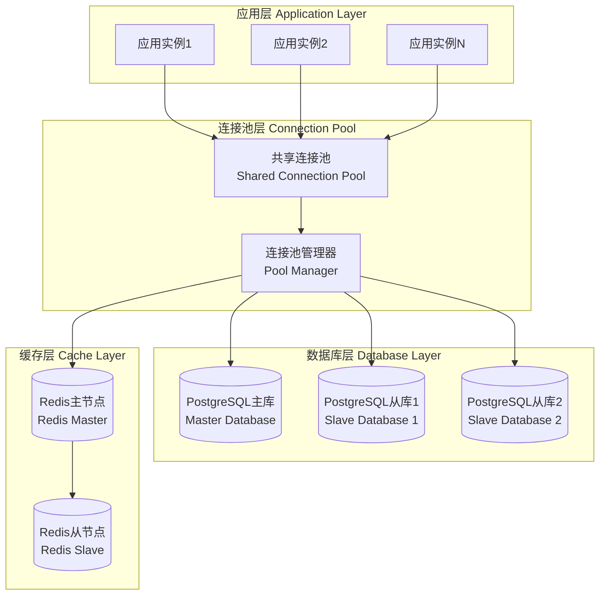
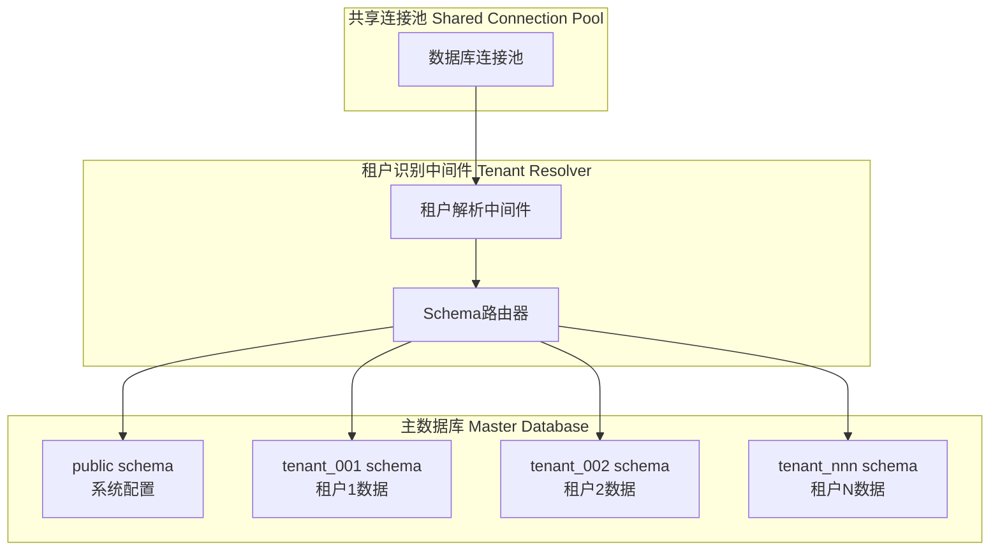

# 数据库架构

## 🗄️ 数据库设计概述

统一认证管理系统采用PostgreSQL作为主数据库，配合Redis作为缓存数据库，实现了高性能、高可用的数据存储方案。系统采用多租户共享连接池架构，支持大规模并发访问。

### 数据库架构特点

- **多租户隔离**: 通过schema级别的数据隔离
- **连接池优化**: 共享连接池提升性能
- **读写分离**: 主从复制提升读取性能
- **缓存策略**: Redis缓存热点数据
- **数据加密**: 敏感数据加密存储
- **审计日志**: 完整的数据变更追踪

## 🏗️ 数据库架构设计

### 整体架构图



### 多租户数据隔离



## 📊 数据表分类与统计

系统共包含**94个数据表**，按功能模块分类如下：

| 模块分类 | 表数量 | 说明 |
|----------|--------|------|
| **核心业务表** | 28 | 用户、租户、角色权限等核心表 |
| **系统配置表** | 18 | 系统参数、字典、配置等表 |
| **审计日志表** | 12 | 操作日志、审计记录等表 |
| **AI服务表** | 8 | AI模型、对话、分析等表 |
| **文件管理表** | 10 | 文件、文件夹、存储等表 |
| **通知消息表** | 6 | 消息、通知、推送等表 |
| **监控统计表** | 12 | 性能监控、统计数据等表 |

## 🏛️ 核心数据表设计

### 1. 用户相关表

#### users - 用户主表
```sql
CREATE TABLE users (
    id UUID PRIMARY KEY DEFAULT gen_random_uuid(),
    tenant_id UUID NOT NULL REFERENCES tenants(id),
    username VARCHAR(50) UNIQUE NOT NULL,
    email VARCHAR(255) UNIQUE NOT NULL,
    phone VARCHAR(20),
    password_hash VARCHAR(255) NOT NULL,
    salt VARCHAR(255) NOT NULL,
    status VARCHAR(20) NOT NULL DEFAULT 'active',
    email_verified BOOLEAN DEFAULT false,
    phone_verified BOOLEAN DEFAULT false,
    last_login_at TIMESTAMP WITH TIME ZONE,
    login_count INTEGER DEFAULT 0,
    created_at TIMESTAMP WITH TIME ZONE DEFAULT CURRENT_TIMESTAMP,
    updated_at TIMESTAMP WITH TIME ZONE DEFAULT CURRENT_TIMESTAMP,
    deleted_at TIMESTAMP WITH TIME ZONE
);

-- 索引
CREATE INDEX idx_users_tenant_id ON users(tenant_id);
CREATE INDEX idx_users_email ON users(email);
CREATE INDEX idx_users_username ON users(username);
CREATE INDEX idx_users_status ON users(status);
```

#### user_profiles - 用户资料表
```sql
CREATE TABLE user_profiles (
    id UUID PRIMARY KEY DEFAULT gen_random_uuid(),
    user_id UUID NOT NULL REFERENCES users(id) ON DELETE CASCADE,
    first_name VARCHAR(50),
    last_name VARCHAR(50),
    nickname VARCHAR(50),
    avatar_url VARCHAR(500),
    gender VARCHAR(10),
    birthday DATE,
    timezone VARCHAR(50) DEFAULT 'UTC',
    language VARCHAR(10) DEFAULT 'zh-CN',
    bio TEXT,
    metadata JSONB DEFAULT '{}',
    created_at TIMESTAMP WITH TIME ZONE DEFAULT CURRENT_TIMESTAMP,
    updated_at TIMESTAMP WITH TIME ZONE DEFAULT CURRENT_TIMESTAMP
);

CREATE UNIQUE INDEX idx_user_profiles_user_id ON user_profiles(user_id);
```

#### user_sessions - 用户会话表
```sql
CREATE TABLE user_sessions (
    id UUID PRIMARY KEY DEFAULT gen_random_uuid(),
    user_id UUID NOT NULL REFERENCES users(id) ON DELETE CASCADE,
    session_token VARCHAR(255) UNIQUE NOT NULL,
    refresh_token VARCHAR(255) UNIQUE,
    device_info JSONB,
    ip_address INET,
    user_agent TEXT,
    expires_at TIMESTAMP WITH TIME ZONE NOT NULL,
    last_activity_at TIMESTAMP WITH TIME ZONE DEFAULT CURRENT_TIMESTAMP,
    created_at TIMESTAMP WITH TIME ZONE DEFAULT CURRENT_TIMESTAMP
);

CREATE INDEX idx_user_sessions_user_id ON user_sessions(user_id);
CREATE INDEX idx_user_sessions_token ON user_sessions(session_token);
CREATE INDEX idx_user_sessions_expires ON user_sessions(expires_at);
```

### 2. 租户相关表

#### tenants - 租户主表
```sql
CREATE TABLE tenants (
    id UUID PRIMARY KEY DEFAULT gen_random_uuid(),
    name VARCHAR(100) NOT NULL,
    code VARCHAR(50) UNIQUE NOT NULL,
    domain VARCHAR(100),
    logo_url VARCHAR(500),
    status VARCHAR(20) NOT NULL DEFAULT 'active',
    plan_type VARCHAR(20) NOT NULL DEFAULT 'basic',
    max_users INTEGER DEFAULT 100,
    max_storage BIGINT DEFAULT 10737418240, -- 10GB
    settings JSONB DEFAULT '{}',
    metadata JSONB DEFAULT '{}',
    created_at TIMESTAMP WITH TIME ZONE DEFAULT CURRENT_TIMESTAMP,
    updated_at TIMESTAMP WITH TIME ZONE DEFAULT CURRENT_TIMESTAMP,
    deleted_at TIMESTAMP WITH TIME ZONE
);

CREATE INDEX idx_tenants_code ON tenants(code);
CREATE INDEX idx_tenants_status ON tenants(status);
```

#### tenant_configs - 租户配置表
```sql
CREATE TABLE tenant_configs (
    id UUID PRIMARY KEY DEFAULT gen_random_uuid(),
    tenant_id UUID NOT NULL REFERENCES tenants(id) ON DELETE CASCADE,
    config_key VARCHAR(100) NOT NULL,
    config_value JSONB NOT NULL,
    description TEXT,
    is_encrypted BOOLEAN DEFAULT false,
    created_at TIMESTAMP WITH TIME ZONE DEFAULT CURRENT_TIMESTAMP,
    updated_at TIMESTAMP WITH TIME ZONE DEFAULT CURRENT_TIMESTAMP,

    UNIQUE(tenant_id, config_key)
);

CREATE INDEX idx_tenant_configs_tenant_id ON tenant_configs(tenant_id);
```

### 3. 角色权限表

#### roles - 角色表
```sql
CREATE TABLE roles (
    id UUID PRIMARY KEY DEFAULT gen_random_uuid(),
    tenant_id UUID REFERENCES tenants(id),
    name VARCHAR(50) NOT NULL,
    code VARCHAR(50) NOT NULL,
    description TEXT,
    is_system BOOLEAN DEFAULT false,
    is_default BOOLEAN DEFAULT false,
    level INTEGER DEFAULT 0,
    metadata JSONB DEFAULT '{}',
    created_at TIMESTAMP WITH TIME ZONE DEFAULT CURRENT_TIMESTAMP,
    updated_at TIMESTAMP WITH TIME ZONE DEFAULT CURRENT_TIMESTAMP,
    deleted_at TIMESTAMP WITH TIME ZONE,

    UNIQUE(tenant_id, code),
    UNIQUE(tenant_id, name)
);

CREATE INDEX idx_roles_tenant_id ON roles(tenant_id);
CREATE INDEX idx_roles_code ON roles(code);
```

#### permissions - 权限表
```sql
CREATE TABLE permissions (
    id UUID PRIMARY KEY DEFAULT gen_random_uuid(),
    name VARCHAR(100) NOT NULL,
    code VARCHAR(100) UNIQUE NOT NULL,
    resource VARCHAR(100) NOT NULL,
    action VARCHAR(50) NOT NULL,
    description TEXT,
    module VARCHAR(50),
    is_system BOOLEAN DEFAULT false,
    metadata JSONB DEFAULT '{}',
    created_at TIMESTAMP WITH TIME ZONE DEFAULT CURRENT_TIMESTAMP,
    updated_at TIMESTAMP WITH TIME ZONE DEFAULT CURRENT_TIMESTAMP
);

CREATE INDEX idx_permissions_resource ON permissions(resource);
CREATE INDEX idx_permissions_module ON permissions(module);
```

#### role_permissions - 角色权限关联表
```sql
CREATE TABLE role_permissions (
    id UUID PRIMARY KEY DEFAULT gen_random_uuid(),
    role_id UUID NOT NULL REFERENCES roles(id) ON DELETE CASCADE,
    permission_id UUID NOT NULL REFERENCES permissions(id) ON DELETE CASCADE,
    created_at TIMESTAMP WITH TIME ZONE DEFAULT CURRENT_TIMESTAMP,

    UNIQUE(role_id, permission_id)
);

CREATE INDEX idx_role_permissions_role_id ON role_permissions(role_id);
CREATE INDEX idx_role_permissions_permission_id ON role_permissions(permission_id);
```

#### user_roles - 用户角色关联表
```sql
CREATE TABLE user_roles (
    id UUID PRIMARY KEY DEFAULT gen_random_uuid(),
    user_id UUID NOT NULL REFERENCES users(id) ON DELETE CASCADE,
    role_id UUID NOT NULL REFERENCES roles(id) ON DELETE CASCADE,
    granted_by UUID REFERENCES users(id),
    granted_at TIMESTAMP WITH TIME ZONE DEFAULT CURRENT_TIMESTAMP,
    expires_at TIMESTAMP WITH TIME ZONE,

    UNIQUE(user_id, role_id)
);

CREATE INDEX idx_user_roles_user_id ON user_roles(user_id);
CREATE INDEX idx_user_roles_role_id ON user_roles(role_id);
```

### 4. 审计日志表

#### audit_logs - 审计日志表
```sql
CREATE TABLE audit_logs (
    id UUID PRIMARY KEY DEFAULT gen_random_uuid(),
    tenant_id UUID REFERENCES tenants(id),
    user_id UUID REFERENCES users(id),
    action VARCHAR(50) NOT NULL,
    resource_type VARCHAR(50) NOT NULL,
    resource_id VARCHAR(100),
    old_values JSONB,
    new_values JSONB,
    ip_address INET,
    user_agent TEXT,
    request_id VARCHAR(100),
    created_at TIMESTAMP WITH TIME ZONE DEFAULT CURRENT_TIMESTAMP
);

CREATE INDEX idx_audit_logs_tenant_id ON audit_logs(tenant_id);
CREATE INDEX idx_audit_logs_user_id ON audit_logs(user_id);
CREATE INDEX idx_audit_logs_action ON audit_logs(action);
CREATE INDEX idx_audit_logs_created_at ON audit_logs(created_at);
```

### 5. 系统配置表

#### system_configs - 系统配置表
```sql
CREATE TABLE system_configs (
    id UUID PRIMARY KEY DEFAULT gen_random_uuid(),
    config_key VARCHAR(100) UNIQUE NOT NULL,
    config_value JSONB NOT NULL,
    description TEXT,
    is_encrypted BOOLEAN DEFAULT false,
    is_public BOOLEAN DEFAULT false,
    created_at TIMESTAMP WITH TIME ZONE DEFAULT CURRENT_TIMESTAMP,
    updated_at TIMESTAMP WITH TIME ZONE DEFAULT CURRENT_TIMESTAMP
);

CREATE INDEX idx_system_configs_key ON system_configs(config_key);
```

## 🔐 数据安全设计

### 1. 敏感数据加密

```sql
-- 创建加密函数
CREATE OR REPLACE FUNCTION encrypt_sensitive_data(data TEXT, key TEXT)
RETURNS TEXT AS $$
BEGIN
    -- 使用AES-256加密
    RETURN encode(encrypt(data::bytea, key::bytea, 'aes'), 'base64');
END;
$$ LANGUAGE plpgsql;

-- 创建解密函数
CREATE OR REPLACE FUNCTION decrypt_sensitive_data(encrypted_data TEXT, key TEXT)
RETURNS TEXT AS $$
BEGIN
    RETURN convert_from(decrypt(decode(encrypted_data, 'base64'), key::bytea, 'aes'), 'UTF8');
END;
$$ LANGUAGE plpgsql;
```

### 2. 数据脱敏

```sql
-- 手机号脱敏函数
CREATE OR REPLACE FUNCTION mask_phone_number(phone VARCHAR)
RETURNS VARCHAR AS $$
BEGIN
    IF phone IS NULL OR length(phone) < 11 THEN
        RETURN phone;
    END IF;
    RETURN substr(phone, 1, 3) || '****' || substr(phone, -4);
END;
$$ LANGUAGE plpgsql;

-- 邮箱脱敏函数
CREATE OR REPLACE FUNCTION mask_email(email VARCHAR)
RETURNS VARCHAR AS $$
BEGIN
    IF email IS NULL OR position('@' in email) = 0 THEN
        RETURN email;
    END IF;
    RETURN substr(email, 1, 2) || '***@' || split_part(email, '@', 2);
END;
$$ LANGUAGE plpgsql;
```

## 📈 性能优化策略

### 1. 索引优化

```sql
-- 复合索引优化
CREATE INDEX idx_users_tenant_status ON users(tenant_id, status);
CREATE INDEX idx_audit_logs_user_action_time ON audit_logs(user_id, action, created_at);

-- 部分索引优化
CREATE INDEX idx_users_active ON users(tenant_id) WHERE status = 'active';
CREATE INDEX idx_sessions_valid ON user_sessions(user_id) WHERE expires_at > CURRENT_TIMESTAMP;

-- 表达式索引
CREATE INDEX idx_users_email_lower ON users(lower(email));
```

### 2. 分区表设计

```sql
-- 按时间分区的审计日志表
CREATE TABLE audit_logs_partitioned (
    LIKE audit_logs INCLUDING ALL
) PARTITION BY RANGE (created_at);

-- 创建月度分区
CREATE TABLE audit_logs_2025_01 PARTITION OF audit_logs_partitioned
    FOR VALUES FROM ('2025-01-01') TO ('2025-02-01');

CREATE TABLE audit_logs_2025_02 PARTITION OF audit_logs_partitioned
    FOR VALUES FROM ('2025-02-01') TO ('2025-03-01');
```

### 3. 查询优化

```sql
-- 创建物化视图优化统计查询
CREATE MATERIALIZED VIEW user_statistics AS
SELECT
    tenant_id,
    COUNT(*) as total_users,
    COUNT(*) FILTER (WHERE status = 'active') as active_users,
    COUNT(*) FILTER (WHERE email_verified = true) as verified_users,
    MAX(created_at) as latest_user_created
FROM users
GROUP BY tenant_id;

-- 创建唯一索引
CREATE UNIQUE INDEX idx_user_statistics_tenant_id ON user_statistics(tenant_id);

-- 定期刷新物化视图
CREATE OR REPLACE FUNCTION refresh_user_statistics()
RETURNS void AS $$
BEGIN
    REFRESH MATERIALIZED VIEW CONCURRENTLY user_statistics;
END;
$$ LANGUAGE plpgsql;
```

## 🔄 数据库迁移管理

### 1. 迁移脚本结构

```
database/migrations/
├── 001_initial_schema.sql
├── 002_add_user_profiles.sql
├── 003_add_audit_logs.sql
├── 004_add_tenant_configs.sql
└── 005_add_indexes.sql
```

### 2. 迁移版本控制表

```sql
CREATE TABLE schema_migrations (
    version VARCHAR(20) PRIMARY KEY,
    applied_at TIMESTAMP WITH TIME ZONE DEFAULT CURRENT_TIMESTAMP,
    checksum VARCHAR(64) NOT NULL
);
```

## 🔧 数据库维护

### 1. 定期维护任务

```sql
-- 清理过期会话
DELETE FROM user_sessions WHERE expires_at < CURRENT_TIMESTAMP;

-- 清理过期审计日志（保留1年）
DELETE FROM audit_logs WHERE created_at < CURRENT_TIMESTAMP - INTERVAL '1 year';

-- 更新表统计信息
ANALYZE users;
ANALYZE audit_logs;

-- 重建索引
REINDEX INDEX CONCURRENTLY idx_users_email;
```

### 2. 备份策略

```bash
#!/bin/bash
# 每日全量备份
pg_dump -h localhost -U postgres -d auth_system > backup_$(date +%Y%m%d).sql

# 每小时增量备份（WAL归档）
pg_receivewal -h localhost -U postgres -D /var/lib/postgresql/wal_archive
```

## 📊 监控指标

### 1. 性能指标
- **连接数**: 当前活跃连接数
- **查询性能**: 慢查询统计
- **缓存命中率**: Buffer cache命中率
- **锁等待**: 锁等待时间和次数

### 2. 容量指标
- **数据库大小**: 各schema和表的大小
- **索引大小**: 索引占用空间
- **WAL大小**: WAL日志增长情况
- **备份大小**: 备份文件大小

## 🔗 相关文档

- [核心业务表详解](./16-core-business-tables.md)
- [系统配置表详解](./17-system-config-tables.md)
- [监控日志表详解](./18-monitoring-log-tables.md)
- [数据库备份恢复](./41-backup-recovery.md)

---

**最后更新**: 2025-11-29
**文档版本**: v1.0.0
**数据库版本**: PostgreSQL 15.x