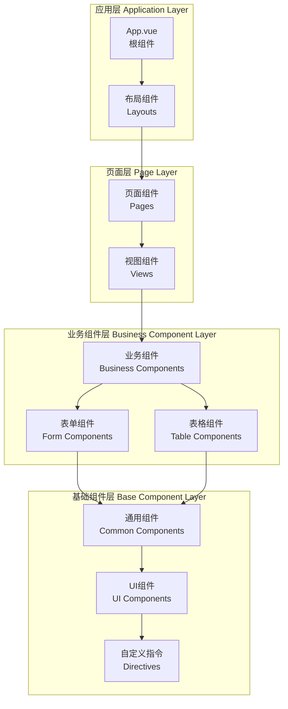
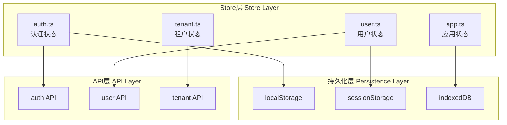

# 前端架构

## 🎨 前端技术栈概述

统一认证管理系统前端采用现代化的Vue 3技术栈，结合TypeScript、Vite等工具，构建高性能、可维护的企业级单页应用（SPA）。

### 技术栈选型

| 技术领域 | 选型 | 版本 | 说明 |
|---------|------|------|------|
| **核心框架** | Vue.js | 3.3+ | 渐进式JavaScript框架 |
| **开发语言** | TypeScript | 5.x | 类型安全的JavaScript超集 |
| **构建工具** | Vite | 4.x | 快速的前端构建工具 |
| **UI组件库** | Element Plus | 2.x | Vue 3企业级UI组件库 |
| **状态管理** | Pinia | 2.x | Vue官方状态管理库 |
| **路由管理** | Vue Router | 4.x | 官方路由管理器 |
| **HTTP客户端** | Axios | 1.x | Promise based HTTP客户端 |
| **图表库** | ECharts | 5.x | 数据可视化图表库 |
| **CSS预处理** | Sass/SCSS | 1.x | CSS扩展语言 |
| **代码规范** | ESLint + Prettier | Latest | 代码质量和格式化 |
| **测试框架** | Vitest + Vue Test Utils | Latest | 单元测试框架 |

## 🏗️ 项目结构设计

### 目录结构

```
client/
├── public/                     # 静态资源
│   ├── favicon.ico
│   └── index.html
├── src/
│   ├── api/                   # API接口
│   │   ├── auth.ts
│   │   ├── users.ts
│   │   ├── tenants.ts
│   │   └── index.ts
│   ├── assets/                # 静态资源
│   │   ├── images/
│   │   ├── icons/
│   │   └── styles/
│   ├── components/            # 公共组件
│   │   ├── common/           # 通用组件
│   │   ├── business/         # 业务组件
│   │   └── layout/           # 布局组件
│   ├── composables/          # 组合式函数
│   │   ├── useAuth.ts
│   │   ├── useUser.ts
│   │   └── useTenant.ts
│   ├── directives/           # 自定义指令
│   │   ├── permission.ts
│   │   └── loading.ts
│   ├── layouts/              # 布局模板
│   │   ├── DefaultLayout.vue
│   │   ├── AuthLayout.vue
│   │   └── EmptyLayout.vue
│   ├── pages/                # 页面组件
│   │   ├── auth/            # 认证页面
│   │   ├── dashboard/       # 仪表板
│   │   ├── users/           # 用户管理
│   │   ├── tenants/         # 租户管理
│   │   └── settings/        # 系统设置
│   ├── plugins/              # 插件配置
│   │   ├── axios.ts
│   │   ├── element-plus.ts
│   │   └── router.ts
│   ├── router/               # 路由配置
│   │   ├── index.ts
│   │   ├── routes.ts
│   │   └── guards.ts
│   ├── stores/               # Pinia状态管理
│   │   ├── auth.ts
│   │   ├── user.ts
│   │   ├── tenant.ts
│   │   └── index.ts
│   ├── types/                # TypeScript类型定义
│   │   ├── api.ts
│   │   ├── auth.ts
│   │   ├── user.ts
│   │   └── common.ts
│   ├── utils/                # 工具函数
│   │   ├── request.ts
│   │   ├── storage.ts
│   │   ├── validation.ts
│   │   └── format.ts
│   ├── App.vue               # 根组件
│   └── main.ts               # 应用入口
├── tests/                    # 测试文件
├── .env                      # 环境变量
├── .env.development
├── .env.production
├── package.json
├── tsconfig.json
├── vite.config.ts
└── README.md
```

## 🎯 组件架构设计

### 组件分层架构



## 📦 组件库设计

### 1. 基础组件库

#### 通用组件 (Common Components)

| 组件名称 | 路径 | 功能描述 |
|----------|------|----------|
| **BaseButton** | `/components/common/BaseButton.vue` | 基础按钮组件 |
| **BaseInput** | `/components/common/BaseInput.vue` | 基础输入框组件 |
| **BaseModal** | `/components/common/BaseModal.vue` | 基础弹窗组件 |
| **BaseTable** | `/components/common/BaseTable.vue` | 基础表格组件 |
| **BasePagination** | `/components/common/BasePagination.vue` | 分页组件 |
| **BaseLoading** | `/components/common/BaseLoading.vue` | 加载组件 |
| **BaseEmpty** | `/components/common/BaseEmpty.vue` | 空状态组件 |
| **BaseError** | `/components/common/BaseError.vue` | 错误状态组件 |
| **BaseConfirm** | `/components/common/BaseConfirm.vue` | 确认对话框 |
| **BaseUpload** | `/components/common/BaseUpload.vue` | 文件上传组件 |

#### 布局组件 (Layout Components)

| 组件名称 | 路径 | 功能描述 |
|----------|------|----------|
| **AppHeader** | `/components/layout/AppHeader.vue` | 应用头部 |
| **AppSidebar** | `/components/layout/AppSidebar.vue` | 侧边栏 |
| **AppFooter** | `/components/layout/AppFooter.vue` | 应用底部 |
| **Breadcrumb** | `/components/layout/Breadcrumb.vue` | 面包屑导航 |
| **UserDropdown** | `/components/layout/UserDropdown.vue` | 用户下拉菜单 |
| **TenantSelector** | `/components/layout/TenantSelector.vue` | 租户选择器 |
| **NotificationCenter** | `/components/layout/NotificationCenter.vue` | 通知中心 |

### 2. 业务组件库

#### 用户管理组件

```vue
<!-- /components/business/user/UserForm.vue -->
<template>
  <el-form
    ref="formRef"
    :model="formData"
    :rules="formRules"
    @submit.prevent="handleSubmit"
  >
    <el-form-item label="用户名" prop="username">
      <el-input v-model="formData.username" placeholder="请输入用户名" />
    </el-form-item>

    <el-form-item label="邮箱" prop="email">
      <el-input v-model="formData.email" placeholder="请输入邮箱" />
    </el-form-item>

    <el-form-item label="角色" prop="roleIds">
      <el-select
        v-model="formData.roleIds"
        multiple
        placeholder="请选择角色"
      >
        <el-option
          v-for="role in roles"
          :key="role.id"
          :label="role.name"
          :value="role.id"
        />
      </el-select>
    </el-form-item>

    <el-form-item>
      <el-button type="primary" @click="handleSubmit">提交</el-button>
      <el-button @click="handleReset">重置</el-button>
    </el-form-item>
  </el-form>
</template>

<script setup lang="ts">
import { ref, reactive } from 'vue'
import type { FormInstance } from 'element-plus'
import { useUserStore } from '@/stores/user'

interface UserFormData {
  username: string
  email: string
  roleIds: string[]
}

const props = defineProps<{
  userId?: string
}>()

const emit = defineEmits<{
  success: []
}>()

const userStore = useUserStore()
const formRef = ref<FormInstance>()
const roles = ref([])

const formData = reactive<UserFormData>({
  username: '',
  email: '',
  roleIds: []
})

const formRules = {
  username: [
    { required: true, message: '请输入用户名', trigger: 'blur' }
  ],
  email: [
    { required: true, message: '请输入邮箱', trigger: 'blur' },
    { type: 'email', message: '请输入正确的邮箱格式', trigger: 'blur' }
  ],
  roleIds: [
    { required: true, message: '请选择角色', trigger: 'change' }
  ]
}

const handleSubmit = async () => {
  if (!formRef.value) return

  try {
    await formRef.value.validate()

    if (props.userId) {
      await userStore.updateUser(props.userId, formData)
    } else {
      await userStore.createUser(formData)
    }

    emit('success')
  } catch (error) {
    console.error('表单验证失败:', error)
  }
}

const handleReset = () => {
  formRef.value?.resetFields()
}
</script>
```

## 🔄 状态管理架构

### Pinia Store设计



### 认证状态管理示例

```typescript
// /stores/auth.ts
import { defineStore } from 'pinia'
import { ref, computed } from 'vue'
import type { User, LoginCredentials } from '@/types/auth'
import { authApi } from '@/api/auth'
import { storage } from '@/utils/storage'

export const useAuthStore = defineStore('auth', () => {
  // 状态
  const user = ref<User | null>(null)
  const token = ref<string>('')
  const refreshToken = ref<string>('')
  const permissions = ref<string[]>([])
  const isLoading = ref(false)

  // 计算属性
  const isAuthenticated = computed(() => !!token.value)
  const hasPermission = computed(() => (permission: string) =>
    permissions.value.includes(permission)
  )

  // 初始化
  const initialize = () => {
    const storedToken = storage.get('token')
    const storedUser = storage.get('user')

    if (storedToken && storedUser) {
      token.value = storedToken
      user.value = storedUser
      // 验证token有效性
      validateToken()
    }
  }

  // 登录
  const login = async (credentials: LoginCredentials) => {
    isLoading.value = true
    try {
      const response = await authApi.login(credentials)

      token.value = response.token
      refreshToken.value = response.refreshToken
      user.value = response.user
      permissions.value = response.permissions

      // 持久化存储
      storage.set('token', token.value)
      storage.set('refreshToken', refreshToken.value)
      storage.set('user', user.value)

      return response
    } finally {
      isLoading.value = false
    }
  }

  // 登出
  const logout = async () => {
    try {
      await authApi.logout()
    } finally {
      // 清理状态
      token.value = ''
      refreshToken.value = ''
      user.value = null
      permissions.value = []

      // 清理存储
      storage.remove('token')
      storage.remove('refreshToken')
      storage.remove('user')
    }
  }

  // 刷新Token
  const refreshAccessToken = async () => {
    if (!refreshToken.value) {
      await logout()
      return false
    }

    try {
      const response = await authApi.refresh(refreshToken.value)
      token.value = response.token
      refreshToken.value = response.refreshToken

      storage.set('token', token.value)
      storage.set('refreshToken', refreshToken.value)

      return true
    } catch (error) {
      await logout()
      return false
    }
  }

  // 验证Token
  const validateToken = async () => {
    try {
      const response = await authApi.validate()
      user.value = response.user
      permissions.value = response.permissions
      return true
    } catch (error) {
      await logout()
      return false
    }
  }

  return {
    // 状态
    user: readonly(user),
    token: readonly(token),
    permissions: readonly(permissions),
    isLoading: readonly(isLoading),

    // 计算属性
    isAuthenticated,
    hasPermission,

    // 方法
    initialize,
    login,
    logout,
    refreshAccessToken,
    validateToken
  }
})
```

## 🛣️ 路由架构

### 路由设计原则

- **模块化路由**: 按功能模块划分路由
- **懒加载**: 页面组件按需加载
- **权限控制**: 路由级别权限控制
- **动态路由**: 基于权限动态生成路由

### 路由配置

```typescript
// /router/routes.ts
import type { RouteRecordRaw } from 'vue-router'

export const routes: RouteRecordRaw[] = [
  {
    path: '/',
    redirect: '/dashboard'
  },
  {
    path: '/auth',
    component: () => import('@/layouts/AuthLayout.vue'),
    children: [
      {
        path: 'login',
        name: 'Login',
        component: () => import('@/pages/auth/Login.vue'),
        meta: {
          title: '登录',
          requiresAuth: false
        }
      },
      {
        path: 'register',
        name: 'Register',
        component: () => import('@/pages/auth/Register.vue'),
        meta: {
          title: '注册',
          requiresAuth: false
        }
      }
    ]
  },
  {
    path: '/',
    component: () => import('@/layouts/DefaultLayout.vue'),
    meta: {
      requiresAuth: true
    },
    children: [
      {
        path: 'dashboard',
        name: 'Dashboard',
        component: () => import('@/pages/dashboard/Index.vue'),
        meta: {
          title: '仪表板',
          icon: 'dashboard',
          permissions: ['dashboard:read']
        }
      },
      {
        path: 'users',
        name: 'Users',
        component: () => import('@/pages/users/Index.vue'),
        meta: {
          title: '用户管理',
          icon: 'user',
          permissions: ['user:read']
        },
        children: [
          {
            path: 'create',
            name: 'CreateUser',
            component: () => import('@/pages/users/Create.vue'),
            meta: {
              title: '创建用户',
              permissions: ['user:create'],
              hidden: true
            }
          },
          {
            path: ':id',
            name: 'UserDetail',
            component: () => import('@/pages/users/Detail.vue'),
            meta: {
              title: '用户详情',
              permissions: ['user:read'],
              hidden: true
            }
          }
        ]
      },
      {
        path: 'tenants',
        name: 'Tenants',
        component: () => import('@/pages/tenants/Index.vue'),
        meta: {
          title: '租户管理',
          icon: 'apartment',
          permissions: ['tenant:read']
        }
      }
    ]
  },
  {
    path: '/:pathMatch(.*)*',
    name: 'NotFound',
    component: () => import('@/pages/error/NotFound.vue'),
    meta: {
      title: '页面不存在'
    }
  }
]
```

### 路由守卫

```typescript
// /router/guards.ts
import type { Router } from 'vue-router'
import { useAuthStore } from '@/stores/auth'
import { useTenantStore } from '@/stores/tenant'

export function setupRouterGuards(router: Router) {
  // 全局前置守卫
  router.beforeEach(async (to, from, next) => {
    const authStore = useAuthStore()
    const tenantStore = useTenantStore()

    // 设置页面标题
    document.title = to.meta?.title ? `${to.meta.title} - 统一认证管理系统` : '统一认证管理系统'

    // 检查是否需要认证
    if (to.meta?.requiresAuth !== false && !authStore.isAuthenticated) {
      // 保存目标路径
      const redirect = to.fullPath
      next({ name: 'Login', query: { redirect } })
      return
    }

    // 已登录用户访问登录页，重定向到首页
    if (to.name === 'Login' && authStore.isAuthenticated) {
      next({ name: 'Dashboard' })
      return
    }

    // 检查权限
    if (to.meta?.permissions) {
      const hasPermission = (to.meta.permissions as string[]).some(
        permission => authStore.hasPermission(permission)
      )

      if (!hasPermission) {
        next({ name: 'Forbidden' })
        return
      }
    }

    // 初始化租户信息
    if (authStore.isAuthenticated && !tenantStore.currentTenant) {
      try {
        await tenantStore.initialize()
      } catch (error) {
        console.error('初始化租户信息失败:', error)
      }
    }

    next()
  })

  // 全局后置守卫
  router.afterEach((to, from) => {
    // 页面访问统计
    if (to.meta?.requiresAuth !== false) {
      // 记录页面访问日志
      console.log(`页面访问: ${to.path}`)
    }
  })

  // 错误处理
  router.onError((error) => {
    console.error('路由错误:', error)
  })
}
```

## 🎨 主题与样式

### 1. 主题配置

```typescript
// /assets/styles/theme.ts
export const lightTheme = {
  primaryColor: '#409EFF',
  successColor: '#67C23A',
  warningColor: '#E6A23C',
  dangerColor: '#F56C6C',
  infoColor: '#909399',

  backgroundColor: '#FFFFFF',
  textColor: '#303133',
  textColorSecondary: '#606266',
  textColorPlaceholder: '#C0C4CC',

  borderColor: '#DCDFE6',
  borderColorLight: '#E4E7ED',
  borderColorLighter: '#EBEEF5',

  backgroundColorPage: '#F2F3F5',
  backgroundColorOverlay: 'rgba(0, 0, 0, 0.8)'
}

export const darkTheme = {
  primaryColor: '#409EFF',
  successColor: '#67C23A',
  warningColor: '#E6A23C',
  dangerColor: '#F56C6C',
  infoColor: '#909399',

  backgroundColor: '#1D1E1F',
  textColor: '#E4E7ED',
  textColorSecondary: '#A8ABB2',
  textColorPlaceholder: '#6C6E72',

  borderColor: '#4C4D4F',
  borderColorLight: '#414243',
  borderColorLighter: '#363637',

  backgroundColorPage: '#0A0A0A',
  backgroundColorOverlay: 'rgba(0, 0, 0, 0.8)'
}
```

### 2. 全局样式

```scss
// /assets/styles/index.scss
// 变量定义
:root {
  --app-primary-color: #{$--color-primary};
  --app-success-color: #{$--color-success};
  --app-warning-color: #{$--color-warning};
  --app-danger-color: #{$--color-danger};
  --app-info-color: #{$--color-info};

  --app-header-height: 60px;
  --app-sidebar-width: 250px;
  --app-sidebar-collapsed-width: 64px;
}

// 全局重置
* {
  margin: 0;
  padding: 0;
  box-sizing: border-box;
}

html, body {
  height: 100%;
  font-family: -apple-system, BlinkMacSystemFont, 'Segoe UI', Roboto, 'Helvetica Neue', Arial, sans-serif;
}

#app {
  height: 100%;
}

// 布局类
.app-layout {
  display: flex;
  height: 100vh;

  &__sidebar {
    width: var(--app-sidebar-width);
    background-color: var(--el-bg-color);
    border-right: 1px solid var(--el-border-color);
    transition: width 0.3s;

    &--collapsed {
      width: var(--app-sidebar-collapsed-width);
    }
  }

  &__main {
    flex: 1;
    display: flex;
    flex-direction: column;
    overflow: hidden;
  }

  &__header {
    height: var(--app-header-height);
    background-color: var(--el-bg-color);
    border-bottom: 1px solid var(--el-border-color);
  }

  &__content {
    flex: 1;
    padding: 20px;
    overflow-y: auto;
    background-color: var(--el-bg-color-page);
  }
}

// 工具类
.text-center { text-align: center; }
.text-left { text-align: left; }
.text-right { text-align: right; }

.flex { display: flex; }
.flex-center {
  display: flex;
  align-items: center;
  justify-content: center;
}
.flex-between {
  display: flex;
  align-items: center;
  justify-content: space-between;
}

.w-full { width: 100%; }
.h-full { height: 100%; }

.mt-1 { margin-top: 4px; }
.mt-2 { margin-top: 8px; }
.mt-3 { margin-top: 12px; }
.mt-4 { margin-top: 16px; }

.mb-1 { margin-bottom: 4px; }
.mb-2 { margin-bottom: 8px; }
.mb-3 { margin-bottom: 12px; }
.mb-4 { margin-bottom: 16px; }
```

## 📱 响应式设计

### 断点配置

```scss
// /assets/styles/breakpoints.scss
$breakpoints: (
  'xs': 480px,
  'sm': 768px,
  'md': 992px,
  'lg': 1200px,
  'xl': 1920px
);

@mixin respond-to($breakpoint) {
  @if map-has-key($breakpoints, $breakpoint) {
    @media (min-width: map-get($breakpoints, $breakpoint)) {
      @content;
    }
  } @else {
    @warn "无效的断点: #{$breakpoint}";
  }
}

// 使用示例
.sidebar {
  width: 250px;

  @include respond-to('md') {
    width: 200px;
  }

  @include respond-to('sm') {
    width: 100%;
    position: fixed;
    top: 0;
    left: 0;
    z-index: 1000;
    transform: translateX(-100%);
    transition: transform 0.3s;

    &--open {
      transform: translateX(0);
    }
  }
}
```

## 🔧 构建配置

### Vite配置

```typescript
// /vite.config.ts
import { defineConfig } from 'vite'
import vue from '@vitejs/plugin-vue'
import { resolve } from 'path'

export default defineConfig({
  plugins: [vue()],
  resolve: {
    alias: {
      '@': resolve(__dirname, 'src'),
      '@/components': resolve(__dirname, 'src/components'),
      '@/pages': resolve(__dirname, 'src/pages'),
      '@/stores': resolve(__dirname, 'src/stores'),
      '@/utils': resolve(__dirname, 'src/utils'),
      '@/api': resolve(__dirname, 'src/api'),
      '@/types': resolve(__dirname, 'src/types')
    }
  },
  css: {
    preprocessorOptions: {
      scss: {
        additionalData: '@import "@/assets/styles/variables.scss";'
      }
    }
  },
  server: {
    port: 3000,
    proxy: {
      '/api': {
        target: 'http://localhost:8000',
        changeOrigin: true,
        rewrite: (path) => path.replace(/^\/api/, '/api/v1')
      }
    }
  },
  build: {
    rollupOptions: {
      output: {
        manualChunks: {
          vendor: ['vue', 'vue-router', 'pinia'],
          elementPlus: ['element-plus'],
          echarts: ['echarts']
        }
      }
    },
    chunkSizeWarningLimit: 1000
  }
})
```

## 🔍 性能优化

### 1. 组件懒加载

```typescript
// 路由级别的懒加载
const routes = [
  {
    path: '/users',
    component: () => import('@/pages/users/Index.vue')
  }
]

// 组件级别的懒加载
const LazyComponent = defineAsyncComponent(() => import('./HeavyComponent.vue'))
```

### 2. 虚拟滚动

```vue
<template>
  <el-table-v2
    :columns="columns"
    :data="data"
    :width="700"
    :height="400"
    fixed
  />
</template>
```

### 3. 图片懒加载

```vue
<template>
  
</template>
```

## 🧪 测试策略

### 1. 单元测试

```typescript
// /tests/unit/components/UserForm.spec.ts
import { mount } from '@vue/test-utils'
import { describe, it, expect } from 'vitest'
import UserForm from '@/components/business/user/UserForm.vue'

describe('UserForm', () => {
  it('应该正确渲染表单', () => {
    const wrapper = mount(UserForm)
    expect(wrapper.find('form').exists()).toBe(true)
  })

  it('应该验证必填字段', async () => {
    const wrapper = mount(UserForm)
    const submitButton = wrapper.find('button[type="submit"]')

    await submitButton.trigger('click')

    expect(wrapper.text()).toContain('请输入用户名')
    expect(wrapper.text()).toContain('请输入邮箱')
  })
})
```

## 🔗 相关文档

- [UI组件库使用指南](./21-ui-components.md)
- [业务组件详解](./22-business-components.md)
- [状态管理详解](./24-state-management.md)
- [路由配置详解](./25-routing-management.md)

---

**最后更新**: 2025-11-29
**文档版本**: v1.0.0
**前端版本**: Vue 3.3+ + TypeScript 5.x