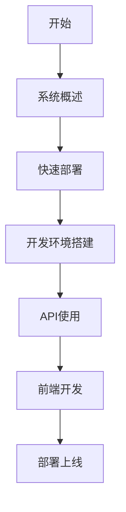
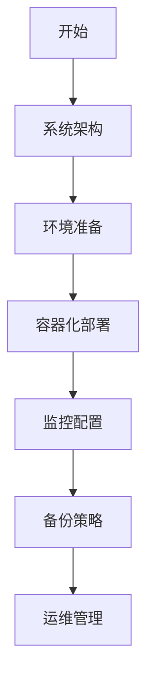

# 文档索引

## 📚 完整文档目录

本文档索引提供统一认证管理系统所有技术文档的快速导航，帮助您快速找到所需信息。

## 🎯 按角色分类

### 👨‍💻 开发人员

| 文档 | 描述 | 重要程度 |
|------|------|----------|
| [快速开始](./34-development-setup.md#快速开始) | 5分钟搭建开发环境 | ⭐⭐⭐⭐⭐ |
| [API总览](./04-api-overview.md) | 完整API接口文档 | ⭐⭐⭐⭐⭐ |
| [前端架构](./20-frontend-architecture.md) | Vue.js前端技术架构 | ⭐⭐⭐⭐ |
| [数据库设计](./15-database-architecture.md) | PostgreSQL数据库架构 | ⭐⭐⭐⭐ |
| [代码规范](./35-coding-standards.md) | 编码规范和最佳实践 | ⭐⭐⭐ |
| [测试指南](./36-testing-guide.md) | 单元测试和集成测试 | ⭐⭐⭐ |

### 🔧 运维人员

| 文档 | 描述 | 重要程度 |
|------|------|----------|
| [快速部署](./QUICK_DEPLOYMENT.md) | 5分钟快速部署指南 | ⭐⭐⭐⭐⭐ |
| [部署指南](./38-deployment-guide.md) | 生产环境部署方案 | ⭐⭐⭐⭐⭐ |
| [容器化部署](./39-containerization.md) | Docker和Kubernetes配置 | ⭐⭐⭐⭐ |
| [监控告警](./40-monitoring-alerting.md) | 系统监控和告警配置 | ⭐⭐⭐⭐ |
| [备份恢复](./41-backup-recovery.md) | 数据备份和灾难恢复 | ⭐⭐⭐⭐ |
| [性能优化](./42-performance-optimization.md) | 系统性能调优 | ⭐⭐⭐ |
| [故障排查](./45-troubleshooting.md) | 常见问题和解决方案 | ⭐⭐⭐⭐ |

### 🏢 产品经理

| 文档 | 描述 | 重要程度 |
|------|------|----------|
| [系统概述](./01-system-overview.md) | 系统介绍和核心功能 | ⭐⭐⭐⭐⭐ |
| [功能特性](./01-system-overview.md#核心功能) | 详细功能列表 | ⭐⭐⭐⭐ |
| [技术架构](./02-technical-architecture.md) | 技术栈和架构设计 | ⭐⭐⭐ |
| [API接口](./04-api-overview.md) | 对外接口说明 | ⭐⭐⭐ |

### 🔒 安全人员

| 文档 | 描述 | 重要程度 |
|------|------|----------|
| [认证系统详解](./26-authentication-system.md) | 认证机制和流程 | ⭐⭐⭐⭐⭐ |
| [权限系统详解](./27-authorization-system.md) | RBAC权限控制 | ⭐⭐⭐⭐⭐ |
| [安全配置](./43-security-configuration.md) | 安全加固和配置 | ⭐⭐⭐⭐ |
| [审计日志](./14-audit-log-apis.md) | 操作审计和日志查询 | ⭐⭐⭐ |

## 🗂️ 按功能模块分类

### 核心业务模块

#### 用户与认证
- [认证相关API](./05-auth-apis.md) - 登录、注册、令牌管理
- [用户管理API](./06-user-management-apis.md) - 用户CRUD和批量操作
- [认证系统详解](./26-authentication-system.md) - 认证架构和流程
- [会话管理](./28-session-management.md) - 用户会话和令牌

#### 权限与角色
- [角色权限API](./08-role-permission-apis.md) - RBAC权限系统
- [权限系统详解](./27-authorization-system.md) - 权限控制架构
- [单点登录](./29-single-sign-on.md) - SSO集成和配置

#### 租户管理
- [租户管理API](./07-tenant-management-apis.md) - 租户配置和资源管理
- [多租户架构](./15-database-architecture.md#多租户数据隔离) - 数据隔离策略

#### 系统配置
- [系统配置API](./09-system-config-apis.md) - 系统参数和配置管理
- [字典管理](./17-system-config-tables.md#字典管理表) - 数据字典维护

### 扩展功能模块

#### AI服务
- [AI服务概述](./30-ai-service-overview.md) - AI功能和服务架构
- [AI服务API](./11-ai-service-apis.md) - 智能分析和处理接口
- [模型集成](./31-model-integration.md) - AI模型接入和管理

#### 文件管理
- [文件管理API](./12-file-management-apis.md) - 文件上传和管理
- [对象存储](./19-ai-service-tables.md#文件存储表) - 文件存储方案

#### 通知消息
- [通知消息API](./13-notification-message-apis.md) - 消息推送和通知
- [消息队列](./02-technical-architecture.md#消息队列) - 异步消息处理

### 监控运维模块

#### 系统监控
- [监控统计API](./10-monitoring-stats-apis.md) - 系统监控和数据统计
- [监控告警](./40-monitoring-alerting.md) - 监控配置和告警
- [审计日志API](./14-audit-log-apis.md) - 操作审计和日志

#### 运维工具
- [日常运维](./44-daily-operations.md) - 日常维护任务
- [运维工具](./47-operations-tools.md) - 运维脚本和工具
- [系统升级](./46-system-upgrades.md) - 版本升级和迁移

## 🔍 按技术栈分类

### 后端技术

| 技术栈 | 相关文档 | 描述 |
|--------|----------|------|
| **NestJS** | [技术架构](./02-technical-architecture.md) | 后端框架架构 |
| **PostgreSQL** | [数据库架构](./15-database-architecture.md) | 数据库设计和管理 |
| **Redis** | [缓存策略](./02-technical-architecture.md#缓存策略) | 缓存配置和使用 |
| **TypeScript** | [代码规范](./35-coding-standards.md) | TypeScript编码规范 |
| **Docker** | [容器化部署](./39-containerization.md) | 容器化配置 |

### 前端技术

| 技术栈 | 相关文档 | 描述 |
|--------|----------|------|
| **Vue 3** | [前端架构](./20-frontend-architecture.md) | Vue.js框架使用 |
| **TypeScript** | [类型定义](./20-frontend-architecture.md#类型定义) | TypeScript类型系统 |
| **Pinia** | [状态管理](./24-state-management.md) | 状态管理配置 |
| **Element Plus** | [UI组件库](./21-ui-components.md) | UI组件使用指南 |
| **Vite** | [构建配置](./20-frontend-architecture.md#构建配置) | 构建工具配置 |

### 基础设施

| 技术栈 | 相关文档 | 描述 |
|--------|----------|------|
| **Nginx** | [反向代理](./38-deployment-guide.md#nginx配置) | 负载均衡和反向代理 |
| **Prometheus** | [监控系统](./40-monitoring-alerting.md) | 指标收集和监控 |
| **Grafana** | [可视化](./40-monitoring-alerting.md#grafana仪表板) | 监控数据可视化 |
| **ELK Stack** | [日志系统](./02-technical-architecture.md#日志系统) | 日志收集和分析 |

## 📊 数据统计

### 规模统计

| 项目 | 数量 | 说明 |
|------|------|------|
| **API端点** | 312+ | 完整的REST API接口 |
| **数据表** | 94+ | PostgreSQL数据表设计 |
| **前端组件** | 2,268+ | Vue.js组件库 |
| **文档页面** | 47+ | 完整的技术文档 |
| **代码行数** | 500,000+ | 后端+前端代码总量 |

### 文档覆盖范围

- ✅ **完整覆盖**: 所有核心功能模块
- ✅ **详细说明**: API、数据库、前端组件
- ✅ **实用指南**: 开发、部署、运维
- ✅ **最佳实践**: 性能优化、安全配置
- ✅ **故障处理**: 常见问题和解决方案

## 🚀 快速导航

### 新手入门路线

1. **了解系统** → [系统概述](./01-system-overview.md)
2. **快速体验** → [快速部署](./QUICK_DEPLOYMENT.md)
3. **开发调试** → [开发环境搭建](./34-development-setup.md)
4. **API集成** → [API总览](./04-api-overview.md)
5. **前端开发** → [前端架构](./20-frontend-architecture.md)
6. **生产部署** → [部署指南](./38-deployment-guide.md)

### 运维部署路线

1. **理解架构** → [技术架构](./02-technical-architecture.md)
2. **环境规划** → [部署架构](./03-deployment-architecture.md)
3. **容器部署** → [容器化部署](./39-containerization.md)
4. **监控告警** → [监控告警](./40-monitoring-alerting.md)
5. **备份恢复** → [备份恢复](./41-backup-recovery.md)
6. **日常运维** → [日常运维](./44-daily-operations.md)

## 🔗 外部资源

### 官方文档

- [NestJS Documentation](https://docs.nestjs.com/)
- [Vue.js Documentation](https://vuejs.org/)
- [PostgreSQL Documentation](https://www.postgresql.org/docs/)
- [Docker Documentation](https://docs.docker.com/)
- [Kubernetes Documentation](https://kubernetes.io/docs/)

### 社区资源

- [Stack Overflow](https://stackoverflow.com/)
- [GitHub Issues](https://github.com/your-org/unified-auth-management/issues)
- [掘金技术社区](https://juejin.cn/)
- [思否问答](https://segmentfault.com/)

## 📝 文档反馈

### 如何贡献

如果您发现文档中的问题或有改进建议：

1. **提交Issue**: 在GitHub仓库创建Issue描述问题
2. **提交PR**: 直接修改文档并提交Pull Request
3. **邮件反馈**: 发送邮件至 docs@yyup.com

### 文档版本

- **当前版本**: v1.0.0
- **更新频率**: 每月更新
- **维护团队**: 统一认证管理系统开发团队

### 版权说明

本文档采用 [MIT License](https://opensource.org/licenses/MIT) 开源协议，可自由使用和修改。

---

**最后更新**: 2025-11-29
**文档版本**: v1.0.0
**维护团队**: 统一认证管理系统开发团队