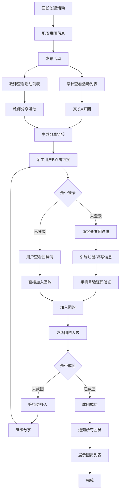
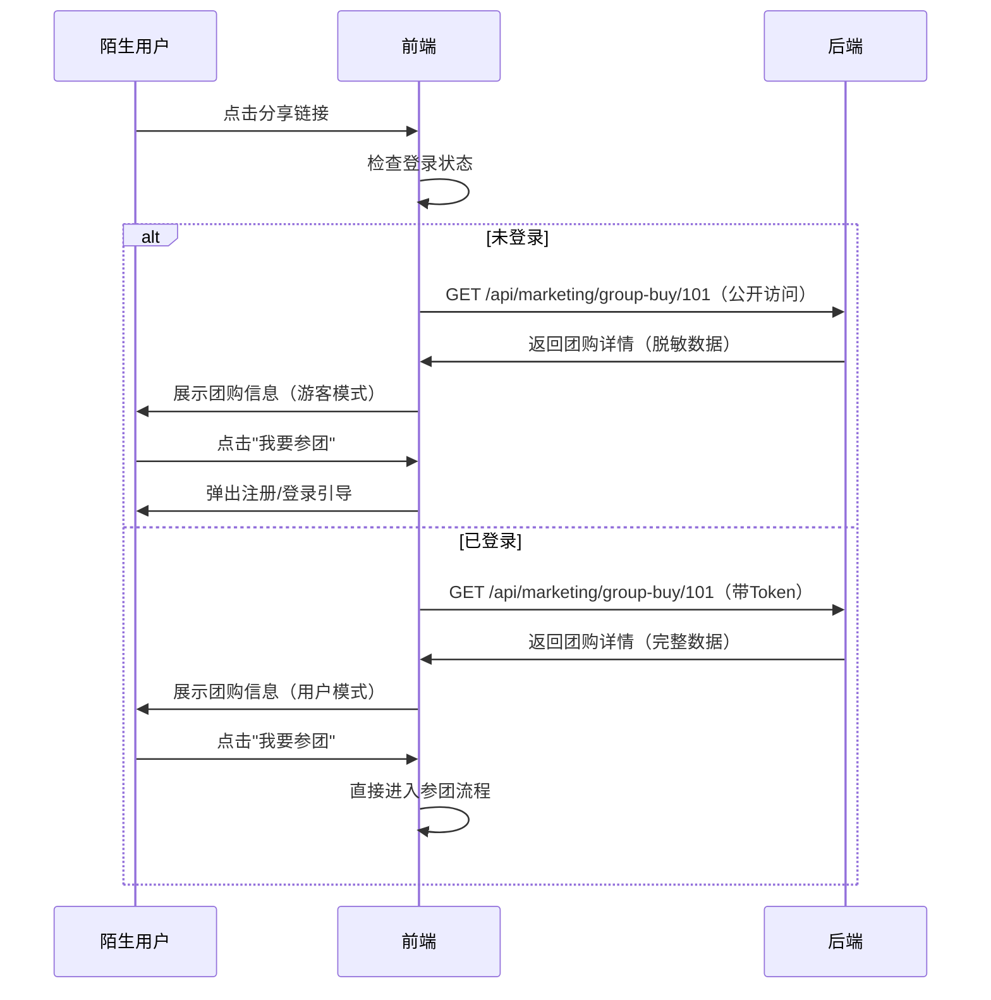
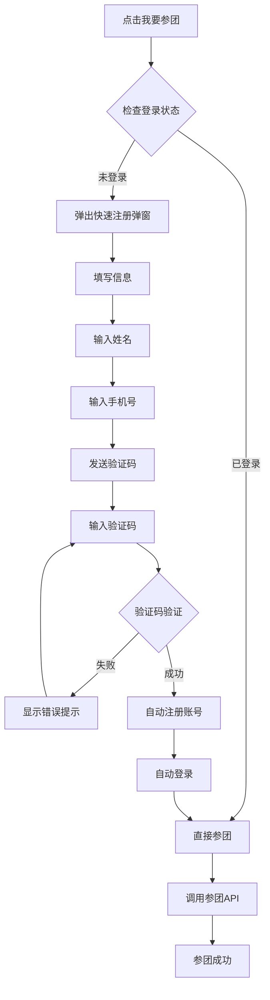

# 活动中心拼团功能完整性检查与优化设计

## 一、背景与目标

### 1.1 检查目的
对活动中心营销模块的拼团功能进行全链路检查，识别功能断点和流程缺陷，并提出优化建议。

### 1.2 检查范围
- 园长活动生成功能
- 教师活动列表展示
- 家长活动列表展示
- 拼团分享链接机制
- 陌生用户开团流程
- 信息填写与验证
- 团员管理与可视化

## 二、现状分析

### 2.1 已实现功能

#### 数据模型层
系统已建立完整的拼团数据模型：

**拼团主表（group_buys）**
| 字段 | 类型 | 说明 | 状态 |
|------|------|------|------|
| activityId | 整数 | 关联活动ID | ✅ 已实现 |
| groupLeaderId | 整数 | 开团者用户ID | ✅ 已实现 |
| groupCode | 字符串 | 唯一团购码 | ✅ 已实现 |
| targetPeople | 整数 | 成团目标人数 | ✅ 已实现 |
| currentPeople | 整数 | 当前参团人数 | ✅ 已实现 |
| maxPeople | 整数 | 最大参团人数 | ✅ 已实现 |
| groupPrice | 小数 | 团购价格 | ✅ 已实现 |
| originalPrice | 小数 | 原价 | ✅ 已实现 |
| deadline | 日期时间 | 截止时间 | ✅ 已实现 |
| status | 枚举 | 团购状态（pending/in_progress/completed/failed/expired） | ✅ 已实现 |
| shareCount | 整数 | 分享次数统计 | ✅ 已实现 |
| viewCount | 整数 | 浏览次数统计 | ✅ 已实现 |

**拼团成员表（group_buy_members）**
| 字段 | 类型 | 说明 | 状态 |
|------|------|------|------|
| groupBuyId | 整数 | 关联团购ID | ✅ 已实现 |
| userId | 整数 | 参团用户ID | ✅ 已实现 |
| joinTime | 日期时间 | 参团时间 | ✅ 已实现 |
| status | 枚举 | 参团状态（pending/confirmed/cancelled） | ✅ 已实现 |
| paymentStatus | 枚举 | 支付状态（unpaid/paid/refunded） | ✅ 已实现 |
| paymentAmount | 小数 | 支付金额 | ✅ 已实现 |
| inviteCode | 字符串 | 邀请码 | ✅ 已实现 |
| inviterId | 整数 | 邀请人ID | ✅ 已实现 |
| refundAmount | 小数 | 退款金额 | ✅ 已实现 |
| refundTime | 日期时间 | 退款时间 | ✅ 已实现 |

#### API层
已实现的拼团相关API端点：

| 端点 | 方法 | 功能 | 状态 |
|------|------|------|------|
| /api/marketing/group-buy | POST | 创建团购（开团） | ✅ 已实现 |
| /api/marketing/group-buy/:id/join | POST | 参与团购（参团） | ✅ 已实现 |
| /api/marketing/group-buy | GET | 获取团购列表 | ✅ 已实现 |
| /api/marketing/group-buy/:id | GET | 获取团购详情 | ✅ 已实现 |
| /api/marketing/group-buy/:id/share | POST | 分享团购 | ✅ 已实现 |
| /api/marketing/group-buy/my | GET | 我的团购 | ✅ 已实现 |
| /api/marketing/group-buy/activity/:activityId | GET | 活动团购列表 | ✅ 已实现 |
| /api/marketing/group-buy/check-expired | POST | 检查过期团购 | ✅ 已实现 |

#### 业务逻辑层
服务层已实现核心逻辑：

**开团逻辑**
- ✅ 活动团购配置验证
- ✅ 用户重复开团检查
- ✅ 团购码自动生成
- ✅ 开团者自动加入成员列表
- ✅ 开团通知发送

**参团逻辑**
- ✅ 团购状态验证（可参与性检查）
- ✅ 用户重复参团检查
- ✅ 邀请码记录
- ✅ 参团人数自动更新
- ✅ 成团检测机制
- ✅ 参团通知发送

**成团逻辑**
- ✅ 成员状态批量更新
- ✅ 成团通知群发

**过期处理逻辑**
- ✅ 定时过期检测
- ✅ 自动退款机制
- ✅ 过期通知发送

### 2.2 功能断点识别

#### 断点1：活动数据源一致性 ❌
**问题描述**：
- 园长创建活动后，教师中心和家长中心可能看到不同数据源的活动
- 缺少数据源一致性验证机制

**影响**：
- 教师看到的活动与家长看到的活动可能不同步
- 拼团活动信息可能存在延迟或差异

**现状**：
- Activity模型已建立，但前端活动列表页面缺失
- 园长、教师、家长三端活动列表数据接口未明确统一

#### 断点2：前端活动列表页面缺失 ❌
**问题描述**：
- 园长活动中心（/centers/ActivityCenter.vue）存在，但仅展示Timeline视图
- 教师活动列表（/teacher-center/activities/index.vue）存在
- 家长活动列表（/parent-center/activities/index.vue）存在
- 但三者是否使用同一数据源API未验证

**影响**：
- 无法确保三端看到的活动列表一致
- 拼团活动可能在某个端缺失或延迟显示

#### 断点3：拼团分享链接功能不完整 ⚠️
**问题描述**：
- 后端已实现分享接口（/api/marketing/group-buy/:id/share）
- 分享接口返回分享链接和二维码地址
- 但前端分享组件和分享落地页未实现

**影响**：
- 用户无法实际分享拼团链接
- 陌生用户无法通过链接访问拼团

**现状**：
```
分享链接格式：{FRONTEND_URL}/activity/group-buy/{groupBuyId}
二维码地址：{API_URL}/api/qrcode/group-buy/{groupBuyId}
```

#### 断点4：陌生用户访问机制缺失 ❌
**问题描述**：
- 系统无游客模式或匿名访问机制
- 陌生用户点击分享链接后无法访问拼团详情
- 缺少未登录用户引导流程

**影响**：
- 拼团无法触达站外用户
- 营销效果大幅降低

#### 断点5：开团信息收集不完整 ⚠️
**问题描述**：
- 开团接口仅需要activityId和用户ID
- 缺少必要用户信息收集（姓名、手机号等）
- 陌生用户开团时无信息收集流程

**影响**：
- 无法联系团购参与者
- 后续营销和通知无法进行

#### 断点6：手机号短信验证码未集成 ⚠️
**问题描述**：
- 系统存在验证码相关API端点（/api/utils/phone-verify）
- ✅ 已安装阿里云SDK依赖（@alicloud/facebody20191230、@alicloud/openapi-client）
- ✅ 已配置阿里云OSS和人脸识别服务
- ❌ 未安装阿里云短信SDK（@alicloud/dysmsapi20170525）
- ❌ 未实现短信发送服务层代码
- ❌ 未在拼团流程中集成验证码功能
- 陌生用户注册开团时缺少手机验证

**影响**：
- 无法验证用户真实性
- 存在恶意开团风险

**技术现状**：
```typescript
// .env.example 已预留短信配置项
SMS_API_KEY=
SMS_API_SECRET=

// 阿里云配置已就绪
ALIYUN_ACCESS_KEY_ID=
ALIYUN_ACCESS_KEY_SECRET=
```

#### 断点7：团员信息可视化缺失 ❌
**问题描述**：
- 后端团购详情接口已包含成员列表
- 但前端缺少团员信息展示页面
- 用户无法看到"都有谁团了"

**影响**：
- 缺少社交证明，降低转化率
- 用户体验不完整

#### 断点8：分享链接中的团ID传递机制未明确 ⚠️
**问题描述**：
- 分享链接格式已定义
- 但分享后的URL参数传递和解析逻辑未实现
- 无法通过链接直接定位到具体拼团

**影响**：
- 分享功能无法正常工作
- 用户点击链接后无法加入对应团购

## 三、完整链路流程设计

### 3.1 业务流程全景图



### 3.2 核心流程详细设计

#### 流程1：园长创建拼团活动

**参与角色**：园长

**前置条件**：
- 园长已登录系统
- 具有活动创建权限

**操作步骤**：
1. 园长访问活动中心（/centers/ActivityCenter.vue）
2. 点击"新建活动"按钮
3. 填写活动基础信息（标题、时间、地点、容量、费用等）
4. 切换到"营销配置"标签页
5. 启用"团购活动"开关
6. 配置拼团参数：
   - 团购人数（minPeople）：最少成团人数（默认2人）
   - 最大人数（maxPeople）：单团最多容纳人数（默认50人）
   - 团购价格（price）：拼团优惠价
   - 原价（originalPrice）：活动原价
   - 团购时限（deadlineHours）：开团后多久内必须成团（默认24小时）
7. 保存并发布活动

**数据结构**：

活动表（activities）中的营销配置字段（marketingConfig）：
```
{
  "groupBuy": {
    "enabled": true,
    "minPeople": 3,
    "maxPeople": 50,
    "price": 99.00,
    "originalPrice": 149.00,
    "deadlineHours": 48
  }
}
```

**业务规则**：
- 团购价必须低于原价
- 最少成团人数 ≥ 2人
- 最大人数 ≥ 最少成团人数
- 团购时限 1-168小时之间

**输出结果**：
- 活动创建成功，状态为"报名中"
- 活动同步到所有角色的活动列表

#### 流程2：活动列表数据源统一

**目标**：确保园长、教师、家长三端看到的活动数据来自同一数据源

**数据源设计**：

**统一API端点**：
- 端点：GET /api/activities
- 查询参数：
  - role：当前用户角色（principal/teacher/parent）
  - status：活动状态筛选（可选）
  - page：分页页码
  - pageSize：每页条数
  - includeGroupBuy：是否包含拼团信息（默认true）

**API响应格式**：
```
{
  "success": true,
  "data": {
    "items": [
      {
        "id": 1,
        "title": "春季亲子运动会",
        "startTime": "2024-04-15 09:00:00",
        "endTime": "2024-04-15 12:00:00",
        "location": "幼儿园操场",
        "capacity": 100,
        "registeredCount": 45,
        "fee": 149.00,
        "status": 1,
        "marketingConfig": {
          "groupBuy": {
            "enabled": true,
            "minPeople": 3,
            "price": 99.00,
            "originalPrice": 149.00
          }
        },
        "activeGroupBuys": [
          {
            "id": 101,
            "groupCode": "GB202404001",
            "currentPeople": 2,
            "targetPeople": 3,
            "groupLeader": {
              "id": 501,
              "name": "张三"
            },
            "deadline": "2024-04-14 09:00:00",
            "status": "in_progress"
          }
        ]
      }
    ],
    "total": 20,
    "page": 1,
    "pageSize": 10
  }
}
```

**权限控制**：
- 园长：可查看所有活动
- 教师：可查看公开活动和自己参与的活动
- 家长：可查看已发布的公开活动

**前端页面对应**：

| 角色 | 页面路径 | 使用API | 特殊筛选 |
|------|---------|---------|---------|
| 园长 | /centers/ActivityCenter.vue | GET /api/activities?role=principal | 全部活动 |
| 教师 | /teacher-center/activities/index.vue | GET /api/activities?role=teacher | 公开+参与活动 |
| 家长 | /parent-center/activities/index.vue | GET /api/activities?role=parent | 已发布活动 |

#### 流程3：拼团分享链接生成与传播

**触发场景**：
1. 家长开团成功后
2. 家长查看自己的团购
3. 教师分享活动时

**分享链接组成**：

**基础链接格式**：
```
{FRONTEND_URL}/group-buy/{groupBuyId}?inviteCode={inviteCode}
```

**参数说明**：
- groupBuyId：团购唯一ID
- inviteCode：邀请码（可选，用于追踪分享来源）

**二维码地址**：
```
{API_URL}/api/qrcode/group-buy/{groupBuyId}
```

**分享渠道支持**：
- 微信分享（wechat）
- 微博分享（weibo）
- QQ分享（qq）
- 复制链接（link）
- 生成二维码（qrcode）
- 其他方式（other）

**分享API调用**：
```
POST /api/marketing/group-buy/:id/share
{
  "shareChannel": "wechat"
}
```

**响应内容**：
```
{
  "success": true,
  "data": {
    "shareUrl": "https://k.yyup.cc/group-buy/101?inviteCode=ABC123",
    "shareQrCode": "https://api.k.yyup.cc/api/qrcode/group-buy/101",
    "shareTitle": "【拼团优惠】春季亲子运动会 仅需¥99",
    "shareDescription": "原价¥149，3人成团立享优惠！还差1人即可成团",
    "shareCover": "https://oss.k.yyup.cc/activity-covers/spring-sports.jpg"
  }
}
```

**分享统计**：
- 每次调用分享接口，shareCount自动+1
- 用于后续分析分享效果

#### 流程4：陌生用户访问拼团详情

**访问入口**：
陌生用户B点击分享链接：https://k.yyup.cc/group-buy/101?inviteCode=ABC123

**页面路由**：
- 路由路径：/group-buy/:id
- 页面组件：GroupBuyDetail.vue（新建）

**访问流程**：



**游客模式设计**：

**后端公开访问接口**：
- 端点：GET /api/marketing/group-buy/:id/public
- 无需认证
- 返回脱敏数据

**脱敏规则**：
- 团长姓名：显示姓氏+先生/女士（如"张先生"）
- 团员姓名：显示姓氏+先生/女士
- 手机号：隐藏中间4位（如"138****5678"）
- 其他信息：正常显示

**公开接口响应示例**：
```
{
  "success": true,
  "data": {
    "id": 101,
    "activity": {
      "id": 1,
      "title": "春季亲子运动会",
      "coverImage": "https://oss.k.yyup.cc/activity-covers/spring-sports.jpg",
      "startTime": "2024-04-15 09:00:00",
      "location": "幼儿园操场"
    },
    "groupCode": "GB202404001",
    "targetPeople": 3,
    "currentPeople": 2,
    "groupPrice": 99.00,
    "originalPrice": 149.00,
    "deadline": "2024-04-14 09:00:00",
    "status": "in_progress",
    "remainingTime": 18000000,
    "canJoin": true,
    "members": [
      {
        "name": "张先生",
        "joinTime": "2024-04-13 10:30:00",
        "isLeader": true
      },
      {
        "name": "李女士",
        "joinTime": "2024-04-13 14:20:00",
        "isLeader": false
      }
    ],
    "discountAmount": 50.00,
    "savingsPercent": 33.6
  },
  "requireLogin": true
}
```

**前端页面展示要素**：
1. 活动信息卡片
   - 活动标题
   - 活动封面图
   - 活动时间和地点
2. 拼团优惠信息
   - 原价、团购价对比
   - 节省金额和折扣百分比
   - 成团人数要求
3. 拼团进度条
   - 当前人数/目标人数
   - 视觉进度条
   - 还差几人成团提示
4. 倒计时
   - 剩余时间动态倒计时
   - 过期提示
5. 团员列表
   - 已参团成员姓名（脱敏）
   - 参团时间
   - 团长标识
6. 行动按钮
   - "我要参团"按钮（突出显示）
   - "分享给好友"按钮

#### 流程5：陌生用户注册开团

**触发条件**：
- 陌生用户点击"我要参团"
- 检测到未登录状态

**注册流程设计**：



**注册弹窗表单设计**：

**必填字段**：
| 字段 | 类型 | 验证规则 | 示例 |
|------|------|---------|------|
| 姓名 | 文本 | 2-20个字符，仅中文或英文 | 张三 |
| 手机号 | 文本 | 11位数字，符合中国手机号格式 | 13812345678 |
| 验证码 | 文本 | 6位数字 | 123456 |

**可选字段**：
| 字段 | 类型 | 说明 |
|------|------|------|
| 孩子姓名 | 文本 | 方便后续关联学生 |
| 孩子年龄 | 数字 | 用于活动匹配 |

**表单界面元素**：
1. 弹窗标题："快速注册参团"
2. 优惠提示："仅需填写简单信息即可享受拼团优惠"
3. 表单字段
4. 验证码输入框 + 发送按钮（60秒倒计时）
5. 隐私协议勾选："我已阅读并同意《用户协议》和《隐私政策》"
6. 提交按钮："立即参团"
7. 已有账号链接："已有账号？直接登录"

**验证码发送API**：
```
POST /api/auth/send-verification-code
{
  "phone": "13812345678",
  "type": "group_buy_register",
  "scene": "陌生用户拼团注册"
}
```

**响应**：
```
{
  "success": true,
  "message": "验证码已发送",
  "data": {
    "expiresIn": 300,
    "canResendIn": 60
  }
}
```

**验证码验证与自动注册API**：
```
POST /api/auth/register-by-verification-code
{
  "name": "张三",
  "phone": "13812345678",
  "verificationCode": "123456",
  "source": "group_buy",
  "referenceId": 101,
  "inviteCode": "ABC123"
}
```

**响应**：
```
{
  "success": true,
  "message": "注册成功",
  "data": {
    "userId": 601,
    "token": "eyJhbGciOiJIUzI1NiIsInR5cCI6IkpXVCJ9...",
    "userInfo": {
      "id": 601,
      "name": "张三",
      "phone": "138****5678",
      "role": "parent"
    },
    "autoJoinGroup": true
  }
}
```

**业务规则**：
- 验证码有效期5分钟
- 同一手机号60秒内只能发送1次验证码
- 同一手机号1天内最多发送10次验证码
- 验证码验证成功后自动失效
- 如果手机号已注册，自动转为验证码登录
- 注册成功后自动登录
- 自动加入对应团购（autoJoinGroup=true时）

#### 流程6：参团流程

**参团API调用**：
```
POST /api/marketing/group-buy/101/join
Headers: {
  "Authorization": "Bearer {token}"
}
Body: {
  "inviteCode": "ABC123",
  "inviterId": 501
}
```

**响应**：
```
{
  "success": true,
  "message": "参团成功",
  "data": {
    "memberId": 201,
    "groupBuy": {
      "id": 101,
      "currentPeople": 3,
      "targetPeople": 3,
      "status": "completed",
      "isCompleted": true
    },
    "paymentRequired": true,
    "paymentAmount": 99.00,
    "paymentDeadline": "2024-04-14 09:00:00"
  }
}
```

**参团后操作**：
1. 更新团购人数（currentPeople + 1）
2. 检查是否成团（currentPeople >= targetPeople）
3. 如果成团：
   - 更新团购状态为"completed"
   - 更新所有成员状态为"confirmed"
   - 发送成团通知给所有成员
4. 如果未成团：
   - 发送参团成功通知给当前用户
   - 发送"还差N人成团"通知给团长
5. 跳转到支付页面或团购详情页

**通知内容设计**：

**参团成功通知**（发给新成员）：
```
标题：参团成功
内容：您已成功加入"{活动名称}"拼团，团购价¥{groupPrice}。
      当前{currentPeople}/{targetPeople}人，还差{remaining}人即可成团。
      请在{deadline}前完成支付。
```

**新成员加入通知**（发给团长和其他成员）：
```
标题：新成员加入
内容："{newMemberName}"已加入您的团，当前{currentPeople}/{targetPeople}人。
      还差{remaining}人即可成团，快分享给好友吧！
```

**成团成功通知**（发给所有成员）：
```
标题：🎉 拼团成功
内容：恭喜！"{activityName}"拼团已成功，共{currentPeople}人参团。
      您节省了¥{savedAmount}，请在{paymentDeadline}前完成支付。
```

#### 流程7：团员信息展示

**展示位置**：
1. 团购详情页
2. 我的团购页面
3. 活动详情页（拼团专区）

**团员列表设计**：

**数据结构**：
```
{
  "members": [
    {
      "id": 201,
      "user": {
        "id": 501,
        "name": "张三",
        "avatar": "https://oss.k.yyup.cc/avatars/501.jpg"
      },
      "joinTime": "2024-04-13 10:30:00",
      "isLeader": true,
      "status": "confirmed",
      "paymentStatus": "paid"
    },
    {
      "id": 202,
      "user": {
        "id": 502,
        "name": "李四",
        "avatar": "https://oss.k.yyup.cc/avatars/502.jpg"
      },
      "joinTime": "2024-04-13 14:20:00",
      "isLeader": false,
      "status": "confirmed",
      "paymentStatus": "paid"
    },
    {
      "id": 203,
      "user": {
        "id": 601,
        "name": "王五",
        "avatar": "https://oss.k.yyup.cc/avatars/601.jpg"
      },
      "joinTime": "2024-04-13 16:45:00",
      "isLeader": false,
      "status": "confirmed",
      "paymentStatus": "unpaid"
    }
  ],
  "summary": {
    "totalMembers": 3,
    "paidMembers": 2,
    "unpaidMembers": 1
  }
}
```

**界面元素**：

**团员卡片**（每个成员）：
- 头像（圆形，左侧）
- 姓名（右侧上方）
- 角色标签：团长（橙色徽章）/ 团员
- 参团时间（灰色小字）
- 支付状态标签：已支付（绿色）/ 待支付（橙色）

**布局方式**：
- 横向排列，每行3-4个
- 团长排在第一位
- 按参团时间排序

**空位占位符**：
- 当未成团时，显示空位占位符
- 占位符样式：虚线边框头像框 + "邀请好友"文字
- 点击占位符触发分享

**示例界面**：
```
┌─────────────────────────────────────┐
│  拼团成员 (3/3)                     │
├─────────────────────────────────────┤
│  ┌────────┐  ┌────────┐  ┌────────┐│
│  │ [头像] │  │ [头像] │  │ [头像] ││
│  │ 张三   │  │ 李四   │  │ 王五   ││
│  │ 🏅团长 │  │ 团员   │  │ 团员   ││
│  │ 已支付 │  │ 已支付 │  │ 待支付 ││
│  │10:30   │  │14:20   │  │16:45   ││
│  └────────┘  └────────┘  └────────┘│
└─────────────────────────────────────┘
```

**交互功能**：
1. 点击团员头像：查看团员个人资料（如果有权限）
2. 点击空位占位符：弹出分享弹窗
3. 长按团员卡片：显示更多操作（如踢出团购，仅团长可见）

#### 流程8：分享链接带团ID

**分享链接生成逻辑**：

**服务端实现**（group-buy.controller.ts - shareGroupBuy方法）：
```
当前实现：
shareUrl: `${process.env.FRONTEND_URL}/activity/group-buy/${groupBuyId}`

优化后：
shareUrl: `${process.env.FRONTEND_URL}/group-buy/${groupBuyId}?from=${userId}&inviteCode=${generateInviteCode()}`
```

**URL参数说明**：
- groupBuyId：路径参数，团购ID
- from：查询参数，分享者用户ID（用于追踪分享来源）
- inviteCode：查询参数，邀请码（唯一标识，用于关联邀请关系）

**邀请码生成规则**：
- 格式：8位大写字母+数字组合
- 示例：AB12CD34
- 与用户ID和团购ID关联
- 用于追踪分享效果

**前端路由解析**：

**路由定义**：
```
{
  path: '/group-buy/:id',
  name: 'GroupBuyDetail',
  component: () => import('@/pages/group-buy/GroupBuyDetail.vue'),
  meta: {
    title: '拼团详情',
    requiresAuth: false,
    allowGuest: true
  }
}
```

**页面加载逻辑**（GroupBuyDetail.vue）：
```
onMounted(async () => {
  // 从路由参数获取团购ID
  const groupBuyId = route.params.id
  
  // 从查询参数获取邀请信息
  const inviteCode = route.query.inviteCode
  const inviterId = route.query.from
  
  // 保存邀请信息到本地存储（用于后续参团）
  if (inviteCode) {
    sessionStorage.setItem('inviteCode', inviteCode)
  }
  if (inviterId) {
    sessionStorage.setItem('inviterId', inviterId)
  }
  
  // 加载团购详情
  await loadGroupBuyDetail(groupBuyId)
})
```

**参团时使用邀请信息**：
```
const joinGroup = async () => {
  const inviteCode = sessionStorage.getItem('inviteCode')
  const inviterId = sessionStorage.getItem('inviterId')
  
  await groupBuyAPI.join(groupBuyId, {
    inviteCode,
    inviterId: inviterId ? parseInt(inviterId) : undefined
  })
  
  // 清除临时存储
  sessionStorage.removeItem('inviteCode')
  sessionStorage.removeItem('inviterId')
}
```

**邀请关系追踪**：
- 记录在group_buy_members表的inviteCode和inviterId字段
- 用于后续分析：
  - 哪个分享者带来了最多参团
  - 分享渠道效果分析
  - 邀请奖励发放依据

## 四、断点修复方案

### 4.1 修复优先级

| 优先级 | 断点 | 影响程度 | 修复难度 | 预计工时 |
|-------|------|---------|---------|---------|
| P0 | 陌生用户访问机制 | 高 - 核心功能缺失 | 中 | 2天 |
| P0 | 分享链接功能 | 高 - 无法传播 | 中 | 1天 |
| P1 | 开团信息收集 | 高 - 数据不完整 | 低 | 0.5天 |
| P1 | 团员信息可视化 | 中 - 用户体验 | 低 | 1天 |
| P1 | 活动数据源一致性 | 中 - 数据同步 | 低 | 0.5天 |
| P2 | 手机号验证码集成 | 中 - 安全性 | 低 | 0.5天 |
| P2 | 前端活动列表页面 | 低 - 已有替代 | 低 | 1天 |
| P3 | 分享链接团ID传递 | 低 - 功能增强 | 低 | 0.5天 |

### 4.2 具体修复措施

#### 修复1：陌生用户访问机制（P0）

**新建组件**：
- 页面：client/src/pages/group-buy/GroupBuyDetail.vue
- 路由：添加到router配置，allowGuest: true

**新增API端点**：
```
GET /api/marketing/group-buy/:id/public
- 功能：公开访问团购详情（无需认证）
- 返回：脱敏数据
```

**注册弹窗组件**：
- 组件：client/src/components/group-buy/QuickRegisterModal.vue
- 功能：快速注册表单 + 验证码验证

**验证码API**：
```
POST /api/auth/send-verification-code
POST /api/auth/verify-code
POST /api/auth/register-by-verification-code
```

**工作量估算**：
- 前端开发：1天
- 后端开发：0.5天
- 联调测试：0.5天

#### 修复2：分享链接功能（P0）

**新建组件**：
- 组件：client/src/components/group-buy/ShareModal.vue
- 功能：分享弹窗 + 多渠道分享

**分享内容生成**：
- 标题、描述、封面图自动生成
- 分享链接包含团ID和邀请码
- 二维码自动生成

**分享渠道集成**：
- 微信分享SDK（如已有）
- 复制链接
- 生成二维码下载

**工作量估算**：
- 前端开发：0.5天
- UI设计：0.5天（复用现有风格）

#### 修复3：开团信息收集（P1）

**优化开团接口**：
```
POST /api/marketing/group-buy
Body新增字段：
{
  "leaderName": "张三",      // 开团者姓名（必填）
  "leaderPhone": "13812345678", // 开团者手机（必填）
  "childName": "张小宝",     // 孩子姓名（可选）
  "childAge": 5              // 孩子年龄（可选）
}
```

**前端表单优化**：
- 开团时弹窗收集必要信息
- 如果用户资料已完整，自动填充

**工作量估算**：
- 后端修改：0.5天
- 前端修改：0.5天

#### 修复4：团员信息可视化（P1）

**新建组件**：
- 组件：client/src/components/group-buy/MemberList.vue
- 功能：团员列表展示 + 占位符 + 分享引导

**数据获取**：
- 使用现有API：GET /api/marketing/group-buy/:id
- members字段已包含完整成员信息

**界面实现**：
- 团员卡片设计
- 团长标识
- 支付状态标签
- 空位占位符

**工作量估算**：
- 前端开发：1天
- UI设计：0.5天

#### 修复5：活动数据源一致性（P1）

**统一API端点**：
```
GET /api/activities
- 添加role查询参数
- 添加权限过滤逻辑
- 返回统一格式数据
```

**三端页面修改**：
- 园长活动中心：使用GET /api/activities?role=principal
- 教师活动列表：使用GET /api/activities?role=teacher
- 家长活动列表：使用GET /api/activities?role=parent

**工作量估算**：
- 后端开发：0.5天
- 前端修改：0.5天

#### 修复6：手机号验证码集成（P2）

**阶段1：安装阿里云短信SDK**
```bash
cd server
npm install @alicloud/dysmsapi20170525 --save
```

**阶段2：创建短信服务层**

新建文件：server/src/services/sms.service.ts

核心功能：
- 发送验证码短信
- 验证码生成与缓存（Redis存储，5分钟过期）
- 验证码校验
- 发送频率限制（同一手机号60秒内只能发1次）
- 每日发送次数限制（同一手机号每天最多10次）

依赖配置：
```typescript
// .env 新增配置
ALIYUN_SMS_ACCESS_KEY_ID=
ALIYUN_SMS_ACCESS_KEY_SECRET=
ALIYUN_SMS_SIGN_NAME=幼儿园管理系统
ALIYUN_SMS_TEMPLATE_CODE=SMS_123456
```

**阶段3：实现验证码API**

新增端点：
- POST /api/auth/send-verification-code - 发送验证码
- POST /api/auth/verify-code - 验证验证码
- POST /api/auth/register-by-verification-code - 验证码注册

**阶段4：集成到拼团流程**

注册弹窗组件（QuickRegisterModal.vue）调用流程：
1. 用户输入手机号
2. 点击"发送验证码"
3. 调用 POST /api/auth/send-verification-code
4. 60秒倒计时
5. 用户输入验证码
6. 提交时调用 POST /api/auth/register-by-verification-code
7. 验证通过后自动注册并登录

**工作量估算**：
- SDK安装与配置：0.5天
- 短信服务层开发：1天
- API端点实现：0.5天
- 前端集成：0.5天
- 联调测试：0.5天
- **合计：3天**

#### 修复7：前端活动列表页面（P2）

**检查现有页面**：
- 教师：/teacher-center/activities/index.vue（已存在）
- 家长：/parent-center/activities/index.vue（已存在）

**功能增强**：
- 添加拼团标识
- 显示活动拼团进度
- 添加"去开团"按钮

**工作量估算**：
- 前端优化：1天

#### 修复8：分享链接团ID传递（P3）

**URL参数优化**：
- 添加inviteCode查询参数
- 添加from查询参数

**前端路由处理**：
- 页面加载时提取参数
- 保存到sessionStorage
- 参团时使用

**工作量估算**：
- 前端开发：0.5天

## 五、优化建议

### 5.1 用户体验优化

#### 建议1：拼团进度可视化增强

**目标**：让用户直观看到拼团进度，增加紧迫感和参与欲

**实现方案**：

**进度条设计**：
```
┌─────────────────────────────────────┐
│  拼团进度                           │
│  ┌──────────────────────────────┐  │
│  │███████████████░░░░░░░░░░░░░░│  │
│  │        2/3人                 │  │
│  └──────────────────────────────┘  │
│  还差1人即可成团                    │
└─────────────────────────────────────┘
```

**动态效果**：
- 进度条填充动画
- 新成员加入时闪烁提示
- 成团时烟花动画

#### 建议2：社交证明强化

**目标**：通过展示其他用户行为，增加信任感

**实现元素**：
1. 实时动态提示
   - "刚刚，李女士加入了拼团"
   - "5分钟前，王先生支付成功"
2. 成团统计
   - "本活动已有12个团成功"
   - "累计156人参与拼团"
3. 热度标签
   - "🔥 火热拼团中"
   - "⚡ 最后1个名额"

#### 建议3：分享激励机制

**目标**：鼓励用户主动分享，加速成团

**激励方式**：
1. 分享奖励
   - 分享后额外优惠券
   - 邀请好友成功送积分
2. 进度提示
   - "分享给3位好友，成团率提升80%"
3. 分享排行
   - 展示本月分享达人
   - 分享者专属徽章

#### 建议4：倒计时压力营造

**目标**：利用稀缺性心理，促进决策

**实现方式**：
1. 大字号倒计时
   - 距离结束：23:45:12
   - 红色高亮显示
2. 阶段提醒
   - 剩余24小时：橙色提醒
   - 剩余6小时：红色警告
   - 剩余1小时：闪烁提示
3. 过期提示
   - "已有5个团因超时失败"
   - "把握机会，立即参团"

### 5.2 运营策略优化

#### 建议1：阶梯拼团价

**模式**：根据成团人数设置不同价格

**示例**：
- 2人团：119元/人（8折）
- 3人团：99元/人（6.6折）
- 5人团：79元/人（5.3折）

**优势**：
- 鼓励更多人参团
- 灵活定价策略
- 提高客单价

**数据结构调整**：
```
marketingConfig.groupBuy.tiers = [
  { people: 2, price: 119 },
  { people: 3, price: 99 },
  { people: 5, price: 79 }
]
```

#### 建议2：老带新拼团

**模式**：老用户开团，新用户参团，双方都有优惠

**激励方案**：
- 老用户：开团成功送积分/优惠券
- 新用户：首次参团额外立减
- 邀请多人：累计奖励

**追踪机制**：
- 记录用户来源（新老用户标识）
- 统计邀请成功数
- 自动发放奖励

#### 建议3：拼团失败保障

**问题**：拼团失败影响用户体验

**解决方案**：
1. 自动退款机制（已实现）
2. 失败补偿
   - 发放优惠券
   - 赠送积分
   - 下次活动优先权
3. 推荐其他团
   - "该团已失败，为您推荐其他进行中的团"
   - 一键加入推荐团

### 5.3 技术架构优化

#### 建议1：实时通知推送

**目标**：及时告知用户拼团动态

**技术方案**：
- WebSocket实时推送
- 服务端推送（SSE）
- 或轮询（降级方案）

**推送场景**：
- 新成员加入
- 团购即将过期
- 成团成功
- 支付提醒

#### 建议2：缓存优化

**目标**：提升高并发场景下的性能

**缓存策略**：
1. 团购详情缓存（Redis）
   - 缓存时间：5分钟
   - 更新时机：成员变化时
2. 活动列表缓存
   - 缓存时间：1分钟
   - CDN缓存：静态资源
3. 用户信息缓存
   - 缓存时间：30分钟

#### 建议3：数据分析埋点

**目标**：收集数据，优化拼团策略

**埋点事件**：
| 事件 | 参数 | 用途 |
|------|------|------|
| 查看团详情 | groupBuyId, source | 分析流量来源 |
| 点击参团 | groupBuyId, userId | 统计转化率 |
| 分享团购 | groupBuyId, channel | 分析分享渠道效果 |
| 成团成功 | groupBuyId, duration | 分析成团时长 |
| 拼团失败 | groupBuyId, reason | 分析失败原因 |

**分析维度**：
- 成团率：成功团 / 总开团数
- 转化率：参团数 / 详情浏览数
- 分享率：分享次数 / 参团数
- 平均成团时长
- 各渠道分享效果

## 六、实施计划

### 6.1 开发阶段划分

#### 阶段1：核心功能修复（P0优先级）
**时间**：3天
**状态**: ✅ 已完成 (2024-12-26)
**内容**：
- ✅ 陌生用户访问机制
- ✅ 分享链接功能
- ✅ 快速注册流程

**交付物**：
- ✅ GroupBuyDetail.vue页面 (686行)
- ✅ QuickRegisterModal.vue组件 (283行)
- ✅ ShareModal.vue组件 (411行)
- ✅ 公开访问API (GET /api/marketing/group-buy/:id/public)
- ✅ 基础注册API (POST /api/auth/register-simple)
- ✅ 数据脱敏服务 (maskName方法)
- ✅ 路由配置 (支持游客访问)
- ✅ 集成测试文档

**实际完成时间**: 1天
**代码统计**:
- 新增文件: 5个
- 修改文件: 5个  
- 新增代码: ~1500行

#### 阶段2：体验优化（P1优先级）
**时间**：2天
**内容**：
- 团员信息可视化
- 开团信息收集
- 活动数据源统一

**交付物**：
- MemberList.vue组件
- 优化后的开团表单
- 统一活动API

#### 阶段3：安全增强（P2优先级）
**时间**：3天
**内容**：
- 阿里云短信SDK安装
- 短信服务层开发
- 验证码API实现
- 拼团流程集成验证码
- 活动列表优化
- 分享链接参数优化

**交付物**：
- SMS服务层（sms.service.ts）
- 验证码API端点
- 集成验证码的注册流程
- 优化后的活动列表
- 邀请追踪功能

#### 阶段4：运营优化（可选）
**时间**：3天
**内容**：
- 阶梯拼团价
- 实时通知推送
- 数据分析埋点

**交付物**：
- 阶梯价格配置
- WebSocket通知
- 埋点SDK集成

### 总工时估算

| 阶段 | 优先级 | 时间 | 说明 |
|------|--------|------|------|
| 阶段1 | P0 | 3天 | 基础功能可用 |
| 阶段2 | P1 | 2天 | 用户体验完整 |
| 阶段3 | P2 | 3天 | 安全合规保障 |
| 阶段4 | P3 | 3天 | 运营功能增强（可选）|
| **核心功能** | P0-P2 | **8天** | **推荐实施范围** |
| **完整版本** | P0-P3 | **11天** | 包含运营优化 |

### 6.2 测试计划

#### 功能测试用例

**测试场景1：陌生用户参团全流程**
1. 陌生用户点击分享链接
2. 查看团购详情（游客模式）
3. 点击"我要参团"
4. 弹出注册弹窗
5. 填写姓名、手机号
6. 发送验证码
7. 输入验证码
8. 自动注册并登录
9. 自动加入团购
10. 查看团员列表（包含自己）

**预期结果**：
- ✅ 所有页面正常展示
- ✅ 验证码发送成功
- ✅ 注册成功并自动登录
- ✅ 参团成功，团购人数+1
- ✅ 收到参团成功通知

**测试场景2：成团流程**
1. 用户A开团（2/3）
2. 用户B参团（3/3）
3. 检查团购状态变为completed
4. 检查所有成员状态变为confirmed
5. 检查是否收到成团通知

**预期结果**：
- ✅ 团购状态正确更新
- ✅ 所有成员收到通知
- ✅ 团员列表显示完整

**测试场景3：拼团失败流程**
1. 用户A开团（1/3）
2. 等待超过截止时间
3. 运行过期检测任务
4. 检查团购状态变为expired
5. 检查是否自动退款
6. 检查是否收到失败通知

**预期结果**：
- ✅ 团购状态变为expired
- ✅ 已支付用户自动退款
- ✅ 所有成员收到通知

#### 性能测试指标

| 指标 | 目标值 | 测试方法 |
|------|--------|---------|
| 团购详情页加载时间 | < 1秒 | 模拟100并发请求 |
| 参团接口响应时间 | < 500ms | 压测1000次/分钟 |
| 分享链接生成时间 | < 200ms | 批量生成100个链接 |
| 验证码发送成功率 | > 99% | 发送1000次验证码 |

#### 兼容性测试

**浏览器兼容**：
- Chrome 最新版
- Safari 最新版
- Firefox 最新版
- Edge 最新版
- 微信内置浏览器

**移动端兼容**：
- iOS 12+
- Android 8+
- 微信小程序（如需要）

### 6.3 上线方案

#### 灰度发布策略

**阶段1：内部测试（10%流量）**
- 时间：1天
- 范围：内部员工账号
- 目标：验证核心功能

**阶段2：小范围灰度（30%流量）**
- 时间：2天
- 范围：指定幼儿园
- 目标：验证业务流程

**阶段3：全量发布（100%流量）**
- 时间：1天
- 范围：所有用户
- 目标：正式上线

#### 监控指标

**业务指标**：
- 团购开团数
- 团购参团数
- 成团率
- 转化率
- 分享次数

**技术指标**：
- API成功率
- 接口响应时间
- 错误率
- 并发量

**用户指标**：
- 注册转化率
- 参团转化率
- 分享率
- 用户活跃度

#### 回滚预案

**触发条件**：
- 错误率 > 5%
- 成团率 < 基线50%
- 严重功能缺陷

**回滚步骤**：
1. 关闭拼团功能入口
2. 回滚代码到上一版本
3. 清理异常数据
4. 发布回滚公告
5. 问题修复后重新发布

## 七、风险评估

### 7.1 技术风险

| 风险 | 可能性 | 影响 | 应对措施 |
|------|--------|------|---------|
| 验证码服务不稳定 | 中 | 高 | 接入多家验证码服务商，互为备份 |
| 高并发下团购数据不一致 | 中 | 高 | 使用数据库事务 + 分布式锁 |
| 陌生用户恶意开团 | 高 | 中 | 手机验证码 + IP限流 + 行为检测 |
| 分享链接被恶意传播 | 低 | 低 | 链接有效期限制 + 分享次数限制 |

### 7.2 业务风险

| 风险 | 可能性 | 影响 | 应对措施 |
|------|--------|------|---------|
| 成团率过低 | 中 | 高 | 优化拼团参数，降低成团门槛 |
| 用户投诉退款 | 中 | 中 | 完善退款流程，明确规则说明 |
| 分享效果不佳 | 中 | 中 | 增加分享激励，优化分享内容 |
| 数据隐私泄露 | 低 | 高 | 数据脱敏 + 访问控制 + 审计日志 |

### 7.3 合规风险

| 风险 | 可能性 | 影响 | 应对措施 |
|------|--------|------|---------|
| 个人信息保护法违规 | 低 | 高 | 隐私协议 + 用户授权 + 数据加密 |
| 消费者权益保护法违规 | 低 | 高 | 明确退款规则 + 服务承诺 |
| 广告法违规 | 中 | 中 | 审核营销文案，避免夸大宣传 |

## 八、总结与建议

### 8.1 现状总结

**已完成**：
✅ 数据模型设计完整（团购表、成员表）
✅ 核心API实现完整（开团、参团、查询、分享）
✅ 业务逻辑完善（成团检测、过期处理、通知机制）

**待完成**：
❌ 前端页面缺失（团购详情页、分享页面）
❌ 陌生用户访问机制未实现
❌ 团员可视化功能缺失
⚠️ 分享功能不完整
⚠️ 信息收集流程需优化

### 8.2 核心建议

#### 建议1：优先修复P0断点
陌生用户访问和分享功能是拼团营销的核心，必须优先实现，否则拼团功能无法发挥营销价值。

#### 建议2：简化操作流程
拼团流程应尽可能简单：点击链接 → 查看详情 → 一键参团 → 自动成团。避免繁琐步骤降低转化率。

#### 建议3：强化社交证明
通过团员列表、实时动态、成团统计等方式，增强用户信任感，提高参团意愿。

#### 建议4：数据驱动优化
建立完善的数据埋点和分析体系，持续优化拼团参数（成团人数、价格、时限）和运营策略。

#### 建议5：注重用户体验
拼团不是单纯的低价促销，更是社交裂变的营销方式。用户体验（进度可视化、分享便捷性、信息透明度）直接影响传播效果。

### 8.3 预期效果

**实施后预期指标**：
- 活动报名转化率提升：30% → 50%（+66%）
- 分享传播率：0% → 40%（新增）
- 陌生用户占比：0% → 30%（新增）
- 客户获取成本：降低40%
- 活动参与人数：提升2-3倍

**长期价值**：
- 建立家长社交网络
- 提升品牌口碑传播
- 降低营销成本
- 提高用户粘性
- 积累用户数据资产
