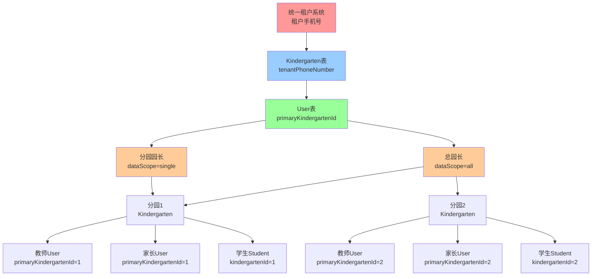

# 校区隔离功能完整实现设计

## 文档信息

| 项目 | 内容 |
|------|------|
| 文档类型 | 功能完善设计 |
| 创建时间 | 2024-12-29 |
| 设计目标 | 实现完整的用户隔离功能，确保租户数据安全 |
| 关联文档 | function-check-.md, CAMPUS_ISOLATION_IMPLEMENTATION_SUMMARY.md |

## 一、当前完成情况评估

### 1.1 已完成核心基础（70%）

| 功能模块 | 完成度 | 状态 | 备注 |
|---------|-------|------|------|
| User模型扩展 | 100% | ✅ 已实现 | primaryKindergartenId, allowedKindergartenIds, dataScope |
| Kindergarten模型扩展 | 100% | ✅ 已实现 | tenantPhoneNumber, tenantId, isPrimaryBranch |
| Parent模型扩展 | 100% | ✅ 已实现 | kindergartenId冗余字段 |
| 新角色定义 | 100% | ✅ 已实现 | group_admin, chief_principal, branch_principal |
| 数据库迁移脚本 | 100% | ✅ 已创建 | 20241227000000-add-kindergarten-isolation-fields.js |
| JWT Token增强 | 100% | ✅ 已实现 | Token包含园区上下文信息 |
| 数据范围中间件 | 100% | ✅ 已实现 | applyDataScope, getDataScopeFilter, canAccessKindergarten |

### 1.2 待完成关键功能（30%）

| 功能模块 | 完成度 | 优先级 | 预估工作量 |
|---------|-------|--------|----------|
| 租户注册与园区创建流程 | 0% | 🔴 高 | 3天 |
| 总园长分园管理API | 0% | 🔴 高 | 2天 |
| 园长账号开通API | 0% | 🔴 高 | 2天 |
| 教师账号开通API | 0% | 🔴 高 | 1天 |
| 家长账号开通API | 0% | 🔴 高 | 1天 |
| 现有API数据范围适配 | 0% | 🔴 高 | 5天 |
| AI表隔离字段补充 | 0% | 🟡 中 | 2天 |
| 前端管理界面 | 0% | 🟡 中 | 7天 |
| 审计日志持久化 | 0% | 🟢 低 | 2天 |

## 二、完整用户隔离路径设计

### 2.1 隔离链路架构



### 2.2 数据关联关系

**租户 → 园区关联**：
- Kindergarten.tenantPhoneNumber = 租户手机号
- Kindergarten.tenantId = 统一租户系统的全局租户ID（可选）
- 一个租户可创建多个园区

**用户 → 园区关联**：
- User.primaryKindergartenId = 主要归属园区
- User.allowedKindergartenIds = 允许访问的园区列表（JSON数组）
- User.dataScope = 数据访问范围（all/single/none）

**业务数据 → 园区关联**：
- Student/Teacher/Class等核心表：kindergartenId字段
- Parent表：kindergartenId冗余字段（提升查询效率）
- AI相关表：需要添加kindergartenId字段

## 三、核心业务流程设计

### 3.1 租户注册与园区初始化流程

**流程名称**：租户注册并创建主园区

**触发方式**：统一租户系统注册成功后回调

**核心步骤**：

1. **接收租户注册信息**
   - 输入：租户手机号、租户名称、租户ID
   - 验证：手机号格式、重复性检查
   
2. **创建主园区记录**
   - 在Kindergarten表创建记录
   - 设置tenantPhoneNumber、tenantId
   - 设置isPrimaryBranch=1（标记为主园区）
   - 生成园区编码（基于租户手机号）

3. **创建总园长账号**
   - 在User表创建记录
   - 设置primaryKindergartenId=主园区ID
   - 设置allowedKindergartenIds=[主园区ID]
   - 设置dataScope='all'
   - 分配chief_principal角色
   - 生成初始密码

4. **返回结果**
   - 输出：园区ID、总园长账号、初始密码

**API设计**：

| 接口 | 方法 | 路径 |
|------|------|------|
| 租户注册回调 | POST | /api/tenant/register-callback |

**数据流转**：
```
统一租户系统 → POST /api/tenant/register-callback
{
  tenantPhoneNumber: "13800138000",
  tenantName: "示例幼儿园集团",
  tenantId: "tenant_abc123"
}
↓
创建Kindergarten记录
↓
创建User记录（总园长）
↓
返回园区信息和账号信息
```

### 3.2 总园长创建分园流程

**流程名称**：总园长开通新分园

**权限要求**：
- 角色：chief_principal或group_admin
- 数据范围：dataScope='all'

**核心步骤**：

1. **验证总园长权限**
   - 检查用户角色
   - 检查dataScope
   - 验证租户归属

2. **创建分园记录**
   - 在Kindergarten表创建记录
   - 复制tenantPhoneNumber和tenantId
   - 设置isPrimaryBranch=0（标记为分园）
   - 设置groupId关联到主园区
   - 生成分园编码

3. **更新总园长权限**
   - 将新分园ID加入allowedKindergartenIds

4. **返回分园信息**

**API设计**：

| 接口 | 方法 | 路径 |
|------|------|------|
| 创建分园 | POST | /api/kindergartens/branches |
| 查询分园列表 | GET | /api/kindergartens/branches |
| 更新分园信息 | PUT | /api/kindergartens/branches/:id |
| 删除分园 | DELETE | /api/kindergartens/branches/:id |

**请求参数**：
```
POST /api/kindergartens/branches
{
  name: "分园名称",
  code: "分园编码",
  address: "分园地址",
  phone: "联系电话",
  principal: "园长姓名",
  ...其他基本信息
}
```

**响应数据**：
```
{
  success: true,
  data: {
    kindergartenId: 2,
    name: "分园名称",
    tenantPhoneNumber: "13800138000",
    isPrimaryBranch: 0
  }
}
```

### 3.3 总园长分配分园园长流程

**流程名称**：为分园指定园长

**权限要求**：
- 角色：chief_principal或group_admin
- 数据范围：dataScope='all'
- 目标园区：必须在allowedKindergartenIds内

**核心步骤**：

1. **验证操作权限**
   - 检查总园长权限
   - 验证目标园区归属

2. **创建园长账号**
   - 在User表创建记录
   - 设置primaryKindergartenId=分园ID
   - 设置allowedKindergartenIds=[分园ID]
   - 设置dataScope='single'
   - 分配branch_principal角色
   - 生成用户名和初始密码

3. **更新园区信息**
   - 更新Kindergarten.principal字段

4. **返回园长账号信息**

**API设计**：

| 接口 | 方法 | 路径 |
|------|------|------|
| 分配园长 | POST | /api/kindergartens/:id/assign-principal |
| 更换园长 | PUT | /api/kindergartens/:id/assign-principal |
| 查询园长信息 | GET | /api/kindergartens/:id/principal |

**请求参数**：
```
POST /api/kindergartens/:id/assign-principal
{
  realName: "园长姓名",
  phone: "手机号",
  email: "邮箱"
}
```

**响应数据**：
```
{
  success: true,
  data: {
    userId: 123,
    username: "principal_k002",
    realName: "园长姓名",
    phone: "18800000000",
    initialPassword: "******",
    primaryKindergartenId: 2,
    role: "branch_principal"
  }
}
```

### 3.4 分园园长开通教师账号流程

**流程名称**：园长为本园创建教师账号

**权限要求**：
- 角色：branch_principal或admin
- 数据范围：dataScope='single'
- 操作范围：仅限本园（primaryKindergartenId）

**核心步骤**：

1. **验证园长权限**
   - 检查角色
   - 检查园区归属

2. **创建教师User记录**
   - 设置primaryKindergartenId=园长的园区ID
   - 设置dataScope='single'
   - 分配teacher角色
   - 生成用户名和密码

3. **创建Teacher记录**
   - 在Teacher表创建记录
   - 设置kindergartenId
   - 关联到User记录

4. **返回教师账号信息**

**API设计**：

| 接口 | 方法 | 路径 |
|------|------|------|
| 创建教师账号 | POST | /api/teachers/register |
| 批量创建教师 | POST | /api/teachers/batch-register |
| 查询本园教师 | GET | /api/teachers |
| 更新教师信息 | PUT | /api/teachers/:id |
| 停用教师账号 | DELETE | /api/teachers/:id |

**请求参数**：
```
POST /api/teachers/register
{
  realName: "教师姓名",
  phone: "手机号",
  email: "邮箱",
  gender: "性别",
  idCard: "身份证号",
  education: "学历",
  specialty: "专业"
}
```

### 3.5 分园园长开通家长账号流程

**流程名称**：园长为本园学生家长创建账号

**权限要求**：
- 角色：branch_principal或admin
- 数据范围：dataScope='single'
- 操作范围：仅限本园学生家长

**核心步骤**：

1. **验证园长权限和学生归属**
   - 检查角色
   - 验证学生是否属于本园

2. **创建家长User记录**
   - 设置primaryKindergartenId=园长的园区ID
   - 设置dataScope='single'
   - 分配parent角色
   - 生成用户名和密码

3. **创建Parent记录**
   - 在Parent表创建记录
   - 设置kindergartenId（冗余字段）
   - 关联到Student记录
   - 关联到User记录

4. **返回家长账号信息**

**API设计**：

| 接口 | 方法 | 路径 |
|------|------|------|
| 创建家长账号 | POST | /api/parents/register |
| 批量创建家长 | POST | /api/parents/batch-register |
| 查询本园家长 | GET | /api/parents |
| 更新家长信息 | PUT | /api/parents/:id |
| 停用家长账号 | DELETE | /api/parents/:id |

**请求参数**：
```
POST /api/parents/register
{
  studentId: 456,
  realName: "家长姓名",
  phone: "手机号",
  email: "邮箱",
  relationship: "与学生关系",
  isPrimaryContact: 1,
  isLegalGuardian: 1
}
```

## 四、现有API数据范围适配方案

### 4.1 适配策略

**核心原则**：
- 所有涉及园区数据的API都必须应用数据范围过滤
- 优先使用中间件自动过滤
- 特殊情况在Service层手动过滤

**适配方式**：

方式一：使用中间件（推荐）
```typescript
// 路由层添加applyDataScope中间件
router.get('/students', 
  verifyToken,           // 认证
  applyDataScope,        // 应用数据范围
  studentController.list // 业务逻辑
);

// Controller层无需修改
// Service层使用getDataScopeFilter获取过滤条件
const filter = getDataScopeFilter(req);
const students = await Student.findAll({
  where: {
    ...filter,
    ...其他条件
  }
});
```

方式二：Service层手动过滤
```typescript
// 对于复杂查询，在Service层手动应用过滤
const user = req.user;
const where: any = {};

if (user.dataScope === 'single') {
  where.kindergartenId = user.primaryKindergartenId;
} else if (user.dataScope === 'all') {
  if (user.allowedKindergartenIds?.length > 0) {
    where.kindergartenId = user.allowedKindergartenIds;
  }
}

const students = await Student.findAll({ where });
```

### 4.2 需要适配的API列表

**高优先级（核心业务）**：

| API路径 | 资源类型 | 适配方式 | 工作量 |
|---------|---------|---------|--------|
| /api/students/* | 学生管理 | 中间件 | 0.5天 |
| /api/teachers/* | 教师管理 | 中间件 | 0.5天 |
| /api/classes/* | 班级管理 | 中间件 | 0.5天 |
| /api/parents/* | 家长管理 | 中间件 | 0.5天 |
| /api/activities/* | 活动管理 | 中间件 | 0.5天 |
| /api/enrollment/* | 招生管理 | 中间件 | 0.5天 |

**中优先级（辅助功能）**：

| API路径 | 资源类型 | 适配方式 | 工作量 |
|---------|---------|---------|--------|
| /api/attendance/* | 考勤管理 | 中间件 | 0.3天 |
| /api/health/* | 健康管理 | 中间件 | 0.3天 |
| /api/meals/* | 膳食管理 | 中间件 | 0.3天 |
| /api/fees/* | 收费管理 | 中间件 | 0.3天 |

**低优先级（可延后）**：

| API路径 | 资源类型 | 适配方式 | 工作量 |
|---------|---------|---------|--------|
| /api/reports/* | 报表统计 | Service层 | 1天 |
| /api/ai/* | AI功能 | Service层 | 1天 |

### 4.3 适配检查清单

每个API适配完成后需验证：

- [ ] 总园长可以查看所有园区数据
- [ ] 分园园长只能查看本园数据
- [ ] 教师只能查看本园数据
- [ ] 家长只能查看本园数据
- [ ] 越权访问被拒绝
- [ ] 错误消息清晰明确
- [ ] 单元测试覆盖隔离场景

## 五、AI表隔离字段补充

### 5.1 需要添加kindergartenId的表

| 表名 | 说明 | 关联方式 | 工作量 |
|------|------|---------|--------|
| ai_conversations | AI对话会话 | 从userId获取 | 0.5天 |
| ai_messages | AI消息记录 | 从conversationId获取 | 0.5天 |
| ai_feedback | AI反馈记录 | 从userId获取 | 0.3天 |
| ai_billing_records | AI计费记录 | 从userId获取 | 0.3天 |

### 5.2 迁移脚本设计

**文件名**：`20241228000000-add-ai-tables-kindergarten-id.js`

**核心步骤**：
1. 为ai_conversations、ai_messages等表添加kindergarten_id字段
2. 根据userId回填kindergarten_id数据
3. 添加索引
4. 添加外键约束（可选）

**数据回填逻辑**：
```
UPDATE ai_conversations ac
JOIN users u ON ac.user_id = u.id
SET ac.kindergarten_id = u.primary_kindergarten_id
WHERE u.primary_kindergarten_id IS NOT NULL;
```

## 六、实施计划

### 6.1 第一周任务（Day 1-5）

**Day 1：租户注册与园区初始化**
- [ ] 设计租户注册回调API
- [ ] 实现Kindergarten创建逻辑
- [ ] 实现总园长User创建逻辑
- [ ] 编写单元测试

**Day 2：总园长分园管理**
- [ ] 实现创建分园API
- [ ] 实现查询分园列表API
- [ ] 实现更新分园API
- [ ] 编写单元测试

**Day 3：园长账号分配**
- [ ] 实现分配园长API
- [ ] 实现更换园长API
- [ ] 实现查询园长API
- [ ] 编写单元测试

**Day 4：教师账号开通**
- [ ] 实现教师注册API
- [ ] 实现批量注册API
- [ ] 更新教师查询API（应用数据范围）
- [ ] 编写单元测试

**Day 5：家长账号开通**
- [ ] 实现家长注册API
- [ ] 实现批量注册API
- [ ] 更新家长查询API（应用数据范围）
- [ ] 编写单元测试

### 6.2 第二周任务（Day 6-10）

**Day 6-8：现有API适配（高优先级）**
- [ ] 适配学生管理API（6个接口）
- [ ] 适配教师管理API（6个接口）
- [ ] 适配班级管理API（6个接口）
- [ ] 适配家长管理API（6个接口）
- [ ] 适配活动管理API（6个接口）
- [ ] 适配招生管理API（6个接口）
- [ ] 编写集成测试

**Day 9：AI表隔离字段补充**
- [ ] 创建迁移脚本
- [ ] 执行数据回填
- [ ] 更新AI相关模型
- [ ] 适配AI查询API

**Day 10：集成测试与验证**
- [ ] 完整业务流程测试
- [ ] 数据隔离验证测试
- [ ] 越权访问测试
- [ ] 性能测试

### 6.3 第三周任务（Day 11-15）

**Day 11-13：前端管理界面**
- [ ] 总园长分园管理页面
- [ ] 园长分配界面
- [ ] 教师账号管理界面
- [ ] 家长账号管理界面

**Day 14：审计日志持久化**
- [ ] 创建审计日志表
- [ ] 实现日志记录逻辑
- [ ] 实现日志查询API

**Day 15：文档完善与交付**
- [ ] 完善API文档
- [ ] 编写操作手册
- [ ] 准备演示环境

## 七、验收标准

### 7.1 功能完整性

- [ ] 租户可以注册并创建主园区
- [ ] 总园长可以创建分园
- [ ] 总园长可以为分园分配园长
- [ ] 分园园长可以开通教师账号
- [ ] 分园园长可以开通家长账号
- [ ] 所有核心API已应用数据范围过滤
- [ ] AI表已补充kindergartenId字段

### 7.2 数据隔离验证

- [ ] 总园长可以查看所有分园数据
- [ ] 分园园长只能查看本园数据
- [ ] 教师只能查看本园数据
- [ ] 家长只能查看本园数据
- [ ] 越权访问被正确拒绝
- [ ] 跨园访问有审计日志

### 7.3 安全性验证

- [ ] Token伪造测试通过
- [ ] 参数篡改测试通过
- [ ] SQL注入测试通过
- [ ] 数据泄露测试通过

### 7.4 性能验证

- [ ] 查询性能下降<10%
- [ ] Token大小增加<200字节
- [ ] API响应时间<2秒

### 7.5 兼容性验证

- [ ] 现有功能正常运行
- [ ] 现有测试全部通过
- [ ] 支持渐进式迁移

## 八、风险与缓解措施

| 风险 | 可能性 | 影响 | 缓解措施 |
|------|-------|------|---------|
| 数据库迁移失败 | 低 | 高 | 完整备份、测试环境验证、回滚脚本 |
| API适配遗漏 | 中 | 高 | API清单、代码审查、全面测试 |
| 数据隔离不完整 | 中 | 高 | 安全测试、渗透测试、审计日志 |
| 性能下降 | 中 | 中 | 索引优化、查询优化、缓存策略 |
| 前端开发延期 | 中 | 低 | API先行、前端可独立迭代 |

## 九、成功标准总结

**核心目标**：实现完整的租户数据隔离，确保不同租户的数据绝对安全

**关键指标**：
1. ✅ 100%的核心业务API已应用数据范围过滤
2. ✅ 通过安全测试（越权访问、Token伪造）
3. ✅ 数据查询性能下降<10%
4. ✅ 支持租户自主管理园区和账号
5. ✅ 完整的审计日志可追溯

---

**文档版本**：v1.0  
**最后更新**：2024-12-29  
**预计完成时间**：3周