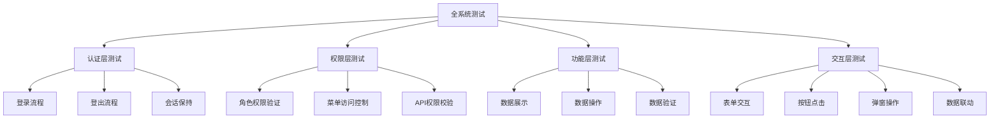
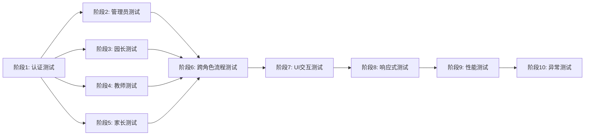

# 幼儿园管理系统全覆盖测试设计

## 测试目标

使用 MCP Server Playwright 协议对幼儿园管理系统进行元素级全覆盖测试，模拟真实客户操作场景，确保系统所有功能正常运行。

## 测试环境

| 配置项 | 值 |
|--------|-----|
| 前端地址 | http://localhost:5173 |
| 后端API | http://localhost:3000 |
| MCP Server | @iflow-mcp/playwright-mcp@0.0.32 |
| 浏览器模式 | 无头模式（headless） |
| 测试工具 | MCP Playwright 协议调用 |

## 测试角色与权限

系统共有4类角色，每个角色的测试需要独立的登录会话和权限验证：

| 角色 | 用户名 | 权限范围 | 测试优先级 |
|------|--------|----------|-----------|
| 系统管理员 | admin | 系统层面管理（用户、角色、权限、系统设置） | P0 |
| 园长 | principal | 招生业务管理（招生计划、活动、客户池、业绩） | P0 |
| 教师 | teacher | 招生任务执行（任务、客户跟踪、活动参与） | P1 |
| 家长 | parent | 入园申请（孩子管理、申请、活动参与） | P1 |

## 测试策略

### 测试层级划分



### 测试原则

| 原则 | 说明 |
|------|------|
| 元素级验证 | 每个可见元素、每个按钮、每个输入框都要进行测试 |
| 真实操作模拟 | 使用MCP协议真实调用浏览器，不使用脚本模拟 |
| 数据驱动 | 所有测试数据从数据库获取，不使用硬编码 |
| 权限隔离 | 每个角色测试独立会话，验证权限边界 |
| 异常覆盖 | 包含正常流程和异常流程的测试 |
| 顺序依赖 | 按照用户真实使用路径设计测试顺序 |

## 详细测试计划

### 阶段1：认证系统测试（必须优先完成）

#### 1.1 登录功能测试

**测试目标**：验证所有角色的登录流程和会话建立

**测试步骤**：

| 步骤ID | 测试操作 | 验证点 | MCP操作 |
|--------|----------|--------|---------|
| AUTH-001 | 打开登录页面 | 页面加载完成，显示登录表单 | navigate → snapshot |
| AUTH-002 | 输入系统管理员账号 | 用户名输入框正确接收输入 | type(用户名: admin) |
| AUTH-003 | 输入管理员密码 | 密码输入框正确接收输入（密文显示） | type(密码: ****) |
| AUTH-004 | 点击登录按钮 | 按钮响应，发起登录请求 | click(登录按钮) |
| AUTH-005 | 等待登录响应 | 成功跳转到管理员工作台 | wait_for(工作台标题) |
| AUTH-006 | 验证Token存储 | localStorage包含有效token | evaluate(检查token) |
| AUTH-007 | 验证用户信息显示 | 页面显示当前登录用户名 | snapshot(用户信息区域) |

**扩展测试**：
- 错误密码登录（验证错误提示）
- 空用户名提交（验证表单验证）
- 空密码提交（验证表单验证）
- 用户不存在场景（验证错误提示）

**重复测试**：对园长、教师、家长角色重复以上步骤

#### 1.2 登出功能测试

**测试目标**：验证登出流程和会话清理

**测试步骤**：

| 步骤ID | 测试操作 | 验证点 | MCP操作 |
|--------|----------|--------|---------|
| AUTH-101 | 点击用户菜单 | 展开用户下拉菜单 | click(用户头像) |
| AUTH-102 | 点击登出选项 | 触发登出操作 | click(登出) |
| AUTH-103 | 验证登出响应 | 跳转到登录页面 | wait_for(登录表单) |
| AUTH-104 | 验证Token清理 | localStorage的token已清除 | evaluate(检查token) |
| AUTH-105 | 尝试访问受保护页面 | 自动重定向到登录页 | navigate → snapshot |

### 阶段2：系统管理员功能测试

#### 2.1 系统概览页面测试

**测试目标**：验证系统仪表板数据展示和交互

**前置条件**：已完成管理员登录（AUTH-001至AUTH-007）

**测试步骤**：

| 步骤ID | 测试操作 | 验证点 | MCP操作 |
|--------|----------|--------|---------|
| ADMIN-001 | 访问系统概览 | 页面加载完成 | navigate(/system/dashboard) |
| ADMIN-002 | 验证统计卡片 | 显示用户数、角色数等统计数据 | snapshot(统计卡片区域) |
| ADMIN-003 | 验证图表渲染 | ECharts图表正常显示 | snapshot(图表区域) |
| ADMIN-004 | 测试时间范围选择器 | 选择不同时间范围，数据更新 | click(时间选择器) → select_option |
| ADMIN-005 | 验证数据刷新按钮 | 点击刷新按钮，数据重新加载 | click(刷新按钮) → wait_for |
| ADMIN-006 | 验证响应式布局 | 调整浏览器窗口，布局自适应 | resize → snapshot |

**数据验证**：
- 统计数据与数据库实际数据一致
- 图表数据点数量正确
- 数据加载状态正确显示

#### 2.2 用户管理测试

**测试目标**：验证用户的增删改查和权限分配

**测试场景A：用户列表展示**

| 步骤ID | 测试操作 | 验证点 | MCP操作 |
|--------|----------|--------|---------|
| ADMIN-101 | 访问用户管理页面 | 页面加载，显示用户列表 | navigate(/system/users) → snapshot |
| ADMIN-102 | 验证表格列头 | 显示用户名、角色、状态等列 | snapshot(表格列头) |
| ADMIN-103 | 验证分页组件 | 显示分页器，总数正确 | snapshot(分页器) |
| ADMIN-104 | 点击下一页 | 切换到第2页，显示新数据 | click(下一页) → wait_for |
| ADMIN-105 | 测试每页条数切换 | 选择20条/页，数据重新加载 | select_option(20) → wait_for |
| ADMIN-106 | 测试搜索功能 | 输入用户名，筛选结果 | type(搜索框) → press_key(Enter) |
| ADMIN-107 | 测试角色筛选 | 选择角色，筛选结果 | select_option(角色选择器) → wait_for |
| ADMIN-108 | 测试状态筛选 | 选择启用/禁用，筛选结果 | select_option(状态选择器) → wait_for |
| ADMIN-109 | 测试重置按钮 | 清空筛选条件，显示全部数据 | click(重置按钮) → wait_for |

**测试场景B：创建新用户**

| 步骤ID | 测试操作 | 验证点 | MCP操作 |
|--------|----------|--------|---------|
| ADMIN-201 | 点击新增用户按钮 | 打开新增用户对话框 | click(新增按钮) → wait_for(对话框) |
| ADMIN-202 | 验证表单结构 | 显示用户名、密码、角色等字段 | snapshot(表单区域) |
| ADMIN-203 | 输入用户名 | 用户名输入框接收输入 | type(用户名: test_user_001) |
| ADMIN-204 | 输入密码 | 密码输入框接收输入 | type(密码: Test@123456) |
| ADMIN-205 | 确认密码 | 确认密码输入框接收输入 | type(确认密码: Test@123456) |
| ADMIN-206 | 输入邮箱 | 邮箱输入框接收输入 | type(邮箱: test@example.com) |
| ADMIN-207 | 输入手机号 | 手机号输入框接收输入 | type(手机: 13800138000) |
| ADMIN-208 | 选择角色 | 下拉框展开，选择角色 | click(角色选择器) → select_option(教师) |
| ADMIN-209 | 选择状态 | 选择启用状态 | click(状态开关) |
| ADMIN-210 | 提交表单 | 点击确定按钮，创建用户 | click(确定按钮) → wait_for |
| ADMIN-211 | 验证创建成功 | 显示成功提示，列表刷新 | snapshot(提示消息) → wait_for |
| ADMIN-212 | 验证新用户出现 | 列表中显示新创建的用户 | snapshot(用户列表) |

**表单验证测试**：
- 用户名为空（验证必填提示）
- 用户名重复（验证唯一性提示）
- 密码格式错误（验证格式提示）
- 两次密码不一致（验证一致性提示）
- 邮箱格式错误（验证格式提示）
- 手机号格式错误（验证格式提示）

**测试场景C：编辑用户**

| 步骤ID | 测试操作 | 验证点 | MCP操作 |
|--------|----------|--------|---------|
| ADMIN-301 | 点击编辑按钮 | 打开编辑用户对话框 | click(编辑按钮) → wait_for(对话框) |
| ADMIN-302 | 验证表单数据回显 | 表单显示当前用户信息 | snapshot(表单区域) |
| ADMIN-303 | 修改邮箱 | 邮箱输入框更新内容 | type(邮箱: newemail@example.com) |
| ADMIN-304 | 修改角色 | 选择新角色 | select_option(角色选择器: 园长) |
| ADMIN-305 | 提交修改 | 点击确定按钮，更新用户 | click(确定按钮) → wait_for |
| ADMIN-306 | 验证更新成功 | 显示成功提示，数据已更新 | snapshot → wait_for |

**测试场景D：删除用户**

| 步骤ID | 测试操作 | 验证点 | MCP操作 |
|--------|----------|--------|---------|
| ADMIN-401 | 点击删除按钮 | 显示确认对话框 | click(删除按钮) → wait_for(确认框) |
| ADMIN-402 | 取消删除 | 关闭对话框，数据未删除 | click(取消按钮) → wait_for |
| ADMIN-403 | 再次点击删除按钮 | 显示确认对话框 | click(删除按钮) → wait_for(确认框) |
| ADMIN-404 | 确认删除 | 执行删除操作 | click(确定按钮) → wait_for |
| ADMIN-405 | 验证删除成功 | 显示成功提示，用户从列表消失 | snapshot → wait_for |

**测试场景E：批量操作**

| 步骤ID | 测试操作 | 验证点 | MCP操作 |
|--------|----------|--------|---------|
| ADMIN-501 | 勾选多个用户 | 复选框被选中 | click(复选框1) → click(复选框2) |
| ADMIN-502 | 点击批量启用 | 显示确认对话框 | click(批量启用按钮) → wait_for |
| ADMIN-503 | 确认批量操作 | 执行批量启用 | click(确定按钮) → wait_for |
| ADMIN-504 | 验证批量结果 | 显示成功提示，状态已更新 | snapshot → wait_for |

#### 2.3 角色管理测试

**测试目标**：验证角色的增删改查和权限配置

**测试场景A：角色列表展示**

| 步骤ID | 测试操作 | 验证点 | MCP操作 |
|--------|----------|--------|---------|
| ADMIN-601 | 访问角色管理页面 | 页面加载，显示角色列表 | navigate(/system/roles) → snapshot |
| ADMIN-602 | 验证表格数据 | 显示系统管理员、园长、教师、家长角色 | snapshot(角色表格) |
| ADMIN-603 | 验证操作按钮 | 每个角色显示编辑、权限、删除按钮 | snapshot(操作列) |

**测试场景B：创建新角色**

| 步骤ID | 测试操作 | 验证点 | MCP操作 |
|--------|----------|--------|---------|
| ADMIN-701 | 点击新增角色按钮 | 打开新增角色对话框 | click(新增按钮) → wait_for(对话框) |
| ADMIN-702 | 输入角色名称 | 角色名称输入框接收输入 | type(角色名称: 测试角色) |
| ADMIN-703 | 输入角色代码 | 角色代码输入框接收输入 | type(角色代码: TEST_ROLE) |
| ADMIN-704 | 输入角色描述 | 描述输入框接收输入 | type(描述: 这是测试角色) |
| ADMIN-705 | 选择角色状态 | 启用状态 | click(状态开关) |
| ADMIN-706 | 提交表单 | 创建角色成功 | click(确定按钮) → wait_for |
| ADMIN-707 | 验证创建成功 | 列表显示新角色 | snapshot(角色列表) |

**测试场景C：权限配置**

| 步骤ID | 测试操作 | 验证点 | MCP操作 |
|--------|----------|--------|---------|
| ADMIN-801 | 点击权限按钮 | 打开权限配置对话框 | click(权限按钮) → wait_for(对话框) |
| ADMIN-802 | 验证权限树结构 | 显示完整的权限树 | snapshot(权限树) |
| ADMIN-803 | 展开一级节点 | 显示二级权限 | click(展开图标) → wait_for |
| ADMIN-804 | 勾选权限节点 | 权限被选中，子权限自动选中 | click(权限复选框) → snapshot |
| ADMIN-805 | 取消权限节点 | 权限取消，子权限自动取消 | click(权限复选框) → snapshot |
| ADMIN-806 | 保存权限配置 | 权限配置生效 | click(保存按钮) → wait_for |
| ADMIN-807 | 验证保存成功 | 显示成功提示 | snapshot(提示消息) |

#### 2.4 权限管理测试

**测试目标**：验证权限的增删改查和层级管理

**测试步骤**：

| 步骤ID | 测试操作 | 验证点 | MCP操作 |
|--------|----------|--------|---------|
| ADMIN-901 | 访问权限管理页面 | 页面加载，显示权限树 | navigate(/system/permissions) → snapshot |
| ADMIN-902 | 验证权限树结构 | 显示多级权限结构 | snapshot(权限树) |
| ADMIN-903 | 展开权限节点 | 显示子权限 | click(展开图标) → snapshot |
| ADMIN-904 | 点击新增权限 | 打开新增权限对话框 | click(新增按钮) → wait_for(对话框) |
| ADMIN-905 | 选择父级权限 | 下拉框显示权限树 | click(父级选择器) → snapshot |
| ADMIN-906 | 输入权限名称 | 权限名称输入框接收输入 | type(权限名称: 测试权限) |
| ADMIN-907 | 输入权限代码 | 权限代码输入框接收输入 | type(权限代码: TEST_PERMISSION) |
| ADMIN-908 | 选择权限类型 | 选择菜单/按钮/API | select_option(权限类型: 菜单) |
| ADMIN-909 | 输入权限路径 | 路径输入框接收输入 | type(路径: /test/permission) |
| ADMIN-910 | 提交表单 | 创建权限成功 | click(确定按钮) → wait_for |
| ADMIN-911 | 验证权限出现 | 权限树显示新权限 | snapshot(权限树) |

#### 2.5 系统设置测试

**测试目标**：验证系统参数配置功能

**测试步骤**：

| 步骤ID | 测试操作 | 验证点 | MCP操作 |
|--------|----------|--------|---------|
| ADMIN-1001 | 访问系统设置页面 | 页面加载，显示设置项 | navigate(/system/settings) → snapshot |
| ADMIN-1002 | 验证设置分类 | 显示基础设置、安全设置等分类 | snapshot(设置分类) |
| ADMIN-1003 | 修改系统名称 | 系统名称输入框接收输入 | type(系统名称: 新系统名称) |
| ADMIN-1004 | 修改Logo | 点击上传，选择图片文件 | click(上传按钮) → file_upload |
| ADMIN-1005 | 修改主题色 | 颜色选择器显示并选择颜色 | click(颜色选择器) → click(颜色) |
| ADMIN-1006 | 修改超时时间 | 输入框接收数字输入 | type(超时时间: 30) |
| ADMIN-1007 | 保存设置 | 点击保存按钮 | click(保存按钮) → wait_for |
| ADMIN-1008 | 验证保存成功 | 显示成功提示 | snapshot(提示消息) |
| ADMIN-1009 | 刷新页面验证 | 设置已持久化 | navigate → snapshot |

#### 2.6 系统日志测试

**测试目标**：验证系统日志查询和分析功能

**测试步骤**：

| 步骤ID | 测试操作 | 验证点 | MCP操作 |
|--------|----------|--------|---------|
| ADMIN-1101 | 访问系统日志页面 | 页面加载，显示日志列表 | navigate(/system/logs) → snapshot |
| ADMIN-1102 | 验证日志表格 | 显示时间、用户、操作、结果等列 | snapshot(日志表格) |
| ADMIN-1103 | 测试时间筛选 | 选择时间范围，筛选日志 | click(时间选择器) → select_option |
| ADMIN-1104 | 测试用户筛选 | 选择用户，筛选日志 | select_option(用户选择器) |
| ADMIN-1105 | 测试操作类型筛选 | 选择操作类型，筛选日志 | select_option(操作类型) |
| ADMIN-1106 | 测试关键词搜索 | 输入关键词，搜索日志 | type(搜索框) → press_key(Enter) |
| ADMIN-1107 | 点击查看详情 | 打开日志详情对话框 | click(详情按钮) → wait_for(对话框) |
| ADMIN-1108 | 验证详情内容 | 显示完整的日志信息 | snapshot(详情对话框) |
| ADMIN-1109 | 测试导出功能 | 点击导出按钮，下载日志文件 | click(导出按钮) → wait_for |

#### 2.7 数据备份测试

**测试目标**：验证数据备份和恢复功能

**测试步骤**：

| 步骤ID | 测试操作 | 验证点 | MCP操作 |
|--------|----------|--------|---------|
| ADMIN-1201 | 访问数据备份页面 | 页面加载，显示备份列表 | navigate(/system/backup) → snapshot |
| ADMIN-1202 | 验证备份列表 | 显示历史备份记录 | snapshot(备份列表) |
| ADMIN-1203 | 点击创建备份 | 打开备份配置对话框 | click(创建备份按钮) → wait_for(对话框) |
| ADMIN-1204 | 输入备份描述 | 备份描述输入框接收输入 | type(备份描述: 测试备份) |
| ADMIN-1205 | 选择备份类型 | 选择全量/增量备份 | select_option(备份类型: 全量) |
| ADMIN-1206 | 确认创建备份 | 开始备份操作 | click(确定按钮) → wait_for |
| ADMIN-1207 | 验证备份进度 | 显示备份进度条 | snapshot(进度条) |
| ADMIN-1208 | 验证备份完成 | 列表显示新备份记录 | wait_for → snapshot(备份列表) |
| ADMIN-1209 | 点击下载备份 | 下载备份文件 | click(下载按钮) → wait_for |
| ADMIN-1210 | 点击恢复备份 | 显示确认对话框 | click(恢复按钮) → wait_for(确认框) |
| ADMIN-1211 | 取消恢复操作 | 关闭对话框 | click(取消按钮) |

### 阶段3：园长功能测试

#### 3.1 园长工作台测试

**测试目标**：验证园长工作台数据展示和快捷操作

**前置条件**：完成园长账号登录

**测试步骤**：

| 步骤ID | 测试操作 | 验证点 | MCP操作 |
|--------|----------|--------|---------|
| PRINCIPAL-001 | 访问园长工作台 | 页面加载，显示招生数据概览 | navigate(/principal/dashboard) → snapshot |
| PRINCIPAL-002 | 验证统计卡片 | 显示招生计划、活动数、客户数等 | snapshot(统计卡片) |
| PRINCIPAL-003 | 验证招生趋势图 | 显示招生数据趋势图表 | snapshot(趋势图) |
| PRINCIPAL-004 | 验证转化漏斗 | 显示招生转化漏斗图 | snapshot(漏斗图) |
| PRINCIPAL-005 | 验证教师业绩榜 | 显示教师招生业绩排名 | snapshot(业绩榜) |
| PRINCIPAL-006 | 点击统计卡片 | 跳转到对应详情页 | click(统计卡片) → wait_for |
| PRINCIPAL-007 | 返回工作台 | 导航返回工作台 | navigate_back → snapshot |
| PRINCIPAL-008 | 测试快捷操作 | 显示快捷操作按钮 | snapshot(快捷操作区) |
| PRINCIPAL-009 | 点击新建活动 | 打开活动创建对话框 | click(新建活动) → wait_for(对话框) |
| PRINCIPAL-010 | 关闭对话框 | 对话框关闭 | click(关闭按钮) |

#### 3.2 招生计划管理测试

**测试目标**：验证招生计划的完整生命周期管理

**测试场景A：招生计划列表**

| 步骤ID | 测试操作 | 验证点 | MCP操作 |
|--------|----------|--------|---------|
| PRINCIPAL-101 | 访问招生计划页面 | 页面加载，显示计划列表 | navigate(/principal/enrollment-plan) → snapshot |
| PRINCIPAL-102 | 验证表格列 | 显示计划名称、时间、目标、状态等 | snapshot(计划表格) |
| PRINCIPAL-103 | 测试状态筛选 | 筛选进行中的计划 | select_option(状态: 进行中) → wait_for |
| PRINCIPAL-104 | 测试时间筛选 | 筛选本月计划 | click(时间选择器) → select_option |
| PRINCIPAL-105 | 测试搜索功能 | 搜索计划名称 | type(搜索框) → press_key(Enter) |

**测试场景B：创建招生计划**

| 步骤ID | 测试操作 | 验证点 | MCP操作 |
|--------|----------|--------|---------|
| PRINCIPAL-201 | 点击新建计划按钮 | 打开创建计划对话框 | click(新建按钮) → wait_for(对话框) |
| PRINCIPAL-202 | 输入计划名称 | 计划名称输入框接收输入 | type(计划名称: 2024春季招生计划) |
| PRINCIPAL-203 | 选择开始时间 | 日期选择器显示并选择日期 | click(开始时间) → click(日期) |
| PRINCIPAL-204 | 选择结束时间 | 日期选择器显示并选择日期 | click(结束时间) → click(日期) |
| PRINCIPAL-205 | 输入招生目标 | 目标人数输入框接收输入 | type(招生目标: 100) |
| PRINCIPAL-206 | 选择目标班级 | 多选下拉框选择班级 | click(班级选择器) → click(班级1) |
| PRINCIPAL-207 | 输入计划描述 | 富文本编辑器接收输入 | type(描述: 春季招生重点...) |
| PRINCIPAL-208 | 上传计划附件 | 选择并上传文件 | click(上传按钮) → file_upload |
| PRINCIPAL-209 | 配置奖励规则 | 输入奖励金额和条件 | type(奖励配置) |
| PRINCIPAL-210 | 提交创建 | 创建计划成功 | click(确定按钮) → wait_for |
| PRINCIPAL-211 | 验证创建成功 | 列表显示新计划 | snapshot(计划列表) |

**测试场景C：编辑招生计划**

| 步骤ID | 测试操作 | 验证点 | MCP操作 |
|--------|----------|--------|---------|
| PRINCIPAL-301 | 点击编辑按钮 | 打开编辑对话框 | click(编辑按钮) → wait_for(对话框) |
| PRINCIPAL-302 | 验证数据回显 | 表单显示当前计划信息 | snapshot(表单) |
| PRINCIPAL-303 | 修改招生目标 | 更新目标人数 | type(招生目标: 120) |
| PRINCIPAL-304 | 修改结束时间 | 选择新的结束时间 | click(结束时间) → click(日期) |
| PRINCIPAL-305 | 提交修改 | 更新计划成功 | click(确定按钮) → wait_for |
| PRINCIPAL-306 | 验证更新成功 | 列表显示更新后的数据 | snapshot(计划列表) |

**测试场景D：查看计划详情**

| 步骤ID | 测试操作 | 验证点 | MCP操作 |
|--------|----------|--------|---------|
| PRINCIPAL-401 | 点击查看按钮 | 打开详情页面 | click(查看按钮) → wait_for |
| PRINCIPAL-402 | 验证基本信息 | 显示计划完整信息 | snapshot(基本信息区) |
| PRINCIPAL-403 | 验证进度统计 | 显示完成进度和转化率 | snapshot(进度统计) |
| PRINCIPAL-404 | 验证教师分配 | 显示参与教师列表 | snapshot(教师列表) |
| PRINCIPAL-405 | 验证活动列表 | 显示关联的招生活动 | snapshot(活动列表) |
| PRINCIPAL-406 | 点击活动链接 | 跳转到活动详情 | click(活动名称) → wait_for |
| PRINCIPAL-407 | 返回计划详情 | 导航返回 | navigate_back → snapshot |

**测试场景E：计划状态管理**

| 步骤ID | 测试操作 | 验证点 | MCP操作 |
|--------|----------|--------|---------|
| PRINCIPAL-501 | 点击启动计划 | 显示确认对话框 | click(启动按钮) → wait_for(确认框) |
| PRINCIPAL-502 | 确认启动 | 计划状态变为进行中 | click(确定按钮) → wait_for |
| PRINCIPAL-503 | 验证状态更新 | 列表显示进行中状态 | snapshot(计划列表) |
| PRINCIPAL-504 | 点击暂停计划 | 显示确认对话框 | click(暂停按钮) → wait_for(确认框) |
| PRINCIPAL-505 | 确认暂停 | 计划状态变为已暂停 | click(确定按钮) → wait_for |
| PRINCIPAL-506 | 点击结束计划 | 显示确认对话框 | click(结束按钮) → wait_for(确认框) |
| PRINCIPAL-507 | 确认结束 | 计划状态变为已结束 | click(确定按钮) → wait_for |

#### 3.3 招生活动管理测试

**测试目标**：验证招生活动的全流程管理

**测试场景A：活动列表展示**

| 步骤ID | 测试操作 | 验证点 | MCP操作 |
|--------|----------|--------|---------|
| PRINCIPAL-601 | 访问活动管理页面 | 页面加载，显示活动列表 | navigate(/principal/activity) → snapshot |
| PRINCIPAL-602 | 验证表格列 | 显示活动名称、类型、时间、报名数等 | snapshot(活动表格) |
| PRINCIPAL-603 | 测试活动类型筛选 | 筛选开放日活动 | select_option(类型: 开放日) → wait_for |
| PRINCIPAL-604 | 测试状态筛选 | 筛选报名中的活动 | select_option(状态: 报名中) → wait_for |
| PRINCIPAL-605 | 测试时间筛选 | 筛选本周活动 | click(时间选择器) → select_option |
| PRINCIPAL-606 | 验证活动卡片视图 | 切换到卡片视图 | click(卡片视图按钮) → snapshot |
| PRINCIPAL-607 | 切换回列表视图 | 切换到列表视图 | click(列表视图按钮) → snapshot |

**测试场景B：创建活动**

| 步骤ID | 测试操作 | 验证点 | MCP操作 |
|--------|----------|--------|---------|
| PRINCIPAL-701 | 点击创建活动按钮 | 打开活动创建向导 | click(创建活动) → wait_for |
| PRINCIPAL-702 | 步骤1：基本信息 | 显示基本信息表单 | snapshot(步骤1) |
| PRINCIPAL-703 | 输入活动名称 | 活动名称输入框接收输入 | type(活动名称: 春季开放日) |
| PRINCIPAL-704 | 选择活动类型 | 下拉框选择类型 | select_option(类型: 开放日) |
| PRINCIPAL-705 | 选择活动时间 | 日期时间选择器选择时间 | click(活动时间) → click(日期时间) |
| PRINCIPAL-706 | 输入活动地点 | 地点输入框接收输入 | type(地点: 幼儿园大厅) |
| PRINCIPAL-707 | 输入报名限额 | 人数输入框接收输入 | type(限额: 50) |
| PRINCIPAL-708 | 点击下一步 | 进入步骤2 | click(下一步按钮) → wait_for |
| PRINCIPAL-709 | 步骤2：活动内容 | 显示内容编辑表单 | snapshot(步骤2) |
| PRINCIPAL-710 | 输入活动简介 | 富文本编辑器接收输入 | type(简介: 欢迎家长...) |
| PRINCIPAL-711 | 输入活动流程 | 富文本编辑器接收输入 | type(流程: 9:00签到...) |
| PRINCIPAL-712 | 上传活动封面 | 选择并上传图片 | click(上传封面) → file_upload |
| PRINCIPAL-713 | 上传活动相册 | 选择并上传多张图片 | click(上传相册) → file_upload |
| PRINCIPAL-714 | 点击下一步 | 进入步骤3 | click(下一步按钮) → wait_for |
| PRINCIPAL-715 | 步骤3：报名设置 | 显示报名配置表单 | snapshot(步骤3) |
| PRINCIPAL-716 | 选择报名开始时间 | 选择开始时间 | click(报名开始) → click(日期时间) |
| PRINCIPAL-717 | 选择报名结束时间 | 选择结束时间 | click(报名结束) → click(日期时间) |
| PRINCIPAL-718 | 配置报名字段 | 勾选必填字段 | click(字段复选框) |
| PRINCIPAL-719 | 输入报名须知 | 富文本编辑器接收输入 | type(须知: 请提前...) |
| PRINCIPAL-720 | 点击下一步 | 进入步骤4 | click(下一步按钮) → wait_for |
| PRINCIPAL-721 | 步骤4：确认提交 | 显示活动预览 | snapshot(步骤4) |
| PRINCIPAL-722 | 验证信息完整性 | 预览显示所有配置信息 | snapshot(预览区) |
| PRINCIPAL-723 | 提交创建 | 创建活动成功 | click(提交按钮) → wait_for |
| PRINCIPAL-724 | 验证创建成功 | 列表显示新活动 | snapshot(活动列表) |

**测试场景C：活动详情查看**

| 步骤ID | 测试操作 | 验证点 | MCP操作 |
|--------|----------|--------|---------|
| PRINCIPAL-801 | 点击活动名称 | 进入活动详情页 | click(活动名称) → wait_for |
| PRINCIPAL-802 | 验证活动基本信息 | 显示完整活动信息 | snapshot(基本信息) |
| PRINCIPAL-803 | 验证报名统计 | 显示报名人数、签到率等 | snapshot(报名统计) |
| PRINCIPAL-804 | 查看报名列表 | 显示所有报名记录 | snapshot(报名列表) |
| PRINCIPAL-805 | 点击报名详情 | 查看单个报名信息 | click(报名详情) → wait_for(对话框) |
| PRINCIPAL-806 | 验证报名信息 | 显示家长和孩子信息 | snapshot(报名详情) |
| PRINCIPAL-807 | 关闭报名详情 | 关闭对话框 | click(关闭按钮) |
| PRINCIPAL-808 | 测试报名审核 | 审核通过/拒绝报名 | click(审核按钮) → select_option |
| PRINCIPAL-809 | 查看活动签到 | 显示签到列表 | click(签到标签) → snapshot |
| PRINCIPAL-810 | 测试签到操作 | 扫码或手动签到 | click(签到按钮) → wait_for |

**测试场景D：活动编辑**

| 步骤ID | 测试操作 | 验证点 | MCP操作 |
|--------|----------|--------|---------|
| PRINCIPAL-901 | 返回活动列表 | 导航返回 | navigate_back → snapshot |
| PRINCIPAL-902 | 点击编辑按钮 | 进入活动编辑页 | click(编辑按钮) → wait_for |
| PRINCIPAL-903 | 验证数据回显 | 表单显示当前活动信息 | snapshot(编辑表单) |
| PRINCIPAL-904 | 修改报名限额 | 更新限额数字 | type(限额: 80) |
| PRINCIPAL-905 | 修改活动流程 | 更新流程内容 | type(流程: 更新后的流程) |
| PRINCIPAL-906 | 保存修改 | 更新活动成功 | click(保存按钮) → wait_for |
| PRINCIPAL-907 | 验证更新成功 | 详情页显示更新后数据 | snapshot |

#### 3.4 客户池管理测试

**测试目标**：验证潜在客户的管理和分配功能

**测试步骤**：

| 步骤ID | 测试操作 | 验证点 | MCP操作 |
|--------|----------|--------|---------|
| PRINCIPAL-1001 | 访问客户池页面 | 页面加载，显示客户列表 | navigate(/principal/customer) → snapshot |
| PRINCIPAL-1002 | 验证客户列表 | 显示客户姓名、联系方式、来源、状态 | snapshot(客户列表) |
| PRINCIPAL-1003 | 测试来源筛选 | 筛选活动来源客户 | select_option(来源: 活动) → wait_for |
| PRINCIPAL-1004 | 测试状态筛选 | 筛选待分配客户 | select_option(状态: 待分配) → wait_for |
| PRINCIPAL-1005 | 测试搜索功能 | 搜索客户姓名或电话 | type(搜索框) → press_key(Enter) |
| PRINCIPAL-1006 | 点击添加客户 | 打开客户创建对话框 | click(添加客户) → wait_for(对话框) |
| PRINCIPAL-1007 | 输入客户信息 | 填写姓名、电话、备注等 | fill_form |
| PRINCIPAL-1008 | 提交创建 | 创建客户成功 | click(确定按钮) → wait_for |
| PRINCIPAL-1009 | 选择多个客户 | 勾选客户复选框 | click(复选框) |
| PRINCIPAL-1010 | 点击批量分配 | 打开分配对话框 | click(批量分配) → wait_for(对话框) |
| PRINCIPAL-1011 | 选择分配教师 | 下拉框选择教师 | select_option(教师) |
| PRINCIPAL-1012 | 确认分配 | 分配客户成功 | click(确定按钮) → wait_for |
| PRINCIPAL-1013 | 验证分配结果 | 客户状态更新为已分配 | snapshot(客户列表) |

#### 3.5 招生业绩统计测试

**测试目标**：验证业绩统计和分析功能

**测试步骤**：

| 步骤ID | 测试操作 | 验证点 | MCP操作 |
|--------|----------|--------|---------|
| PRINCIPAL-1101 | 访问业绩统计页面 | 页面加载，显示业绩数据 | navigate(/principal/performance) → snapshot |
| PRINCIPAL-1102 | 验证整体业绩 | 显示总招生数、转化率等 | snapshot(整体业绩) |
| PRINCIPAL-1103 | 验证教师排行榜 | 显示教师业绩排名 | snapshot(教师排行) |
| PRINCIPAL-1104 | 验证业绩趋势图 | 显示时间趋势图表 | snapshot(趋势图) |
| PRINCIPAL-1105 | 测试时间筛选 | 切换本月/本季度/本年 | click(时间切换) → wait_for |
| PRINCIPAL-1106 | 测试部门筛选 | 筛选特定部门业绩 | select_option(部门) → wait_for |
| PRINCIPAL-1107 | 点击教师名称 | 查看教师详细业绩 | click(教师名称) → wait_for |
| PRINCIPAL-1108 | 验证教师详情 | 显示个人业绩明细 | snapshot(教师详情) |
| PRINCIPAL-1109 | 测试导出功能 | 导出业绩报表 | click(导出按钮) → wait_for |

#### 3.6 绩效规则配置测试

**测试目标**：验证绩效考核规则的配置功能

**测试步骤**：

| 步骤ID | 测试操作 | 验证点 | MCP操作 |
|--------|----------|--------|---------|
| PRINCIPAL-1201 | 访问绩效规则页面 | 页面加载，显示规则列表 | navigate(/principal/performance-rules) → snapshot |
| PRINCIPAL-1202 | 验证规则列表 | 显示已配置的绩效规则 | snapshot(规则列表) |
| PRINCIPAL-1203 | 点击新增规则 | 打开规则配置对话框 | click(新增规则) → wait_for(对话框) |
| PRINCIPAL-1204 | 输入规则名称 | 规则名称输入框接收输入 | type(规则名称: 春季奖励规则) |
| PRINCIPAL-1205 | 选择适用对象 | 多选框选择教师 | click(适用对象) → click(教师) |
| PRINCIPAL-1206 | 配置考核指标 | 添加招生数量、转化率等指标 | click(添加指标) → fill_form |
| PRINCIPAL-1207 | 配置奖励梯度 | 设置不同目标的奖励金额 | fill_form(奖励梯度) |
| PRINCIPAL-1208 | 选择生效时间 | 选择规则生效的时间范围 | click(时间选择器) → select_option |
| PRINCIPAL-1209 | 提交创建 | 创建规则成功 | click(确定按钮) → wait_for |
| PRINCIPAL-1210 | 验证规则生效 | 列表显示新规则并标记已生效 | snapshot(规则列表) |

#### 3.7 海报模板管理测试

**测试目标**：验证海报模板的管理和生成功能

**测试步骤**：

| 步骤ID | 测试操作 | 验证点 | MCP操作 |
|--------|----------|--------|---------|
| PRINCIPAL-1301 | 访问海报管理页面 | 页面加载，显示海报模板 | navigate(/principal/poster) → snapshot |
| PRINCIPAL-1302 | 验证模板库 | 显示预设海报模板 | snapshot(模板库) |
| PRINCIPAL-1303 | 点击模板预览 | 查看模板详细设计 | click(模板缩略图) → wait_for |
| PRINCIPAL-1304 | 关闭预览 | 关闭预览对话框 | click(关闭按钮) |
| PRINCIPAL-1305 | 点击使用模板 | 进入海报编辑器 | click(使用模板) → wait_for |
| PRINCIPAL-1306 | 验证编辑器界面 | 显示海报画布和工具栏 | snapshot(编辑器) |
| PRINCIPAL-1307 | 修改海报文字 | 双击文字编辑 | doubleClick(文字元素) → type |
| PRINCIPAL-1308 | 上传海报图片 | 替换图片元素 | click(图片元素) → file_upload |
| PRINCIPAL-1309 | 调整元素位置 | 拖拽元素到新位置 | drag(元素, 新位置) |
| PRINCIPAL-1310 | 修改背景颜色 | 选择器选择颜色 | click(背景设置) → click(颜色) |
| PRINCIPAL-1311 | 保存海报 | 保存到我的海报 | click(保存按钮) → wait_for |
| PRINCIPAL-1312 | 生成海报 | 生成最终海报图片 | click(生成按钮) → wait_for |
| PRINCIPAL-1313 | 下载海报 | 下载生成的海报 | click(下载按钮) → wait_for |

#### 3.8 营销数据分析测试

**测试目标**：验证各渠道招生效果分析功能

**测试步骤**：

| 步骤ID | 测试操作 | 验证点 | MCP操作 |
|--------|----------|--------|---------|
| PRINCIPAL-1401 | 访问营销分析页面 | 页面加载，显示营销数据 | navigate(/principal/marketing) → snapshot |
| PRINCIPAL-1402 | 验证渠道统计 | 显示各渠道客户来源统计 | snapshot(渠道统计) |
| PRINCIPAL-1403 | 验证转化漏斗 | 显示各渠道转化率 | snapshot(转化漏斗) |
| PRINCIPAL-1404 | 验证ROI分析 | 显示投入产出比数据 | snapshot(ROI分析) |
| PRINCIPAL-1405 | 测试渠道筛选 | 筛选特定渠道数据 | select_option(渠道) → wait_for |
| PRINCIPAL-1406 | 测试时间对比 | 对比不同时间段数据 | click(时间对比) → select_option |
| PRINCIPAL-1407 | 查看详细报表 | 展开详细数据表格 | click(详细报表) → snapshot |
| PRINCIPAL-1408 | 测试导出功能 | 导出营销分析报告 | click(导出按钮) → wait_for |

### 阶段4：教师功能测试

#### 4.1 教师工作台测试

**测试目标**：验证教师工作台的任务展示和快捷操作

**前置条件**：完成教师账号登录

**测试步骤**：

| 步骤ID | 测试操作 | 验证点 | MCP操作 |
|--------|----------|--------|---------|
| TEACHER-001 | 访问教师工作台 | 页面加载，显示个人任务概览 | navigate(/teacher/dashboard) → snapshot |
| TEACHER-002 | 验证任务统计 | 显示待跟进、已完成任务数 | snapshot(任务统计) |
| TEACHER-003 | 验证客户统计 | 显示分配客户、成功转化数 | snapshot(客户统计) |
| TEACHER-004 | 验证今日日程 | 显示今日待办事项 | snapshot(今日日程) |
| TEACHER-005 | 验证个人业绩 | 显示本月业绩数据 | snapshot(个人业绩) |
| TEACHER-006 | 点击待办事项 | 跳转到对应详情页 | click(待办事项) → wait_for |
| TEACHER-007 | 返回工作台 | 导航返回 | navigate_back → snapshot |

#### 4.2 招生任务测试

**测试目标**：验证教师任务查看和执行功能

**测试步骤**：

| 步骤ID | 测试操作 | 验证点 | MCP操作 |
|--------|----------|--------|---------|
| TEACHER-101 | 访问任务列表页 | 页面加载，显示分配任务 | navigate(/teacher/tasks) → snapshot |
| TEACHER-102 | 验证任务列表 | 显示任务名称、时间、进度等 | snapshot(任务列表) |
| TEACHER-103 | 测试状态筛选 | 筛选进行中任务 | select_option(状态: 进行中) → wait_for |
| TEACHER-104 | 点击任务详情 | 查看任务详细信息 | click(任务名称) → wait_for |
| TEACHER-105 | 验证任务目标 | 显示任务要求和指标 | snapshot(任务目标) |
| TEACHER-106 | 验证关联客户 | 显示任务相关客户列表 | snapshot(关联客户) |
| TEACHER-107 | 点击开始任务 | 任务状态变为进行中 | click(开始任务) → wait_for |
| TEACHER-108 | 点击完成任务 | 打开任务总结对话框 | click(完成任务) → wait_for(对话框) |
| TEACHER-109 | 填写任务总结 | 输入总结内容 | type(总结: 任务完成情况...) |
| TEACHER-110 | 上传任务附件 | 上传相关文件 | click(上传) → file_upload |
| TEACHER-111 | 提交完成 | 任务标记为已完成 | click(提交按钮) → wait_for |

#### 4.3 客户跟踪测试

**测试目标**：验证客户跟进和记录功能

**测试步骤**：

| 步骤ID | 测试操作 | 验证点 | MCP操作 |
|--------|----------|--------|---------|
| TEACHER-201 | 访问客户跟踪页面 | 页面加载，显示分配客户 | navigate(/teacher/customers) → snapshot |
| TEACHER-202 | 验证客户列表 | 显示客户姓名、联系方式、状态 | snapshot(客户列表) |
| TEACHER-203 | 测试客户筛选 | 筛选待跟进客户 | select_option(状态: 待跟进) → wait_for |
| TEACHER-204 | 点击客户详情 | 查看客户详细信息 | click(客户名称) → wait_for |
| TEACHER-205 | 验证客户信息 | 显示完整客户资料 | snapshot(客户信息) |
| TEACHER-206 | 验证跟进历史 | 显示历史跟进记录 | snapshot(跟进历史) |
| TEACHER-207 | 点击新增跟进 | 打开跟进记录对话框 | click(新增跟进) → wait_for(对话框) |
| TEACHER-208 | 选择跟进方式 | 选择电话/微信/面谈等 | select_option(跟进方式: 电话) |
| TEACHER-209 | 输入跟进内容 | 富文本编辑器接收输入 | type(跟进内容: 与家长沟通...) |
| TEACHER-210 | 选择客户意向 | 选择意向等级 | select_option(意向: 高) |
| TEACHER-211 | 设置下次跟进 | 选择下次跟进时间 | click(下次跟进) → click(日期时间) |
| TEACHER-212 | 提交跟进记录 | 保存跟进记录 | click(确定按钮) → wait_for |
| TEACHER-213 | 验证记录保存 | 跟进历史显示新记录 | snapshot(跟进历史) |

#### 4.4 活动参与测试

**测试目标**：验证教师活动参与和执行功能

**测试步骤**：

| 步骤ID | 测试操作 | 验证点 | MCP操作 |
|--------|----------|--------|---------|
| TEACHER-301 | 访问活动参与页面 | 页面加载，显示相关活动 | navigate(/teacher/activities) → snapshot |
| TEACHER-302 | 验证活动列表 | 显示分配或可参与的活动 | snapshot(活动列表) |
| TEACHER-303 | 测试状态筛选 | 筛选即将开始活动 | select_option(状态: 即将开始) → wait_for |
| TEACHER-304 | 点击活动详情 | 查看活动详细信息 | click(活动名称) → wait_for |
| TEACHER-305 | 验证活动信息 | 显示活动时间、地点、任务 | snapshot(活动信息) |
| TEACHER-306 | 验证报名列表 | 显示活动报名人员 | snapshot(报名列表) |
| TEACHER-307 | 点击签到按钮 | 打开签到界面 | click(签到按钮) → wait_for |
| TEACHER-308 | 扫码签到 | 扫描二维码完成签到 | click(扫码签到) → wait_for |
| TEACHER-309 | 手动签到 | 搜索并手动签到 | type(搜索框) → click(签到) |
| TEACHER-310 | 查看签到记录 | 显示签到列表 | snapshot(签到记录) |

#### 4.5 跟进记录测试

**测试目标**：验证客户沟通记录的管理功能

**测试步骤**：

| 步骤ID | 测试操作 | 验证点 | MCP操作 |
|--------|----------|--------|---------|
| TEACHER-401 | 访问跟进记录页面 | 页面加载，显示所有跟进记录 | navigate(/teacher/follow-up) → snapshot |
| TEACHER-402 | 验证记录列表 | 显示跟进时间、客户、内容等 | snapshot(记录列表) |
| TEACHER-403 | 测试时间筛选 | 筛选本周记录 | click(时间选择器) → select_option |
| TEACHER-404 | 测试客户筛选 | 筛选特定客户记录 | select_option(客户) → wait_for |
| TEACHER-405 | 点击记录详情 | 查看完整跟进记录 | click(记录详情) → wait_for(对话框) |
| TEACHER-406 | 验证记录内容 | 显示详细沟通内容 | snapshot(记录详情) |
| TEACHER-407 | 点击编辑记录 | 打开编辑对话框 | click(编辑按钮) → wait_for(对话框) |
| TEACHER-408 | 修改记录内容 | 更新跟进内容 | type(内容: 更新后的内容) |
| TEACHER-409 | 保存修改 | 更新记录成功 | click(保存按钮) → wait_for |

#### 4.6 个人业绩查看测试

**测试目标**：验证教师个人业绩统计功能

**测试步骤**：

| 步骤ID | 测试操作 | 验证点 | MCP操作 |
|--------|----------|--------|---------|
| TEACHER-501 | 访问个人业绩页面 | 页面加载，显示业绩数据 | navigate(/teacher/performance) → snapshot |
| TEACHER-502 | 验证业绩统计 | 显示招生数、转化率等指标 | snapshot(业绩统计) |
| TEACHER-503 | 验证业绩趋势 | 显示时间趋势图表 | snapshot(趋势图) |
| TEACHER-504 | 验证排名信息 | 显示在团队中的排名 | snapshot(排名信息) |
| TEACHER-505 | 测试时间切换 | 切换月度/季度/年度 | click(时间切换) → wait_for |
| TEACHER-506 | 查看详细明细 | 展开业绩明细列表 | click(详细明细) → snapshot |
| TEACHER-507 | 测试导出功能 | 导出个人业绩报表 | click(导出按钮) → wait_for |

### 阶段5：家长功能测试

#### 5.1 家长中心测试

**测试目标**：验证家长中心的入园申请进度展示

**前置条件**：完成家长账号登录

**测试步骤**：

| 步骤ID | 测试操作 | 验证点 | MCP操作 |
|--------|----------|--------|---------|
| PARENT-001 | 访问家长中心 | 页面加载，显示申请进度 | navigate(/parent/dashboard) → snapshot |
| PARENT-002 | 验证申请状态 | 显示当前申请状态和进度 | snapshot(申请状态) |
| PARENT-003 | 验证待办事项 | 显示需要完成的待办 | snapshot(待办事项) |
| PARENT-004 | 验证通知消息 | 显示来自幼儿园的通知 | snapshot(通知消息) |
| PARENT-005 | 点击查看通知 | 打开通知详情 | click(通知) → wait_for(对话框) |
| PARENT-006 | 关闭通知 | 关闭对话框 | click(关闭按钮) |

#### 5.2 我的孩子管理测试

**测试目标**：验证孩子信息的管理功能

**测试场景A：孩子列表展示**

| 步骤ID | 测试操作 | 验证点 | MCP操作 |
|--------|----------|--------|---------|
| PARENT-101 | 访问我的孩子页面 | 页面加载，显示孩子列表 | navigate(/parent/children) → snapshot |
| PARENT-102 | 验证孩子卡片 | 显示孩子姓名、年龄、照片等 | snapshot(孩子卡片) |

**测试场景B：添加孩子**

| 步骤ID | 测试操作 | 验证点 | MCP操作 |
|--------|----------|--------|---------|
| PARENT-201 | 点击添加孩子按钮 | 打开添加孩子对话框 | click(添加孩子) → wait_for(对话框) |
| PARENT-202 | 输入孩子姓名 | 姓名输入框接收输入 | type(姓名: 张小明) |
| PARENT-203 | 选择孩子性别 | 单选按钮选择性别 | click(性别: 男) |
| PARENT-204 | 选择出生日期 | 日期选择器选择日期 | click(出生日期) → click(日期) |
| PARENT-205 | 上传孩子照片 | 选择并上传照片 | click(上传照片) → file_upload |
| PARENT-206 | 输入健康状况 | 富文本编辑器接收输入 | type(健康状况: 良好) |
| PARENT-207 | 输入特殊说明 | 富文本编辑器接收输入 | type(特殊说明: 无) |
| PARENT-208 | 提交创建 | 创建孩子信息成功 | click(确定按钮) → wait_for |
| PARENT-209 | 验证创建成功 | 列表显示新孩子卡片 | snapshot(孩子列表) |

**测试场景C：编辑孩子信息**

| 步骤ID | 测试操作 | 验证点 | MCP操作 |
|--------|----------|--------|---------|
| PARENT-301 | 点击编辑按钮 | 打开编辑对话框 | click(编辑按钮) → wait_for(对话框) |
| PARENT-302 | 验证数据回显 | 表单显示当前孩子信息 | snapshot(编辑表单) |
| PARENT-303 | 修改健康状况 | 更新健康状况内容 | type(健康状况: 更新后内容) |
| PARENT-304 | 更换照片 | 上传新照片 | click(上传照片) → file_upload |
| PARENT-305 | 保存修改 | 更新孩子信息成功 | click(保存按钮) → wait_for |

**测试场景D：查看孩子详情**

| 步骤ID | 测试操作 | 验证点 | MCP操作 |
|--------|----------|--------|---------|
| PARENT-401 | 点击孩子卡片 | 进入孩子详情页 | click(孩子卡片) → wait_for |
| PARENT-402 | 验证基本信息 | 显示完整孩子信息 | snapshot(基本信息) |
| PARENT-403 | 验证成长记录 | 显示身高体重等记录 | snapshot(成长记录) |
| PARENT-404 | 验证健康档案 | 显示疫苗接种等信息 | snapshot(健康档案) |

#### 5.3 入园申请测试

**测试目标**：验证入园申请的完整流程

**测试步骤**：

| 步骤ID | 测试操作 | 验证点 | MCP操作 |
|--------|----------|--------|---------|
| PARENT-501 | 访问入园申请页面 | 页面加载，显示申请表单 | navigate(/parent/application) → snapshot |
| PARENT-502 | 选择申请孩子 | 下拉框选择已添加的孩子 | select_option(孩子) |
| PARENT-503 | 选择申请班级 | 下拉框选择目标班级 | select_option(班级) |
| PARENT-504 | 选择入园时间 | 日期选择器选择时间 | click(入园时间) → click(日期) |
| PARENT-505 | 填写家长信息 | 输入家长姓名、电话、职业等 | fill_form(家长信息) |
| PARENT-506 | 填写家庭住址 | 输入详细地址 | type(家庭住址: 详细地址) |
| PARENT-507 | 上传户口本 | 上传户口本照片 | click(上传户口本) → file_upload |
| PARENT-508 | 上传出生证明 | 上传出生证明照片 | click(上传出生证明) → file_upload |
| PARENT-509 | 上传疫苗本 | 上传疫苗接种本照片 | click(上传疫苗本) → file_upload |
| PARENT-510 | 填写申请理由 | 富文本编辑器接收输入 | type(申请理由: 家住附近...) |
| PARENT-511 | 预览申请信息 | 显示申请预览 | click(预览按钮) → snapshot |
| PARENT-512 | 提交申请 | 提交入园申请 | click(提交按钮) → wait_for |
| PARENT-513 | 验证提交成功 | 显示成功提示和申请编号 | snapshot(成功提示) |

#### 5.4 招生活动参与测试

**测试目标**：验证家长参与招生活动功能

**测试步骤**：

| 步骤ID | 测试操作 | 验证点 | MCP操作 |
|--------|----------|--------|---------|
| PARENT-601 | 访问招生活动页面 | 页面加载，显示活动列表 | navigate(/parent/activities) → snapshot |
| PARENT-602 | 验证活动列表 | 显示可参与的活动 | snapshot(活动列表) |
| PARENT-603 | 测试活动筛选 | 筛选活动类型 | select_option(活动类型) → wait_for |
| PARENT-604 | 点击活动详情 | 查看活动详细信息 | click(活动名称) → wait_for |
| PARENT-605 | 验证活动信息 | 显示活动时间、地点、内容 | snapshot(活动信息) |
| PARENT-606 | 点击报名按钮 | 打开报名表单 | click(报名按钮) → wait_for(对话框) |
| PARENT-607 | 选择参加孩子 | 下拉框选择孩子 | select_option(孩子) |
| PARENT-608 | 填写参加人数 | 输入成人和儿童人数 | fill_form(参加人数) |
| PARENT-609 | 填写特殊需求 | 富文本编辑器接收输入 | type(特殊需求: 无) |
| PARENT-610 | 提交报名 | 提交活动报名 | click(确定按钮) → wait_for |
| PARENT-611 | 验证报名成功 | 显示成功提示 | snapshot(成功提示) |
| PARENT-612 | 查看报名记录 | 我的报名显示该活动 | click(我的报名) → snapshot |

#### 5.5 在线咨询测试

**测试目标**：验证家长在线咨询功能

**测试步骤**：

| 步骤ID | 测试操作 | 验证点 | MCP操作 |
|--------|----------|--------|---------|
| PARENT-701 | 访问在线咨询页面 | 页面加载，显示咨询界面 | navigate(/parent/consultation) → snapshot |
| PARENT-702 | 验证历史咨询 | 显示历史咨询记录 | snapshot(历史记录) |
| PARENT-703 | 点击发起咨询 | 打开咨询对话框 | click(发起咨询) → wait_for(对话框) |
| PARENT-704 | 选择咨询类型 | 选择招生/课程/其他 | select_option(类型: 招生) |
| PARENT-705 | 输入咨询标题 | 标题输入框接收输入 | type(标题: 关于入园时间) |
| PARENT-706 | 输入咨询内容 | 富文本编辑器接收输入 | type(内容: 咨询详细内容...) |
| PARENT-707 | 上传相关图片 | 上传咨询相关图片 | click(上传图片) → file_upload |
| PARENT-708 | 提交咨询 | 提交咨询请求 | click(提交按钮) → wait_for |
| PARENT-709 | 验证提交成功 | 显示成功提示和咨询编号 | snapshot(成功提示) |
| PARENT-710 | 查看咨询详情 | 查看提交的咨询 | click(咨询详情) → wait_for |
| PARENT-711 | 验证回复功能 | 教师回复后可查看回复 | snapshot(回复内容) |

#### 5.6 申请结果查看测试

**测试目标**：验证家长查看申请状态和结果功能

**测试步骤**：

| 步骤ID | 测试操作 | 验证点 | MCP操作 |
|--------|----------|--------|---------|
| PARENT-801 | 访问申请结果页面 | 页面加载，显示申请列表 | navigate(/parent/application-results) → snapshot |
| PARENT-802 | 验证申请列表 | 显示所有申请记录 | snapshot(申请列表) |
| PARENT-803 | 验证申请状态 | 显示待审核/已通过/已拒绝等状态 | snapshot(申请状态) |
| PARENT-804 | 点击申请详情 | 查看申请详细信息 | click(申请详情) → wait_for |
| PARENT-805 | 验证审核进度 | 显示审核流程和当前节点 | snapshot(审核进度) |
| PARENT-806 | 查看审核意见 | 显示审核人意见和建议 | snapshot(审核意见) |
| PARENT-807 | 下载录取通知 | 通过后可下载录取通知书 | click(下载通知) → wait_for |

### 阶段6：跨角色流程测试

#### 6.1 完整招生流程测试

**测试目标**：验证从客户获取到入园的完整流程

**流程步骤**：

| 步骤ID | 角色 | 测试操作 | 验证点 | MCP操作 |
|--------|------|----------|--------|------|
| FLOW-001 | 园长 | 创建招生计划 | 计划创建成功 | 完整流程操作 |
| FLOW-002 | 园长 | 创建招生活动 | 活动创建成功 | 完整流程操作 |
| FLOW-003 | 园长 | 添加潜在客户 | 客户添加成功 | 完整流程操作 |
| FLOW-004 | 园长 | 分配客户给教师 | 分配成功 | 完整流程操作 |
| FLOW-005 | 教师 | 查看分配客户 | 客户出现在列表 | 完整流程操作 |
| FLOW-006 | 教师 | 添加跟进记录 | 记录保存成功 | 完整流程操作 |
| FLOW-007 | 家长 | 查看招生活动 | 活动显示在列表 | 完整流程操作 |
| FLOW-008 | 家长 | 报名参加活动 | 报名成功 | 完整流程操作 |
| FLOW-009 | 教师 | 活动现场签到 | 签到成功 | 完整流程操作 |
| FLOW-010 | 家长 | 提交入园申请 | 申请提交成功 | 完整流程操作 |
| FLOW-011 | 园长 | 审核入园申请 | 审核通过 | 完整流程操作 |
| FLOW-012 | 家长 | 查看审核结果 | 显示已通过 | 完整流程操作 |
| FLOW-013 | 园长 | 查看招生业绩 | 数据已更新 | 完整流程操作 |

#### 6.2 权限隔离测试

**测试目标**：验证不同角色的权限边界

**测试步骤**：

| 步骤ID | 角色 | 测试操作 | 验证点 | MCP操作 |
|--------|------|----------|--------|------|
| AUTH-001 | 教师 | 尝试访问用户管理 | 显示403无权限 | navigate → snapshot |
| AUTH-002 | 教师 | 尝试访问角色管理 | 显示403无权限 | navigate → snapshot |
| AUTH-003 | 家长 | 尝试访问招生计划 | 显示403无权限 | navigate → snapshot |
| AUTH-004 | 家长 | 尝试访问客户管理 | 显示403无权限 | navigate → snapshot |
| AUTH-005 | 教师 | 尝试访问其他教师客户 | 仅显示自己的客户 | navigate → snapshot |
| AUTH-006 | 家长 | 尝试查看其他家长孩子 | 仅显示自己的孩子 | navigate → snapshot |

### 阶段7：UI交互细节测试

#### 7.1 表单验证测试

**测试目标**：验证所有表单的输入验证功能

**测试范围**：

| 表单类型 | 验证项 | 测试场景 |
|---------|--------|----------|
| 登录表单 | 用户名必填、密码必填 | 空值提交 |
| 用户表单 | 用户名格式、邮箱格式、手机号格式、密码强度 | 格式错误 |
| 角色表单 | 角色名称必填、角色代码唯一 | 重复值提交 |
| 招生计划表单 | 时间范围、目标数量、结束时间晚于开始时间 | 逻辑错误 |
| 活动表单 | 报名时间早于活动时间 | 时间逻辑错误 |
| 客户表单 | 手机号格式、邮箱格式 | 格式错误 |
| 申请表单 | 必填字段、附件上传 | 缺失必填项 |

**通用测试步骤**：

| 步骤ID | 测试操作 | 验证点 | MCP操作 |
|--------|----------|--------|------|
| FORM-001 | 打开表单 | 表单显示 | click → wait_for(对话框) |
| FORM-002 | 不填任何内容直接提交 | 显示必填提示 | click(提交) → snapshot |
| FORM-003 | 填写错误格式数据 | 显示格式错误提示 | type → snapshot |
| FORM-004 | 修正错误后提交 | 提交成功 | type → click(提交) → wait_for |

#### 7.2 表格操作测试

**测试目标**：验证所有表格的交互功能

**测试范围**：

| 功能 | 测试步骤 | 验证点 |
|------|----------|--------|
| 排序 | 点击列头排序图标 | 数据按升序/降序排列 |
| 筛选 | 输入筛选条件 | 显示符合条件的数据 |
| 搜索 | 输入关键词搜索 | 高亮显示匹配结果 |
| 分页 | 切换页码 | 显示对应页数据 |
| 每页条数 | 修改每页显示条数 | 数据重新加载 |
| 全选 | 点击全选复选框 | 当前页全部选中 |
| 单选 | 点击单个复选框 | 该行被选中 |
| 行操作 | 点击编辑/删除按钮 | 触发对应操作 |
| 批量操作 | 选中多行后批量操作 | 对所选行执行操作 |

**通用测试步骤**：

| 步骤ID | 测试操作 | 验证点 | MCP操作 |
|--------|----------|--------|------|
| TABLE-001 | 点击列头排序 | 数据重新排列 | click(列头) → wait_for |
| TABLE-002 | 输入筛选条件 | 数据过滤 | type(筛选框) → wait_for |
| TABLE-003 | 点击全选 | 全部选中 | click(全选) → snapshot |
| TABLE-004 | 点击批量删除 | 显示确认框 | click(批量删除) → wait_for |

#### 7.3 对话框操作测试

**测试目标**：验证所有对话框的交互功能

**测试步骤**：

| 步骤ID | 测试操作 | 验证点 | MCP操作 |
|--------|----------|--------|------|
| DIALOG-001 | 打开对话框 | 对话框显示并居中 | click → wait_for(对话框) |
| DIALOG-002 | 点击遮罩层 | 对话框关闭 | click(遮罩) → wait_for |
| DIALOG-003 | 重新打开对话框 | 对话框显示 | click → wait_for(对话框) |
| DIALOG-004 | 点击关闭按钮 | 对话框关闭 | click(关闭按钮) → wait_for |
| DIALOG-005 | 重新打开对话框 | 对话框显示 | click → wait_for(对话框) |
| DIALOG-006 | 按ESC键 | 对话框关闭 | press_key(Escape) → wait_for |
| DIALOG-007 | 重新打开对话框 | 对话框显示 | click → wait_for(对话框) |
| DIALOG-008 | 点击取消按钮 | 对话框关闭 | click(取消) → wait_for |

#### 7.4 文件上传测试

**测试目标**：验证文件上传功能

**测试步骤**：

| 步骤ID | 测试操作 | 验证点 | MCP操作 |
|--------|----------|--------|------|
| UPLOAD-001 | 点击上传按钮 | 文件选择器打开 | click(上传按钮) → file_upload |
| UPLOAD-002 | 选择正确格式文件 | 文件上传成功，显示预览 | file_upload → wait_for |
| UPLOAD-003 | 验证文件列表 | 显示已上传文件 | snapshot(文件列表) |
| UPLOAD-004 | 删除已上传文件 | 文件从列表移除 | click(删除按钮) → wait_for |
| UPLOAD-005 | 上传超大文件 | 显示文件过大提示 | file_upload → snapshot |
| UPLOAD-006 | 上传错误格式文件 | 显示格式错误提示 | file_upload → snapshot |
| UPLOAD-007 | 批量上传多个文件 | 所有文件上传成功 | file_upload → wait_for |

#### 7.5 日期时间选择器测试

**测试目标**：验证日期时间选择器功能

**测试步骤**：

| 步骤ID | 测试操作 | 验证点 | MCP操作 |
|--------|----------|--------|------|
| DATE-001 | 点击日期输入框 | 日期面板展开 | click(日期输入框) → wait_for |
| DATE-002 | 选择年份 | 年份下拉框显示 | click(年份) → snapshot |
| DATE-003 | 选择月份 | 月份下拉框显示 | click(月份) → snapshot |
| DATE-004 | 选择日期 | 日期被选中并填入输入框 | click(日期) → snapshot |
| DATE-005 | 点击今天按钮 | 当前日期被选中 | click(今天) → snapshot |
| DATE-006 | 点击清空按钮 | 日期被清空 | click(清空) → snapshot |
| DATE-007 | 选择时间 | 时间选择器显示 | click(时间) → wait_for |
| DATE-008 | 选择小时分钟 | 时间被选中 | click(小时) → click(分钟) |

#### 7.6 下拉选择器测试

**测试目标**：验证下拉选择器功能

**测试步骤**：

| 步骤ID | 测试操作 | 验证点 | MCP操作 |
|--------|----------|--------|------|
| SELECT-001 | 点击下拉框 | 选项列表展开 | click(下拉框) → wait_for |
| SELECT-002 | 选择选项 | 选项被选中并显示 | click(选项) → snapshot |
| SELECT-003 | 搜索选项 | 输入关键词筛选选项 | type(搜索框) → snapshot |
| SELECT-004 | 清空选择 | 清空按钮清除选择 | click(清空按钮) → snapshot |
| SELECT-005 | 多选模式 | 可选择多个选项 | click(选项1) → click(选项2) |
| SELECT-006 | 全选 | 全部选项被选中 | click(全选) → snapshot |
| SELECT-007 | 取消全选 | 所有选项取消选中 | click(取消全选) → snapshot |

#### 7.7 富文本编辑器测试

**测试目标**：验证富文本编辑器功能

**测试步骤**：

| 步骤ID | 测试操作 | 验证点 | MCP操作 |
|--------|----------|--------|------|
| EDITOR-001 | 输入文本 | 文本正常显示 | type(编辑器, 文本内容) |
| EDITOR-002 | 选中文本加粗 | 文本加粗显示 | 选中 → click(加粗) → snapshot |
| EDITOR-003 | 选中文本斜体 | 文本斜体显示 | 选中 → click(斜体) → snapshot |
| EDITOR-004 | 设置标题 | 文本变为标题样式 | 选中 → select_option(标题) |
| EDITOR-005 | 插入链接 | 链接插入成功 | click(插入链接) → fill_form |
| EDITOR-006 | 插入图片 | 图片上传并显示 | click(插入图片) → file_upload |
| EDITOR-007 | 设置文字颜色 | 文字颜色改变 | 选中 → click(颜色) → click(颜色值) |
| EDITOR-008 | 插入列表 | 列表格式应用 | click(列表) → snapshot |

### 阶段8：响应式和兼容性测试

#### 8.1 响应式布局测试

**测试目标**：验证不同屏幕尺寸下的布局适配

**测试步骤**：

| 步骤ID | 屏幕尺寸 | 测试操作 | 验证点 | MCP操作 |
|--------|---------|----------|--------|------|
| RESP-001 | 1920x1080 | 访问首页 | 布局正常显示 | resize → navigate → snapshot |
| RESP-002 | 1366x768 | 访问首页 | 布局正常显示 | resize → navigate → snapshot |
| RESP-003 | 1024x768 | 访问首页 | 布局正常显示 | resize → navigate → snapshot |
| RESP-004 | 768x1024 | 访问首页 | 平板布局显示 | resize → navigate → snapshot |
| RESP-005 | 375x667 | 访问首页 | 移动端布局显示 | resize → navigate → snapshot |
| RESP-006 | 414x896 | 访问首页 | 移动端布局显示 | resize → navigate → snapshot |

**关键页面响应式测试**：
- 登录页面
- 工作台页面
- 列表页面
- 表单页面
- 详情页面

#### 8.2 浏览器控制台监控

**测试目标**：监控浏览器控制台错误和警告

**测试步骤**：

| 步骤ID | 测试操作 | 验证点 | MCP操作 |
|--------|----------|--------|------|
| CONSOLE-001 | 登录系统 | 无控制台错误 | console_messages(error) |
| CONSOLE-002 | 访问工作台 | 无控制台错误 | console_messages(error) |
| CONSOLE-003 | 执行CRUD操作 | 无控制台错误 | console_messages(error) |
| CONSOLE-004 | 文件上传操作 | 无控制台错误 | console_messages(error) |
| CONSOLE-005 | 表单提交操作 | 无控制台错误 | console_messages(error) |

#### 8.3 网络请求监控

**测试目标**：监控所有网络请求的状态和性能

**测试步骤**：

| 步骤ID | 测试操作 | 验证点 | MCP操作 |
|--------|----------|--------|------|
| NET-001 | 登录请求 | 状态码200，响应时间<2s | network_requests |
| NET-002 | 获取列表请求 | 状态码200，响应时间<3s | network_requests |
| NET-003 | 创建数据请求 | 状态码200或201 | network_requests |
| NET-004 | 更新数据请求 | 状态码200 | network_requests |
| NET-005 | 删除数据请求 | 状态码200或204 | network_requests |
| NET-006 | 文件上传请求 | 状态码200，支持进度 | network_requests |
| NET-007 | 图片加载请求 | 状态码200或304 | network_requests |

### 阶段9：性能和压力测试

#### 9.1 页面加载性能测试

**测试目标**：验证页面加载时间和性能指标

**测试步骤**：

| 步骤ID | 测试页面 | 性能指标 | 验证标准 | MCP操作 |
|--------|---------|---------|---------|------|
| PERF-001 | 登录页面 | 首次内容绘制 | <1.5s | navigate → evaluate(performance) |
| PERF-002 | 工作台页面 | 首次内容绘制 | <2s | navigate → evaluate(performance) |
| PERF-003 | 列表页面（100条） | 首次内容绘制 | <2.5s | navigate → evaluate(performance) |
| PERF-004 | 表单页面 | 首次内容绘制 | <1.5s | navigate → evaluate(performance) |
| PERF-005 | 图表页面 | 首次内容绘制 | <3s | navigate → evaluate(performance) |

#### 9.2 数据量压力测试

**测试目标**：验证大数据量下的系统表现

**测试步骤**：

| 步骤ID | 测试场景 | 数据量 | 验证点 | MCP操作 |
|--------|---------|-------|--------|------|
| STRESS-001 | 用户列表 | 1000条 | 加载时间<5s，滚动流畅 | navigate → snapshot |
| STRESS-002 | 客户列表 | 5000条 | 虚拟滚动正常工作 | navigate → snapshot |
| STRESS-003 | 活动列表 | 500条 | 分页正常工作 | navigate → snapshot |
| STRESS-004 | 日志查询 | 10000条 | 筛选和搜索正常 | navigate → fill_form |

### 阶段10：异常场景测试

#### 10.1 网络异常测试

**测试目标**：验证网络异常情况的处理

**测试场景**：

| 场景ID | 测试场景 | 验证点 |
|--------|---------|--------|
| ERR-001 | API返回500错误 | 显示友好错误提示 |
| ERR-002 | API返回404错误 | 显示资源不存在提示 |
| ERR-003 | API返回401错误 | 自动跳转登录页 |
| ERR-004 | API返回403错误 | 显示无权限提示 |
| ERR-005 | 请求超时 | 显示超时提示并可重试 |
| ERR-006 | 网络断开 | 显示网络断开提示 |

#### 10.2 数据异常测试

**测试目标**：验证异常数据的处理

**测试场景**：

| 场景ID | 测试场景 | 验证点 |
|--------|---------|--------|
| DATA-001 | 列表返回空数据 | 显示空状态提示 |
| DATA-002 | 详情数据不存在 | 显示数据不存在提示 |
| DATA-003 | 图片链接失效 | 显示默认占位图 |
| DATA-004 | 数据格式错误 | 显示格式错误提示 |

## 测试执行计划

### 测试顺序



### 执行策略

| 阶段 | 预计用时 | 测试步骤数 | 优先级 |
|------|---------|-----------|--------|
| 阶段1: 认证系统 | 30分钟 | 20步 | P0 |
| 阶段2: 系统管理员 | 4小时 | 300+步 | P0 |
| 阶段3: 园长功能 | 3小时 | 200+步 | P0 |
| 阶段4: 教师功能 | 2小时 | 120+步 | P1 |
| 阶段5: 家长功能 | 2小时 | 100+步 | P1 |
| 阶段6: 跨角色流程 | 1.5小时 | 50步 | P0 |
| 阶段7: UI交互测试 | 2小时 | 80+步 | P1 |
| 阶段8: 响应式测试 | 1小时 | 30步 | P2 |
| 阶段9: 性能测试 | 1小时 | 20步 | P1 |
| 阶段10: 异常测试 | 1小时 | 30步 | P1 |
| **总计** | **18小时** | **950+步** | - |

### 测试资源需求

| 资源类型 | 需求 |
|---------|------|
| MCP Server | @iflow-mcp/playwright-mcp@0.0.32 |
| 浏览器 | Chromium（无头模式） |
| 测试账号 | admin, principal, teacher, parent |
| 测试数据 | 通过种子数据脚本初始化 |
| 系统状态 | 前后端服务正常运行 |
| 网络环境 | localhost本地测试 |

## MCP操作说明

### 常用MCP协议调用

| 操作类型 | MCP函数 | 参数说明 |
|---------|---------|----------|
| 导航到页面 | mcp_playwright_browser_navigate | url: 目标页面URL |
| 页面快照 | mcp_playwright_browser_snapshot | filename: 快照文件名（可选） |
| 点击元素 | mcp_playwright_browser_click | element: 元素描述, ref: 元素引用 |
| 输入文本 | mcp_playwright_browser_type | element: 元素描述, ref: 元素引用, text: 输入内容 |
| 等待条件 | mcp_playwright_browser_wait_for | text: 等待出现的文本, time: 等待时间（秒） |
| 选择选项 | mcp_playwright_browser_select_option | element: 元素描述, ref: 元素引用, values: 选项值数组 |
| 上传文件 | mcp_playwright_browser_file_upload | paths: 文件路径数组 |
| 双击元素 | mcp_playwright_browser_click | element: 元素描述, ref: 元素引用, doubleClick: true |
| 拖拽元素 | mcp_playwright_browser_drag | startElement, startRef, endElement, endRef |
| 按键操作 | mcp_playwright_browser_press_key | key: 按键名称 |
| 填写表单 | mcp_playwright_browser_fill_form | fields: 表单字段数组 |
| 执行脚本 | mcp_playwright_browser_evaluate | function: JavaScript函数 |
| 调整窗口 | mcp_playwright_browser_resize | width: 宽度, height: 高度 |
| 查看控制台 | mcp_playwright_browser_console_messages | level: error/warning/info/debug |
| 查看网络 | mcp_playwright_browser_network_requests | includeStatic: true/false |
| 截图 | mcp_playwright_browser_take_screenshot | filename: 文件名, fullPage: true/false |
| 返回上页 | mcp_playwright_browser_navigate_back | - |

### 操作流程示例

#### 示例1：登录流程

```
1. navigate(http://localhost:5173/login)
2. snapshot() - 验证登录页面加载
3. type(用户名输入框, "admin")
4. type(密码输入框, "admin123")
5. click(登录按钮)
6. wait_for("工作台") - 等待跳转
7. snapshot() - 验证登录成功
8. console_messages(error) - 检查控制台错误
```

#### 示例2：创建用户流程

```
1. navigate(http://localhost:5173/system/users)
2. snapshot() - 验证用户列表页
3. click(新增用户按钮)
4. wait_for(对话框出现)
5. fill_form([
   {name: "用户名", value: "test_user"},
   {name: "邮箱", value: "test@example.com"},
   {name: "手机", value: "13800138000"}
  ])
6. select_option(角色选择器, ["教师"])
7. click(确定按钮)
8. wait_for("创建成功")
9. snapshot() - 验证创建结果
10. network_requests() - 检查API请求
```

## 测试结果记录

### 记录格式

每个测试步骤需要记录以下信息：

| 字段 | 说明 |
|------|------|
| 步骤ID | 唯一标识 |
| 测试时间 | 执行时间戳 |
| 测试状态 | 通过/失败/跳过 |
| 执行耗时 | 毫秒 |
| 截图文件 | 快照文件路径 |
| 错误信息 | 失败原因（如有） |
| 控制台日志 | 错误和警告信息 |
| 网络请求 | API调用状态 |

### 缺陷分类

| 严重级别 | 定义 | 处理优先级 |
|---------|------|----------|
| P0 - 阻断 | 核心功能无法使用，系统崩溃 | 立即修复 |
| P1 - 严重 | 主要功能异常，影响用户体验 | 24小时内修复 |
| P2 - 一般 | 次要功能异常，不影响主流程 | 本周内修复 |
| P3 - 轻微 | UI瑕疵，文字错误等 | 计划修复 |

## 测试通过标准

### 整体通过标准

| 指标 | 标准 |
|------|------|
| P0测试通过率 | 100% |
| P1测试通过率 | ≥95% |
| P2测试通过率 | ≥90% |
| 控制台错误数 | 0 |
| API错误率 | <1% |
| 页面加载时间 | 关键页面<3s |
| 操作响应时间 | <1s |

### 单个测试通过标准

| 验证项 | 标准 |
|--------|------|
| 元素正常显示 | 快照中元素可见且位置正确 |
| 数据正确展示 | 显示的数据与数据库一致 |
| 交互正常响应 | 点击/输入等操作立即响应 |
| 无控制台错误 | 无error级别日志 |
| API调用成功 | 状态码2xx |
| 状态正确更新 | 操作后状态变化符合预期 |

## 风险与注意事项

### 测试风险

| 风险 | 影响 | 应对措施 |
|------|------|----------|
| 测试数据污染 | 影响后续测试 | 每次测试前重置数据库 |
| 网络不稳定 | 测试结果不准确 | 本地环境测试，确保网络稳定 |
| 浏览器兼容性 | 部分功能失效 | 使用标准Chromium无头浏览器 |
| 并发测试冲突 | 数据竞争 | 测试顺序执行，避免并发 |
| 会话过期 | 测试中断 | 定期刷新token或重新登录 |

### 注意事项

1. **测试前准备**：
   - 启动前后端服务（npm run start:all）
   - 初始化测试数据（npm run seed-data:complete）
   - 确认MCP Server配置正确

2. **测试执行**：
   - 严格按照测试顺序执行
   - 每个测试步骤都要验证快照
   - 记录所有异常和错误信息
   - 关键操作要截图保存证据

3. **测试后清理**：
   - 保存测试报告和快照文件
   - 清理测试过程中创建的临时数据
   - 关闭浏览器和MCP连接

4. **特殊场景处理**：
   - 文件上传需要准备测试文件
   - 日期选择要考虑时区问题
   - 异步操作要有充足的等待时间
   - 动态加载内容要等待渲染完成

## 测试报告模板

### 报告结构

1. **测试概况**
   - 测试时间范围
   - 测试环境信息
   - 测试覆盖范围
   - 总体测试结果

2. **测试统计**
   - 总测试用例数
   - 通过用例数
   - 失败用例数
   - 跳过用例数
   - 通过率

3. **功能测试结果**
   - 按模块统计测试结果
   - 关键功能测试情况
   - 性能测试数据

4. **缺陷清单**
   - 缺陷ID
   - 缺陷描述
   - 严重级别
   - 复现步骤
   - 截图证据

5. **性能分析**
   - 页面加载时间统计
   - API响应时间统计
   - 性能瓶颈分析

6. **改进建议**
   - 功能改进建议
   - 性能优化建议
   - 用户体验改进建议