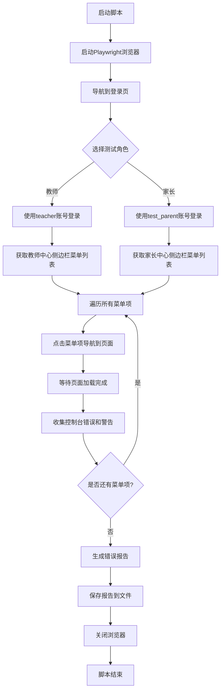

# 快捷登录账号错误检测与修复设计

## 需求概述

针对教师中心和家长中心的侧边栏页面，创建自动化检测脚本识别控制台错误，并进行页面级错误修复。约束条件：不允许修改中间件、公共函数、工具函数等共享代码，仅修复页面组件内部错误。

## 快捷登录账号信息

根据登录页面代码分析（`client/src/pages/Login/index.vue`），系统提供以下快捷登录账号：

| 角色 | 用户名 | 密码 | 跳转路径 |
|------|--------|------|----------|
| 教师 | teacher | 123456 | /teacher-center/dashboard |
| 家长 | test_parent | 123456 | /parent-center/dashboard |

## 错误检测结果

### 教师中心错误汇总

通过MCP Playwright浏览器自动化测试，检测到以下页面存在控制台错误：

#### 1. 教师工作台 (`/teacher-center/dashboard`)

**错误类型**：

- **404错误（4个API端点）**：
  - `GET /teacher-dashboard/statistics` - 仪表板统计数据
  - `GET /teacher-dashboard/today-tasks` - 今日任务
  - `GET /teacher-dashboard/today-courses` - 今日课程
  - `GET /teacher-dashboard/recent-notifications` - 最新通知

- **403错误（1个API端点）**：
  - `GET /api/system-configs` - 系统配置（Logo配置）

- **WARNING**：
  - `UnifiedIcon: 图标 'trophy' 修复后为 'trophy' 仍未找到，使用默认图标`

**影响文件**：
- `client/src/pages/teacher-center/dashboard/index.vue`
- `client/src/stores/logo.ts`

#### 2. 任务中心 (`/teacher-center/tasks`)

**错误类型**：

- **500错误（2个API端点）**：
  - `GET /api/teacher-dashboard/tasks` - 任务列表（失败并重试1次）
  - `GET /api/teacher-dashboard/tasks/stats` - 任务统计（失败并重试1次）

- **403错误（1个API端点）**：
  - `GET /api/system-configs` - Logo配置

- **WARNING**：
  - `Property "handleSearch" was accessed during render but is not defined on instance`
  - `UnifiedIcon: 图标 'trophy' 修复后为 'trophy' 仍未找到`

**影响文件**：
- `client/src/pages/teacher-center/tasks/index.vue`

#### 3. 活动中心 (`/teacher-center/activities`)

**错误类型**：

- **404错误（1个API端点）**：
  - `GET /teacher-dashboard/activity-statistics` - 活动统计

- **403错误（1个API端点）**：
  - `GET /api/system-configs` - Logo配置

- **WARNING（3个Vue警告）**：
  - `[Vue warn]: Missing required prop: "visible"` in ActivityDetail组件
  - `[Vue warn]: Missing required prop: "participants"` in ActivityDetail组件
  - `[Vue warn]: Missing required prop: "evaluations"` in ActivityDetail组件
  - `[Vue warn]: Missing required prop: "visible"` in ActivityForm组件

**影响文件**：
- `client/src/pages/teacher-center/activities/index.vue`
- 子组件：ActivityDetail、ActivityForm

#### 4. 招生中心 (`/teacher-center/enrollment`)

**错误类型**：

- **403错误（2个API端点）**：
  - `GET /api/teacher/customers/stats` - 客户跟踪统计
  - `GET /api/teacher/customers/list` - 客户列表
  - `GET /api/system-configs` - Logo配置

**影响文件**：
- `client/src/pages/teacher-center/enrollment/index.vue`
- `client/src/api/modules/teacher-customers.ts`

#### 5. 教学中心 (`/teacher-center/teaching`)

**影响文件**：
- `client/src/pages/teacher-center/teaching/index.vue`

#### 6. 客户跟踪 (`/teacher-center/customer-tracking`)

**影响文件**：
- `client/src/pages/teacher-center/customer-tracking/index.vue`

#### 7. AI互动课堂 (`/teacher-center/creative-curriculum`)

**错误类型**：

- **WARNING**：
  - `[Vue Router warn]: No match found for location with path "/teacher-center/creative-curriculum"`

**根本原因**：路由配置缺失，该页面路由未在路由系统中注册

**影响文件**：
- 路由配置文件

#### 8. 绩效中心 (`/teacher-center/performance-rewards`)

**错误类型**：

- **WARNING**：
  - `[Vue Router warn]: No match found for location with path "/teacher-center/performance-rewards"`

**根本原因**：路由配置缺失，该页面路由未在路由系统中注册

**影响文件**：
- 路由配置文件

### 家长中心错误检测

（待补充：需要使用test_parent账号登录后进行检测）

## 错误分类与修复策略

### 错误分类

根据错误类型和修复难度，将错误分为以下几类：

| 错误类别 | 错误类型 | 修复难度 | 修复范围 |
|----------|----------|----------|----------|
| A类 | Vue组件属性缺失警告 | 低 | 仅页面组件 |
| B类 | 未定义属性访问警告 | 低 | 仅页面组件 |
| C类 | 图标缺失警告 | 低 | 仅页面组件 |
| D类 | API端点404错误 | 中 | 需后端配合 |
| E类 | API端点403权限错误 | 中 | 需权限配置 |
| F类 | API端点500服务器错误 | 高 | 需后端修复 |
| G类 | 路由配置缺失 | 低 | 仅路由配置 |

### 修复策略

#### A类：Vue组件属性缺失警告

**问题页面**：活动中心

**修复方案**：
- 为ActivityDetail组件提供必需的props默认值
- 为ActivityForm组件提供必需的props默认值

**修复示例**：
```typescript
// 在组件初始化时提供默认值
const activityDetailProps = {
  visible: false,
  participants: [],
  evaluations: []
}
```

#### B类：未定义属性访问警告

**问题页面**：任务中心

**修复方案**：
- 在组件的setup函数中定义缺失的handleSearch方法
- 或从模板中移除未使用的handleSearch引用

#### C类：图标缺失警告

**问题页面**：所有教师中心页面

**修复方案**：
- 方案1：在UnifiedIcon组件中为'trophy'图标添加映射
- 方案2（推荐）：在页面组件中使用已注册的图标替代

**修复示例**：
```typescript
// 替换trophy图标为已注册的类似图标
const iconName = 'trophy' // 修改为 'award' 或其他已注册图标
```

#### D类：API端点404错误

**问题页面**：教师工作台、活动中心

**修复方案**：
- 前端方案：添加API调用的错误处理，失败时展示友好提示
- 后端方案（需协作）：实现缺失的API端点

**前端修复示例**：
```typescript
const loadDashboardData = async () => {
  try {
    const response = await teacherDashboardAPI.getStatistics()
    // 处理成功响应
  } catch (error) {
    // 优雅降级：使用默认数据或隐藏相关模块
    console.warn('统计数据加载失败，使用默认数据')
    dashboardData.value = getDefaultDashboardData()
  }
}
```

#### E类：API端点403权限错误

**问题页面**：所有教师中心页面（Logo配置）、招生中心

**修复方案**：
- 前端方案：添加权限判断，无权限时不调用API或使用默认配置
- 权限方案（需配置）：为teacher角色添加相应API权限

**前端修复示例**：
```typescript
// Logo加载时处理权限不足
const loadLogoConfig = async () => {
  try {
    const config = await systemConfigAPI.getLogo()
    return config
  } catch (error) {
    if (error.statusCode === 403) {
      // 使用默认Logo
      return getDefaultLogoConfig()
    }
    throw error
  }
}
```

#### F类：API端点500服务器错误

**问题页面**：任务中心

**修复方案**：
- 前端临时方案：增强错误处理，添加重试机制和友好提示
- 后端根本方案（需配合）：修复服务器端错误

**前端修复示例**：
```typescript
const loadTasksWithRetry = async (retryCount = 0, maxRetries = 2) => {
  try {
    return await teacherTasksAPI.getTasks()
  } catch (error) {
    if (error.statusCode === 500 && retryCount < maxRetries) {
      // 延迟重试
      await delay(1000 * (retryCount + 1))
      return loadTasksWithRetry(retryCount + 1, maxRetries)
    }
    // 最终失败，展示友好错误
    showErrorFallback('任务数据暂时无法加载，请稍后重试')
    return null
  }
}
```

#### G类：路由配置缺失

**问题页面**：AI互动课堂、绩效中心

**修复方案**：
- 在路由配置文件中添加缺失的路由定义
- 如果页面组件不存在，需创建占位页面

**修复位置**：
- 动态路由：`client/src/router/dynamic-routes.ts`
- 静态路由：`client/src/router/index.ts`
- 权限配置：`client/src/stores/permissions-simple.ts`

## 检测脚本设计

### 脚本功能

创建自动化检测脚本，用于批量检测教师中心和家长中心的所有侧边栏页面控制台错误。

### 脚本技术方案

使用Playwright无头浏览器进行自动化测试，符合项目测试规范。

### 脚本文件结构

```
scripts/
└── sidebar-error-detection.js         # 侧边栏错误检测主脚本
```

### 脚本核心流程



### 脚本输入配置

检测脚本需要以下配置参数：

| 参数名 | 类型 | 默认值 | 说明 |
|--------|------|--------|------|
| roles | Array | ['teacher', 'parent'] | 要测试的角色列表 |
| baseUrl | String | http://localhost:5173 | 前端应用地址 |
| headless | Boolean | true | 是否使用无头模式 |
| outputPath | String | ./error-reports/ | 错误报告输出目录 |
| waitTime | Number | 2000 | 页面加载等待时间（毫秒） |

### 脚本输出报告

检测脚本生成以下格式的错误报告：

#### 报告文件命名

```
error-reports/
├── teacher-center-errors-{timestamp}.json      # 教师中心错误报告
├── parent-center-errors-{timestamp}.json       # 家长中心错误报告
└── combined-errors-{timestamp}.json            # 合并错误报告
```

#### 报告数据结构

```json
{
  "role": "teacher",
  "testTime": "2024-12-27T00:55:37.000Z",
  "baseUrl": "http://localhost:5173",
  "totalPages": 9,
  "totalErrors": 24,
  "pages": [
    {
      "name": "教师工作台",
      "path": "/teacher-center/dashboard",
      "url": "http://localhost:5173/teacher-center/dashboard",
      "errors": [
        {
          "type": "network",
          "level": "error",
          "statusCode": 404,
          "method": "GET",
          "url": "/teacher-dashboard/statistics",
          "message": "请求的资源不存在",
          "timestamp": "2024-12-27T00:55:40.123Z"
        },
        {
          "type": "console",
          "level": "warning",
          "message": "UnifiedIcon: 图标 'trophy' 修复后为 'trophy' 仍未找到，使用默认图标",
          "source": "http://localhost:5173/src/components/UnifiedIcon.vue",
          "timestamp": "2024-12-27T00:55:40.456Z"
        }
      ],
      "errorCount": 5
    }
  ],
  "errorSummary": {
    "network404": 5,
    "network403": 3,
    "network500": 2,
    "consoleError": 0,
    "consoleWarning": 14
  }
}
```

### 脚本关键技术点

#### 1. 无头浏览器配置

严格遵循项目规范，使用无头模式：

```javascript
const browser = await chromium.launch({
  headless: true,
  devtools: false
});
```

#### 2. 错误监听机制

监听以下错误类型：

- 控制台错误：`page.on('console', msg => {...})`
- 网络错误：`page.on('response', response => {...})`
- 页面异常：`page.on('pageerror', error => {...})`

#### 3. 动态菜单识别

通过DOM查询获取侧边栏菜单项：

```javascript
const menuItems = await page.$$eval('nav a[href^="/teacher-center/"]', links => 
  links.map(link => ({
    name: link.textContent.trim(),
    href: link.getAttribute('href')
  }))
);
```

#### 4. 错误分类逻辑

根据错误来源和类型进行分类：

- 网络错误：根据HTTP状态码分类（404、403、500等）
- 控制台错误：区分error和warning级别
- Vue警告：识别Vue框架特定警告

## 修复实施计划

### 修复优先级

根据错误影响和修复难度，制定修复优先级：

| 优先级 | 错误类型 | 修复顺序 | 预计耗时 |
|--------|----------|----------|----------|
| P0 | 路由配置缺失 | 1 | 10分钟 |
| P1 | Vue组件属性缺失 | 2 | 15分钟 |
| P1 | 未定义属性访问 | 3 | 10分钟 |
| P2 | 图标缺失警告 | 4 | 20分钟 |
| P2 | API 403权限错误 | 5 | 30分钟 |
| P3 | API 404错误 | 6 | 40分钟 |
| P4 | API 500服务器错误 | 7 | 依赖后端 |

### 修复范围约束

严格遵守以下约束条件：

1. **禁止修改的文件类型**：
   - 中间件：`client/src/middleware/*`
   - 公共函数：`client/src/utils/*`（除非仅用于新增辅助函数）
   - 工具函数：`client/src/helpers/*`
   - API请求工具：`client/src/utils/request.ts`
   - 错误处理器：`client/src/utils/errorHandler.ts`

2. **允许修改的文件类型**：
   - 页面组件：`client/src/pages/**/*.vue`
   - 页面专属组件：`client/src/pages/**/components/*.vue`
   - 路由配置：`client/src/router/*`（仅新增路由）
   - Store状态：`client/src/stores/*`（仅修复Logo等状态问题）

3. **修复原则**：
   - 优先在页面组件内部处理错误
   - 使用try-catch包装API调用
   - 提供降级方案和默认数据
   - 添加友好的用户提示

### 修复文件清单

根据检测结果，以下文件需要修复：

#### 页面组件修复

| 文件路径 | 修复类型 | 错误数量 |
|----------|----------|----------|
| `client/src/pages/teacher-center/dashboard/index.vue` | API错误处理、图标替换 | 5 |
| `client/src/pages/teacher-center/tasks/index.vue` | API错误处理、属性定义、图标替换 | 3 |
| `client/src/pages/teacher-center/activities/index.vue` | 组件props、API错误处理、图标替换 | 4 |
| `client/src/pages/teacher-center/enrollment/index.vue` | API权限处理、图标替换 | 3 |
| `client/src/pages/teacher-center/teaching/index.vue` | 图标替换 | 1 |
| `client/src/pages/teacher-center/customer-tracking/index.vue` | 图标替换 | 1 |

#### 路由配置修复

| 文件路径 | 修复内容 |
|----------|----------|
| `client/src/router/dynamic-routes.ts` | 添加creative-curriculum和performance-rewards路由 |
| `client/src/stores/permissions-simple.ts` | 更新教师菜单权限配置 |

#### Store状态修复

| 文件路径 | 修复内容 |
|----------|----------|
| `client/src/stores/logo.ts` | 添加403错误处理，使用默认Logo配置 |

## 验证测试方案

### 测试流程

1. 运行检测脚本生成修复前错误报告
2. 执行修复操作
3. 再次运行检测脚本生成修复后错误报告
4. 对比修复前后错误数量变化
5. 手动验证关键页面功能正常

### 验证指标

| 指标类型 | 目标值 | 测量方法 |
|----------|--------|----------|
| 控制台ERROR清零 | 0个 | 自动化脚本统计 |
| 控制台WARNING减少 | 减少80%以上 | 自动化脚本统计 |
| 页面可正常访问 | 100% | 手动测试 |
| 无新增错误 | 0个 | 对比测试 |

### 回归测试

修复完成后需执行以下回归测试：

1. 教师中心完整流程测试
   - 登录 → 工作台 → 各功能页面浏览
2. 家长中心完整流程测试
   - 登录 → 工作台 → 各功能页面浏览
3. 路由导航测试
   - 侧边栏菜单点击跳转正常
   - 浏览器前进后退功能正常
4. 错误降级测试
   - API失败时展示友好提示
   - 无权限时使用默认配置

## 风险评估

### 技术风险

| 风险项 | 影响等级 | 应对措施 |
|--------|----------|----------|
| 修复引入新错误 | 中 | 严格进行回归测试，保留错误报告对比 |
| API依赖后端修复 | 高 | 前端实现降级方案，不依赖后端立即修复 |
| 路由配置冲突 | 低 | 仅新增路由，不修改现有路由 |

### 限制条件

1. **后端依赖**：部分404和500错误需要后端配合修复API
2. **权限配置**：403错误可能需要数据库权限配置调整
3. **修复范围**：严格遵守不修改公共代码的约束

## 交付物

1. **检测脚本**：`scripts/sidebar-error-detection.js`
2. **错误报告**：
   - 修复前报告：`error-reports/teacher-center-errors-before.json`
   - 修复后报告：`error-reports/teacher-center-errors-after.json`
3. **修复代码**：所有修改的页面组件和路由配置文件
4. **修复说明文档**：详细记录每个错误的修复方法
