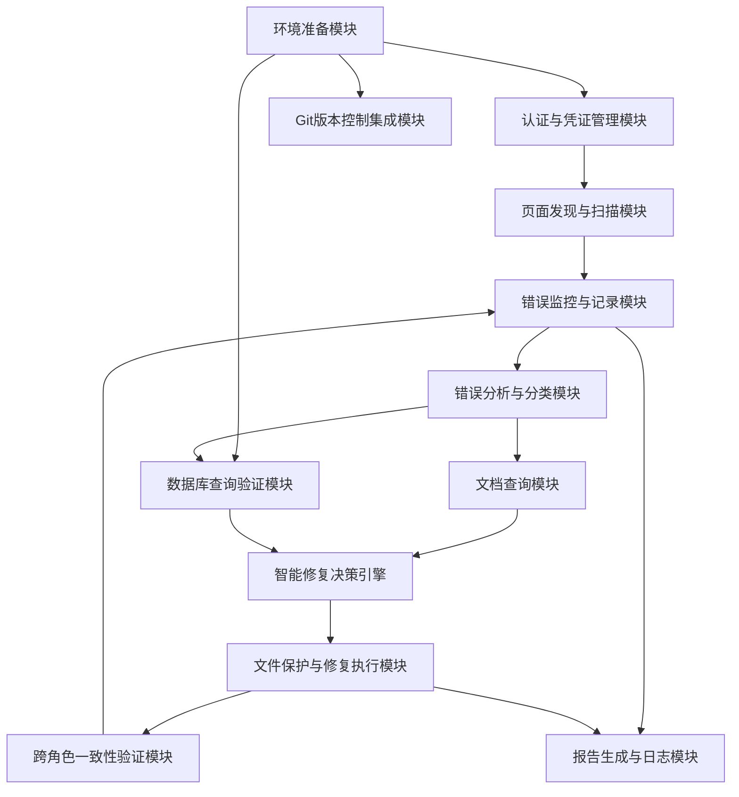
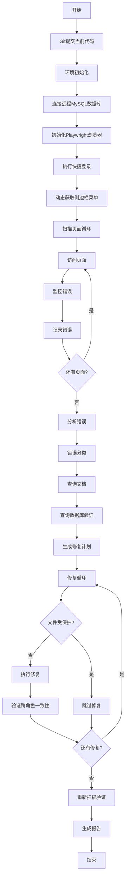

# 自动化测试与修复脚本设计文档

## 需求概述

开发一个智能化的自动化测试与修复脚本，用于检测和修复admin角色登录后所有侧边栏页面的控制台错误。脚本需要能够：

1. 自动从登录页快捷登录获取admin账号凭证
2. 动态获取所有侧边栏菜单页面并访问
3. 监控并记录控制台错误和网络请求错误
4. 根据错误类型（404、400、500）智能分析并修复
5. 连接远程MySQL数据库进行数据验证
6. 确保admin、教师中心、家长中心三个角色的功能一致性
7. 在修复前自动查询相关文档了解功能逻辑
8. 修复前自动执行git提交保护现有代码

## 系统架构设计

### 核心模块划分

系统采用模块化设计，分为以下核心模块：

#### 模块一：环境准备模块
- 职责：初始化脚本运行环境、连接数据库、配置浏览器
- 输出：就绪状态标识

#### 模块二：认证与凭证管理模块
- 职责：从登录页获取快捷登录凭证、执行登录、管理Token
- 输出：有效的登录Token和用户信息

#### 模块三：页面发现与扫描模块
- 职责：动态获取侧边栏菜单结构、生成待测试页面列表
- 输出：完整的页面URL列表及元信息

#### 模块四：错误监控与记录模块
- 职责：监听控制台错误、网络请求错误、页面加载异常
- 输出：结构化的错误数据集

#### 模块五：错误分析与分类模块
- 职责：解析错误信息、分类错误类型、识别错误根源
- 输出：带有修复建议的错误分析报告

#### 模块六：数据库查询验证模块
- 职责：连接远程MySQL数据库、验证数据完整性、查询缺失数据
- 输出：数据验证结果和缺失数据清单

#### 模块七：文档查询模块
- 职责：搜索项目文档、提取功能逻辑说明、生成修复上下文
- 输出：相关功能文档摘要

#### 模块八：智能修复决策引擎
- 职责：根据错误类型选择修复策略、验证修复可行性、生成修复方案
- 输出：可执行的修复计划

#### 模块九：文件保护与修复执行模块
- 职责：识别受保护文件、执行修复操作、验证修复结果
- 输出：修复操作执行日志

#### 模块十：跨角色一致性验证模块
- 职责：验证admin、教师中心、家长中心功能对齐、检查数据库表共享
- 输出：一致性验证报告

#### 模块十一：Git版本控制集成模块
- 职责：在修复前提交当前代码、记录修复版本、支持回滚
- 输出：Git提交记录

#### 模块十二：报告生成与日志模块
- 职责：生成详细的测试报告、记录完整操作日志、统计修复成效
- 输出：多格式报告文件

### 模块依赖关系

## 数据结构设计

### 错误记录数据结构

| 字段名称 | 数据类型 | 说明 | 示例 |
|---------|---------|------|------|
| errorId | 字符串 | 唯一错误标识 | err_20250101_001 |
| errorType | 枚举 | 错误类型（CONSOLE、NETWORK_404、NETWORK_400、NETWORK_500、PAGE_CRASH） | NETWORK_404 |
| pagePath | 字符串 | 出错页面路径 | /admin/student-management |
| pageTitle | 字符串 | 页面标题 | 学生管理 |
| timestamp | 时间戳 | 错误发生时间 | 2025-01-01T10:30:00Z |
| errorMessage | 字符串 | 错误消息 | Failed to load resource: 404 |
| stackTrace | 字符串 | 错误堆栈（如有） | at StudentList.vue:123 |
| requestUrl | 字符串 | 请求URL（网络错误） | /api/students/list |
| requestMethod | 字符串 | 请求方法 | GET |
| responseStatus | 数字 | 响应状态码 | 404 |
| responseBody | 字符串 | 响应内容 | {"error": "Not Found"} |
| severity | 枚举 | 严重程度（CRITICAL、HIGH、MEDIUM、LOW） | HIGH |
| isFixed | 布尔值 | 是否已修复 | false |
| fixStrategy | 字符串 | 修复策略 | ADD_ROUTE_REGISTRATION |

### 页面扫描结果数据结构

| 字段名称 | 数据类型 | 说明 | 示例 |
|---------|---------|------|------|
| scanId | 字符串 | 扫描会话ID | scan_20250101_admin |
| pageUrl | 字符串 | 页面完整URL | http://localhost:5173/admin/dashboard |
| pagePath | 字符串 | 页面路径 | /admin/dashboard |
| pageTitle | 字符串 | 页面标题 | 仪表板 |
| menuCategory | 字符串 | 菜单分类 | 系统管理 |
| accessTime | 时间戳 | 访问时间 | 2025-01-01T10:30:00Z |
| loadDuration | 数字 | 加载耗时（毫秒） | 1250 |
| hasConsoleErrors | 布尔值 | 是否存在控制台错误 | true |
| consoleErrorCount | 数字 | 控制台错误数量 | 3 |
| hasNetworkErrors | 布尔值 | 是否存在网络错误 | true |
| networkErrorCount | 数字 | 网络错误数量 | 2 |
| screenshotPath | 字符串 | 页面截图路径 | screenshots/admin-dashboard.png |
| errors | 数组 | 错误记录列表 | [ErrorRecord, ...] |

### 修复计划数据结构

| 字段名称 | 数据类型 | 说明 | 示例 |
|---------|---------|------|------|
| planId | 字符串 | 修复计划ID | fix_plan_001 |
| errorId | 字符串 | 关联的错误ID | err_20250101_001 |
| fixType | 枚举 | 修复类型（ROUTE_FIX、API_FIX、DATA_FIX、COMPONENT_FIX） | ROUTE_FIX |
| targetFiles | 数组 | 需要修改的文件列表 | ["/client/src/router/optimized-routes.ts"] |
| isFileProtected | 布尔值 | 文件是否受保护 | false |
| fixDescription | 字符串 | 修复描述 | 添加学生管理页面的路由注册 |
| fixSteps | 数组 | 修复步骤列表 | ["步骤1", "步骤2"] |
| estimatedDifficulty | 枚举 | 修复难度（EASY、MEDIUM、HARD） | MEDIUM |
| requiresDatabaseChange | 布尔值 | 是否需要数据库变更 | false |
| requiresCrossRoleSync | 布尔值 | 是否需要跨角色同步 | true |
| relatedDocuments | 数组 | 相关文档路径 | ["/docs/student-management.md"] |

### 数据库验证结果数据结构

| 字段名称 | 数据类型 | 说明 | 示例 |
|---------|---------|------|------|
| validationId | 字符串 | 验证ID | db_val_001 |
| errorId | 字符串 | 关联的错误ID | err_20250101_001 |
| tableName | 字符串 | 数据库表名 | students |
| queryExecuted | 字符串 | 执行的SQL查询 | SELECT COUNT(*) FROM students |
| queryResult | 对象 | 查询结果 | {"count": 0} |
| dataExists | 布尔值 | 数据是否存在 | false |
| missingDataDescription | 字符串 | 缺失数据描述 | 学生表为空 |
| suggestedSeedScript | 字符串 | 建议的种子脚本 | npm run seed-data:students |

### 跨角色一致性验证数据结构

| 字段名称 | 数据类型 | 说明 | 示例 |
|---------|---------|------|------|
| validationId | 字符串 | 验证ID | cross_role_val_001 |
| featureName | 字符串 | 功能名称 | 学生管理 |
| adminTableUsed | 字符串 | Admin使用的表 | students |
| teacherTableUsed | 字符串 | 教师中心使用的表 | students |
| parentTableUsed | 字符串 | 家长中心使用的表 | students |
| isConsistent | 布尔值 | 是否一致 | true |
| inconsistencyDetails | 字符串 | 不一致详情 | 无 |
| recommendedAction | 字符串 | 建议操作 | 无需操作 |

## 工作流设计

### 整体工作流程

### 阶段一：准备阶段

#### 步骤1.1：Git版本控制
- 检查当前工作目录是否有未提交的修改
- 如果存在修改，执行git add和git commit操作
- 提交信息格式：自动化修复前备份 - 时间戳
- 记录当前commit哈希值用于可能的回滚

#### 步骤1.2：环境初始化
- 加载环境变量配置文件（.env）
- 读取数据库连接参数（主机、端口、用户名、密码、数据库名）
- 验证必要的目录结构存在（日志目录、截图目录、报告目录）
- 初始化日志系统（文件日志和控制台日志）

#### 步骤1.3：数据库连接
- 使用MySQL客户端库连接远程数据库
- 连接参数从.env文件获取（dbconn.sealoshzh.site:43906）
- 执行连接测试查询验证连接有效性
- 建立连接池用于后续查询操作

#### 步骤1.4：浏览器初始化
- 启动Playwright Chromium浏览器（必须使用无头模式：headless=true）
- 配置浏览器上下文（视口大小、用户代理等）
- 创建新页面实例
- 注册全局错误监听器（console、pageerror、requestfailed）

### 阶段二：扫描阶段

#### 步骤2.1：获取登录凭证
- 访问登录页面（http://localhost:5173/login）
- 等待页面加载完成
- 定位快捷登录区域
- 识别admin快捷登录按钮（选择器：.admin-btn 或包含"系统管理员"文本的按钮）
- 从登录逻辑中提取凭证信息（用户名：admin，密码：123456）

#### 步骤2.2：执行登录
- 点击admin快捷登录按钮
- 等待登录完成（监控网络请求完成和页面跳转）
- 验证登录成功（检查localStorage中的token和用户信息）
- 记录登录时间和用户角色信息

#### 步骤2.3：动态获取侧边栏菜单
- 等待侧边栏渲染完成
- 通过DOM查询获取所有一级菜单项
- 展开所有可折叠的菜单项
- 遍历并提取所有二级、三级菜单项
- 提取每个菜单项的文本、路由路径、图标等信息
- 构建完整的页面URL列表（基础URL + 路由路径）
- 过滤掉外部链接和特殊路由（如登录、登出）

#### 步骤2.4：逐页扫描循环
对每个页面URL执行以下操作：

**2.4.1 访问页面**
- 导航到目标页面URL
- 等待页面加载完成（networkidle状态）
- 等待额外的稳定时间（2-3秒，确保动态内容加载）
- 记录页面标题和当前URL

**2.4.2 监控错误**
启动三类错误监听器：

控制台错误监听器：
- 监听console.error和console.warn事件
- 捕获JavaScript运行时错误
- 记录错误消息、堆栈跟踪、源文件位置

网络错误监听器：
- 监听requestfailed和response事件
- 捕获HTTP状态码为404、400、500的请求
- 记录请求URL、方法、响应状态、响应体

页面崩溃监听器：
- 监听pageerror事件
- 捕获未处理的异常导致的页面崩溃

**2.4.3 截图保存**
- 对每个页面进行全屏截图
- 截图保存到指定目录（screenshots/页面路径.png）
- 记录截图文件路径到扫描结果

**2.4.4 记录扫描结果**
- 将页面扫描结果和所有错误记录保存到数据结构
- 统计该页面的错误数量和类型
- 更新整体扫描进度

### 阶段三：分析阶段

#### 步骤3.1：错误分类
遍历所有错误记录，根据以下规则分类：

**404路由错误**
- 特征：HTTP状态码404，请求的是页面路径或静态资源
- 可能原因：路由未注册、组件文件不存在、路径拼写错误
- 优先级：高

**400业务错误**
- 特征：HTTP状态码400，请求的是API端点
- 可能原因：请求参数错误、数据验证失败、业务逻辑约束
- 优先级：中

**500服务器错误**
- 特征：HTTP状态码500，请求的是API端点
- 可能原因：后端代码异常、数据库查询失败、缺失数据
- 优先级：高

**控制台JavaScript错误**
- 特征：console.error或运行时异常
- 可能原因：未定义变量、空指针访问、类型错误、API响应数据结构不匹配
- 优先级：根据错误内容判断

#### 步骤3.2：查询相关文档
对每个错误执行以下文档查询：

**3.2.1 文档搜索策略**
- 从错误信息中提取关键词（如页面名称、功能模块）
- 在项目文档目录中搜索相关文档文件
- 优先搜索.md格式的文档文件
- 搜索范围包括：docs目录、根目录下的说明文档、注释丰富的源代码文件

**3.2.2 文档内容提取**
- 读取匹配的文档文件内容
- 提取与当前错误相关的章节
- 识别功能描述、数据流程、API端点、数据库表等关键信息
- 构建修复上下文摘要

**3.2.3 文档匹配示例**
- 如果错误页面是学生管理，搜索包含"学生"、"student"关键词的文档
- 如果是API错误，搜索对应的API端点文档或Swagger定义
- 如果是数据库相关，搜索数据模型文档或迁移文件

#### 步骤3.3：数据库验证查询
对400和500错误执行数据库验证：

**3.3.1 提取数据库相关信息**
- 从API请求URL推断涉及的数据库表
- 从响应错误消息中提取表名、字段名、主键值
- 映射API端点到数据模型（如/api/students -> students表）

**3.3.2 执行验证查询**
常见验证查询类型：

数据存在性验证：
- 查询目标表是否有数据记录
- 示例：SELECT COUNT(*) FROM students

关联数据验证：
- 查询外键关联数据是否存在
- 示例：SELECT COUNT(*) FROM classes WHERE id = 某个class_id

数据完整性验证：
- 检查必填字段是否有空值
- 示例：SELECT COUNT(*) FROM students WHERE name IS NULL OR name = ''

**3.3.3 记录验证结果**
- 记录查询语句和查询结果
- 判断数据是否存在、是否完整
- 生成缺失数据描述
- 如果数据缺失，识别对应的种子数据脚本（如npm run seed-data:students）

#### 步骤3.4：生成修复计划
根据错误分类和分析结果，为每个错误生成修复计划：

**修复计划生成规则**

404路由错误修复计划：
- 修复类型：ROUTE_FIX
- 目标文件：/client/src/router/optimized-routes.ts 或 动态路由配置文件
- 修复步骤：
  1. 检查路由配置文件中是否存在该路径的路由定义
  2. 如果不存在，添加路由定义（路径、组件映射、权限配置）
  3. 检查组件文件是否存在于/client/src/pages目录
  4. 如果组件不存在，需要先开发组件
  5. 验证路由注册后页面可访问

400业务错误修复计划：
- 修复类型：API_FIX
- 目标文件：API控制器文件、服务层文件、数据验证文件
- 修复步骤：
  1. 定位对应的API控制器（如/server/src/controllers/student.controller.ts）
  2. 检查请求参数验证逻辑是否正确
  3. 检查业务逻辑是否符合预期
  4. 如果是数据验证问题，调整验证规则
  5. 如果是业务逻辑问题，修复逻辑错误

500服务器错误修复计划：
- 修复类型：API_FIX 或 DATA_FIX
- 目标文件：API控制器、服务层、数据模型
- 修复步骤：
  1. 根据数据库验证结果判断是否为数据缺失
  2. 如果数据缺失，运行对应的种子数据脚本
  3. 如果是代码异常，定位控制器或服务层的错误代码
  4. 检查数据库查询语句是否正确
  5. 检查空值处理和异常捕获是否完善

控制台JavaScript错误修复计划：
- 修复类型：COMPONENT_FIX
- 目标文件：前端组件文件
- 修复步骤：
  1. 定位错误所在的组件文件
  2. 检查变量声明和初始化
  3. 添加空值检查和默认值处理
  4. 验证API响应数据结构与前端代码匹配
  5. 添加错误边界和降级处理

### 阶段四：修复阶段

#### 步骤4.1：文件保护检查
在执行任何修复前，验证目标文件是否受保护：

**受保护文件类型**
- 中间件文件（/server/src/middlewares/）
- 公共工具文件（/server/src/utils/、/client/src/utils/）
- 一对多共享文件（被多个模块引用的基础服务类）

**检查方法**
- 分析目标文件的导入和引用关系
- 统计该文件被其他文件引用的次数
- 如果引用次数超过阈值（如5次），标记为受保护
- 如果文件路径匹配受保护目录，标记为受保护

**处理策略**
- 如果文件受保护，跳过该修复，记录到日志，标记为需要人工处理
- 如果文件不受保护，继续执行修复

#### 步骤4.2：执行修复操作
根据修复计划类型执行对应的修复操作：

**路由修复（ROUTE_FIX）**
- 打开路由配置文件
- 在合适的位置添加路由定义
- 路由定义包含：路径、组件引入、名称、元信息（权限、标题）
- 如果使用懒加载，使用动态导入语法
- 保存文件

**API修复（API_FIX）**
- 打开对应的控制器或服务文件
- 根据错误信息定位问题代码段
- 修改参数验证逻辑、业务逻辑或错误处理
- 确保修改不破坏现有的其他API端点
- 保存文件

**数据修复（DATA_FIX）**
- 识别需要运行的种子数据脚本
- 执行npm run命令运行种子脚本
- 等待脚本执行完成
- 验证数据已成功插入数据库

**组件修复（COMPONENT_FIX）**
- 打开前端组件文件
- 定位错误代码行
- 添加空值检查、默认值、可选链操作符
- 修复变量声明和类型问题
- 保存文件

#### 步骤4.3：跨角色一致性验证
对于涉及功能性的修复，执行跨角色一致性验证：

**4.3.1 识别功能关联性**
- 判断当前修复的功能是否与教师中心或家长中心相关
- 关联标准：涉及学生、班级、教师、活动、考勤等共享数据的功能

**4.3.2 检查三个角色的实现**
- Admin角色：检查/client/src/pages/admin/目录或系统管理相关页面
- 教师中心：检查/client/src/pages/teacher-center/目录
- 家长中心：检查/client/src/pages/parent-center/目录

**4.3.3 数据库表一致性验证**
- 提取三个角色对应页面使用的API端点
- 通过API端点追溯到服务层和数据模型
- 验证三个角色是否使用相同的数据库表
- 示例：学生列表功能，admin、teacher、parent都应该查询students表

**4.3.4 一致性修复**
- 如果发现不一致，生成同步修复任务
- 在对应的角色目录中执行类似的修复操作
- 确保三个角色的功能行为一致

#### 步骤4.4：修复后验证
每次修复后执行快速验证：

**4.4.1 代码语法验证**
- 如果修改了TypeScript文件，运行类型检查
- 如果修改了Vue组件，验证模板语法

**4.4.2 重新访问页面**
- 使用浏览器重新访问修复的页面
- 监控是否还有相同的错误
- 记录验证结果

**4.4.3 相关页面回归测试**
- 如果修改了共享的API或数据模型，测试其他使用该API的页面
- 确保修复没有引入新的错误

### 阶段五：验证与报告阶段

#### 步骤5.1：重新扫描验证
修复完成后，重新执行完整的页面扫描：

- 使用相同的扫描流程访问所有页面
- 监控和记录错误
- 对比修复前后的错误数量和类型
- 识别哪些错误已解决、哪些错误仍然存在、是否有新的错误

#### 步骤5.2：生成修复报告
生成包含以下内容的详细报告：

**报告结构**

执行摘要：
- 扫描时间和持续时长
- 扫描的页面总数
- 发现的错误总数（按类型分类）
- 修复的错误数量
- 跳过的错误数量（受保护文件）
- 修复成功率

错误详情列表：
- 每个错误的详细信息（错误类型、页面、消息、修复状态）
- 修复操作描述
- 修复前后对比

受保护文件列表：
- 哪些错误因文件保护而跳过
- 建议的人工处理方案

跨角色一致性验证结果：
- 验证的功能列表
- 一致性状态
- 发现的不一致项

数据库验证结果：
- 执行的查询列表
- 数据完整性状态
- 运行的种子脚本

文档查询摘要：
- 查询到的相关文档
- 文档对修复的帮助程度

Git提交信息：
- 修复前的备份提交哈希
- 当前状态
- 回滚命令（如需要）

**报告格式**
- Markdown格式报告（report.md）
- JSON格式数据（report.json）
- HTML格式可视化报告（report.html）

#### 步骤5.3：日志归档
- 将所有日志文件归档到指定目录（logs/扫描时间戳/）
- 包含：执行日志、错误日志、修复日志、截图文件
- 保留最近N次扫描的历史记录

## 错误检测与分类策略

### 控制台错误检测

**监听事件类型**
- console.error：捕获显式错误输出
- console.warn：捕获警告信息（可配置是否包含）
- pageerror：捕获未处理的JavaScript异常

**错误信息提取**
从控制台消息中提取：
- 错误消息文本
- 错误堆栈跟踪
- 源文件路径和行号
- 错误发生的上下文（如组件名称）

**严重程度判断**
- CRITICAL：导致页面崩溃或核心功能不可用
- HIGH：影响主要功能，但页面可继续运行
- MEDIUM：影响次要功能或用户体验
- LOW：不影响功能的警告或提示

### 网络错误检测

**监听事件类型**
- request：监控所有网络请求
- response：检查响应状态码
- requestfailed：捕获请求失败事件

**错误分类规则**

404错误：
- HTTP状态码为404
- 请求的资源不存在
- 可能是路由未注册、API端点不存在、静态资源缺失

400错误：
- HTTP状态码为400
- 请求参数错误或业务逻辑验证失败
- 需要检查请求参数和后端验证逻辑

500错误：
- HTTP状态码为500、501、502、503
- 服务器内部错误
- 需要检查后端代码异常和数据库问题

**请求信息记录**
- 完整的请求URL
- 请求方法（GET、POST、PUT、DELETE）
- 请求头信息
- 请求体内容
- 响应状态码
- 响应头信息
- 响应体内容（前1000字符）

### 页面加载异常检测

**超时检测**
- 页面加载超过配置的超时时间（默认30秒）
- 标记为加载超时错误

**白屏检测**
- 页面加载后检查DOM结构
- 如果主内容区域为空或只有Loading占位符
- 标记为渲染失败错误

**资源加载失败检测**
- 监控图片、样式表、脚本文件的加载状态
- 记录加载失败的资源URL

## 智能修复策略

### 404路由错误修复策略

**策略一：添加路由注册**
- 适用场景：路由配置文件中缺少该路径的路由定义
- 修复方法：在optimized-routes.ts中添加路由配置
- 路由配置模板：
  - path：从错误URL提取路径
  - component：根据路径推断组件位置（如/admin/students -> pages/admin/StudentManagement.vue）
  - name：根据路径生成路由名称（如admin-students）
  - meta：配置权限标识、页面标题、图标

**策略二：修复路径拼写错误**
- 适用场景：URL路径与组件文件路径不匹配
- 检测方法：检查组件文件是否存在于预期位置
- 修复方法：修正路由配置中的路径或组件路径

**策略三：组件文件缺失处理**
- 适用场景：路由已注册但组件文件不存在
- 检测方法：根据路由配置查找组件文件
- 处理方式：标记为需要开发新组件，跳过自动修复

### 400业务错误修复策略

**策略一：调整请求参数验证**
- 适用场景：后端参数验证规则过于严格或不正确
- 定位方法：查找对应的控制器验证中间件或验证装饰器
- 修复方法：
  - 检查必填字段验证是否合理
  - 检查数据类型验证是否正确
  - 检查业务规则验证是否符合实际需求
  - 调整验证规则或添加可选字段

**策略二：修复前端请求参数**
- 适用场景：前端传递的参数不符合后端要求
- 定位方法：对比前端请求体和后端接口文档
- 修复方法：
  - 检查参数名称是否正确
  - 检查参数数据类型是否匹配
  - 添加缺失的必填参数
  - 移除不需要的参数

**策略三：业务逻辑调整**
- 适用场景：业务规则验证失败
- 定位方法：查看响应错误消息中的业务规则描述
- 修复方法：
  - 根据实际业务需求调整业务逻辑
  - 修改服务层的业务验证代码
  - 确保逻辑一致性

### 500服务器错误修复策略

**策略一：数据缺失修复**
- 适用场景：数据库验证发现表为空或缺少关键数据
- 修复方法：
  - 识别对应的种子数据脚本（从scripts目录或package.json）
  - 执行种子脚本填充数据
  - 验证数据插入成功
- 常见种子脚本：
  - npm run seed-data:students
  - npm run seed-data:classes
  - npm run seed-data:teachers
  - npm run seed-data:complete（完整数据初始化）

**策略二：数据库查询错误修复**
- 适用场景：SQL查询语句错误或表结构不匹配
- 定位方法：查看后端日志中的SQL错误信息
- 修复方法：
  - 检查Sequelize模型定义是否正确
  - 检查查询语句中的字段名是否存在
  - 检查表关联关系是否正确配置
  - 修正查询逻辑

**策略三：异常处理增强**
- 适用场景：代码抛出未捕获的异常
- 定位方法：根据堆栈跟踪定位异常代码
- 修复方法：
  - 添加try-catch错误捕获
  - 添加空值检查和默认值
  - 完善异常信息返回
  - 添加日志记录

### 控制台JavaScript错误修复策略

**策略一：空值处理**
- 适用场景：访问未定义变量或空对象属性
- 常见错误：Cannot read property 'xxx' of undefined/null
- 修复方法：
  - 使用可选链操作符（obj?.prop）
  - 添加条件判断（if (obj) { ... }）
  - 提供默认值（obj ?? defaultValue）
  - 在组件初始化时设置默认数据结构

**策略二：API响应数据结构适配**
- 适用场景：前端代码期望的数据结构与API返回不一致
- 修复方法：
  - 对比API文档和前端代码
  - 调整前端数据处理逻辑
  - 添加数据转换层
  - 使用TypeScript接口确保类型安全

**策略三：组件生命周期问题**
- 适用场景：在组件未挂载或已销毁时访问DOM或执行异步操作
- 修复方法：
  - 使用Vue生命周期钩子正确时机执行代码
  - 添加组件存在性检查
  - 在组件销毁时取消未完成的异步请求

**策略四：依赖导入问题**
- 适用场景：模块导入路径错误或模块不存在
- 修复方法：
  - 检查import路径是否正确
  - 检查模块文件是否存在
  - 检查是否安装了必要的npm包
  - 修正导入路径或安装缺失依赖

## 约束条件与保护机制

### 文件修改约束

**禁止修改的文件类型**

中间件文件：
- 路径特征：/server/src/middlewares/
- 原因：中间件被多个路由和控制器共享，修改可能影响全局功能
- 示例：auth.middleware.ts、validation.middleware.ts、error-handler.middleware.ts

公共工具文件：
- 路径特征：/server/src/utils/、/client/src/utils/
- 原因：工具函数被多处引用，修改可能导致连锁错误
- 示例：request.ts、logger.ts、date-formatter.ts、validation-helper.ts

一对多共享文件：
- 识别标准：被5个以上文件引用的模块
- 检测方法：静态代码分析，统计import语句
- 示例：基础服务类、全局状态管理、API客户端封装

数据库迁移文件：
- 路径特征：/server/src/migrations/
- 原因：迁移文件是历史记录，不应修改已执行的迁移

配置文件：
- 文件示例：.env、package.json、vite.config.ts、sequelize.config.js
- 原因：配置文件影响整个项目运行环境

### 保护机制实现

**文件引用分析**
- 使用静态代码分析工具扫描项目
- 构建文件依赖图
- 统计每个文件被引用的次数
- 将高引用次数文件标记为受保护

**路径匹配检查**
- 维护受保护路径规则列表
- 对目标文件路径进行模式匹配
- 如果匹配受保护路径，拒绝修改

**人工审核标记**
- 对于受保护的文件，生成人工审核任务
- 在报告中详细说明为什么跳过修复
- 提供建议的人工处理方案
- 建议创建新的适配器或包装器代替直接修改

### 修复范围限定

**允许修改的文件**

具体页面组件：
- 路径：/client/src/pages/具体页面.vue
- 原因：页面组件通常独立，修改影响范围可控

API控制器：
- 路径：/server/src/controllers/具体控制器.ts
- 条件：单一职责，只服务于特定API端点
- 修复限制：只修改特定端点的逻辑，不修改共享方法

服务层：
- 路径：/server/src/services/具体服务.ts
- 条件：服务方法职责明确
- 修复限制：只修改特定方法，不影响其他方法

路由配置：
- 路径：/client/src/router/optimized-routes.ts
- 修复操作：仅添加新路由，不修改现有路由

数据库种子脚本：
- 路径：/server/scripts/seed-data/
- 修复操作：运行种子脚本，不修改脚本内容

## 跨角色同步验证机制

### 角色功能映射

**三个角色目录结构**
- Admin（系统管理员）：/client/src/pages/admin/、/client/src/pages/dashboard/、/client/src/pages/system/
- 教师中心：/client/src/pages/teacher-center/
- 家长中心：/client/src/pages/parent-center/

**共享功能识别标准**

学生管理功能：
- Admin：学生列表、学生详情、学生编辑、学生删除
- 教师中心：班级学生列表、学生考勤、学生评价
- 家长中心：我的孩子、孩子成长记录
- 共享表：students表

班级管理功能：
- Admin：班级列表、班级配置、班级分配
- 教师中心：我的班级、班级学生
- 家长中心：孩子班级信息
- 共享表：classes表

活动管理功能：
- Admin：活动创建、活动审核、活动统计
- 教师中心：活动发布、活动报名管理
- 家长中心：活动浏览、活动报名
- 共享表：activities、activity_registrations表

考勤管理功能：
- Admin：考勤统计、考勤报表
- 教师中心：每日考勤录入、考勤查询
- 家长中心：孩子考勤记录查看
- 共享表：attendance_records表

### 一致性验证流程

**步骤1：识别功能领域**
- 根据修复的页面或API，识别功能所属领域
- 判断该功能是否涉及多角色
- 提取功能关键实体（如学生、班级、活动）

**步骤2：查找对应页面**
- 在admin目录查找对应功能页面
- 在teacher-center目录查找对应功能页面
- 在parent-center目录查找对应功能页面
- 记录每个角色的页面路径

**步骤3：提取API端点**
- 分析每个页面的源代码
- 提取页面中调用的API端点
- 记录请求方法和路径（如GET /api/students/list）

**步骤4：追溯数据模型**
- 根据API端点查找对应的控制器
- 从控制器追溯到服务层
- 从服务层追溯到数据模型
- 记录每个角色使用的数据库表名

**步骤5：对比一致性**
- 对比三个角色使用的数据库表是否相同
- 对比API端点的业务逻辑是否一致
- 对比数据权限范围（如教师只能看自己班级，家长只能看自己孩子）

**步骤6：生成一致性报告**
数据表一致性：
- 相同表：标记为一致
- 不同表但数据相关：标记为需要同步
- 完全不同表：标记为独立功能，无需验证

功能行为一致性：
- 相同的CRUD操作：标记为一致
- 权限范围不同但逻辑一致：标记为正常差异
- 功能缺失或逻辑不一致：标记为需要修复

### 同步修复策略

**策略一：跨角色同步修复**
- 适用场景：在一个角色中修复了功能，其他角色也需要相同修复
- 修复方法：
  - 在对应角色的目录中找到类似页面
  - 应用相同的修复逻辑
  - 调整权限验证逻辑以匹配角色
  - 验证修复后三个角色功能一致

**策略二：数据模型统一**
- 适用场景：发现不同角色使用了不同的表存储相同数据
- 修复方法：
  - 识别正确的标准表
  - 将其他角色的实现迁移到标准表
  - 更新API端点和服务层代码
  - 执行数据迁移（如果需要）

**策略三：差异化功能标记**
- 适用场景：功能在不同角色中的表现应该不同
- 处理方法：
  - 标记为角色特定功能
  - 不执行同步验证
  - 在报告中说明差异原因

## 数据库交互设计

### 数据库连接配置

**连接参数**
- 主机：dbconn.sealoshzh.site
- 端口：43906
- 用户：root
- 密码：pwk5ls7j
- 数据库：kargerdensales
- 来源：从/server/.env文件读取

**连接选项**
- 连接池最大连接数：25
- 连接池最小连接数：8
- 连接获取超时：8000ms
- 连接空闲超时：2000ms
- 字符集：utf8mb4
- 时区：+08:00（中国标准时间）

### 数据验证查询模板

**学生数据验证**
检查学生表是否有数据：
- SELECT COUNT(*) as count FROM students
- 期望结果：count > 0
- 如果count = 0，执行：npm run seed-data:students

检查特定学生是否存在：
- SELECT * FROM students WHERE id = ?
- 期望结果：返回一条记录
- 如果无结果，说明学生ID无效

**班级数据验证**
检查班级表是否有数据：
- SELECT COUNT(*) as count FROM classes
- 期望结果：count > 0
- 如果count = 0，执行：npm run seed-data:classes

检查班级学生关联：
- SELECT COUNT(*) as count FROM class_students WHERE class_id = ? AND student_id = ?
- 期望结果：count = 1
- 如果count = 0，说明学生未分配到班级

**教师数据验证**
检查教师表是否有数据：
- SELECT COUNT(*) as count FROM teachers
- 期望结果：count > 0
- 如果count = 0，执行：npm run seed-data:teachers

检查教师班级关联：
- SELECT * FROM classes WHERE teacher_id = ?
- 期望结果：返回教师负责的班级列表

**活动数据验证**
检查活动表是否有数据：
- SELECT COUNT(*) as count FROM activities WHERE status != 'deleted'
- 期望结果：count > 0
- 如果count = 0，执行：npm run seed-data:activities

检查活动报名数据：
- SELECT COUNT(*) as count FROM activity_registrations WHERE activity_id = ?
- 期望结果：count >= 0

**用户权限验证**
检查用户角色权限：
- SELECT r.name as role_name, COUNT(p.id) as permission_count FROM users u JOIN roles r ON u.role_id = r.id LEFT JOIN role_permissions rp ON r.id = rp.role_id LEFT JOIN permissions p ON rp.permission_id = p.id WHERE u.id = ? GROUP BY r.id
- 期望结果：permission_count > 0

### 种子数据脚本映射

**完整数据初始化**
- 命令：npm run seed-data:complete
- 用途：初始化所有基础数据和测试数据
- 执行场景：数据库完全为空或需要重置

**分类种子脚本**
- 学生数据：npm run seed-data:students
- 班级数据：npm run seed-data:classes
- 教师数据：npm run seed-data:teachers
- 活动数据：npm run seed-data:activities
- 用户权限：npm run seed-data:permissions

**脚本执行验证**
- 执行前记录表的记录数
- 执行种子脚本
- 执行后再次查询记录数
- 验证记录数增加

## 文档查询机制

### 文档搜索范围

**项目文档目录**
- 主文档目录：/docs/
- 根目录文档：项目根目录下的.md文件
- 功能模块文档：各子目录中的README.md和说明文档

**文档类型优先级**
1. 功能设计文档（如"招生管理设计文档.md"）
2. API接口文档（如Swagger文档、API端点说明）
3. 数据库模型文档（如数据表设计、迁移文件注释）
4. 开发指南文档（如AGENTS.md、开发规范.md）
5. 测试报告文档（作为功能行为参考）

### 搜索策略

**关键词提取**
从错误信息中提取关键词：
- 页面路径：如/admin/student-management -> "学生管理"、"student"
- API端点：如/api/activities/list -> "活动"、"activity"
- 错误消息：如"Class not found" -> "班级"、"class"

**文件名匹配**
- 精确匹配：文件名包含关键词
- 模糊匹配：文件名包含关键词的拼音或英文翻译
- 示例：搜索"学生"可以匹配"学生管理.md"、"student-management.md"

**内容搜索**
- 全文搜索：在文档内容中搜索关键词
- 章节提取：提取包含关键词的章节内容
- 上下文提取：提取关键词前后N行内容（默认5行）

### 文档内容提取

**结构化信息提取**

功能描述提取：
- 查找"功能概述"、"功能说明"、"需求描述"等章节
- 提取功能的主要目的和业务流程

API端点提取：
- 查找API路径定义（如GET /api/xxx）
- 提取请求参数、响应格式、错误码说明

数据表结构提取：
- 查找数据库表名和字段定义
- 提取表关联关系
- 提取约束条件（主键、外键、唯一索引）

技术实现提取：
- 查找关键技术栈说明
- 提取依赖的第三方库
- 提取特殊处理逻辑说明

**文档相关性评分**
- 关键词匹配度：关键词出现次数越多，相关性越高
- 章节标题匹配：标题包含关键词的相关性更高
- 文档类型权重：设计文档权重高于测试报告
- 更新时间：最近修改的文档相关性更高

### 修复上下文构建

**上下文摘要生成**
包含以下信息：
- 功能名称和业务目标
- 涉及的数据库表和字段
- 相关的API端点和数据流
- 已知的技术约束和注意事项
- 参考文档路径列表

**上下文应用到修复决策**
- 修复策略选择时参考业务逻辑
- 数据验证时参考数据表结构
- 跨角色同步时参考功能范围
- 生成修复说明时引用文档来源

## 报告与日志设计

### 测试报告结构

**报告元信息**
- 报告生成时间
- 脚本版本号
- 执行环境信息（Node版本、操作系统、数据库版本）
- 扫描范围（角色、页面数量）

**执行摘要**
- 总体执行时间
- 扫描页面总数
- 发现错误总数（按类型统计）
- 修复错误数量
- 修复成功率
- 跳过错误数量

**错误详情表格**

| 错误ID | 错误类型 | 页面路径 | 错误消息 | 严重程度 | 修复状态 | 修复方法 |
|--------|---------|---------|---------|---------|---------|---------|
| err_001 | NETWORK_404 | /admin/students | /api/students/list not found | HIGH | 已修复 | 添加API端点 |
| err_002 | CONSOLE | /teacher-center/dashboard | Cannot read property 'name' | MEDIUM | 已修复 | 添加空值检查 |

**修复详情**
对每个已修复的错误，提供：
- 错误原因分析
- 文档查询结果摘要
- 数据库验证结果
- 修复策略描述
- 修改的文件列表
- 修复前后对比

**跳过的错误列表**
对每个跳过的错误，提供：
- 跳过原因（文件受保护、需要新功能开发等）
- 涉及的受保护文件路径
- 建议的人工处理方案
- 相关文档引用

**跨角色一致性验证报告**
- 验证的功能列表
- 每个功能的一致性状态（一致、部分一致、不一致）
- 数据库表使用对比
- 发现的不一致项和修复建议

**数据库验证报告**
- 执行的查询语句列表
- 查询结果摘要
- 发现的数据缺失
- 执行的种子脚本列表
- 数据修复结果

**截图附件**
- 每个页面的截图文件路径
- 错误页面的高亮截图
- 修复前后对比截图（如果有）

### 日志系统设计

**日志级别**
- DEBUG：详细的调试信息（如DOM查询、选择器尝试）
- INFO：常规信息（如页面访问、修复执行）
- WARN：警告信息（如跳过的错误、非关键失败）
- ERROR：错误信息（如脚本执行失败、数据库连接失败）
- FATAL：致命错误（导致脚本终止）

**日志格式**
每条日志包含：
- 时间戳（ISO 8601格式）
- 日志级别
- 模块名称（如"PageScanner"、"ErrorAnalyzer"）
- 日志消息
- 上下文数据（JSON格式，可选）

**日志输出目标**
- 控制台输出：实时显示关键信息（INFO及以上级别）
- 文件输出：记录所有级别日志到日志文件
- 日志文件路径：logs/扫描时间戳/execution.log
- 错误日志单独输出：logs/扫描时间戳/errors.log

**日志内容**

环境准备日志：
- 数据库连接成功/失败
- 浏览器启动成功/失败
- Git状态检查结果

扫描阶段日志：
- 每个页面的访问开始和结束
- 页面加载耗时
- 发现的错误数量

分析阶段日志：
- 错误分类结果
- 文档查询匹配结果
- 数据库验证查询和结果

修复阶段日志：
- 修复计划生成
- 文件保护检查结果
- 修复操作执行步骤
- 修复成功/失败状态

验证阶段日志：
- 重新扫描结果对比
- 修复有效性验证

### 进度反馈机制

**实时进度输出**
- 当前执行阶段（准备、扫描、分析、修复、验证）
- 当前进度百分比（如扫描 25/100 页面，25%）
- 预估剩余时间（根据当前速度计算）

**进度条显示**
使用命令行进度条库（如cli-progress）显示：
- 页面扫描进度条
- 修复执行进度条

**阶段性摘要输出**
每个阶段完成后输出摘要：
- 扫描阶段：发现X个页面，Y个错误
- 分析阶段：分类完成，生成Z个修复计划
- 修复阶段：成功修复M个，跳过N个
- 验证阶段：错误减少P个，修复成功率Q%

## 配置参数设计

### 脚本配置文件

配置文件路径：script-config.json

**通用配置**
- scriptVersion：脚本版本号
- logLevel：日志级别（DEBUG、INFO、WARN、ERROR）
- reportFormat：报告格式（markdown、json、html、all）
- maxConcurrency：最大并发页面数（默认1，顺序扫描）

**环境配置**
- baseUrl：前端基础URL（默认 http://localhost:5173）
- apiBaseUrl：后端API基础URL（默认 http://localhost:3000）
- databaseConfigPath：数据库配置文件路径（默认 server/.env）

**浏览器配置**
- headless：无头模式（必须为true）
- viewport：视口大小（默认 {width: 1920, height: 1080}）
- slowMo：操作延迟（毫秒，用于调试，默认0）
- pageLoadTimeout：页面加载超时（毫秒，默认30000）
- networkIdleTimeout：网络空闲超时（毫秒，默认5000）

**扫描配置**
- targetRole：目标角色（admin、teacher、parent，默认admin）
- includeCategories：包含的菜单分类（数组，空表示全部）
- excludeCategories：排除的菜单分类（数组）
- excludePaths：排除的路径（数组，如["/admin/test"]）
- screenshotEnabled：是否保存截图（默认true）
- screenshotFormat：截图格式（png、jpeg，默认png）

**错误配置**
- captureConsoleErrors：捕获控制台错误（默认true）
- captureConsoleWarns：捕获控制台警告（默认false）
- captureNetworkErrors：捕获网络错误（默认true）
- networkErrorCodes：需要捕获的HTTP状态码（数组，默认[400, 404, 500, 502, 503]）

**修复配置**
- autoFix：是否自动修复（默认true）
- fixRoutingErrors：修复路由错误（默认true）
- fixApiErrors：修复API错误（默认true）
- fixComponentErrors：修复组件错误（默认true）
- runSeedScripts：自动运行种子脚本（默认true）
- protectedDirs：受保护的目录（数组，默认["middlewares", "utils"]）
- maxFileReferences：文件引用保护阈值（默认5）

**验证配置**
- validateCrossRole：验证跨角色一致性（默认true）
- crossRoleRoles：需要验证的角色列表（数组，默认["admin", "teacher", "parent"]）
- rerunAfterFix：修复后重新扫描（默认true）

**Git配置**
- gitAutoCommit：修复前自动提交（默认true）
- gitCommitMessage：提交消息模板（默认"自动化修复前备份 - {timestamp}"）

**文档配置**
- documentSearchEnabled：启用文档查询（默认true）
- documentDirs：文档搜索目录（数组，默认["docs", "."]）
- documentExtensions：文档文件扩展名（数组，默认[".md", ".txt"]）

### 命令行参数

脚本支持的命令行参数：

**必需参数**
无必需参数，全部使用配置文件和默认值

**可选参数**
- --role <role>：指定扫描角色（覆盖配置文件）
- --no-fix：只扫描不修复
- --no-git：不执行git提交
- --no-screenshot：不保存截图
- --config <path>：指定配置文件路径
- --log-level <level>：指定日志级别
- --output <dir>：指定输出目录
- --include <categories>：包含的菜单分类（逗号分隔）
- --exclude <categories>：排除的菜单分类（逗号分隔）
- --report-format <format>：报告格式（markdown、json、html、all）

**示例命令**
- 扫描admin角色：node script.js --role admin
- 只扫描不修复：node script.js --no-fix
- 指定配置文件：node script.js --config custom-config.json
- 只生成JSON报告：node script.js --report-format json

## 技术实现考虑

### 技术栈选择

**核心技术**
- 运行环境：Node.js（项目要求 >= 18.0.0）
- 编程语言：TypeScript（与项目技术栈一致）
- 浏览器自动化：Playwright（项目已配置，强制无头模式）
- 数据库客户端：mysql2（Node.js的MySQL客户端库）
- 命令行工具：commander（参数解析）、chalk（彩色输出）、cli-progress（进度条）

**项目集成**
- 脚本位置：项目根目录scripts/auto-fix-scanner.ts
- 配置文件：项目根目录script-config.json
- 输出目录：项目根目录test-reports/auto-fix/时间戳/
- package.json脚本：npm run auto-fix-scan

**依赖项目现有模块**
- Playwright配置：使用client/playwright.config.ts
- 路由系统：读取client/src/router/目录
- 环境变量：读取server/.env
- 数据库模型：参考server/src/models/

### 性能优化策略

**页面扫描性能**
- 顺序访问页面避免并发冲突
- 复用浏览器实例和上下文
- 使用网络空闲状态判断页面加载完成
- 设置合理的超时时间避免长时间等待

**数据库查询优化**
- 使用连接池复用连接
- 批量查询减少往返次数
- 添加查询结果缓存（相同查询直接返回缓存）
- 使用索引字段查询提高速度

**内存管理**
- 及时释放不再使用的浏览器页面
- 分批处理大量页面避免内存溢出
- 限制日志和截图文件大小
- 使用流式写入处理大文件

**文档搜索优化**
- 构建文档索引缓存关键词位置
- 使用异步文件读取避免阻塞
- 限制单次搜索结果数量
- 缓存已查询的文档内容

### 错误处理与容错

**脚本级错误处理**
- 捕获所有未处理异常避免脚本崩溃
- 关键操作使用try-catch包裹
- 错误发生时记录详细日志和上下文
- 提供优雅降级机制（如截图失败不影响扫描）

**页面访问容错**
- 页面加载失败重试机制（最多3次）
- 超时后继续下一个页面
- 记录失败页面到单独列表
- 提供手动重试选项

**数据库操作容错**
- 连接失败自动重连
- 查询失败记录但不中断流程
- 事务操作失败自动回滚
- 提供降级方案（如查询失败跳过数据验证）

**修复操作容错**
- 文件修改前备份
- 修改失败自动恢复备份
- 验证修改语法正确性
- 提供回滚机制

### 可扩展性设计

**模块化架构**
- 每个核心模块独立封装
- 模块间通过接口通信
- 易于添加新的错误类型处理
- 易于添加新的修复策略

**插件机制**
- 支持自定义错误检测器
- 支持自定义修复策略
- 支持自定义报告格式
- 通过配置文件启用/禁用插件

**配置驱动**
- 所有行为通过配置文件控制
- 无需修改代码即可调整行为
- 支持多套配置文件切换
- 配置验证和默认值机制

**未来扩展方向**
- 支持多角色并行扫描
- 支持增量扫描（只扫描变更的页面）
- 支持CI/CD集成（自动触发扫描）
- 支持Web界面查看报告
- 支持与项目管理工具集成（如JIRA、GitHub Issues）
