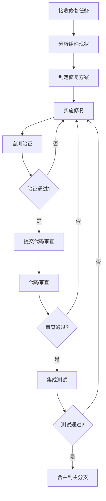

# 组件修复标准和验证机制

## 概述

本文档定义了幼儿园管理系统UI组件修复的详细标准、流程和验证机制，确保所有修复工作的一致性和质量。

## 修复标准体系

### 1. 核心修复标准

#### 1.1 全局样式导入标准
**必须导入的样式文件**：
```scss
// 1. 设计令牌系统（必须）
@import "@/styles/design-tokens.scss";

// 2. 列表组件优化样式（列表类组件必须）
@import "@/styles/list-components-optimization.scss";

// 3. 全局样式基础（可选，如果组件未导入）
@use '@/styles/index.scss' as *;
```

**导入顺序要求**：
1. 设计令牌（design-tokens.scss）
2. 组件特定样式（如 list-components-optimization.scss）
3. 全局样式（index.scss）

#### 1.2 设计令牌使用标准
**颜色使用规范**：
```scss
// ✅ 正确：使用设计令牌
.component {
  background: var(--bg-color);
  border: 1px solid var(--border-color-light);
  color: var(--text-color-primary);
}

// ❌ 错误：硬编码颜色
.component {
  background: #ffffff;
  border: 1px solid #e4e7ed;
  color: #303133;
}
```

**间距使用规范**：
```scss
// ✅ 正确：使用间距令牌
.component {
  padding: var(--spacing-lg);
  margin: var(--spacing-md) 0;
  gap: var(--spacing-sm);
}

// ❌ 错误：硬编码间距
.component {
  padding: 24px;
  margin: 16px 0;
  gap: 8px;
}
```

**字体使用规范**：
```scss
// ✅ 正确：使用字体令牌
.title {
  font-size: var(--text-xl);
  font-weight: var(--font-semibold);
  line-height: var(--leading-normal);
}

// ❌ 错误：硬编码字体
.title {
  font-size: 20px;
  font-weight: 600;
  line-height: 1.5;
}
```

#### 1.3 图标系统标准
**图标组件使用规范**：
```vue
<!-- ✅ 正确：使用UnifiedIcon组件 -->
<template>
  <UnifiedIcon name="Search" :size="16" />
  <UnifiedIcon name="Edit" :size="20" color="var(--primary-color)" />
  <UnifiedIcon name="Delete" :size="18" variant="filled" />
</template>

<!-- ❌ 错误：使用Element Plus图标 -->
<template>
  <el-icon><Search /></el-icon>
  <el-icon><Edit /></el-icon>
</template>
```

**图标尺寸标准**：
```vue
<!-- 标准尺寸映射 -->
<UnifiedIcon :size="12" />  <!-- 超小图标 -->
<UnifiedIcon :size="14" />  <!-- 小图标 -->
<UnifiedIcon :size="16" />  <!-- 标准图标 -->
<UnifiedIcon :size="18" />  <!-- 中等图标 -->
<UnifiedIcon :size="20" />  <!-- 大图标 -->
<UnifiedIcon :size="24" />  <!-- 超大图标 -->
```

#### 1.4 响应式设计标准
**断点使用标准**：
```scss
// ✅ 正确：使用设计令牌断点
@media (max-width: var(--breakpoint-md)) {
  .component {
    padding: var(--spacing-md);
  }
}

// ❌ 错误：硬编码断点
@media (max-width: 768px) {
  .component {
    padding: 16px;
  }
}
```

**容器适配标准**：
```scss
.responsive-container {
  padding: var(--container-padding-desktop);

  @media (max-width: var(--breakpoint-md)) {
    padding: var(--container-padding-tablet);
  }

  @media (max-width: var(--breakpoint-sm)) {
    padding: var(--container-padding-mobile);
  }
}
```

### 2. 组件类型特定标准

#### 2.1 列表类组件标准
**表格组件标准**：
```vue
<template>
  <div class="data-table-container">
    <div class="table-toolbar">
      <!-- 工具栏 -->
    </div>
    <div class="table-wrapper">
      <el-table
        class="responsive-table"
        :data="tableData"
        v-loading="loading"
      >
        <!-- 表格列 -->
      </el-table>
    </div>
    <div class="pagination-container">
      <!-- 分页 -->
    </div>
  </div>
</template>

<style lang="scss" scoped>
@import "@/styles/list-components-optimization.scss";
@import "@/styles/design-tokens.scss";

.data-table-container {
  // 使用标准容器样式
}
</style>
```

**卡片列表标准**：
```vue
<template>
  <div class="card-list cols-3">
    <div
      v-for="item in items"
      :key="item.id"
      class="card-item"
    >
      <div class="card-header">
        <h4 class="card-title">
          <UnifiedIcon name="item-icon" :size="16" />
          {{ item.title }}
        </h4>
        <div class="card-actions">
          <!-- 操作按钮 -->
        </div>
      </div>
      <div class="card-content">
        <!-- 内容 -->
      </div>
    </div>
  </div>
</template>
```

#### 2.2 表单类组件标准
**表单布局标准**：
```vue
<template>
  <el-form
    ref="formRef"
    :model="formData"
    :rules="formRules"
    label-width="120px"
    class="standard-form"
  >
    <el-form-item label="字段名称" prop="field">
      <el-input v-model="formData.field" />
    </el-form-item>
  </el-form>
</template>

<style lang="scss" scoped>
@import "@/styles/design-tokens.scss";

.standard-form {
  :deep(.el-form-item) {
    margin-bottom: var(--spacing-lg);
  }

  :deep(.el-form-item__label) {
    font-weight: var(--font-medium);
    color: var(--text-primary);
  }
}
</style>
```

#### 2.3 对话框类组件标准
**对话框标准结构**：
```vue
<template>
  <el-dialog
    v-model="visible"
    :title="title"
    width="600px"
    :close-on-click-modal="false"
    class="standard-dialog"
  >
    <div class="dialog-content">
      <!-- 内容 -->
    </div>

    <template #footer>
      <div class="dialog-footer">
        <el-button @click="handleCancel">取消</el-button>
        <el-button type="primary" @click="handleConfirm">
          确定
        </el-button>
      </div>
    </template>
  </el-dialog>
</template>
```

### 3. 样式组织标准

#### 3.1 SCSS文件结构标准
```scss
// 1. 导入区域
@import "@/styles/design-tokens.scss";
@import "@/styles/list-components-optimization.scss";

// 2. 组件根样式
.component-name {
  // 根元素样式
}

// 3. 子元素样式（使用BEM命名）
.component-name__header {
  // 头部样式
}

.component-name__content {
  // 内容样式
}

.component-name__footer {
  // 底部样式
}

// 4. 修饰符样式
.component-name--disabled {
  // 禁用状态
}

.component-name--active {
  // 激活状态
}

// 5. 响应式样式
@media (max-width: var(--breakpoint-md)) {
  .component-name {
    // 移动端样式
  }
}
```

#### 3.2 CSS类命名标准
**BEM命名规范**：
```scss
// 块（Block）
.parent-list {}

// 元素（Element）
.parent-list__header {}
.parent-list__content {}
.parent-list__footer {}

// 修饰符（Modifier）
.parent-list--loading {}
.parent-list--empty {}
.parent-list__item--selected {}
```

## 验证机制

### 1. 自动化验证工具

#### 1.1 样式导入验证脚本
```javascript
// validate-style-imports.js
const fs = require('fs');
const path = require('path');

function validateStyleImports(componentPath) {
  const content = fs.readFileSync(componentPath, 'utf8');

  const requiredImports = [
    '@/styles/design-tokens.scss',
    '@/styles/list-components-optimization.scss'
  ];

  const issues = [];

  for (const importPath of requiredImports) {
    if (!content.includes(importPath)) {
      issues.push(`缺少必需导入: ${importPath}`);
    }
  }

  return issues;
}
```

#### 1.2 设计令牌使用验证脚本
```javascript
// validate-design-tokens.js
const hardcodedPatterns = [
  /#[0-9a-fA-F]{6}/g,  // 十六进制颜色
  /\d+px/g,            // 像素值
  /rgba?\([^)]+\)/g,   // RGB颜色
];

function validateDesignTokens(content) {
  const issues = [];

  hardcodedPatterns.forEach(pattern => {
    const matches = content.match(pattern);
    if (matches) {
      issues.push(`发现硬编码值: ${matches.join(', ')}`);
    }
  });

  return issues;
}
```

#### 1.3 图标使用验证脚本
```javascript
// validate-icons.js
function validateIconUsage(content) {
  const issues = [];

  // 检查是否使用了Element Plus图标
  if (content.includes('@element-plus/icons-vue')) {
    issues.push('使用了Element Plus图标，需要替换为UnifiedIcon');
  }

  // 检查UnifiedIcon使用是否正确
  if (content.includes('UnifiedIcon')) {
    if (!content.includes('name=')) {
      issues.push('UnifiedIcon缺少name属性');
    }
  }

  return issues;
}
```

### 2. 手动验证清单

#### 2.1 修复前验证清单
```markdown
## 修复前检查清单

### 基础检查
- [ ] 确认组件文件路径正确
- [ ] 备份原始文件
- [ ] 检查组件依赖关系
- [ ] 确认组件使用场景

### 样式检查
- [ ] 检查当前样式导入情况
- [ ] 识别硬编码颜色和尺寸
- [ ] 分析响应式实现情况
- [ ] 检查图标使用方式

### 功能检查
- [ ] 确认组件功能完整性
- [ ] 检查交互行为
- [ ] 验证数据流
- [ ] 测试边界情况
```

#### 2.2 修复后验证清单
```markdown
## 修复后验证清单

### 代码质量检查
- [ ] 样式导入正确且完整
- [ ] 设计令牌使用规范
- [ ] 图标系统统一
- [ ] 代码结构清晰
- [ ] 命名规范符合标准

### 视觉效果检查
- [ ] 颜色使用符合设计系统
- [ ] 间距布局合理
- [ ] 字体大小层级清晰
- [ ] 边框和阴影效果适当
- [ ] 整体视觉风格统一

### 响应式检查
- [ ] 桌面端显示正常
- [ ] 平板端适配良好
- [ ] 移动端体验友好
- [ ] 不同屏幕尺寸下布局合理
- [ ] 文字大小适配

### 交互体验检查
- [ ] 按钮状态正确
- [ ] 表单验证提示清晰
- [ ] 加载状态显示友好
- [ ] 错误提示信息准确
- [ ] 操作反馈及时

### 功能完整性检查
- [ ] 所有原有功能正常
- [ ] 新增功能工作正常
- [ ] 数据流转正确
- [ ] 事件处理无误
- [ ] 边界情况处理完善

### 兼容性检查
- [ ] 主流浏览器兼容
- [ ] 不同设备兼容
- [ ] 主题切换正常
- [ ] 暗色模式支持
- [ ] 无障碍访问支持
```

### 3. 测试验证流程

#### 3.1 单元测试标准
```javascript
// 组件样式测试示例
import { mount } from '@vue/test-utils';
import Component from './Component.vue';

describe('Component样式测试', () => {
  it('应该正确导入必需的样式文件', () => {
    // 验证样式导入
  });

  it('应该使用设计令牌而非硬编码值', () => {
    const wrapper = mount(Component);
    const element = wrapper.find('.component-element');

    // 验证使用了CSS变量
    expect(element.element.style.getPropertyValue('--bg-color')).toBeDefined();
  });

  it('应该正确使用UnifiedIcon组件', () => {
    const wrapper = mount(Component);
    const icons = wrapper.findAllComponents({ name: 'UnifiedIcon' });

    expect(icons.length).toBeGreaterThan(0);
  });
});
```

#### 3.2 视觉回归测试
```javascript
// 视觉回归测试配置
module.exports = {
  storybookUrl: 'http://localhost:6006',
  stories: ['**/*.stories.@(js|jsx|ts|tsx)'],
  viewport: {
    defaultViewport: 'desktop',
    viewports: {
      desktop: { width: 1200, height: 800 },
      tablet: { width: 768, height: 1024 },
      mobile: { width: 375, height: 667 }
    }
  }
};
```

#### 3.3 性能测试标准
```javascript
// 性能测试示例
describe('组件性能测试', () => {
  it('渲染时间应该在合理范围内', async () => {
    const startTime = performance.now();

    const wrapper = mount(Component);
    await wrapper.vm.$nextTick();

    const endTime = performance.now();
    const renderTime = endTime - startTime;

    expect(renderTime).toBeLessThan(100); // 渲染时间小于100ms
  });

  it('内存使用应该合理', () => {
    // 测试内存使用情况
  });
});
```

## 质量保证流程

### 1. 修复工作流程


### 2. 审查检查点
#### 2.1 代码审查检查点
- [ ] 代码风格符合规范
- [ ] 修复标准执行到位
- [ ] 功能完整性保证
- [ ] 性能影响评估
- [ ] 安全性检查

#### 2.2 测试审查检查点
- [ ] 测试覆盖率达标
- [ ] 边界情况测试完整
- [ ] 性能测试通过
- [ ] 兼容性测试通过
- [ ] 用户验收测试通过

### 3. 发布标准
#### 3.1 技术发布标准
- [ ] 所有测试通过
- [ ] 代码审查完成
- [ ] 文档更新完成
- [ ] 性能指标达标
- [ ] 安全扫描通过

#### 3.2 业务发布标准
- [ ] 功能验证通过
- [ ] 用户体验验证通过
- [ ] 业务流程验证通过
- [ ] 数据迁移验证通过
- [ ] 回滚方案准备就绪

## 工具和资源

### 1. 开发工具
- **VS Code**：代码编辑器
- **Chrome DevTools**：样式调试
- **Vue DevTools**：组件调试
- **Storybook**：组件展示和测试

### 2. 验证工具
- **ESLint**：代码质量检查
- **Stylelint**：样式质量检查
- **Prettier**：代码格式化
- **Jest**：单元测试框架
- **Cypress**：端到端测试

### 3. 设计资源
- **Figma**：设计稿和设计令牌
- **设计系统文档**：组件规范
- **图标库**：UnifiedIcon图标集合

## 总结

本标准和验证机制为幼儿园管理系统UI组件修复工作提供了完整的指导框架，确保修复工作的质量、一致性和可维护性。

通过严格执行这些标准和验证机制，我们可以：
1. 保证修复质量的一致性
2. 提高开发效率和代码质量
3. 降低维护成本和风险
4. 提升用户体验和满意度

所有参与修复工作的开发人员都应该熟悉并严格遵守这些标准和验证机制。