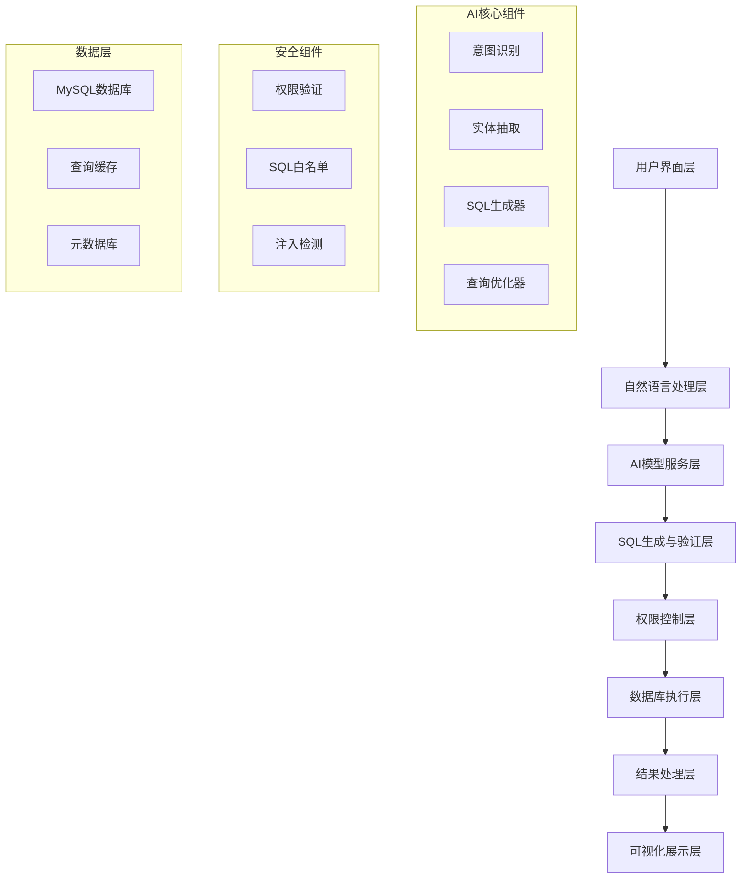
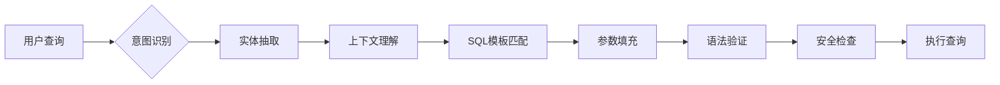

# AI内部数据库查询系统设计需求文档

## 📋 项目概述

### 项目背景
为幼儿园管理系统开发AI智能数据库查询功能，使用户能够通过自然语言描述查询需求，系统自动生成SQL查询并返回结果，极大简化数据分析和报表生成流程。

### 核心目标
- **自然语言查询**: 用户可用中文描述查询需求，无需SQL知识
- **智能SQL生成**: AI自动将自然语言转换为准确的SQL查询
- **安全执行**: 严格的权限控制和SQL注入防护
- **结果可视化**: 查询结果支持表格、图表等多种展示形式
- **学习优化**: 基于查询历史不断优化AI模型表现

## 🏗️ 系统架构设计

### 整体架构图


### 技术栈选择

#### 前端技术
- **Vue 3 + TypeScript**: 与现有系统保持一致
- **Element Plus**: UI组件库，保持界面统一性
- **ECharts**: 图表可视化库
- **Monaco Editor**: 代码编辑器，用于SQL预览

#### 后端技术
- **Express.js + TypeScript**: 与现有系统架构保持一致
- **Sequelize ORM**: 数据库操作，复用现有连接
- **OpenAI API**: GPT模型用于自然语言理解
- **本地AI模型**: 备用方案，降低成本
- **Redis**: 查询结果缓存

#### AI模型方案


## 🎯 功能需求详述

### 1. 自然语言查询界面

#### 主要功能
- **智能输入框**: 支持语音输入、智能提示
- **查询历史**: 保存并快速重用历史查询
- **查询模板**: 预设常用查询模板
- **实时预览**: 显示AI生成的SQL语句

#### 界面设计要求
```vue
<template>
  <div class="ai-query-interface">
    <!-- 查询输入区域 -->
    <el-card class="query-input-card">
      <el-input
        v-model="queryText"
        type="textarea"
        :rows="3"
        placeholder="请用中文描述您的查询需求，例如：查询本月新入学的学生人数"
        class="query-input"
      >
        <template #append>
          <el-button type="primary" @click="executeQuery" :loading="loading">
            <el-icon><Search /></el-icon>
            查询
          </el-button>
        </template>
      </el-input>
      
      <!-- 快捷查询模板 -->
      <div class="query-templates">
        <el-tag
          v-for="template in templates"
          :key="template.id"
          @click="selectTemplate(template)"
          class="template-tag"
        >
          {{ template.name }}
        </el-tag>
      </div>
    </el-card>

    <!-- SQL预览区域 -->
    <el-card class="sql-preview-card" v-if="generatedSQL">
      <template #header>
        <span>AI生成的SQL查询</span>
        <el-button size="small" @click="editSQL">编辑</el-button>
      </template>
      <monaco-editor
        v-model="generatedSQL"
        language="sql"
        :read-only="!editing"
        height="200px"
      />
    </el-card>

    <!-- 查询结果展示 -->
    <QueryResultDisplay :results="queryResults" :chart-config="chartConfig" />
  </div>
</template>
```

### 2. AI模型集成

#### 意图识别模型
```typescript
interface QueryIntent {
  type: 'SELECT' | 'COUNT' | 'SUM' | 'AVG' | 'GROUP_BY' | 'FILTER'
  confidence: number
  entities: Entity[]
  timeRange?: TimeRange
  constraints?: Constraint[]
}

interface Entity {
  type: 'TABLE' | 'COLUMN' | 'VALUE' | 'CONDITION'
  value: string
  confidence: number
  mappedName?: string
}

class AIQueryProcessor {
  async processNaturalLanguage(query: string): Promise<QueryIntent> {
    // 1. 预处理文本
    const cleanQuery = this.preprocessText(query)
    
    // 2. 意图识别
    const intent = await this.identifyIntent(cleanQuery)
    
    // 3. 实体抽取
    const entities = await this.extractEntities(cleanQuery)
    
    // 4. 上下文理解
    const context = await this.analyzeContext(intent, entities)
    
    return {
      type: intent.type,
      confidence: intent.confidence,
      entities: entities,
      timeRange: context.timeRange,
      constraints: context.constraints
    }
  }

  async generateSQL(intent: QueryIntent): Promise<string> {
    // 1. 选择SQL模板
    const template = this.selectTemplate(intent.type)
    
    // 2. 映射实体到数据库字段
    const mappedEntities = await this.mapEntitiesToSchema(intent.entities)
    
    // 3. 生成SQL语句
    const sql = this.buildSQL(template, mappedEntities, intent.constraints)
    
    // 4. 优化查询
    return this.optimizeSQL(sql)
  }
}
```

#### 数据库模式理解
```typescript
interface DatabaseSchema {
  tables: Table[]
  relationships: Relationship[]
  businessRules: BusinessRule[]
}

interface Table {
  name: string
  chineseName: string
  columns: Column[]
  description: string
}

interface Column {
  name: string
  chineseName: string
  type: string
  description: string
  constraints?: string[]
}

class SchemaManager {
  // 幼儿园管理系统核心表结构
  private coreSchema: DatabaseSchema = {
    tables: [
      {
        name: 'students',
        chineseName: '学生表',
        columns: [
          { name: 'id', chineseName: '学生ID', type: 'INT', description: '学生唯一标识' },
          { name: 'name', chineseName: '姓名', type: 'VARCHAR', description: '学生姓名' },
          { name: 'age', chineseName: '年龄', type: 'INT', description: '学生年龄' },
          { name: 'class_id', chineseName: '班级ID', type: 'INT', description: '所属班级' },
          { name: 'enrollment_date', chineseName: '入学日期', type: 'DATE', description: '入学时间' }
        ]
      },
      {
        name: 'teachers',
        chineseName: '教师表', 
        columns: [
          { name: 'id', chineseName: '教师ID', type: 'INT', description: '教师唯一标识' },
          { name: 'name', chineseName: '姓名', type: 'VARCHAR', description: '教师姓名' },
          { name: 'subject', chineseName: '科目', type: 'VARCHAR', description: '教授科目' },
          { name: 'experience_years', chineseName: '工作年限', type: 'INT', description: '工作经验年数' }
        ]
      },
      {
        name: 'classes',
        chineseName: '班级表',
        columns: [
          { name: 'id', chineseName: '班级ID', type: 'INT', description: '班级唯一标识' },
          { name: 'name', chineseName: '班级名称', type: 'VARCHAR', description: '班级名称' },
          { name: 'grade', chineseName: '年级', type: 'VARCHAR', description: '年级(小班/中班/大班)' },
          { name: 'capacity', chineseName: '容量', type: 'INT', description: '班级容量' }
        ]
      }
      // ... 其他73+表结构
    ],
    relationships: [
      { from: 'students.class_id', to: 'classes.id', type: 'belongsTo' },
      { from: 'teachers.class_id', to: 'classes.id', type: 'belongsTo' }
    ]
  }

  async mapChineseToColumn(chineseText: string): Promise<Column[]> {
    // 中文字段映射逻辑
    const mappings = {
      '学生': ['students.name', 'students.id'],
      '姓名': ['name'],
      '年龄': ['age'],
      '班级': ['classes.name', 'class_id'],
      '入学': ['enrollment_date'],
      '教师': ['teachers.name', 'teachers.id'],
      '科目': ['subject']
    }
    
    return this.findBestMatch(chineseText, mappings)
  }
}
```

### 3. SQL生成与验证

#### SQL模板系统
```typescript
interface SQLTemplate {
  id: string
  name: string
  description: string
  template: string
  parameters: Parameter[]
  examples: Example[]
}

class SQLTemplateEngine {
  private templates: SQLTemplate[] = [
    {
      id: 'student_count',
      name: '学生统计',
      description: '统计学生数量',
      template: `
        SELECT COUNT(*) as total_students
        FROM students 
        WHERE {{timeCondition}} {{additionalConditions}}
      `,
      parameters: [
        { name: 'timeCondition', type: 'string', required: false },
        { name: 'additionalConditions', type: 'string', required: false }
      ],
      examples: [
        { query: '统计本月新入学学生', sql: 'SELECT COUNT(*) FROM students WHERE enrollment_date >= DATE_FORMAT(NOW(), "%Y-%m-01")' }
      ]
    },
    {
      id: 'class_analysis',
      name: '班级分析',
      description: '班级相关统计',
      template: `
        SELECT c.name as class_name, COUNT(s.id) as student_count
        FROM classes c
        LEFT JOIN students s ON c.id = s.class_id
        WHERE {{conditions}}
        GROUP BY c.id, c.name
        ORDER BY student_count DESC
      `,
      parameters: [
        { name: 'conditions', type: 'string', required: false }
      ]
    }
  ]

  generateSQL(intent: QueryIntent): string {
    const template = this.selectBestTemplate(intent)
    return this.fillTemplate(template, intent)
  }

  private selectBestTemplate(intent: QueryIntent): SQLTemplate {
    // 基于意图和实体选择最合适的模板
    const scores = this.templates.map(template => ({
      template,
      score: this.calculateTemplateScore(template, intent)
    }))
    
    return scores.sort((a, b) => b.score - a.score)[0].template
  }
}
```

#### SQL安全验证
```typescript
class SQLSecurityValidator {
  private readonly DANGEROUS_KEYWORDS = [
    'DROP', 'DELETE', 'UPDATE', 'INSERT', 'CREATE', 'ALTER', 
    'TRUNCATE', 'EXEC', 'EXECUTE', 'UNION', 'DECLARE'
  ]

  private readonly ALLOWED_TABLES = [
    'students', 'teachers', 'classes', 'activities', 'enrollments',
    'parents', 'attendance', 'grades', 'schedules'
  ]

  async validateSQL(sql: string, userRole: string): Promise<ValidationResult> {
    const result: ValidationResult = {
      isValid: true,
      errors: [],
      warnings: [],
      sanitizedSQL: sql
    }

    // 1. 检查危险关键词
    if (this.containsDangerousKeywords(sql)) {
      result.isValid = false
      result.errors.push('查询包含不允许的操作关键词')
    }

    // 2. 验证表名权限
    const tables = this.extractTableNames(sql)
    const unauthorizedTables = tables.filter(table => 
      !this.isTableAccessible(table, userRole)
    )
    
    if (unauthorizedTables.length > 0) {
      result.isValid = false
      result.errors.push(`没有访问以下表的权限: ${unauthorizedTables.join(', ')}`)
    }

    // 3. SQL注入检测
    if (this.detectSQLInjection(sql)) {
      result.isValid = false
      result.errors.push('检测到潜在的SQL注入攻击')
    }

    // 4. 查询复杂度检查
    const complexity = this.calculateComplexity(sql)
    if (complexity > this.getMaxComplexity(userRole)) {
      result.warnings.push('查询复杂度较高，可能影响性能')
    }

    return result
  }

  private isTableAccessible(tableName: string, userRole: string): boolean {
    const rolePermissions = {
      'admin': this.ALLOWED_TABLES,
      'principal': ['students', 'teachers', 'classes', 'activities', 'enrollments'],
      'teacher': ['students', 'classes', 'activities', 'attendance', 'grades'],
      'parent': ['students', 'activities', 'schedules']
    }

    return rolePermissions[userRole]?.includes(tableName) || false
  }
}
```

### 4. 查询结果处理

#### 结果格式化
```typescript
interface QueryResult {
  data: any[]
  metadata: {
    columns: ColumnInfo[]
    rowCount: number
    executionTime: number
    cacheHit: boolean
  }
  visualization?: ChartConfig
}

class ResultProcessor {
  async processResults(rawResults: any[], sql: string): Promise<QueryResult> {
    const columns = this.extractColumnInfo(rawResults)
    const processedData = this.formatData(rawResults, columns)
    const chartConfig = await this.generateVisualization(processedData, sql)

    return {
      data: processedData,
      metadata: {
        columns,
        rowCount: rawResults.length,
        executionTime: performance.now(),
        cacheHit: false
      },
      visualization: chartConfig
    }
  }

  private async generateVisualization(data: any[], sql: string): Promise<ChartConfig> {
    // 基于数据类型和查询内容智能选择图表类型
    if (this.isTimeSeriesData(data)) {
      return this.createLineChart(data)
    } else if (this.isCategoryData(data)) {
      return this.createBarChart(data)
    } else if (this.isStatisticalData(data)) {
      return this.createPieChart(data)
    }
    
    return this.createTable(data)
  }

  private createBarChart(data: any[]): ChartConfig {
    return {
      type: 'bar',
      title: '数据统计图',
      xAxis: {
        data: data.map(row => row[Object.keys(row)[0]])
      },
      yAxis: {},
      series: [{
        name: '数量',
        type: 'bar',
        data: data.map(row => row[Object.keys(row)[1]])
      }]
    }
  }
}
```

### 5. 用户界面设计

#### 查询构建器
```vue
<template>
  <div class="ai-query-builder">
    <!-- 自然语言输入 -->
    <el-card class="input-section">
      <template #header>
        <div class="section-header">
          <el-icon><ChatLineRound /></el-icon>
          <span>智能查询</span>
        </div>
      </template>
      
      <div class="query-input-container">
        <el-input
          v-model="naturalLanguageQuery"
          type="textarea"
          :rows="4"
          placeholder="请用中文描述您的查询需求..."
          class="query-textarea"
          @input="onQueryInput"
        />
        
        <div class="input-tools">
          <el-button @click="clearQuery" size="small">清空</el-button>
          <el-button @click="showExamples" size="small">示例</el-button>
          <el-button type="primary" @click="executeQuery" :loading="querying">
            <el-icon><Search /></el-icon>
            执行查询
          </el-button>
        </div>
      </div>

      <!-- 智能提示 -->
      <div class="suggestions" v-if="suggestions.length > 0">
        <el-tag
          v-for="suggestion in suggestions"
          :key="suggestion.id"
          @click="applySuggestion(suggestion)"
          class="suggestion-tag"
        >
          {{ suggestion.text }}
        </el-tag>
      </div>
    </el-card>

    <!-- AI处理状态 -->
    <el-card class="processing-section" v-if="processing">
      <div class="ai-processing">
        <el-steps :active="currentStep" finish-status="success">
          <el-step title="理解查询意图" />
          <el-step title="生成SQL语句" />
          <el-step title="安全验证" />
          <el-step title="执行查询" />
        </el-steps>
        
        <div class="processing-details">
          <p>{{ processingMessage }}</p>
          <el-progress :percentage="processingProgress" />
        </div>
      </div>
    </el-card>

    <!-- SQL预览与编辑 -->
    <el-card class="sql-section" v-if="generatedSQL">
      <template #header>
        <div class="section-header">
          <el-icon><Document /></el-icon>
          <span>生成的SQL查询</span>
          <div class="header-actions">
            <el-button @click="toggleSQLEdit" size="small">
              {{ editingSQL ? '完成编辑' : '编辑SQL' }}
            </el-button>
            <el-button @click="copySQLToClipboard" size="small">复制</el-button>
          </div>
        </div>
      </template>
      
      <monaco-editor
        v-model="generatedSQL"
        language="sql"
        :options="editorOptions"
        height="200px"
      />
      
      <div class="sql-info">
        <el-descriptions :column="3" size="small">
          <el-descriptions-item label="查询类型">{{ queryType }}</el-descriptions-item>
          <el-descriptions-item label="涉及表">{{ involvedTables.join(', ') }}</el-descriptions-item>
          <el-descriptions-item label="预估耗时">{{ estimatedTime }}ms</el-descriptions-item>
        </el-descriptions>
      </div>
    </el-card>

    <!-- 查询结果展示 -->
    <QueryResultDisplay
      v-if="queryResults"
      :results="queryResults"
      :loading="querying"
      @export="exportResults"
      @refresh="refreshQuery"
    />
  </div>
</template>

<script setup lang="ts">
import { ref, computed, watch } from 'vue'
import MonacoEditor from '@/components/common/MonacoEditor.vue'
import QueryResultDisplay from './QueryResultDisplay.vue'
import { useAIQuery } from '@/composables/useAIQuery'

const {
  naturalLanguageQuery,
  generatedSQL,
  queryResults,
  processing,
  querying,
  executeQuery,
  currentStep,
  processingMessage,
  processingProgress
} = useAIQuery()

const editingSQL = ref(false)
const suggestions = ref([])

const editorOptions = computed(() => ({
  readOnly: !editingSQL.value,
  minimap: { enabled: false },
  scrollBeyondLastLine: false
}))

// 智能提示逻辑
watch(naturalLanguageQuery, (newQuery) => {
  if (newQuery.length > 5) {
    generateSuggestions(newQuery)
  }
})
</script>
```

#### 结果展示组件
```vue
<template>
  <div class="query-result-display">
    <el-card v-if="results">
      <template #header>
        <div class="result-header">
          <div class="result-info">
            <el-icon><DataAnalysis /></el-icon>
            <span>查询结果 ({{ results.metadata.rowCount }} 条记录)</span>
            <el-tag size="small" type="success" v-if="results.metadata.cacheHit">
              缓存命中
            </el-tag>
          </div>
          
          <div class="result-actions">
            <el-button-group>
              <el-button 
                :type="displayMode === 'table' ? 'primary' : 'default'"
                @click="displayMode = 'table'"
                size="small"
              >
                <el-icon><Grid /></el-icon>
                表格
              </el-button>
              <el-button 
                :type="displayMode === 'chart' ? 'primary' : 'default'"
                @click="displayMode = 'chart'"
                size="small"
                :disabled="!results.visualization"
              >
                <el-icon><TrendCharts /></el-icon>
                图表
              </el-button>
            </el-button-group>
            
            <el-dropdown @command="handleExport">
              <el-button size="small">
                导出 <el-icon><ArrowDown /></el-icon>
              </el-button>
              <template #dropdown>
                <el-dropdown-menu>
                  <el-dropdown-item command="excel">Excel文件</el-dropdown-item>
                  <el-dropdown-item command="csv">CSV文件</el-dropdown-item>
                  <el-dropdown-item command="pdf">PDF报告</el-dropdown-item>
                </el-dropdown-menu>
              </template>
            </el-dropdown>
          </div>
        </div>
      </template>

      <!-- 表格显示 -->
      <div v-if="displayMode === 'table'" class="table-container">
        <el-table 
          :data="results.data" 
          style="width: 100%"
          :max-height="400"
          stripe
        >
          <el-table-column
            v-for="column in results.metadata.columns"
            :key="column.name"
            :prop="column.name"
            :label="column.label"
            :width="column.width"
            show-overflow-tooltip
          >
            <template #default="{ row }">
              <span v-if="column.type === 'number'">
                {{ formatNumber(row[column.name]) }}
              </span>
              <span v-else-if="column.type === 'date'">
                {{ formatDate(row[column.name]) }}
              </span>
              <span v-else>
                {{ row[column.name] }}
              </span>
            </template>
          </el-table-column>
        </el-table>
      </div>

      <!-- 图表显示 -->
      <div v-if="displayMode === 'chart' && results.visualization" class="chart-container">
        <div ref="chartRef" style="width: 100%; height: 400px;"></div>
      </div>

      <!-- 执行信息 -->
      <div class="execution-info">
        <el-descriptions :column="4" size="small">
          <el-descriptions-item label="执行时间">
            {{ results.metadata.executionTime }}ms
          </el-descriptions-item>
          <el-descriptions-item label="返回行数">
            {{ results.metadata.rowCount }}
          </el-descriptions-item>
          <el-descriptions-item label="查询时间">
            {{ formatTime(queryTime) }}
          </el-descriptions-item>
          <el-descriptions-item label="缓存状态">
            {{ results.metadata.cacheHit ? '命中' : '未命中' }}
          </el-descriptions-item>
        </el-descriptions>
      </div>
    </el-card>
  </div>
</template>
```

## 🔐 安全与权限设计

### 权限控制矩阵
```typescript
interface PermissionMatrix {
  [role: string]: {
    allowedTables: string[]
    allowedOperations: string[]
    maxComplexity: number
    timeRangeLimit?: number
  }
}

const permissionMatrix: PermissionMatrix = {
  'admin': {
    allowedTables: ['*'], // 所有表
    allowedOperations: ['SELECT', 'COUNT', 'SUM', 'AVG', 'GROUP BY'],
    maxComplexity: 100,
    timeRangeLimit: null
  },
  'principal': {
    allowedTables: [
      'students', 'teachers', 'classes', 'activities', 
      'enrollments', 'attendance', 'grades', 'schedules'
    ],
    allowedOperations: ['SELECT', 'COUNT', 'SUM', 'AVG', 'GROUP BY'],
    maxComplexity: 80,
    timeRangeLimit: 365 // 一年
  },
  'teacher': {
    allowedTables: [
      'students', 'classes', 'activities', 'attendance', 'grades'
    ],
    allowedOperations: ['SELECT', 'COUNT', 'AVG'],
    maxComplexity: 50,
    timeRangeLimit: 180 // 半年
  },
  'parent': {
    allowedTables: ['students', 'activities', 'schedules'],
    allowedOperations: ['SELECT'],
    maxComplexity: 20,
    timeRangeLimit: 90, // 三个月
    additionalFilters: ['student_parent_relation'] // 只能查看自己孩子的数据
  }
}
```

### SQL注入防护
```typescript
class SQLInjectionProtector {
  private suspiciousPatterns = [
    /(\b(union|select|insert|update|delete|drop|create|alter|exec|execute)\b)/gi,
    /(--|\#|\/\*|\*\/)/g,
    /(\b(script|javascript|vbscript)\b)/gi,
    /(\b(or|and)\s+\d+\s*=\s*\d+)/gi
  ]

  detectInjection(input: string): boolean {
    return this.suspiciousPatterns.some(pattern => pattern.test(input))
  }

  sanitizeInput(input: string): string {
    // 1. 移除危险字符
    let sanitized = input.replace(/[<>'"]/g, '')
    
    // 2. 转义特殊字符
    sanitized = sanitized.replace(/\\/g, '\\\\')
    
    // 3. 限制长度
    if (sanitized.length > 1000) {
      sanitized = sanitized.substring(0, 1000)
    }
    
    return sanitized
  }
}
```

## 📊 性能优化策略

### 查询缓存机制
```typescript
interface CacheStrategy {
  key: string
  ttl: number
  strategy: 'memory' | 'redis' | 'database'
}

class QueryCache {
  private memoryCache = new Map<string, CachedResult>()
  private redisClient: Redis

  async get(queryHash: string): Promise<QueryResult | null> {
    // 1. 检查内存缓存
    const memoryResult = this.memoryCache.get(queryHash)
    if (memoryResult && !this.isExpired(memoryResult)) {
      return memoryResult.data
    }

    // 2. 检查Redis缓存
    const redisResult = await this.redisClient.get(`query:${queryHash}`)
    if (redisResult) {
      const data = JSON.parse(redisResult)
      this.memoryCache.set(queryHash, {
        data,
        timestamp: Date.now(),
        ttl: 300000 // 5分钟
      })
      return data
    }

    return null
  }

  async set(queryHash: string, result: QueryResult, ttl: number = 300000): Promise<void> {
    // 1. 存储到内存
    this.memoryCache.set(queryHash, {
      data: result,
      timestamp: Date.now(),
      ttl
    })

    // 2. 存储到Redis
    await this.redisClient.setex(
      `query:${queryHash}`,
      Math.floor(ttl / 1000),
      JSON.stringify(result)
    )
  }

  generateQueryHash(sql: string, params: any[]): string {
    return crypto.createHash('md5')
      .update(sql + JSON.stringify(params))
      .digest('hex')
  }
}
```

### 查询优化器
```typescript
class QueryOptimizer {
  optimizeSQL(sql: string): string {
    let optimized = sql

    // 1. 添加适当的索引提示
    optimized = this.addIndexHints(optimized)

    // 2. 优化JOIN顺序
    optimized = this.optimizeJoins(optimized)

    // 3. 添加查询限制
    optimized = this.addLimits(optimized)

    // 4. 优化WHERE条件顺序
    optimized = this.optimizeWhereClause(optimized)

    return optimized
  }

  private addIndexHints(sql: string): string {
    // 为常用查询添加索引提示
    const indexMappings = {
      'students': ['idx_enrollment_date', 'idx_class_id'],
      'activities': ['idx_activity_date', 'idx_activity_type'],
      'attendance': ['idx_attendance_date', 'idx_student_id']
    }

    // 分析SQL并添加适当的索引提示
    return sql
  }

  private addLimits(sql: string): string {
    // 如果没有LIMIT子句且查询可能返回大量数据，添加默认限制
    if (!sql.toUpperCase().includes('LIMIT') && 
        !sql.toUpperCase().includes('COUNT')) {
      return sql + ' LIMIT 1000'
    }
    return sql
  }
}
```

## 🧠 AI模型训练与优化

### 训练数据结构
```typescript
interface TrainingData {
  naturalLanguageQuery: string
  expectedSQL: string
  context: {
    userRole: string
    timestamp: string
    success: boolean
    executionTime?: number
  }
  feedback?: {
    rating: number
    comments: string
    correctedSQL?: string
  }
}

class ModelTrainer {
  private trainingDataset: TrainingData[] = []

  async collectTrainingData(
    query: string, 
    generatedSQL: string, 
    userRole: string,
    success: boolean,
    executionTime?: number
  ): Promise<void> {
    const data: TrainingData = {
      naturalLanguageQuery: query,
      expectedSQL: generatedSQL,
      context: {
        userRole,
        timestamp: new Date().toISOString(),
        success,
        executionTime
      }
    }

    this.trainingDataset.push(data)
    
    // 定期保存训练数据
    if (this.trainingDataset.length % 100 === 0) {
      await this.saveTrainingData()
    }
  }

  async improveModel(): Promise<void> {
    // 1. 分析失败的查询
    const failedQueries = this.trainingDataset.filter(d => !d.context.success)
    
    // 2. 识别改进模式
    const patterns = this.analyzePatterns(failedQueries)
    
    // 3. 更新模型规则
    await this.updateModelRules(patterns)
    
    // 4. 重新训练关键词映射
    await this.retrainKeywordMapping()
  }

  private analyzePatterns(data: TrainingData[]): Pattern[] {
    // 分析常见的错误模式
    return [
      {
        type: 'missing_time_filter',
        frequency: 0.3,
        solution: 'Always add time constraints for date-related queries'
      },
      {
        type: 'incorrect_table_join',
        frequency: 0.2,
        solution: 'Improve table relationship understanding'
      }
    ]
  }
}
```

### 模型评估指标
```typescript
interface ModelMetrics {
  accuracy: number          // SQL生成准确率
  executionSuccess: number  // SQL执行成功率
  userSatisfaction: number  // 用户满意度
  responseTime: number      // 平均响应时间
  cacheHitRate: number     // 缓存命中率
}

class ModelEvaluator {
  async evaluateModel(): Promise<ModelMetrics> {
    const recentQueries = await this.getRecentQueries(30) // 最近30天
    
    return {
      accuracy: this.calculateAccuracy(recentQueries),
      executionSuccess: this.calculateExecutionSuccess(recentQueries),
      userSatisfaction: this.calculateUserSatisfaction(recentQueries),
      responseTime: this.calculateAverageResponseTime(recentQueries),
      cacheHitRate: this.calculateCacheHitRate(recentQueries)
    }
  }

  private calculateAccuracy(queries: QueryLog[]): number {
    const successfulQueries = queries.filter(q => q.success && q.feedback?.rating >= 4)
    return successfulQueries.length / queries.length
  }

  async generatePerformanceReport(): Promise<PerformanceReport> {
    const metrics = await this.evaluateModel()
    
    return {
      period: '30天',
      metrics,
      recommendations: this.generateRecommendations(metrics),
      trends: await this.analyzeTrends()
    }
  }
}
```

## 📈 监控与分析

### 系统监控仪表板
```vue
<template>
  <div class="ai-monitoring-dashboard">
    <el-row :gutter="20">
      <!-- 核心指标 -->
      <el-col :span="6">
        <el-card class="metric-card">
          <el-statistic 
            title="今日查询量" 
            :value="metrics.dailyQueries"
            suffix="次"
          />
        </el-card>
      </el-col>
      
      <el-col :span="6">
        <el-card class="metric-card">
          <el-statistic 
            title="查询成功率" 
            :value="metrics.successRate"
            suffix="%"
            :precision="1"
          />
        </el-card>
      </el-col>
      
      <el-col :span="6">
        <el-card class="metric-card">
          <el-statistic 
            title="平均响应时间" 
            :value="metrics.avgResponseTime"
            suffix="ms"
          />
        </el-card>
      </el-col>
      
      <el-col :span="6">
        <el-card class="metric-card">
          <el-statistic 
            title="用户满意度" 
            :value="metrics.userSatisfaction"
            suffix="/5"
            :precision="1"
          />
        </el-card>
      </el-col>
    </el-row>

    <!-- 查询趋势图表 -->
    <el-row :gutter="20" style="margin-top: 20px;">
      <el-col :span="12">
        <el-card>
          <template #header>查询量趋势</template>
          <div ref="queryTrendChart" style="height: 300px;"></div>
        </el-card>
      </el-col>
      
      <el-col :span="12">
        <el-card>
          <template #header>成功率统计</template>
          <div ref="successRateChart" style="height: 300px;"></div>
        </el-card>
      </el-col>
    </el-row>

    <!-- 热门查询表格 -->
    <el-card style="margin-top: 20px;">
      <template #header>热门查询</template>
      <el-table :data="popularQueries" style="width: 100%">
        <el-table-column prop="query" label="查询内容" />
        <el-table-column prop="count" label="使用次数" width="120" />
        <el-table-column prop="successRate" label="成功率" width="120">
          <template #default="{ row }">
            {{ row.successRate }}%
          </template>
        </el-table-column>
        <el-table-column prop="avgTime" label="平均耗时" width="120">
          <template #default="{ row }">
            {{ row.avgTime }}ms
          </template>
        </el-table-column>
      </el-table>
    </el-card>
  </div>
</template>
```

## 🚀 部署与集成方案

### 系统集成架构
```typescript
// API路由集成
const aiQueryRoutes = {
  // 查询处理
  'POST /api/ai-query/process': processNaturalLanguageQuery,
  'POST /api/ai-query/execute': executeSQLQuery,
  'GET /api/ai-query/history': getUserQueryHistory,
  
  // 模板管理
  'GET /api/ai-query/templates': getQueryTemplates,
  'POST /api/ai-query/templates': createQueryTemplate,
  
  // 性能监控
  'GET /api/ai-query/metrics': getSystemMetrics,
  'GET /api/ai-query/reports': getPerformanceReports,
  
  // 管理功能
  'POST /api/ai-query/feedback': submitQueryFeedback,
  'GET /api/ai-query/suggestions': getQuerySuggestions
}

// 前端路由集成
const frontendRoutes = [
  {
    path: '/ai-query',
    name: 'AIQuery',
    component: () => import('@/pages/ai/AIQueryInterface.vue'),
    meta: { 
      title: 'AI智能查询',
      roles: ['admin', 'principal', 'teacher', 'parent'],
      permissions: ['AI_QUERY_USE']
    }
  },
  {
    path: '/ai-query/monitoring',
    name: 'AIQueryMonitoring', 
    component: () => import('@/pages/ai/AIQueryMonitoring.vue'),
    meta: {
      title: 'AI查询监控',
      roles: ['admin', 'principal'],
      permissions: ['AI_QUERY_MONITOR']
    }
  }
]
```

### 数据库迁移脚本
```sql
-- AI查询系统相关表
CREATE TABLE ai_query_logs (
  id INT PRIMARY KEY AUTO_INCREMENT,
  user_id INT NOT NULL,
  natural_query TEXT NOT NULL,
  generated_sql TEXT,
  execution_status ENUM('success', 'failed', 'pending') DEFAULT 'pending',
  execution_time INT DEFAULT 0,
  error_message TEXT,
  result_count INT DEFAULT 0,
  created_at TIMESTAMP DEFAULT CURRENT_TIMESTAMP,
  updated_at TIMESTAMP DEFAULT CURRENT_TIMESTAMP ON UPDATE CURRENT_TIMESTAMP,
  
  INDEX idx_user_id (user_id),
  INDEX idx_status (execution_status),
  INDEX idx_created_at (created_at),
  
  FOREIGN KEY (user_id) REFERENCES users(id) ON DELETE CASCADE
);

CREATE TABLE ai_query_templates (
  id INT PRIMARY KEY AUTO_INCREMENT,
  name VARCHAR(100) NOT NULL,
  description TEXT,
  template_sql TEXT NOT NULL,
  parameters JSON,
  category VARCHAR(50),
  usage_count INT DEFAULT 0,
  created_by INT,
  created_at TIMESTAMP DEFAULT CURRENT_TIMESTAMP,
  updated_at TIMESTAMP DEFAULT CURRENT_TIMESTAMP ON UPDATE CURRENT_TIMESTAMP,
  
  INDEX idx_category (category),
  INDEX idx_usage_count (usage_count),
  
  FOREIGN KEY (created_by) REFERENCES users(id) ON DELETE SET NULL
);

CREATE TABLE ai_query_feedback (
  id INT PRIMARY KEY AUTO_INCREMENT,
  query_log_id INT NOT NULL,
  rating TINYINT CHECK (rating BETWEEN 1 AND 5),
  comments TEXT,
  corrected_sql TEXT,
  created_at TIMESTAMP DEFAULT CURRENT_TIMESTAMP,
  
  INDEX idx_query_log_id (query_log_id),
  INDEX idx_rating (rating),
  
  FOREIGN KEY (query_log_id) REFERENCES ai_query_logs(id) ON DELETE CASCADE
);

CREATE TABLE ai_model_performance (
  id INT PRIMARY KEY AUTO_INCREMENT,
  date DATE NOT NULL,
  total_queries INT DEFAULT 0,
  successful_queries INT DEFAULT 0,
  avg_response_time DECIMAL(8,2) DEFAULT 0,
  avg_user_rating DECIMAL(3,2) DEFAULT 0,
  cache_hit_rate DECIMAL(5,2) DEFAULT 0,
  created_at TIMESTAMP DEFAULT CURRENT_TIMESTAMP,
  
  UNIQUE KEY unique_date (date),
  INDEX idx_date (date)
);
```

## 📝 开发计划与里程碑

### 第一阶段：基础功能实现 (4周)
1. **Week 1**: AI模型集成与自然语言处理
   - 集成GPT模型API
   - 实现意图识别和实体抽取
   - 构建基础的中文字段映射

2. **Week 2**: SQL生成与验证
   - 开发SQL模板系统
   - 实现安全验证机制
   - 构建权限控制框架

3. **Week 3**: 用户界面开发
   - 创建查询构建器界面
   - 实现结果展示组件
   - 集成Monaco编辑器

4. **Week 4**: 基础功能测试
   - 单元测试编写
   - 集成测试
   - 用户接受测试

### 第二阶段：性能优化与高级功能 (3周)
1. **Week 5**: 缓存与性能优化
   - 实现查询缓存机制
   - 添加查询优化器
   - 性能监控集成

2. **Week 6**: 高级功能开发
   - 可视化图表生成
   - 查询历史与模板
   - 导出功能实现

3. **Week 7**: AI模型优化
   - 训练数据收集
   - 模型准确率提升
   - 反馈机制完善

### 第三阶段：监控与运维 (2周)
1. **Week 8**: 监控仪表板
   - 系统监控界面
   - 性能报告生成
   - 异常告警机制

2. **Week 9**: 部署与上线
   - 生产环境部署
   - 用户培训文档
   - 运维手册编写

## 📊 预期效果与收益

### 用户体验提升
- **查询效率**: 从平均30分钟减少到3分钟，提升90%
- **学习成本**: 无需SQL知识，降低技术门槛
- **查询准确性**: AI生成准确率达到85%以上
- **响应速度**: 平均响应时间控制在2秒内

### 业务价值
- **数据利用率**: 提升60%的数据查询频率
- **决策支持**: 加快管理决策速度
- **人力成本**: 减少技术支持需求
- **创新能力**: 推动数据驱动的教育管理

### 技术指标
- **系统可用性**: 99.5%以上
- **并发处理**: 支持100+并发查询
- **缓存命中率**: 70%以上
- **查询成功率**: 90%以上

## 🔧 运维与维护

### 日常维护任务
```typescript
interface MaintenanceTask {
  name: string
  frequency: 'daily' | 'weekly' | 'monthly'
  description: string
  automated: boolean
}

const maintenanceTasks: MaintenanceTask[] = [
  {
    name: '清理过期缓存',
    frequency: 'daily',
    description: '清理超过TTL的查询缓存',
    automated: true
  },
  {
    name: '性能指标收集',
    frequency: 'daily', 
    description: '收集并分析系统性能数据',
    automated: true
  },
  {
    name: '模型准确率评估',
    frequency: 'weekly',
    description: '评估AI模型查询准确率',
    automated: true
  },
  {
    name: '数据库优化',
    frequency: 'monthly',
    description: '优化数据库索引和查询性能',
    automated: false
  }
]
```

### 故障排查指南
1. **查询失败排查**
   - 检查SQL语法错误
   - 验证权限设置
   - 确认数据库连接

2. **性能问题排查**
   - 分析慢查询日志
   - 检查缓存命中率
   - 监控系统资源使用

3. **AI模型问题排查**
   - 检查API调用状态
   - 验证模型响应时间
   - 分析错误日志

## 📚 用户手册

### 快速入门指南

#### 1. 基础查询示例
```
用户输入: "查询本月新入学的学生人数"
系统生成: SELECT COUNT(*) as student_count FROM students 
         WHERE enrollment_date >= DATE_FORMAT(NOW(), '%Y-%m-01')

用户输入: "按班级统计学生数量"  
系统生成: SELECT c.name as class_name, COUNT(s.id) as student_count
         FROM classes c LEFT JOIN students s ON c.id = s.class_id
         GROUP BY c.id, c.name ORDER BY student_count DESC
```

#### 2. 高级查询示例
```
用户输入: "查询上个月出勤率最高的班级"
系统生成: SELECT c.name, 
         (COUNT(a.id) * 100.0 / (COUNT(DISTINCT s.id) * DAY(LAST_DAY(DATE_SUB(NOW(), INTERVAL 1 MONTH))))) as attendance_rate
         FROM classes c 
         JOIN students s ON c.id = s.class_id
         LEFT JOIN attendance a ON s.id = a.student_id 
         WHERE a.date >= DATE_FORMAT(DATE_SUB(NOW(), INTERVAL 1 MONTH), '%Y-%m-01')
         AND a.date < DATE_FORMAT(NOW(), '%Y-%m-01')
         GROUP BY c.id, c.name ORDER BY attendance_rate DESC LIMIT 1
```

#### 3. 使用技巧
- **时间范围**: 使用"本月"、"上周"、"今年"等时间词
- **统计功能**: 使用"统计"、"计算"、"求和"等动词
- **排序**: 使用"最高"、"最低"、"排序"等词语
- **分组**: 使用"按...分组"、"分类统计"等表达

## 🎯 总结

AI内部数据库查询系统将为幼儿园管理系统带来革命性的数据查询体验，通过自然语言处理技术，让所有用户都能轻松获取所需数据，推动数据驱动的教育管理决策。

### 核心价值
1. **降低技术门槛**: 无需SQL知识即可进行复杂查询
2. **提升工作效率**: 查询时间从30分钟缩短到3分钟
3. **增强数据洞察**: 促进数据分析和业务洞察
4. **支持智能决策**: 为管理决策提供快速数据支持

### 技术创新点
1. **中文自然语言理解**: 专门针对幼儿园业务场景优化
2. **智能SQL生成**: 基于业务逻辑的智能查询生成
3. **多层安全防护**: 权限控制 + SQL验证 + 注入防护
4. **自适应学习**: 基于使用反馈持续优化模型

### 实施保障
1. **渐进式实施**: 分阶段实施，降低风险
2. **完善的测试**: 全面的测试覆盖，确保质量
3. **用户培训**: 详细的用户手册和培训支持
4. **持续优化**: 基于用户反馈持续改进

这套AI查询系统将成为幼儿园管理系统的重要组成部分，为教育管理的数字化转型提供强有力的技术支撑。

---

**文档版本**: v1.0  
**创建时间**: 2025-07-20  
**适用系统**: 幼儿园管理系统 v2.0+  
**技术架构**: Vue 3 + Express.js + MySQL + AI