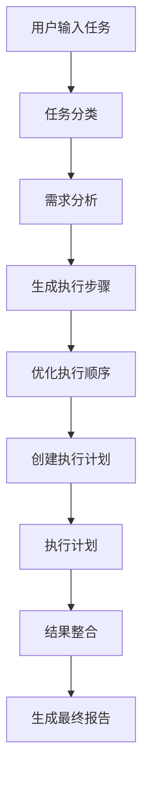

# ⚙️ 服务层文档

## 🎯 服务层概述

服务层是移动端AI专家工作流系统的核心，负责业务逻辑处理、数据管理、外部API调用等关键功能。采用模块化设计，每个服务专注于特定的功能领域。

## 📋 服务列表

| 服务名称 | 文件 | 主要功能 | 依赖关系 |
|---------|------|---------|----------|
| API通信服务 | `mobile-api.service.ts` | 与后端专家系统通信 | 无 |
| 存储服务 | `mobile-storage.service.ts` | 数据持久化和缓存 | 无 |
| 通知服务 | `mobile-notification.service.ts` | 通知管理 | storage |
| 工作流引擎 | `mobile-workflow-engine.service.ts` | 工作流执行 | api, storage |
| AI任务规划器 | `ai-task-planner.service.ts` | 智能任务规划 | api, storage |
| 工具集成服务 | `tool-integration.service.ts` | 外部工具集成 | storage |

## 🔌 API通信服务 (mobile-api.service.ts)

### 功能概述
负责与后端13个专家系统的通信，支持Smart Expert和Expert Consultation两套系统。

### 核心方法

#### `callSmartExpert(request)`
调用Smart Expert系统（7个专家）
```typescript
interface SmartExpertRequest {
  expert_id: AgentType
  task: string
  context?: string
}

// 使用示例
const response = await mobileAPIService.callSmartExpert({
  expert_id: 'activity_planner',
  task: '策划30人春游活动',
  context: '预算1000元'
})
```

#### `callExpertConsultation(request)`
调用Expert Consultation系统（6个专家）
```typescript
interface ExpertConsultationRequest {
  expert_type: ExpertConsultationType
  question: string
  context?: string
}

// 使用示例
const response = await mobileAPIService.callExpertConsultation({
  expert_type: 'planner',
  question: '如何制定招生策略？',
  context: '春季招生'
})
```

### 特性
- **离线队列** - 网络断开时自动排队，恢复后重试
- **重试机制** - 失败请求自动重试，指数退避
- **缓存策略** - 智能缓存响应，减少重复请求
- **错误处理** - 统一错误处理和用户友好提示

## 💾 存储服务 (mobile-storage.service.ts)

### 功能概述
提供多层次的数据存储解决方案，支持不同类型数据的持久化需求。

### 存储类型

| 类型 | 用途 | 特点 | 容量限制 |
|------|------|------|----------|
| MEMORY | 临时数据 | 最快，页面刷新丢失 | 受内存限制 |
| SESSION | 会话数据 | 标签页关闭丢失 | ~5MB |
| LOCAL | 持久数据 | 永久保存 | ~10MB |
| INDEXED_DB | 大量数据 | 结构化存储 | ~50MB+ |
| CACHE_API | 离线缓存 | PWA支持 | ~50MB+ |

### 核心方法

#### `set(key, data, config)`
存储数据
```typescript
await mobileStorageService.set('user_preferences', {
  theme: 'dark',
  language: 'zh-CN'
}, {
  type: StorageType.LOCAL,
  ttl: 30 * 24 * 60 * 60 * 1000, // 30天
  encrypt: true
})
```

#### `get(key, type)`
获取数据
```typescript
const preferences = await mobileStorageService.get('user_preferences', StorageType.LOCAL)
```

### 高级特性
- **数据压缩** - 自动压缩大型数据
- **加密存储** - 敏感数据加密保护
- **过期清理** - 自动清理过期数据
- **同步机制** - 支持云端同步
- **使用统计** - 存储空间使用分析

## 🔔 通知服务 (mobile-notification.service.ts)

### 功能概述
提供全方位的通知解决方案，包括本地通知、推送通知和应用内通知。

### 通知类型

#### 本地通知
```typescript
await mobileNotificationService.showNotification({
  type: NotificationType.WORKFLOW_COMPLETE,
  title: '🎉 工作流执行完成',
  body: '春游活动策划已完成',
  actions: [
    { action: 'view', title: '查看结果' },
    { action: 'share', title: '分享' }
  ]
})
```

#### 应用内通知
```typescript
const notificationId = mobileNotificationService.showInAppNotification({
  type: 'success',
  title: '操作成功',
  message: '数据已保存',
  duration: 3000
})
```

#### 定时提醒
```typescript
await mobileNotificationService.scheduleReminder(
  '会议提醒',
  '10分钟后开始家长会',
  10 * 60 * 1000 // 10分钟后
)
```

### 特性
- **权限管理** - 智能请求通知权限
- **触觉反馈** - 配合振动反馈
- **批量管理** - 批量发送和管理通知
- **统计分析** - 通知效果统计

## ⚡ 工作流引擎 (mobile-workflow-engine.service.ts)

### 功能概述
执行预定义的工作流，管理步骤执行、状态跟踪和结果收集。

### 核心概念

#### 工作流定义
```typescript
interface WorkflowDefinition {
  id: string
  name: string
  description: string
  steps: WorkflowStep[]
  metadata: WorkflowMetadata
}
```

#### 工作流步骤
```typescript
interface WorkflowStep {
  id: string
  name: string
  type: 'agent' | 'tool' | 'condition' | 'parallel'
  agent?: AgentConfig
  dependencies: string[]
  timeout: number
}
```

### 执行流程
1. **步骤验证** - 检查依赖关系和配置
2. **并行执行** - 支持无依赖步骤并行执行
3. **状态跟踪** - 实时更新执行状态
4. **错误处理** - 失败重试和降级处理
5. **结果收集** - 汇总所有步骤结果

### 使用示例
```typescript
const workflow: WorkflowDefinition = {
  id: 'activity_planning',
  name: '活动策划工作流',
  steps: [
    {
      id: 'theme_design',
      name: '主题设计',
      type: 'agent',
      agent: { type: 'activity_planner' },
      dependencies: []
    },
    {
      id: 'budget_analysis',
      name: '预算分析',
      type: 'agent',
      agent: { type: 'cost_analyst' },
      dependencies: ['theme_design']
    }
  ]
}

const results = await workflowEngine.executeWorkflow(workflow)
```

## 🧠 AI任务规划器 (ai-task-planner.service.ts)

### 功能概述
系统的核心智能组件，实现类似Claude的多轮任务执行能力。

### 核心能力

#### 1. 任务理解
- 自然语言解析
- 意图识别
- 需求提取
- 约束分析

#### 2. 计划生成
- 任务分解
- 步骤排序
- 依赖分析
- 资源分配

#### 3. 执行编排
- 专家调度
- 工具调用
- 状态管理
- 结果整合

### 执行流程



### 使用示例
```typescript
// 复杂任务输入
const taskDescription = `
创建2025年9月开学活动策划：
- 30人参会
- 预算1000元  
- 需要活动主题、海报、流程、预算分析
`

// 生成执行计划
const plan = await aiTaskPlannerService.generatePlan(taskDescription)

// 执行计划
const result = await aiTaskPlannerService.executePlan(plan.id, (step, progress) => {
  console.log(`执行步骤: ${step.name}, 进度: ${progress}%`)
})

// 查看结果
console.log(result.artifacts) // 文档、图片、数据等
```

## 🛠️ 工具集成服务 (tool-integration.service.ts)

### 功能概述
集成外部AI工具，为任务执行提供图片生成、文档生成、数据可视化等能力。

### 支持的工具

#### 图片生成
```typescript
const imageResult = await toolIntegrationService.generateImage({
  prompt: '春游活动海报设计',
  style: 'professional',
  size: '1024x1024'
})
```

#### 文档生成
```typescript
const docResult = await toolIntegrationService.generateDocument({
  title: '春游活动策划方案',
  content: {
    summary: '活动概述...',
    details: '详细内容...',
    budget: '预算分析...'
  },
  template: 'report'
})
```

#### 数据可视化
```typescript
const chartResult = await toolIntegrationService.generateVisualization({
  data: budgetData,
  chartType: 'pie',
  title: '预算分布图'
})
```

### 特性
- **多工具支持** - 集成多个AI工具API
- **降级处理** - 工具不可用时的备选方案
- **成本控制** - 使用量统计和成本管理
- **结果缓存** - 避免重复生成相同内容

## 🔄 服务间协作

### 典型协作流程

1. **用户输入** → `SmartTaskExecutor`组件
2. **任务规划** → `ai-task-planner.service`
3. **专家调用** → `mobile-api.service`
4. **工具调用** → `tool-integration.service`
5. **数据存储** → `mobile-storage.service`
6. **通知用户** → `mobile-notification.service`
7. **工作流执行** → `mobile-workflow-engine.service`

### 错误处理策略

- **重试机制** - 网络错误自动重试
- **降级处理** - 服务不可用时的备选方案
- **用户通知** - 友好的错误提示
- **日志记录** - 详细的错误日志

### 性能优化

- **并发控制** - 限制同时执行的任务数
- **缓存策略** - 智能缓存减少重复请求
- **资源管理** - 内存和网络资源优化
- **懒加载** - 按需加载服务模块

## 📊 监控和调试

### 性能监控
- 服务调用耗时统计
- 内存使用监控
- 网络请求分析
- 错误率统计

### 调试工具
- 详细的日志输出
- 状态检查接口
- 性能分析工具
- 错误追踪系统

---

*服务层的设计遵循单一职责原则，每个服务专注于特定功能，通过清晰的接口进行协作，确保系统的可维护性和可扩展性。*
