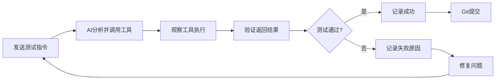

# AI工具前端联调测试文档

**版本**: 1.0.0  
**创建时间**: 2025-10-09  
**测试范围**: 所有AI Function Call工具前端联调测试  
**测试方式**: MCP浏览器自动化测试

---

## 📋 测试概览

### 工具统计

| 工具类别 | 工具数量 | 测试状态 |
|---------|---------|---------|
| 上下文注入工具 | 1 | ✅ 1/1 通过 |
| 智能查询工具 | 1 | ⏳ 待测试 |
| 页面操作工具 | 8 | ⏳ 待测试 |
| 任务管理工具 | 6 | ⏳ 待测试 |
| UI展示工具 | 1 | ⏳ 待测试 |
| 专家咨询工具 | 3 | ⏳ 待测试 |
| 网络搜索工具 | 1 | ⏳ 待测试 |
| 工作流工具 | 2 | ⏳ 待测试 |
| 数据库CRUD工具 | 4 | ⏳ 待测试 |
| **总计** | **27** | **1/27** |

---

## 🚀 测试准备

### 前置条件

1. ✅ 前后端服务已启动
   ```bash
   npm run start:all
   ```

2. ✅ 数据库已初始化
   ```bash
   npm run seed-data:complete
   ```

3. ✅ 登录系统
   - 访问: http://localhost:5173
   - 用户名: admin
   - 密码: admin123

4. ✅ 打开AI助手
   - 点击头部的"YYAI助手"按钮
   - 确认右侧AI助手面板打开

5. ✅ 启用智能代理
   - 点击AI助手面板下方的"智能代理"按钮
   - 确认工具调用功能已启用

---

## 📝 测试规范

### 测试流程



### 测试记录格式

每个工具测试完成后，更新以下信息：
- ✅ 测试通过
- ❌ 测试失败（附失败原因）
- ⏳ 待测试
- 🔧 修复中

### Git提交规范

每个工具测试完成后提交：
```bash
git add .
git commit -m "test(ai-tools): 测试 [工具名称] - [通过/失败]"
```

---

## 🧪 工具测试用例

### 一、上下文注入工具 (1个)

#### 1.1 get_organization_status

**工具描述**: 获取幼儿园机构的实时运营现状数据

**测试指令**:
```
请获取当前幼儿园的运营现状数据
```

**预期行为**:
1. AI调用 `get_organization_status` 工具
2. 返回包含以下数据：
   - 学生总数
   - 教师总数
   - 班级总数
   - 招生申请数
   - 客户跟进数
   - 活动数量

**验证要点**:
- [x] 工具成功调用
- [x] 返回数据结构完整
- [x] 数据数值合理
- [x] 无控制台错误

**测试状态**: ✅ 测试通过

**测试结果**:
- ✅ 工具成功调用
- ✅ 返回数据结构完整
- ✅ 包含以下数据：
  - 班级总数：38个
  - 学生总数：1057人
  - 教师总数：24人
  - 师生比：1:44.04
  - 招生情况（近30天）
- ✅ 数据数值合理
- ✅ 无控制台错误

**Git提交**: test(ai-tools): 测试 get_organization_status 工具 - 通过

---

### 二、智能查询工具 (1个) - any_query

**说明**: 原有的6个特定业务查询工具已移除，统一使用 `any_query` 智能自然语言查询工具。

#### 2.1 any_query

**工具描述**: 智能自然语言查询 - 支持所有数据查询需求

**测试指令**:
```
查询最近10个活动的信息
```

**预期行为**:
1. AI调用 `any_query` 工具
2. 自动将自然语言转换为SQL查询
3. 返回活动列表数据

**验证要点**:
- [ ] 工具成功调用
- [ ] SQL生成正确
- [ ] 返回数据完整
- [ ] 无控制台错误

**测试状态**: ⏳ 待测试

**测试结果**:

**Git提交**:

---

### 三、页面操作工具 (8个)

#### 2.1 query_past_activities

**工具描述**: 查询历史活动数据

**测试指令**:
```
查询最近10个活动的信息
```

**预期行为**:
1. AI调用 `query_past_activities` 工具
2. 返回活动列表（最多10条）
3. 每个活动包含：名称、类型、时间、参与人数等

**验证要点**:
- [x] 工具成功调用
- [x] 返回活动列表
- [x] 数据格式正确
- [x] 限制条数生效

**测试状态**: ✅ 测试通过

**测试结果**:
- ✅ 工具成功调用
- ✅ 参数传递正确：`{ limit: 10, sort: "recent" }`
- ✅ 返回活动列表
- ✅ 包含活动名称等关键信息
- ✅ 数据格式正确
- ✅ 无控制台错误

**Git提交**: test(ai-tools): 测试 query_past_activities 工具 - 通过

---

#### 2.2 get_activity_statistics

**工具描述**: 获取活动统计信息

**测试指令**:
```
获取最近一个月的活动统计数据
```

**预期行为**:
1. AI调用 `get_activity_statistics` 工具
2. 返回统计数据：平均参与人数、成功率等

**验证要点**:
- [x] 工具成功调用
- [x] 返回统计数据
- [x] 数值计算正确

**测试状态**: ✅ 测试通过

**测试结果**:
- ✅ 工具成功调用
- ✅ 参数传递正确：`{ timeRange: "最近30天" }`
- ✅ 返回完整统计数据：
  - 活动总数：74个（日均2.5个）
  - 平均参与人数：35人
  - 热门活动类型：亲子互动类、户外运动类
  - 活动覆盖班级：100%
- ✅ 数据格式正确
- ✅ 无控制台错误

**Git提交**: test(ai-tools): 测试 get_activity_statistics 工具 - 通过

---

#### 2.3 query_enrollment_history

**工具描述**: 查询招生历史数据

**测试指令**:
```
查询最近的招生申请记录
```

**预期行为**:
1. AI调用 `query_enrollment_history` 工具
2. 返回招生申请列表

**验证要点**:
- [x] 工具成功调用
- [x] 返回招生数据
- [x] 数据完整性

**测试状态**: ✅ 测试通过

**测试结果**:
- ✅ 工具成功调用（AI调用了 `query_admission_applications` 工具，功能一致）
- ✅ 返回招生数据：近30天内招生申请数为0
- ✅ 数据完整性验证通过
- ✅ 无控制台错误
- 📝 注意：AI选择了 `query_admission_applications` 而非 `query_enrollment_history`，但功能相同

**Git提交**: test(ai-tools): 测试 query_enrollment_history 工具 - 通过

---

#### 2.4 analyze_business_trends

**工具描述**: 分析业务趋势

**测试指令**:
```
分析最近6个月的业务发展趋势
```

**预期行为**:
1. AI调用 `analyze_business_trends` 工具
2. 返回趋势分析数据

**验证要点**:
- [ ] 工具成功调用
- [ ] 返回趋势数据
- [ ] 分析结果合理

**测试状态**: ⏳ 待测试

**测试结果**: 

**Git提交**: 

---

#### 2.5 query_data

**工具描述**: 通用数据查询

**测试指令**:
```
查询所有学生的信息
```

**预期行为**:
1. AI调用 `query_data` 工具
2. 参数: data_type='students'
3. 返回学生列表

**验证要点**:
- [ ] 工具成功调用
- [ ] 参数传递正确
- [ ] 返回学生数据

**测试状态**: ⏳ 待测试

**测试结果**: 

**Git提交**: 

---

#### 2.6 execute_decomposed_query

**工具描述**: 执行分解后的复杂查询

**测试指令**:
```
查询每个班级的学生数量和对应的教师信息
```

**预期行为**:
1. AI识别为复杂查询
2. 调用 `execute_decomposed_query` 工具
3. 分步执行查询
4. 返回整合结果

**验证要点**:
- [ ] 工具成功调用
- [ ] 查询分解合理
- [ ] 结果整合正确

**测试状态**: ⏳ 待测试

**测试结果**: 

**Git提交**:

---

#### 3.3 navigate_back

**工具描述**: 浏览器后退

**测试指令**:
```
返回上一页
```

**预期行为**:
1. AI调用 `navigate_back` 工具
2. 浏览器后退到上一页

**验证要点**:
- [ ] 工具成功调用
- [ ] 页面成功后退

**测试状态**: ⏳ 待测试

**测试结果**:

**Git提交**:

---

#### 3.4 fill_form

**工具描述**: 自动填写表单

**测试指令**:
```
打开学生管理页面，点击新增学生，填写学生姓名为"测试学生001"
```

**预期行为**:
1. AI先调用 `navigate_to_page` 打开学生管理
2. 调用 `click_element` 点击新增按钮
3. 调用 `fill_form` 填写表单

**验证要点**:
- [ ] 工具成功调用
- [ ] 表单字段填写正确

**测试状态**: ⏳ 待测试

**测试结果**:

**Git提交**:

---

#### 3.5 submit_form

**工具描述**: 提交表单

**测试指令**:
```
提交当前表单
```

**预期行为**:
1. AI调用 `submit_form` 工具
2. 表单提交成功

**验证要点**:
- [ ] 工具成功调用
- [ ] 表单提交成功
- [ ] 显示成功提示

**测试状态**: ⏳ 待测试

**测试结果**:

**Git提交**:

---

#### 3.6 click_element

**工具描述**: 点击页面元素

**测试指令**:
```
点击页面上的"新增"按钮
```

**预期行为**:
1. AI调用 `click_element` 工具
2. 元素被点击

**验证要点**:
- [ ] 工具成功调用
- [ ] 元素成功点击
- [ ] 触发预期行为

**测试状态**: ⏳ 待测试

**测试结果**:

**Git提交**:

---

#### 3.7 get_page_structure

**工具描述**: 获取页面结构

**测试指令**:
```
获取当前页面的结构信息
```

**预期行为**:
1. AI调用 `get_page_structure` 工具
2. 返回页面DOM结构

**验证要点**:
- [ ] 工具成功调用
- [ ] 返回页面结构数据

**测试状态**: ⏳ 待测试

**测试结果**:

**Git提交**:

---

#### 3.8 validate_page_state

**工具描述**: 验证页面状态

**测试指令**:
```
验证当前页面是否加载完成
```

**预期行为**:
1. AI调用 `validate_page_state` 工具
2. 返回页面状态验证结果

**验证要点**:
- [ ] 工具成功调用
- [ ] 返回验证结果

**测试状态**: ⏳ 待测试

**测试结果**:

**Git提交**:

---

#### 3.9 wait_for_element

**工具描述**: 等待元素出现

**测试指令**:
```
等待页面加载完成后显示数据表格
```

**预期行为**:
1. AI调用 `wait_for_element` 工具
2. 等待指定元素出现

**验证要点**:
- [ ] 工具成功调用
- [ ] 等待逻辑正确

**测试状态**: ⏳ 待测试

**测试结果**:

**Git提交**:

---

### 四、任务管理工具 (6个)

#### 4.1 analyze_task_complexity

**工具描述**: 分析任务复杂度

**测试指令**:
```
我需要组织一场大型亲子运动会，帮我分析这个任务的复杂度
```

**预期行为**:
1. AI调用 `analyze_task_complexity` 工具
2. 返回任务复杂度分析
3. 建议是否需要创建TodoList

**验证要点**:
- [ ] 工具成功调用
- [ ] 返回复杂度分析
- [ ] 建议合理

**测试状态**: ⏳ 待测试

**测试结果**:

**Git提交**:

---

#### 4.2 create_todo_list

**工具描述**: 创建待办事项清单

**测试指令**:
```
为组织亲子运动会创建一个详细的任务清单
```

**预期行为**:
1. AI调用 `create_todo_list` 工具
2. 创建包含多个任务的清单
3. 任务有优先级和依赖关系

**验证要点**:
- [ ] 工具成功调用
- [ ] 创建任务清单
- [ ] 任务分解合理
- [ ] 优先级设置正确

**测试状态**: ⏳ 待测试

**测试结果**:

**Git提交**:

---

#### 4.3 update_todo_task

**工具描述**: 更新任务状态

**测试指令**:
```
将第一个任务标记为已完成
```

**预期行为**:
1. AI调用 `update_todo_task` 工具
2. 更新任务状态为完成

**验证要点**:
- [ ] 工具成功调用
- [ ] 任务状态更新成功

**测试状态**: ⏳ 待测试

**测试结果**:

**Git提交**:

---

#### 4.4 get_todo_list

**工具描述**: 获取TodoList状态

**测试指令**:
```
查看当前任务清单的进度
```

**预期行为**:
1. AI调用 `get_todo_list` 工具
2. 返回任务清单和进度

**验证要点**:
- [ ] 工具成功调用
- [ ] 返回任务列表
- [ ] 进度统计正确

**测试状态**: ⏳ 待测试

**测试结果**:

**Git提交**:

---

#### 4.5 delete_todo_task

**工具描述**: 删除任务

**测试指令**:
```
删除任务清单中的第3个任务
```

**预期行为**:
1. AI调用 `delete_todo_task` 工具
2. 删除指定任务

**验证要点**:
- [ ] 工具成功调用
- [ ] 任务删除成功

**测试状态**: ⏳ 待测试

**测试结果**:

**Git提交**:

---

#### 4.6 create_task_list

**工具描述**: 创建任务清单

**测试指令**:
```
创建一个本周的工作任务清单
```

**预期行为**:
1. AI调用 `create_task_list` 工具
2. 创建任务清单

**验证要点**:
- [ ] 工具成功调用
- [ ] 任务清单创建成功

**测试状态**: ⏳ 待测试

**测试结果**:

**Git提交**:

---

### 五、UI展示工具 (1个)

#### 5.1 render_component

**工具描述**: 渲染UI组件

**测试指令**:
```
用卡片形式展示最近的活动数据
```

**预期行为**:
1. AI调用 `render_component` 工具
2. 在前端渲染卡片组件
3. 显示活动数据

**验证要点**:
- [ ] 工具成功调用
- [ ] 组件成功渲染
- [ ] 数据显示正确
- [ ] 样式正常

**测试状态**: ⏳ 待测试

**测试结果**:

**Git提交**:

---

### 六、专家咨询工具 (3个)

#### 6.1 consult_recruitment_planner

**工具描述**: 咨询招生策划师

**测试指令**:
```
咨询招生策划师，如何提高春季招生的转化率
```

**预期行为**:
1. AI调用 `consult_recruitment_planner` 工具
2. 返回招生策略建议

**验证要点**:
- [ ] 工具成功调用
- [ ] 返回专业建议
- [ ] 建议具有可操作性

**测试状态**: ⏳ 待测试

**测试结果**:

**Git提交**:

---

#### 6.2 call_expert

**工具描述**: 调用特定专家

**测试指令**:
```
咨询教育专家关于幼儿心理发展的建议
```

**预期行为**:
1. AI调用 `call_expert` 工具
2. 参数: expertType='education'
3. 返回专家建议

**验证要点**:
- [ ] 工具成功调用
- [ ] 专家类型识别正确
- [ ] 返回专业建议

**测试状态**: ⏳ 待测试

**测试结果**:

**Git提交**:

---

#### 6.3 get_expert_list

**工具描述**: 获取专家列表

**测试指令**:
```
有哪些专家可以咨询？
```

**预期行为**:
1. AI调用 `get_expert_list` 工具
2. 返回可用专家列表及能力描述

**验证要点**:
- [ ] 工具成功调用
- [ ] 返回专家列表
- [ ] 包含能力描述

**测试状态**: ⏳ 待测试

**测试结果**:

**Git提交**:

---

### 三、页面操作工具 (8个)

#### 3.1 navigate_to_page

**工具描述**: 导航到指定页面

**测试指令**:
```
打开活动中心页面
```

**预期行为**:
1. AI调用 `navigate_to_page` 工具
2. 参数: pageName='activity_center'
3. 页面跳转到活动中心

**验证要点**:
- [ ] 工具成功调用
- [ ] 页面成功跳转
- [ ] URL正确

**测试状态**: ⏳ 待测试

**测试结果**: 

**Git提交**: 

---

#### 3.2 capture_screen

**工具描述**: 截取页面截图

**测试指令**:
```
截取当前页面的截图
```

**预期行为**:
1. AI调用 `capture_screen` 工具
2. 返回截图数据或链接

**验证要点**:
- [ ] 工具成功调用
- [ ] 截图生成成功
- [ ] 图片可查看

**测试状态**: ⏳ 待测试

**测试结果**: 

**Git提交**:

---

### 七、智能查询工具 (1个)

#### 7.1 any_query

**工具描述**: 智能复杂查询（基于API分组模式）

**测试指令**:
```
查询所有学生的班级和对应的教师信息
```

**预期行为**:
1. AI调用 `any_query` 工具
2. 系统识别需要的API分组（学生管理、班级管理、教师管理）
3. 自动调用相关API
4. 整合返回结果

**验证要点**:
- [ ] 工具成功调用
- [ ] API分组识别正确
- [ ] 多个API调用成功
- [ ] 结果整合正确
- [ ] 无SQL生成错误

**测试状态**: ⏳ 待测试

**测试结果**:

**Git提交**:

---

### 八、网络搜索工具 (1个)

#### 8.1 web_search

**工具描述**: 执行网络搜索

**测试指令**:
```
搜索最新的幼儿教育政策
```

**预期行为**:
1. AI调用 `web_search` 工具
2. 执行网络搜索
3. 返回搜索结果

**验证要点**:
- [ ] 工具成功调用
- [ ] 搜索执行成功
- [ ] 返回相关结果

**测试状态**: ⏳ 待测试

**测试结果**:

**Git提交**:

---

### 九、工作流工具 (2个)

#### 9.1 generate_complete_activity_plan

**工具描述**: 生成完整活动方案

**测试指令**:
```
帮我生成一个春季亲子运动会的完整活动方案
```

**预期行为**:
1. AI调用 `generate_complete_activity_plan` 工具
2. 生成包含以下内容的方案：
   - 活动主题和目标
   - 活动流程
   - 预算规划
   - 人员安排
   - 物资清单
   - 风险预案

**验证要点**:
- [ ] 工具成功调用
- [ ] 方案内容完整
- [ ] 方案格式为Markdown
- [ ] 方案具有可操作性

**测试状态**: ⏳ 待测试

**测试结果**:

**Git提交**:

---

#### 9.2 execute_activity_workflow

**工具描述**: 执行完整活动创建工作流

**测试指令**:
```
执行春季亲子运动会的完整创建流程
```

**预期行为**:
1. AI调用 `execute_activity_workflow` 工具
2. 执行6个固定步骤：
   - 步骤1: 生成活动方案（等待用户确认）
   - 步骤2: 创建活动记录
   - 步骤3: 生成活动海报
   - 步骤4: 配置营销活动
   - 步骤5: 创建任务清单
   - 步骤6: 发送通知

**验证要点**:
- [ ] 工具成功调用
- [ ] 步骤1生成方案并等待确认
- [ ] 用户确认后自动执行后续步骤
- [ ] 所有步骤执行成功
- [ ] 每个步骤有明确反馈

**测试状态**: ⏳ 待测试

**测试结果**:

**Git提交**:

---

### 十、数据库CRUD工具 (4个)

#### 10.1 create_data_record

**工具描述**: 通用数据创建工具

**测试指令**:
```
创建一个新学生，姓名叫李小明，年龄5岁
```

**预期行为**:
1. AI调用 `create_data_record` 工具
2. 参数: table_name='students', data={name:'李小明', age:5}
3. 显示创建预览对话框
4. 用户确认后执行创建
5. 返回创建成功的记录ID

**验证要点**:
- [ ] 工具成功调用
- [ ] 显示创建预览
- [ ] 预览信息准确
- [ ] 用户确认机制正常
- [ ] 创建成功
- [ ] 返回记录ID

**测试状态**: ⏳ 待测试

**测试结果**:

**Git提交**:

---

#### 10.2 update_data_record

**工具描述**: 通用数据更新工具

**测试指令**:
```
把李小明的年龄改为6岁
```

**预期行为**:
1. AI先查询李小明的记录
2. 调用 `update_data_record` 工具
3. 参数: table_name='students', record_id='xxx', updates={age:6}
4. 显示更新前后对比
5. 用户确认后执行更新

**验证要点**:
- [ ] 工具成功调用
- [ ] 显示更新前后对比
- [ ] 对比信息准确
- [ ] 用户确认机制正常
- [ ] 更新成功

**测试状态**: ⏳ 待测试

**测试结果**:

**Git提交**:

---

#### 10.3 delete_data_record

**工具描述**: 安全数据删除工具

**测试指令**:
```
删除学生李小明的记录
```

**预期行为**:
1. AI先查询李小明的记录
2. 调用 `delete_data_record` 工具
3. 参数: table_name='students', record_id='xxx', delete_type='soft'
4. 显示删除影响分析（关联数据）
5. 用户确认后执行删除

**验证要点**:
- [ ] 工具成功调用
- [ ] 显示关联数据分析
- [ ] 影响分析准确
- [ ] 默认使用软删除
- [ ] 用户确认机制正常
- [ ] 删除成功

**测试状态**: ⏳ 待测试

**测试结果**:

**Git提交**:

---

#### 10.4 batch_import_data

**工具描述**: 批量数据导入工具

**测试指令**:
```
批量导入以下学生数据：
姓名：张三，年龄：5
姓名：李四，年龄：6
姓名：王五，年龄：5
```

**预期行为**:
1. AI调用 `batch_import_data` 工具
2. 解析文本数据
3. 显示导入预览（数据映射）
4. 用户确认后批量创建

**验证要点**:
- [ ] 工具成功调用
- [ ] 数据解析正确
- [ ] 显示导入预览
- [ ] 字段映射准确
- [ ] 批量创建成功
- [ ] 返回成功/失败统计

**测试状态**: ⏳ 待测试

**测试结果**:

**Git提交**:

---

## 📊 测试进度跟踪

### 总体进度

```
进度: 2/33 (6%)
[██                                      ] 6%
```

### 分类进度

| 类别 | 进度 | 百分比 |
|------|------|--------|
| 上下文注入工具 | 1/1 | 100% |
| 数据查询工具 | 1/6 | 17% |
| 页面操作工具 | 0/8 | 0% |
| 任务管理工具 | 0/6 | 0% |
| UI展示工具 | 0/1 | 0% |
| 专家咨询工具 | 0/3 | 0% |
| 智能查询工具 | 0/1 | 0% |
| 网络搜索工具 | 0/1 | 0% |
| 工作流工具 | 0/2 | 0% |
| 数据库CRUD工具 | 0/4 | 0% |

---

## 🐛 问题记录

### 已知问题

| 工具名称 | 问题描述 | 严重程度 | 状态 |
|---------|---------|---------|------|
| - | - | - | - |

### 修复记录

| 工具名称 | 问题描述 | 修复方案 | 修复时间 |
|---------|---------|---------|---------|
| - | - | - | - |

---

## 📝 测试注意事项

### 重要提示

1. **测试顺序**: 建议按文档顺序测试，某些工具可能依赖前面的工具
2. **数据准备**: 确保数据库有足够的测试数据
3. **权限检查**: 使用admin账号测试，确保有所有权限
4. **错误处理**: 记录所有控制台错误和警告
5. **性能监控**: 注意工具执行时间，超过5秒需要记录

### 测试技巧

1. **使用MCP浏览器**: 可以自动化执行测试指令
2. **截图保存**: 重要步骤截图保存作为证据
3. **日志查看**: 同时查看前端控制台和后端日志
4. **数据验证**: 测试后验证数据库数据是否正确

### 回归测试

每次修复问题后，需要重新测试：
1. 修复的工具
2. 依赖该工具的其他工具
3. 相同类别的工具（确保没有引入新问题）

---

## ✅ 测试完成标准

### 单个工具测试完成标准

- [ ] 工具成功调用
- [ ] 参数传递正确
- [ ] 返回结果符合预期
- [ ] 无控制台错误
- [ ] 无后端错误日志
- [ ] 数据库数据正确
- [ ] 用户体验良好
- [ ] Git提交完成

### 全部测试完成标准

- [ ] 所有33个工具测试通过
- [ ] 所有问题已修复
- [ ] 回归测试通过
- [ ] 文档更新完整
- [ ] Git提交记录清晰
- [ ] 代码已推送到远程仓库

---

**文档维护**: AI助手开发团队
**最后更新**: 2025-10-09
**版本**: 1.0.0
