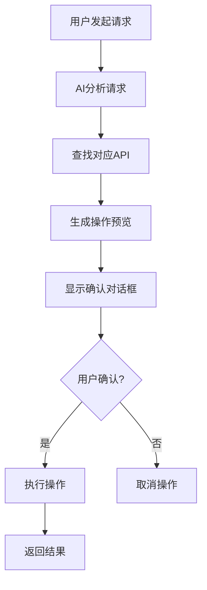

# AI Function Call CRUD工具使用指南

**版本**: 1.0.0  
**发布时间**: 2025-10-08  
**适用范围**: 幼儿园管理系统AI助手

---

## 📋 目录

- [工具概览](#工具概览)
- [使用流程](#使用流程)
- [工具详解](#工具详解)
- [最佳实践](#最佳实践)
- [故障排除](#故障排除)

---

## 🚀 工具概览

### 新增CRUD工具

| 工具名称 | 功能描述 | 安全级别 | 确认机制 |
|----------|----------|----------|----------|
| `create_data_record` | 通用数据创建工具 | 中等 | 两阶段确认 |
| `update_data_record` | 通用数据更新工具 | 中等 | 前后对比确认 |
| `delete_data_record` | 安全数据删除工具 | 高 | 影响分析确认 |

### 支持的数据表

- `students` - 学生信息
- `teachers` - 教师信息  
- `activities` - 活动信息
- `classes` - 班级信息
- `parents` - 家长信息
- `users` - 用户信息
- `enrollments` - 招生申请
- `todos` - 待办事项

---

## 🔄 使用流程

### 两阶段确认机制



### 典型对话流程

**用户**: "帮我创建一个新学生，姓名张小明，年龄5岁"

**AI第一阶段响应**:
```
📋 已分析创建请求，请确认后执行创建操作

操作详情：
- 目标表：学生表 (students)
- API端点：/api/students
- 操作类型：创建 (POST)

将要创建的数据：
- 姓名：张小明
- 年龄：5岁
- 学号：S20240001 (自动生成)
- 状态：活跃

请确认是否执行此操作？
```

**用户确认后**:
```
✅ 成功创建学生记录
- 学生ID：123
- 学号：S20240001
- 创建时间：2025-10-08 10:30:00
```

---

## 🛠️ 工具详解

### 1. create_data_record - 数据创建工具

**功能**: 智能创建各类数据记录

**参数**:
```typescript
{
  table_name: "students",           // 必填：目标表名
  data: {                          // 必填：创建数据
    name: "张小明",
    age: 5,
    class_id: "1"
  },
  description: "创建新学生",        // 可选：操作描述
  auto_confirm: false              // 可选：自动确认
}
```

**使用示例**:
```
用户: "创建一个新活动：春季运动会，时间3月15日"
AI: 分析请求 → 生成预览 → 用户确认 → 执行创建
```

**AI分析内容**:
- ✅ API端点识别
- ✅ 必填字段检查
- ✅ 数据格式验证
- ✅ 冲突检测
- ✅ 自动字段生成

### 2. update_data_record - 数据更新工具

**功能**: 安全更新现有数据记录

**参数**:
```typescript
{
  table_name: "students",          // 必填：目标表名
  record_id: "123",               // 必填：记录ID
  updates: {                      // 必填：更新内容
    age: 6,
    class_id: "2"
  },
  description: "学生升班",         // 可选：操作描述
  auto_confirm: false             // 可选：自动确认
}
```

**使用示例**:
```
用户: "把张小明的年龄改为6岁，班级改为大班"
AI: 获取当前数据 → 生成对比 → 用户确认 → 执行更新
```

**更新前后对比**:
```
字段对比：
┌─────────┬─────────┬─────────┬─────────┐
│ 字段    │ 更新前  │ 更新后  │ 变化类型 │
├─────────┼─────────┼─────────┼─────────┤
│ 年龄    │ 5岁     │ 6岁     │ 修改    │
│ 班级ID  │ 1       │ 2       │ 修改    │
└─────────┴─────────┴─────────┴─────────┘
```

### 3. delete_data_record - 数据删除工具

**功能**: 安全删除数据记录，包含关联分析

**参数**:
```typescript
{
  table_name: "students",          // 必填：目标表名
  record_id: "123",               // 必填：记录ID
  delete_type: "soft",            // 可选：删除类型
  description: "学生毕业",         // 可选：操作描述
  force_delete: false             // 可选：强制删除
}
```

**删除类型**:
- `soft` - 软删除（推荐，可恢复）
- `hard` - 硬删除（不可恢复）

**使用示例**:
```
用户: "删除学生张小明的记录"
AI: 检查关联数据 → 分析影响 → 用户确认 → 执行删除
```

**关联数据分析**:
```
删除影响分析：
- 目标记录：学生 张小明 (ID: 123)
- 关联数据：3条记录将受影响
  - 活动报名记录：2条
  - 成绩报告：1条
- 删除策略：软删除（可恢复）
- 风险级别：低
```

---

## 💡 最佳实践

### 1. 创建数据最佳实践

**✅ 推荐做法**:
```typescript
// 提供完整信息
{
  table_name: "students",
  data: {
    name: "张小明",
    age: 5,
    gender: "male",
    parent_phone: "13800138000"
  },
  description: "新生入学登记"
}
```

**❌ 避免做法**:
```typescript
// 信息不完整
{
  table_name: "students", 
  data: { name: "张小明" }  // 缺少关键信息
}
```

### 2. 更新数据最佳实践

**✅ 推荐做法**:
```typescript
// 明确更新内容
{
  table_name: "students",
  record_id: "123",
  updates: { class_id: "2" },
  description: "学生升班到大班"
}
```

**❌ 避免做法**:
```typescript
// 批量更新过多字段
{
  updates: { 
    name: "...", age: "...", class_id: "...", 
    status: "...", parent_id: "..." 
  }  // 一次更新太多字段
}
```

### 3. 删除数据最佳实践

**✅ 推荐做法**:
```typescript
// 优先使用软删除
{
  table_name: "students",
  record_id: "123", 
  delete_type: "soft",
  description: "学生毕业离园"
}
```

**❌ 避免做法**:
```typescript
// 轻易使用硬删除
{
  delete_type: "hard",  // 危险操作
  force_delete: true    // 跳过安全检查
}
```

---

## 🔧 故障排除

### 常见问题

#### 1. "未找到对应的API端点"

**原因**: 表名不在支持列表中
**解决**: 使用支持的表名：students, teachers, activities, classes, parents, users, enrollments, todos

#### 2. "缺少必填字段"

**原因**: 创建数据缺少必要字段
**解决**: 根据AI提示补充必填字段

#### 3. "记录不存在"

**原因**: 更新/删除的记录ID不存在
**解决**: 先使用 `any_query` 查询确认记录存在

#### 4. "存在关联数据，无法删除"

**原因**: 硬删除时检测到关联数据
**解决**: 
- 使用软删除：`delete_type: "soft"`
- 或先处理关联数据
- 或使用强制删除：`force_delete: true`

### 调试技巧

#### 1. 查看详细日志
```
用户: "创建学生时显示详细过程"
AI: 会显示每个步骤的详细信息
```

#### 2. 测试模式
```typescript
// 使用自动确认进行快速测试
{
  auto_confirm: true  // 仅限简单操作
}
```

#### 3. 分步操作
```
1. 先用 any_query 查询现有数据
2. 再用 CRUD 工具进行操作
3. 最后用 any_query 验证结果
```

---

## 📈 性能优化

### 1. 批量操作建议

**当前**: 单条记录操作
**未来**: 将支持批量操作工具

### 2. 缓存机制

**当前**: 每次都重新分析
**未来**: 相似操作缓存分析结果

### 3. 异步处理

**当前**: 同步操作
**未来**: 大批量操作异步处理

---

## 🔮 未来规划

### 短期 (1个月内)
- ✅ 集成真实API调用
- ✅ 完善前端确认对话框
- ✅ 添加操作历史记录

### 中期 (3个月内)
- 🔄 批量CRUD操作支持
- 🔄 数据验证规则引擎
- 🔄 操作权限细化控制

### 长期 (6个月内)
- 🔮 智能数据建议
- 🔮 操作模板系统
- 🔮 数据关系可视化

---

## 📞 技术支持

**遇到问题？**
1. 查看本文档的故障排除部分
2. 检查工具参数是否正确
3. 确认用户权限是否足够
4. 联系开发团队获取支持

**反馈渠道**:
- 技术问题：开发团队
- 功能建议：产品团队
- 使用疑问：用户支持

---

**文档维护**: AI助手开发团队  
**最后更新**: 2025-10-08  
**版本**: 1.0.0
