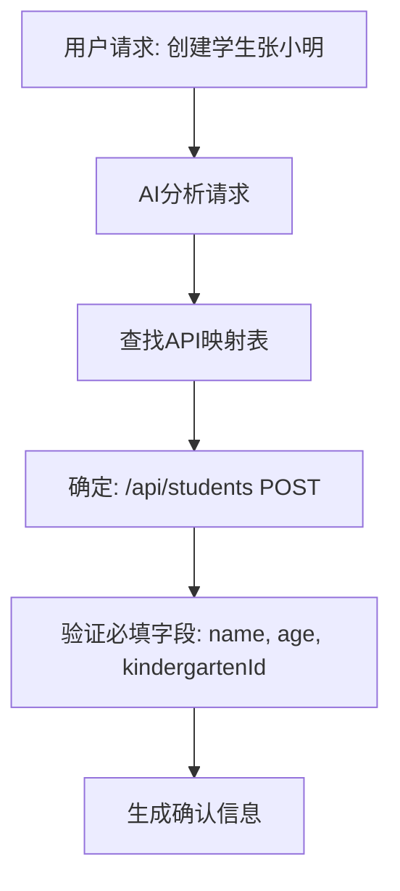
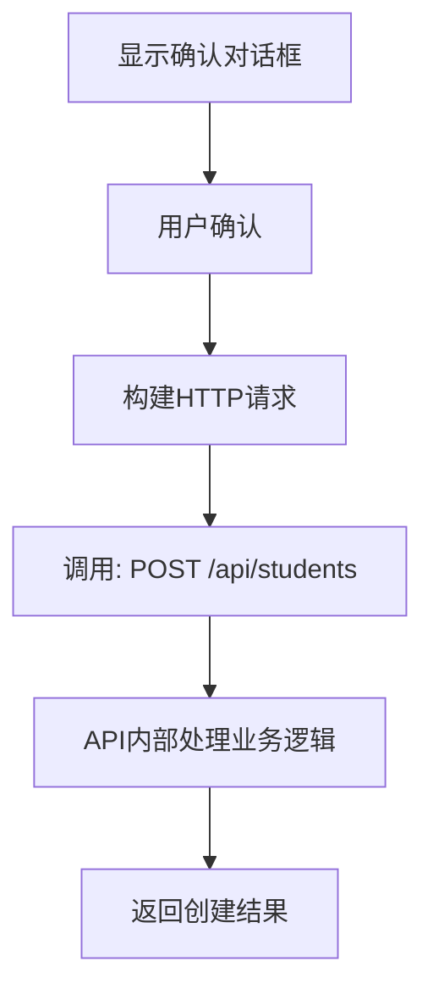

# CRUD工具正确调用链路设计

**版本**: 2.0.0  
**修订时间**: 2025-10-08  
**修订原因**: 基于业务中心API映射表重新设计调用链路

---

## 🎯 问题分析与解决

### ❌ 之前的错误理解

我之前的实现确实有问题：

1. **动态生成SQL** - 在工具内部根据参数生成不同的SQL语句
2. **自定义删除策略** - 允许工具决定软删除还是硬删除
3. **绕过API逻辑** - 没有真正调用现有的API端点

```typescript
// ❌ 错误的方式
if (delete_type === 'soft') {
  sql = "UPDATE students SET deleted_at = NOW() WHERE id = ?"
} else {
  sql = "DELETE FROM students WHERE id = ?"
}
```

### ✅ 正确的调用链路

基于业务中心API映射表，正确的调用链路应该是：

```typescript
// ✅ 正确的方式 - 直接调用现有API
const response = await fetch('/api/students/123', {
  method: 'DELETE',  // 固定的HTTP方法
  headers: { 'Authorization': `Bearer ${token}` }
});
// 删除策略完全由API内部决定，工具不参与
```

---

## 🗺️ 基于业务中心的API映射

### 映射表结构

```typescript
interface ApiMapping {
  center: string;           // 业务中心名称
  endpoint: string;         // API端点路径
  method: string;           // HTTP方法
  requiredFields: string[]; // 必填字段
  optionalFields: string[]; // 可选字段
  permissions: string[];    // 权限要求
  deletionStrategy: 'soft' | 'hard'; // 删除策略（固定）
}
```

### 实际映射示例

```typescript
const apiMappings = {
  'students': {
    center: '人员中心',
    endpoint: '/api/students',
    method: 'POST',
    requiredFields: ['name', 'age', 'kindergartenId'],
    optionalFields: ['classId', 'parentId', 'status', 'remark'],
    permissions: ['STUDENT_VIEW', 'STUDENT_MANAGE'],
    deletionStrategy: 'hard'  // 学生删除是硬删除（由API决定）
  },
  'teachers': {
    center: '人员中心',
    endpoint: '/api/teachers',
    method: 'POST',
    requiredFields: ['userId', 'kindergartenId', 'position'],
    optionalFields: ['teacherNo', 'status', 'remark'],
    permissions: ['TEACHER_VIEW', 'TEACHER_MANAGE'],
    deletionStrategy: 'soft'  // 教师删除是软删除（由API决定）
  }
};
```

---

## 🔄 正确的调用流程

### 第一阶段：AI分析和API映射



### 第二阶段：用户确认和API调用



---

## 🔧 具体实现

### 1. 创建操作 (create_data_record)

```typescript
async function executeCreateOperation(confirmationData: any) {
  // 1. 从映射表获取API信息
  const apiMapping = getApiMapping(confirmationData.table_name);
  
  // 2. 构建API调用
  const apiUrl = `${API_BASE_URL}${apiMapping.endpoint}`;
  
  // 3. 发起HTTP请求
  const response = await fetch(apiUrl, {
    method: apiMapping.method,  // 固定为POST
    headers: {
      'Content-Type': 'application/json',
      'Authorization': `Bearer ${token}`
    },
    body: JSON.stringify(confirmationData.data_preview.processed_data)
  });
  
  // 4. 处理API响应
  const result = await response.json();
  return result;
}
```

### 2. 更新操作 (update_data_record)

```typescript
async function executeUpdateOperation(confirmationData: any) {
  // 1. 从映射表获取API信息
  const apiMapping = getApiMapping(confirmationData.table_name);
  
  // 2. 构建更新API调用
  const apiUrl = `${API_BASE_URL}${apiMapping.endpoint}/${confirmationData.record_id}`;
  
  // 3. 发起HTTP请求
  const response = await fetch(apiUrl, {
    method: 'PUT',  // 固定为PUT
    headers: {
      'Content-Type': 'application/json',
      'Authorization': `Bearer ${token}`
    },
    body: JSON.stringify(confirmationData.update_details.updates)
  });
  
  // 4. 处理API响应
  const result = await response.json();
  return result;
}
```

### 3. 删除操作 (delete_data_record)

```typescript
async function executeDeleteOperation(confirmationData: any) {
  // 1. 从映射表获取API信息
  const apiMapping = getApiMapping(confirmationData.table_name);
  
  // 2. 构建删除API调用（不传递删除类型参数）
  const apiUrl = `${API_BASE_URL}${apiMapping.endpoint}/${confirmationData.record_id}`;
  
  // 3. 发起HTTP请求
  const response = await fetch(apiUrl, {
    method: 'DELETE',  // 固定为DELETE
    headers: {
      'Authorization': `Bearer ${token}`
    }
    // 注意：不传递delete_type参数，删除策略由API决定
  });
  
  // 4. 处理API响应
  const result = await response.json();
  
  // 5. 从映射表获取删除策略信息（仅用于显示）
  const deletionStrategy = apiMapping.deletionStrategy;
  
  return {
    ...result,
    deletion_strategy: deletionStrategy  // 仅用于用户提示
  };
}
```

---

## 🛡️ 安全性和一致性保证

### 1. API行为的一致性

```typescript
// ✅ 工具行为与API行为完全一致
const apiConsistency = {
  'students': {
    delete: 'hard',  // API实现为硬删除
    validation: ['name', 'age', 'kindergartenId'],
    business_rules: ['年龄范围3-8岁', '幼儿园ID必须存在']
  },
  'teachers': {
    delete: 'soft',  // API实现为软删除
    validation: ['userId', 'kindergartenId', 'position'],
    business_rules: ['用户ID必须存在', '职位必须有效']
  }
};
```

### 2. 权限控制

```typescript
// ✅ 权限检查与API保持一致
const permissionCheck = {
  before_api_call: [
    'check_user_authentication',
    'verify_required_permissions',
    'validate_data_access_scope'
  ],
  api_level: [
    'middleware_permission_check',
    'role_based_access_control',
    'data_level_security'
  ]
};
```

### 3. 数据验证

```typescript
// ✅ 数据验证与API保持一致
const validationLayers = {
  tool_level: [
    'required_fields_check',
    'data_type_validation',
    'basic_format_check'
  ],
  api_level: [
    'business_rule_validation',
    'database_constraint_check',
    'relationship_validation'
  ]
};
```

---

## 📊 调用链路对比

### 之前的错误链路

```
用户请求 → AI分析 → 工具内部决策 → 生成SQL → 直接数据库操作
```

**问题**:
- 绕过了API的业务逻辑
- 工具承担了不应该承担的责任
- 与现有系统不一致

### 正确的调用链路

```
用户请求 → AI分析 → 查找API映射 → 用户确认 → HTTP API调用 → API内部处理
```

**优势**:
- 完全复用现有API逻辑
- 保持系统一致性
- 工具职责清晰

---

## 🎯 工具职责边界

### ✅ 工具应该做的

1. **请求分析** - 理解用户意图
2. **API映射** - 找到对应的API端点
3. **数据准备** - 准备API调用参数
4. **用户确认** - 生成确认信息
5. **HTTP调用** - 发起API请求
6. **结果处理** - 处理API响应

### ❌ 工具不应该做的

1. **业务逻辑** - 不实现业务规则
2. **数据验证** - 不做深度数据验证（API负责）
3. **权限控制** - 不实现权限逻辑（API负责）
4. **删除策略** - 不决定删除方式（API决定）
5. **数据库操作** - 不直接操作数据库

---

## 🔮 未来扩展

### 1. 批量操作支持

```typescript
// 未来可以支持批量API调用
const batchOperation = {
  endpoint: '/api/students/batch',
  method: 'POST',
  data: {
    operation: 'create',
    items: [student1, student2, student3]
  }
};
```

### 2. 事务支持

```typescript
// 未来可以支持事务性API调用
const transactionOperation = {
  endpoint: '/api/transaction',
  method: 'POST',
  data: {
    operations: [
      { type: 'create', endpoint: '/api/students', data: studentData },
      { type: 'update', endpoint: '/api/classes/1', data: classData }
    ]
  }
};
```

---

## 📝 总结

通过基于业务中心API映射表的重新设计，我们的CRUD工具现在：

1. **完全依赖现有API** - 不绕过任何业务逻辑
2. **保持系统一致性** - 与现有系统行为完全一致
3. **职责边界清晰** - 工具只负责调用，不负责实现
4. **安全性更高** - 复用现有的权限和验证机制
5. **可维护性更好** - API变更时工具自动适应

这样的设计确保了AI工具与现有系统的完美集成，避免了数据不一致和安全风险。

---

**文档维护**: AI助手开发团队  
**最后更新**: 2025-10-08  
**版本**: 2.0.0 - 基于API映射表重新设计
