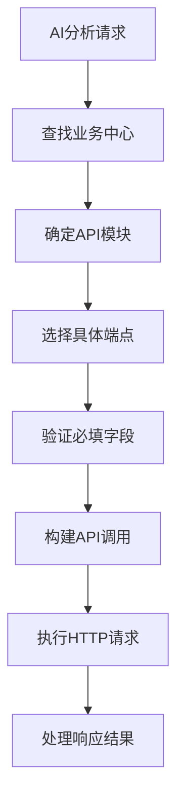

# 业务中心API映射表

**版本**: 1.0.0  
**创建时间**: 2025-10-08  
**用途**: AI Function Call CRUD工具的API调用映射

---

## 📋 目录

- [业务中心分组](#业务中心分组)
- [API映射详表](#api映射详表)
- [必填字段说明](#必填字段说明)
- [调用关系图](#调用关系图)

---

## 🏢 业务中心分组

### 系统架构中的10大业务中心

| 中心名称 | 路径 | 主要功能 | 对应API模块 |
|----------|------|----------|-------------|
| **业务中心** | `/centers/business` | 业务概览、流程管理 | business-center |
| **活动中心** | `/centers/activity` | 活动管理、报名统计 | activities, activity-* |
| **招生中心** | `/centers/enrollment` | 招生管理、咨询跟进 | enrollment-* |
| **人员中心** | `/centers/personnel` | 教师、学生、家长管理 | teachers, students, parents |
| **营销中心** | `/centers/marketing` | 营销活动、广告管理 | marketing-*, advertisements |
| **AI中心** | `/centers/ai` | AI助手、模型管理 | ai, ai-query |
| **系统中心** | `/centers/system` | 系统配置、权限管理 | system, users, roles |
| **客户池中心** | `/centers/customer-pool` | 客户管理、跟进系统 | customer-pool, customers |
| **任务中心** | `/centers/task` | 任务管理、待办事项 | todos, tasks |
| **教学中心** | `/centers/teaching` | 教学管理、课程安排 | classes, teaching |

---

## 🔗 API映射详表

### 1. 人员中心 (Personnel Center)

#### 1.1 学生管理 (Students)

**API基础信息**:
- **基础路径**: `/api/students`
- **权限要求**: `STUDENT_VIEW`, `STUDENT_MANAGE`
- **支持操作**: CREATE, READ, UPDATE, DELETE

**CRUD操作映射**:

| 操作 | HTTP方法 | 端点 | 必填字段 | 可选字段 | 删除策略 |
|------|----------|------|----------|----------|----------|
| **创建** | POST | `/api/students` | `name`, `age`, `kindergartenId` | `classId`, `parentId`, `status`, `remark` | - |
| **查询** | GET | `/api/students` | - | `page`, `limit`, `classId`, `status` | - |
| **详情** | GET | `/api/students/:id` | `id` | - | - |
| **更新** | PUT | `/api/students/:id` | `id` | `name`, `age`, `classId`, `status` | - |
| **删除** | DELETE | `/api/students/:id` | `id` | - | **硬删除** |

**特殊端点**:
```typescript
// 班级分配
PUT /api/students/:id/assign-class
必填: { classId: string }

// 状态更新  
PUT /api/students/:id/status
必填: { status: 'active' | 'inactive' | 'graduated' }

// 批量操作
POST /api/students/batch-assign-class
必填: { studentIds: string[], classId: string }
```

#### 1.2 教师管理 (Teachers)

**API基础信息**:
- **基础路径**: `/api/teachers`
- **权限要求**: `TEACHER_VIEW`, `TEACHER_MANAGE`
- **支持操作**: CREATE, READ, UPDATE, DELETE

**CRUD操作映射**:

| 操作 | HTTP方法 | 端点 | 必填字段 | 可选字段 | 删除策略 |
|------|----------|------|----------|----------|----------|
| **创建** | POST | `/api/teachers` | `userId`, `kindergartenId`, `position` | `teacherNo`, `status`, `remark` | - |
| **查询** | GET | `/api/teachers` | - | `page`, `pageSize`, `keyword`, `status` | - |
| **详情** | GET | `/api/teachers/:id` | `id` | - | - |
| **更新** | PUT | `/api/teachers/:id` | `id` | `position`, `status`, `remark` | - |
| **删除** | DELETE | `/api/teachers/:id` | `id` | - | **软删除** |

#### 1.3 家长管理 (Parents)

**API基础信息**:
- **基础路径**: `/api/parents`
- **权限要求**: `PARENT_VIEW`, `PARENT_MANAGE`
- **支持操作**: CREATE, READ, UPDATE, DELETE

**CRUD操作映射**:

| 操作 | HTTP方法 | 端点 | 必填字段 | 可选字段 | 删除策略 |
|------|----------|------|----------|----------|----------|
| **创建** | POST | `/api/parents` | `name`, `phone` | `email`, `address`, `relationship` | - |
| **查询** | GET | `/api/parents` | - | `page`, `limit`, `keyword` | - |
| **详情** | GET | `/api/parents/:id` | `id` | - | - |
| **更新** | PUT | `/api/parents/:id` | `id` | `name`, `phone`, `email`, `address` | - |
| **删除** | DELETE | `/api/parents/:id` | `id` | - | **软删除** |

### 2. 活动中心 (Activity Center)

#### 2.1 活动管理 (Activities)

**API基础信息**:
- **基础路径**: `/api/activities`
- **权限要求**: `ACTIVITY_VIEW`, `ACTIVITY_MANAGE`
- **支持操作**: CREATE, READ, UPDATE, DELETE

**CRUD操作映射**:

| 操作 | HTTP方法 | 端点 | 必填字段 | 可选字段 | 删除策略 |
|------|----------|------|----------|----------|----------|
| **创建** | POST | `/api/activities` | `title`, `startTime`, `endTime` | `description`, `type`, `capacity`, `location` | - |
| **查询** | GET | `/api/activities` | - | `page`, `pageSize`, `type`, `status`, `startDate`, `endDate` | - |
| **详情** | GET | `/api/activities/:id` | `id` | - | - |
| **更新** | PUT | `/api/activities/:id` | `id` | `title`, `description`, `startTime`, `endTime`, `status` | - |
| **删除** | DELETE | `/api/activities/:id` | `id` | - | **软删除** |

**特殊端点**:
```typescript
// 发布活动
POST /api/activities/:id/publish
必填: { id }

// 活动报名
POST /api/activity-registrations
必填: { activityId: string, studentId: string }

// 活动统计
GET /api/activities/:id/statistics
必填: { id }
```

### 3. 招生中心 (Enrollment Center)

#### 3.1 招生申请 (Enrollment Applications)

**API基础信息**:
- **基础路径**: `/api/enrollment-applications`
- **权限要求**: `ENROLLMENT_VIEW`, `ENROLLMENT_MANAGE`
- **支持操作**: CREATE, READ, UPDATE, DELETE

**CRUD操作映射**:

| 操作 | HTTP方法 | 端点 | 必填字段 | 可选字段 | 删除策略 |
|------|----------|------|----------|----------|----------|
| **创建** | POST | `/api/enrollment-applications` | `studentName`, `parentName`, `parentPhone`, `planId` | `studentAge`, `address`, `remark` | - |
| **查询** | GET | `/api/enrollment-applications` | - | `page`, `pageSize`, `status`, `planId` | - |
| **详情** | GET | `/api/enrollment-applications/:id` | `id` | - | - |
| **更新** | PUT | `/api/enrollment-applications/:id` | `id` | `status`, `remark`, `reviewResult` | - |
| **删除** | DELETE | `/api/enrollment-applications/:id` | `id` | - | **软删除** |

### 4. 系统中心 (System Center)

#### 4.1 用户管理 (Users)

**API基础信息**:
- **基础路径**: `/api/users`
- **权限要求**: `USER_VIEW`, `USER_MANAGE`
- **支持操作**: CREATE, READ, UPDATE, DELETE

**CRUD操作映射**:

| 操作 | HTTP方法 | 端点 | 必填字段 | 可选字段 | 删除策略 |
|------|----------|------|----------|----------|----------|
| **创建** | POST | `/api/users` | `username`, `password`, `email` | `name`, `phone`, `status` | - |
| **查询** | GET | `/api/users` | - | `page`, `pageSize`, `keyword`, `status` | - |
| **详情** | GET | `/api/users/:id` | `id` | - | - |
| **更新** | PUT | `/api/users/:id` | `id` | `name`, `email`, `phone`, `status` | - |
| **删除** | DELETE | `/api/users/:id` | `id` | - | **软删除** |

#### 4.2 角色管理 (Roles)

**API基础信息**:
- **基础路径**: `/api/roles`
- **权限要求**: `ROLE_VIEW`, `ROLE_MANAGE`
- **支持操作**: CREATE, READ, UPDATE, DELETE

**CRUD操作映射**:

| 操作 | HTTP方法 | 端点 | 必填字段 | 可选字段 | 删除策略 |
|------|----------|------|----------|----------|----------|
| **创建** | POST | `/api/roles` | `name`, `code` | `description`, `status` | - |
| **查询** | GET | `/api/roles` | - | `page`, `pageSize`, `keyword` | - |
| **详情** | GET | `/api/roles/:id` | `id` | - | - |
| **更新** | PUT | `/api/roles/:id` | `id` | `name`, `description`, `status` | - |
| **删除** | DELETE | `/api/roles/:id` | `id` | - | **软删除** |

### 5. 任务中心 (Task Center)

#### 5.1 待办事项 (Todos)

**API基础信息**:
- **基础路径**: `/api/todos`
- **权限要求**: `TODO_VIEW`, `TODO_MANAGE`
- **支持操作**: CREATE, READ, UPDATE, DELETE

**CRUD操作映射**:

| 操作 | HTTP方法 | 端点 | 必填字段 | 可选字段 | 删除策略 |
|------|----------|------|----------|----------|----------|
| **创建** | POST | `/api/todos` | `title`, `description` | `priority`, `dueDate`, `assigneeId` | - |
| **查询** | GET | `/api/todos` | - | `page`, `pageSize`, `status`, `priority` | - |
| **详情** | GET | `/api/todos/:id` | `id` | - | - |
| **更新** | PUT | `/api/todos/:id` | `id` | `title`, `description`, `status`, `priority` | - |
| **删除** | DELETE | `/api/todos/:id` | `id` | - | **软删除** |

---

## 📝 必填字段说明

### 通用字段规则

| 字段类型 | 验证规则 | 示例 |
|----------|----------|------|
| **ID字段** | 正整数，存在性验证 | `id: "123"` |
| **名称字段** | 非空字符串，长度2-50 | `name: "张小明"` |
| **手机号** | 11位数字，格式验证 | `phone: "13800138000"` |
| **邮箱** | 邮箱格式验证 | `email: "user@example.com"` |
| **状态字段** | 枚举值验证 | `status: "active"` |
| **时间字段** | ISO格式或时间戳 | `startTime: "2024-03-15T09:00:00Z"` |

### 业务特定字段

#### 学生相关
```typescript
{
  name: string,           // 学生姓名，2-20字符
  age: number,           // 年龄，3-8岁
  kindergartenId: string, // 幼儿园ID，必须存在
  classId?: string,      // 班级ID，可选，必须存在
  status: 'active' | 'inactive' | 'graduated'
}
```

#### 活动相关
```typescript
{
  title: string,         // 活动标题，5-100字符
  startTime: string,     // 开始时间，ISO格式
  endTime: string,       // 结束时间，必须晚于开始时间
  type: 'education' | 'entertainment' | 'sports' | 'art',
  capacity?: number,     // 容量，正整数
  location?: string      // 地点，可选
}
```

#### 用户相关
```typescript
{
  username: string,      // 用户名，3-20字符，唯一
  password: string,      // 密码，6-20字符（创建时）
  email: string,         // 邮箱，格式验证，唯一
  name?: string,         // 真实姓名，可选
  phone?: string         // 手机号，可选，格式验证
}
```

---

## 🔄 调用关系图

### CRUD工具调用流程



### 业务中心与API的映射关系

```mermaid
graph LR
    PC[人员中心] --> SA[/api/students]
    PC --> TA[/api/teachers]
    PC --> PA[/api/parents]
    
    AC[活动中心] --> AA[/api/activities]
    AC --> AR[/api/activity-registrations]
    
    EC[招生中心] --> EA[/api/enrollment-applications]
    EC --> EP[/api/enrollment-plans]
    
    SC[系统中心] --> UA[/api/users]
    SC --> RA[/api/roles]
    
    TC[任务中心] --> TO[/api/todos]
```

---

## 🎯 使用建议

### 1. API选择策略

```typescript
// 根据业务中心选择API
const getApiEndpoint = (center: string, entity: string, operation: string) => {
  const centerApiMap = {
    'personnel': {
      'student': '/api/students',
      'teacher': '/api/teachers', 
      'parent': '/api/parents'
    },
    'activity': {
      'activity': '/api/activities',
      'registration': '/api/activity-registrations'
    },
    'system': {
      'user': '/api/users',
      'role': '/api/roles'
    }
  };
  
  return centerApiMap[center]?.[entity];
};
```

### 2. 字段验证策略

```typescript
// 根据实体类型验证必填字段
const validateRequiredFields = (entity: string, data: any) => {
  const requiredFieldsMap = {
    'student': ['name', 'age', 'kindergartenId'],
    'teacher': ['userId', 'kindergartenId', 'position'],
    'activity': ['title', 'startTime', 'endTime'],
    'user': ['username', 'password', 'email']
  };
  
  const required = requiredFieldsMap[entity] || [];
  const missing = required.filter(field => !data[field]);
  
  return { valid: missing.length === 0, missing };
};
```

### 3. 删除策略识别

```typescript
// 根据API确定删除策略
const getDeletionStrategy = (apiPath: string) => {
  const softDeleteApis = [
    '/api/teachers',
    '/api/activities', 
    '/api/enrollment-applications',
    '/api/users',
    '/api/roles',
    '/api/todos'
  ];
  
  const hardDeleteApis = [
    '/api/students'  // 特殊情况：学生使用硬删除
  ];
  
  if (softDeleteApis.includes(apiPath)) return 'soft';
  if (hardDeleteApis.includes(apiPath)) return 'hard';
  return 'unknown';
};
```

---

**文档维护**: AI助手开发团队  
**最后更新**: 2025-10-08  
**版本**: 1.0.0
