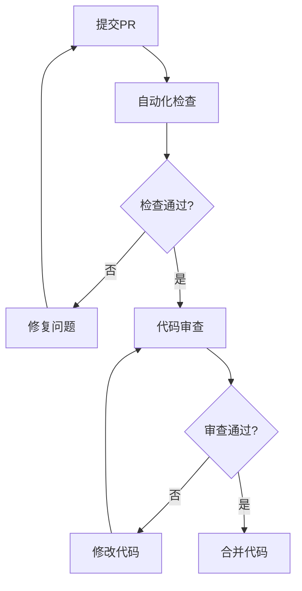

# 开发流程规范

## 🎯 目标
建立标准化的开发流程，确保代码质量、减少bug、提高团队协作效率。

## 🔄 开发流程

### 1. 需求分析阶段


#### 检查清单
- [ ] 需求文档完整
- [ ] API接口设计符合规范
- [ ] 数据库变更已规划
- [ ] 任务分解合理
- [ ] 时间估算准确

### 2. 开发阶段

#### 2.1 分支管理
```bash
# 主分支
main/master     # 生产环境代码
develop         # 开发环境代码

# 功能分支
feature/user-management     # 新功能开发
bugfix/fix-login-issue     # Bug修复
hotfix/critical-security   # 紧急修复
```

#### 2.2 代码开发流程
```bash
# 1. 创建功能分支
git checkout develop
git pull origin develop
git checkout -b feature/new-api

# 2. 开发代码
# 遵循编码规范
# 编写单元测试
# 更新文档

# 3. 提交代码
git add .
git commit -m "feat: add user management API"

# 4. 推送分支
git push origin feature/new-api

# 5. 创建Pull Request
# 填写PR模板
# 请求代码审查
```

### 3. 代码审查阶段

#### 3.1 审查清单
```markdown
## 代码审查清单

### 功能性
- [ ] 功能实现正确
- [ ] 边界条件处理
- [ ] 错误处理完整
- [ ] 性能考虑合理

### 代码质量
- [ ] 代码结构清晰
- [ ] 命名规范一致
- [ ] 注释充分
- [ ] 无重复代码

### 安全性
- [ ] 输入验证
- [ ] 权限检查
- [ ] SQL注入防护
- [ ] XSS防护

### 测试
- [ ] 单元测试覆盖
- [ ] 集成测试通过
- [ ] 手动测试验证
```

#### 3.2 审查流程


### 4. 测试阶段

#### 4.1 测试类型
```typescript
// 单元测试
describe('UserService', () => {
  test('should create user successfully', async () => {
    const userData = { username: 'test', email: 'test@example.com' };
    const result = await userService.createUser(userData);
    expect(result.success).toBe(true);
  });
});

// 集成测试
describe('User API', () => {
  test('POST /api/users should create user', async () => {
    const response = await request(app)
      .post('/api/users')
      .send({ username: 'test', email: 'test@example.com' })
      .expect(201);
    
    expect(response.body.success).toBe(true);
  });
});
```

#### 4.2 测试覆盖率要求
- 单元测试覆盖率 ≥ 80%
- 核心业务逻辑覆盖率 ≥ 90%
- 关键API接口必须有集成测试

### 5. 部署阶段

#### 5.1 部署流程
```yaml
# .github/workflows/deploy.yml
name: Deploy
on:
  push:
    branches: [main]

jobs:
  test:
    runs-on: ubuntu-latest
    steps:
      - uses: actions/checkout@v2
      - name: Run tests
        run: npm test
      
  deploy:
    needs: test
    runs-on: ubuntu-latest
    steps:
      - name: Deploy to production
        run: |
          # 部署脚本
```

#### 5.2 部署检查清单
- [ ] 所有测试通过
- [ ] 代码审查完成
- [ ] 数据库迁移脚本准备
- [ ] 环境变量配置
- [ ] 回滚方案准备

## 📋 代码规范

### 1. 提交信息规范
```bash
# 格式：<type>(<scope>): <subject>

# 类型
feat:     新功能
fix:      Bug修复
docs:     文档更新
style:    代码格式调整
refactor: 代码重构
test:     测试相关
chore:    构建过程或辅助工具的变动

# 示例
feat(auth): add JWT token validation
fix(users): resolve duplicate email issue
docs(api): update user management documentation
```

### 2. 分支命名规范
```bash
# 功能分支
feature/user-authentication
feature/api-rate-limiting

# Bug修复分支
bugfix/login-validation-error
bugfix/memory-leak-in-upload

# 热修复分支
hotfix/security-vulnerability
hotfix/critical-data-loss
```

### 3. PR模板
```markdown
## 变更描述
简要描述本次变更的内容和目的。

## 变更类型
- [ ] 新功能
- [ ] Bug修复
- [ ] 文档更新
- [ ] 代码重构
- [ ] 性能优化

## 测试
- [ ] 单元测试已添加/更新
- [ ] 集成测试已添加/更新
- [ ] 手动测试已完成

## 检查清单
- [ ] 代码符合规范
- [ ] 文档已更新
- [ ] 无破坏性变更
- [ ] 向后兼容

## 相关Issue
Closes #123
```

## 🛠️ 工具配置

### 1. ESLint配置
```json
{
  "extends": [
    "@typescript-eslint/recommended",
    "prettier"
  ],
  "rules": {
    "no-console": "warn",
    "no-unused-vars": "error",
    "@typescript-eslint/no-explicit-any": "warn"
  }
}
```

### 2. Prettier配置
```json
{
  "semi": true,
  "trailingComma": "es5",
  "singleQuote": true,
  "printWidth": 80,
  "tabWidth": 2
}
```

### 3. Husky钩子
```json
{
  "husky": {
    "hooks": {
      "pre-commit": "lint-staged",
      "commit-msg": "commitlint -E HUSKY_GIT_PARAMS"
    }
  },
  "lint-staged": {
    "*.{ts,js}": ["eslint --fix", "prettier --write"],
    "*.{md,json}": ["prettier --write"]
  }
}
```

## 📊 质量指标

### 1. 代码质量指标
- 代码覆盖率 ≥ 80%
- 代码重复率 ≤ 5%
- 圈复杂度 ≤ 10
- 技术债务 ≤ 1天

### 2. 开发效率指标
- 平均PR审查时间 ≤ 24小时
- 构建成功率 ≥ 95%
- 部署频率：每周至少1次
- 平均修复时间 ≤ 4小时

### 3. 质量监控
```typescript
// 代码质量监控
const qualityMetrics = {
  coverage: 85,           // 测试覆盖率
  duplication: 3,         // 代码重复率
  complexity: 8,          // 平均圈复杂度
  maintainability: 'A',   // 可维护性等级
  reliability: 'A',       // 可靠性等级
  security: 'A'          // 安全性等级
};
```

## 🚨 应急处理

### 1. 生产环境问题处理
```bash
# 1. 立即回滚
git revert <commit-hash>
git push origin main

# 2. 创建热修复分支
git checkout -b hotfix/critical-issue

# 3. 修复问题
# 编写修复代码
# 添加测试用例

# 4. 快速部署
# 跳过部分检查（紧急情况）
# 部署后立即验证

# 5. 事后分析
# 根因分析
# 改进措施
# 文档更新
```

### 2. 回滚策略
- 数据库变更：准备回滚脚本
- 配置变更：保留旧配置备份
- 代码变更：使用Git回滚
- 依赖变更：锁定版本号

## ✅ 流程检查清单

每个开发周期结束时检查：

- [ ] 所有功能按计划完成
- [ ] 代码质量指标达标
- [ ] 测试覆盖率满足要求
- [ ] 文档更新完整
- [ ] 安全检查通过
- [ ] 性能测试通过
- [ ] 部署成功无问题
- [ ] 监控告警正常
