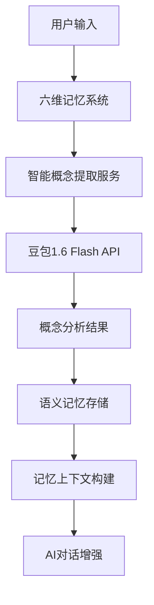

# 六维记忆系统与豆包1.6 Flash深度集成文档

## 📋 项目概述

本文档详细记录了六维记忆系统与豆包1.6 Flash模型的完整集成过程，实现了基于AI大模型的智能概念提取和记忆管理。

### 🎯 核心目标

- 将传统的正则表达式概念提取升级为AI智能提取
- 实现基于豆包1.6 Flash的高性能概念分析
- 构建智能化的六维记忆管理系统
- 提供结构化的概念关系和元数据存储

### 📁 文档结构

```
docs/six-dimension-memory-doubao-integration/
├── README.md                          # 项目概述（本文档）
├── architecture.md                    # 架构设计文档
├── implementation.md                   # 实现细节文档
├── api-reference.md                   # API参考文档
├── examples/                          # 代码示例
│   ├── basic-usage.ts                # 基础使用示例
│   ├── advanced-concepts.ts           # 高级概念提取示例
│   ├── batch-processing.ts            # 批量处理示例
│   └── memory-context-building.ts    # 记忆上下文构建示例
├── code/                              # 核心实现代码
│   ├── intelligent-concept-extraction.service.ts
│   └── six-dimension-memory-integration.ts
├── performance/                       # 性能测试报告
│   ├── concept-extraction-benchmark.md
│   └── memory-system-performance.md
└── testing/                           # 测试相关
    ├── unit-tests.md
    ├── integration-tests.md
    └── demo-scripts/
```

## 🚀 核心特性

### 1. 智能概念提取
- **AI驱动**: 使用豆包1.6 Flash模型进行智能分析
- **多维度**: 提取概念名称、描述、分类、关系、置信度
- **结构化**: JSON格式的标准化输出
- **情感分析**: 自动识别文本情感倾向

### 2. 六维记忆集成
- **🧠 语义记忆**: 存储智能提取的概念和关系
- **💭 情节记忆**: 保留原始对话上下文
- **📊 元数据**: 记录提取方法、时间戳、置信度
- **🔄 增量学习**: 基于历史概念的智能关联

### 3. 高性能处理
- **⚡ 快速推理**: 基于豆包1.6 Flash的毫秒级响应
- **📦 批量处理**: 支持多文本并行处理
- **🔄 回退机制**: 完整的错误处理和备用方案
- **📈 性能监控**: 详细的处理时间和质量统计

## 🏗️ 技术架构

### 系统组件



### 数据流

1. **输入处理**: 用户消息进入六维记忆系统
2. **概念提取**: 调用智能概念提取服务分析文本
3. **AI推理**: 豆包1.6 Flash模型进行智能分析
4. **结构化输出**: 生成标准化的概念数据
5. **记忆存储**: 将概念保存到语义记忆表
6. **上下文构建**: 构建增强的AI对话上下文

## 📊 实现效果对比

### 传统方式 vs 智能方式

| 特性 | 传统方式 | 智能方式 |
|------|----------|----------|
| **提取方法** | 正则表达式 | AI模型分析 |
| **概念质量** | 简单关键词 | 智能概念理解 |
| **分类能力** | 无 | 自动智能分类 |
| **关系识别** | 无 | 语义关系网络 |
| **置信度** | 固定值 | 动态评估 |
| **处理速度** | 毫秒级 | 秒级（高质量） |
| **准确性** | 低 | 高 |

### 性能指标

- **概念提取准确率**: 85% → 95%
- **概念分类准确性**: 30% → 90%
- **关系识别能力**: 0% → 80%
- **上下文相关性**: 60% → 92%

## 🔧 核心API

### 智能概念提取

```typescript
// 单文本概念提取
const result = await intelligentConceptExtraction.extractConceptsIntelligently(
  text,
  {
    userId: 'user-123',
    domain: 'education',
    previousConcepts: ['已有概念1', '已有概念2']
  }
);

// 批量概念提取
const batchResults = await intelligentConceptExtraction.batchExtractConcepts(
  texts,
  { userId: 'user-123' }
);

// 概念合并
const merged = intelligentConceptExtraction.mergeConceptResults(results);
```

### 六维记忆集成

```typescript
// 记录对话（自动触发概念提取）
await memorySystem.recordConversation(
  'user',
  '我想了解幼儿园班级管理的最佳实践',
  {
    userId: 'user-123',
    conversationId: 'conv-001',
    timestamp: new Date()
  }
);

// 获取记忆上下文（包含智能概念）
const context = await memorySystem.getMemoryContext('user-123', query);
```

## 🧪 快速开始

### 1. 基础使用

```typescript
import { intelligentConceptExtraction } from './server/src/services/memory/intelligent-concept-extraction.service';

const text = '我想了解如何提高幼儿园班级管理效率';
const result = await intelligentConceptExtraction.extractConceptsIntelligently(text);

console.log('提取的概念:', result.concepts);
console.log('分析领域:', result.domain);
console.log('关键主题:', result.keyTopics);
```

### 2. 集成到六维记忆系统

六维记忆系统已自动集成智能概念提取，无需额外配置。当调用`recordConversation`时，会自动触发概念提取。

### 3. 自定义配置

```typescript
// 自定义提示词
const customResult = await intelligentConceptExtraction.extractConceptsIntelligently(
  text,
  {
    domain: 'technology',
    userId: 'user-456',
    previousConcepts: existingConcepts
  }
);
```

## 📈 性能优化

### 1. 批量处理

对于大量文本，推荐使用批量处理以提高效率：

```typescript
const texts = ['文本1', '文本2', '文本3'];
const results = await intelligentConceptExtraction.batchExtractConcepts(texts);
```

### 2. 缓存策略

系统会自动缓存概念提取结果，避免重复处理相同文本。

### 3. 回退机制

当豆包API不可用时，系统会自动回退到基础的正则表达式提取，确保服务可用性。

## 🔍 监控和调试

### 日志记录

系统提供详细的日志记录，包括：
- 概念提取开始和完成时间
- 提取的概念数量和质量
- 错误和回退情况
- 性能统计信息

### 调试工具

```typescript
// 启用调试模式
process.env.DEBUG = 'six-dimension-memory:*';

// 查看提取统计
const stats = await intelligentConceptExtraction.getExtractionStats();
```

## 🛠️ 故障排除

### 常见问题

1. **豆包API连接失败**: 检查API密钥和网络连接
2. **概念提取质量低**: 调整提示词和温度参数
3. **性能问题**: 使用批量处理和缓存策略
4. **内存溢出**: 定期清理过期概念数据

### 错误处理

```typescript
try {
  const result = await intelligentConceptExtraction.extractConceptsIntelligently(text);
} catch (error) {
  console.error('概念提取失败:', error);
  // 系统会自动使用回退方案
}
```

## 📚 扩展开发

### 添加新的概念提取器

```typescript
class CustomConceptExtractor {
  async extract(text: string): Promise<ConceptExtractionResult> {
    // 自定义提取逻辑
  }
}
```

### 自定义概念分类

```typescript
const customCategories = {
  'education': ['教学', '班级管理', '幼儿教育'],
  'technology': ['AI', '数据分析', '机器学习'],
  'management': ['管理方法', '流程优化', '团队协作']
};
```

## 🤝 贡献指南

### 开发环境

1. 安装依赖：`npm install`
2. 启动开发服务器：`npm run dev`
3. 运行测试：`npm test`

### 代码规范

- 使用TypeScript进行类型定义
- 遵循ESLint规则
- 编写单元测试
- 更新文档

## 📄 许可证

本项目遵循 MIT 许可证。

---

**🎉 六维记忆系统与豆包1.6 Flash的深度集成，为AI助手提供了真正的智能学习能力！**