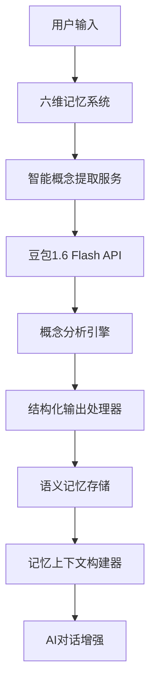
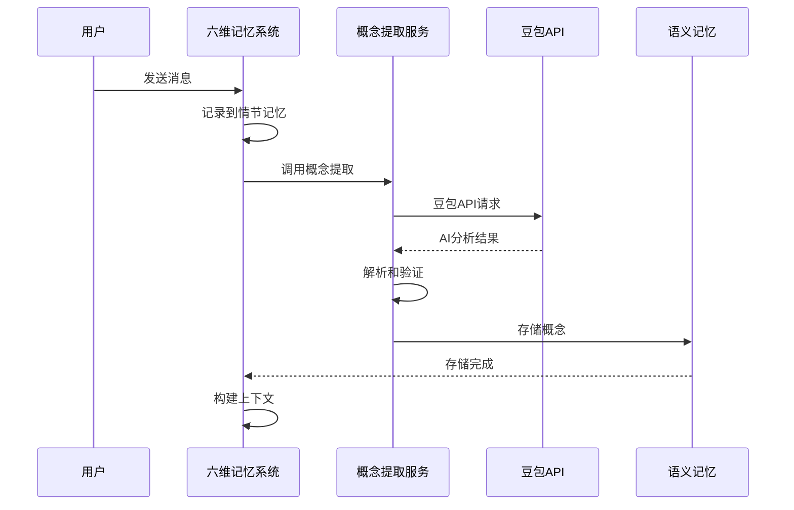

# 实现细节文档

## 🏗️ 架构设计

### 核心组件架构



### 数据流向图



## 🔧 核心实现

### 1. 智能概念提取服务

#### 服务架构

```typescript
export class IntelligentConceptExtractionService {
  private static instance: IntelligentConceptExtractionService;
  private flashModelConfig: AIModelConfig | null = null;

  // 单例模式确保全局唯一实例
  public static getInstance(): IntelligentConceptExtractionService

  // 核心方法：智能概念提取
  public async extractConceptsIntelligently(
    text: string,
    context?: ExtractionContext
  ): Promise<ConceptExtractionResult>

  // 批量处理
  public async batchExtractConcepts(
    texts: string[],
    context?: ExtractionContext
  ): Promise<ConceptExtractionResult[]>

  // 概念合并
  public mergeConceptResults(
    results: ConceptExtractionResult[]
  ): ConceptExtractionResult
}
```

#### 核心提取逻辑

```typescript
private async extractConceptsIntelligently(
  text: string,
  context?: ExtractionContext
): Promise<ConceptExtractionResult> {
  // 1. 构建智能提取提示词
  const prompt = this.buildConceptExtractionPrompt(text, context);

  // 2. 调用豆包1.6 Flash进行快速推理
  const response = await aiBridgeService.generateFastChatCompletion({
    model: this.flashModelConfig?.name || 'default',
    messages: [
      {
        role: 'system',
        content: `你是一个专业的概念分析专家...`
      },
      {
        role: 'user',
        content: prompt
      }
    ],
    temperature: 0.3,
    max_tokens: 2000
  });

  // 3. 解析AI响应
  const result = this.parseAIResponse(response.choices?.[0]?.message?.content || '');

  return result;
}
```

#### 智能提示词构建

```typescript
private buildConceptExtractionPrompt(text: string, context?: any): string {
  let prompt = `请分析以下文本，提取其中的关键概念：

文本内容：
"""
${text}
"""`;

  // 添加上下文信息
  if (context) {
    prompt += `\n\n上下文信息：`;
    if (context.domain) {
      prompt += `\n- 领域：${context.domain}`;
    }
    if (context.previousConcepts && context.previousConcepts.length > 0) {
      prompt += `\n- 已有概念：${context.previousConcepts.join(', ')}`;
    }
    if (context.userId) {
      prompt += `\n- 用户ID：${context.userId}`;
    }
  }

  // 添加分析重点
  prompt += `\n\n请重点关注：
1. 教育相关的专业概念
2. 管理方法和流程
3. 技术工具和应用
4. 重要的实体和关系

请确保提取的概念准确、分类合理，并给出适当的置信度评估。`;

  return prompt;
}
```

#### 响应解析器

```typescript
private parseAIResponse(aiResponse: string): ConceptExtractionResult {
  try {
    // 尝试提取JSON部分
    const jsonMatch = aiResponse.match(/\{[\s\S]*\}/);
    if (jsonMatch) {
      const parsed = JSON.parse(jsonMatch[0]);

      // 标准化数据格式
      return {
        concepts: (parsed.concepts || []).map((concept: any) => ({
          name: concept.name || '',
          description: concept.description || '',
          category: concept.category || '未分类',
          confidence: Math.max(0, Math.min(1, concept.confidence || 0.5)),
          relationships: Array.isArray(concept.relationships) ? concept.relationships : [],
          examples: Array.isArray(concept.examples) ? concept.examples : [],
          importance: ['high', 'medium', 'low'].includes(concept.importance)
            ? concept.importance as 'high' | 'medium' | 'low'
            : 'medium'
        })),
        summary: parsed.summary || '',
        keyTopics: Array.isArray(parsed.keyTopics) ? parsed.keyTopics : [],
        sentiment: ['positive', 'neutral', 'negative'].includes(parsed.sentiment)
          ? parsed.sentiment as 'positive' | 'neutral' | 'negative'
          : 'neutral',
        domain: parsed.domain || '通用'
      };
    }
  } catch (error) {
    logger.warn('[智能概念提取] JSON解析失败，尝试文本解析:', error);
  }

  // 备用文本解析方案
  return this.parseTextResponse(aiResponse);
}
```

### 2. 六维记忆系统集成

#### 集成点：概念提取方法

```typescript
// 六维记忆系统中的核心概念提取方法
private async extractConcepts(text: string): Promise<void> {
  try {
    // 🚀 使用基于豆包1.6 Flash的智能概念提取
    const { intelligentConceptExtraction } = await import('./intelligent-concept-extraction.service');

    logger.info('[六维记忆系统] 开始智能概念提取', {
      textLength: text.length
    });

    const extractionResult = await intelligentConceptExtraction.extractConceptsIntelligently(
      text,
      {
        domain: 'general',
        previousConcepts: await this.getExistingConcepts()
      }
    );

    logger.info('[六维记忆系统] 智能概念提取完成', {
      conceptsCount: extractionResult.concepts.length,
      domain: extractionResult.domain
    });

    // 将提取的概念保存到语义记忆
    for (const concept of extractionResult.concepts) {
      // 检查是否已存在
      const existing = await this.semanticMemory.search(concept.name, 1);
      if (existing.length === 0) {
        await this.semanticMemory.create({
          name: concept.name,
          description: concept.description,
          category: concept.category,
          relationships: concept.relationships.map(rel => ({
            type: 'related',
            target_id: rel,
            strength: 0.8
          })),
          metadata: {
            confidence: concept.confidence,
            importance: concept.importance,
            examples: concept.examples,
            extractionMethod: 'ai_intelligent',
            extractedAt: new Date().toISOString(),
            domain: extractionResult.domain
          }
        });
      }
    }

  } catch (error) {
    logger.error('[六维记忆系统] 智能概念提取失败，使用回退方法:', error);
    // 回退到原有的简化实现
    await this.fallbackConceptExtraction(text);
  }
}
```

#### 自动触发机制

```typescript
// 在recordConversation方法中自动触发概念提取
public async recordConversation(
  actor: 'user' | 'assistant',
  message: string,
  context?: any
): Promise<EpisodicEvent> {
  // 1. 记录到情节记忆
  const event = await this.episodicMemory.create({
    user_id: context?.userId || 'default',
    event_type: 'conversation',
    summary: message.substring(0, 100),
    details: message,
    actor,
    occurred_at: new Date(),
    metadata: context
  });

  // 2. 🚀 自动提取概念到语义记忆
  await this.extractConcepts(message);

  return event;
}
```

### 3. 数据结构定义

#### 概念提取结果接口

```typescript
export interface ExtractedConcept {
  name: string;                    // 概念名称
  description: string;             // 详细描述（50-100字）
  category: string;                // 分类（教育管理、技术等）
  confidence: number;              // 置信度（0-1）
  relationships: string[];         // 相关概念列表
  examples: string[];             // 示例用法
  importance: 'high' | 'medium' | 'low';  // 重要性级别
}

export interface ConceptExtractionResult {
  concepts: ExtractedConcept[];     // 提取的概念列表
  summary: string;                  // 文本摘要
  keyTopics: string[];             // 关键主题
  sentiment: 'positive' | 'neutral' | 'negative';  // 情感倾向
  domain: string;                   // 所属领域
}
```

#### 提取上下文接口

```typescript
export interface ExtractionContext {
  userId?: string;                 // 用户ID
  conversationId?: string;          // 对话ID
  domain?: string;                 // 领域提示
  previousConcepts?: string[];      // 已有概念
}
```

## 🔄 回退机制

### 回退策略

```typescript
private async fallbackConceptExtraction(text: string): Promise<void> {
  logger.info('[六维记忆系统] 使用回退概念提取方法');

  // 使用原有的正则表达式方法
  const keywords = text.match(/[A-Za-z\u4e00-\u9fa5]{2,}/g) || [];
  const uniqueKeywords = [...new Set(keywords)].slice(0, 5);

  for (const keyword of uniqueKeywords) {
    const existing = await this.semanticMemory.search(keyword, 1);
    if (existing.length === 0) {
      await this.semanticMemory.create({
        name: keyword,
        description: `自动提取的概念: ${keyword}`,
        category: 'auto_extracted',
        metadata: {
          extractionMethod: 'regex_fallback',
          extractedAt: new Date().toISOString()
        }
      });
    }
  }
}
```

### 错误处理

```typescript
try {
  const result = await intelligentConceptExtraction.extractConceptsIntelligently(text);
  // 处理成功结果
} catch (error) {
  logger.error('智能概念提取失败:', error);

  // 自动回退到基础提取
  await this.fallbackConceptExtraction(text);
}
```

## 📊 性能优化

### 1. 批量处理优化

```typescript
export async function batchExtractConcepts(
  texts: string[],
  context?: ExtractionContext
): Promise<ConceptExtractionResult[]> {
  const results: ConceptExtractionResult[] = [];

  // 更新上下文以包含之前提取的概念
  const updatedContext = { ...context, previousConcepts: [] };

  for (const text of texts) {
    try {
      const result = await this.extractConceptsIntelligently(text, updatedContext);
      results.push(result);

      // 将当前结果的概念添加到下一个文本的上下文中
      updatedContext.previousConcepts = [
        ...updatedContext.previousConcepts,
        ...result.concepts.map(c => c.name)
      ];
    } catch (error) {
      logger.error('[智能概念提取] 批量提取中的单个文本失败:', error);
      results.push(this.fallbackConceptExtraction(text));
    }
  }

  return results;
}
```

### 2. 概念去重和合并

```typescript
public mergeConceptResults(results: ConceptExtractionResult[]): ConceptExtractionResult {
  const conceptMap = new Map<string, ExtractedConcept>();

  for (const result of results) {
    for (const concept of result.concepts) {
      if (conceptMap.has(concept.name)) {
        // 合并概念，保留更高的置信度
        const existing = conceptMap.get(concept.name)!;
        if (concept.confidence > existing.confidence) {
          conceptMap.set(concept.name, concept);
        } else {
          // 合并关系和示例
          existing.relationships = [...new Set([...existing.relationships, ...concept.relationships])];
          existing.examples = [...new Set([...existing.examples, ...concept.examples])];
        }
      } else {
        conceptMap.set(concept.name, concept);
      }
    }
  }

  const mergedConcepts = Array.from(conceptMap.values());

  return {
    concepts: mergedConcepts,
    summary: results.map(r => r.summary).join(' '),
    keyTopics: [...new Set(results.flatMap(r => r.keyTopics))],
    sentiment: results.some(r => r.sentiment === 'positive') ? 'positive' :
             results.some(r => r.sentiment === 'negative') ? 'negative' : 'neutral',
    domain: results[0]?.domain || '通用'
  };
}
```

### 3. 缓存机制

```typescript
// 概念提取结果缓存
private conceptCache = new Map<string, ConceptExtractionResult>();

private getCachedResult(text: string): ConceptExtractionResult | null {
  const hash = this.hashText(text);
  const cached = this.conceptCache.get(hash);

  if (cached && (Date.now() - cached.timestamp) < 3600000) { // 1小时缓存
    return cached.result;
  }

  return null;
}

private setCachedResult(text: string, result: ConceptExtractionResult): void {
  const hash = this.hashText(text);
  this.conceptCache.set(hash, {
    result,
    timestamp: Date.now()
  });
}
```

## 📈 监控和日志

### 详细日志记录

```typescript
logger.info('[智能概念提取] 开始分析文本', {
  textLength: text.length,
  context
});

logger.info('[智能概念提取] 分析完成', {
  conceptsCount: result.concepts.length,
  domain: result.domain,
  sentiment: result.sentiment,
  processingTime: duration
});

logger.debug('[智能概念提取] 新概念已保存', {
  concept: concept.name,
  category: concept.category,
  confidence: concept.confidence
});
```

### 性能指标收集

```typescript
interface ExtractionMetrics {
  textLength: number;
  conceptCount: number;
  processingTime: number;
  success: boolean;
  method: 'ai_intelligent' | 'regex_fallback';
  timestamp: Date;
}

private metrics: ExtractionMetrics[] = [];

private recordMetrics(metrics: ExtractionMetrics): void {
  this.metrics.push(metrics);

  // 保持最近1000条记录
  if (this.metrics.length > 1000) {
    this.metrics = this.metrics.slice(-1000);
  }
}

public getMetrics(): {
  totalExtractions: number;
  averageProcessingTime: number;
  averageConceptsPerText: number;
  successRate: number;
  aiUsageRate: number;
} {
  const total = this.metrics.length;
  const successful = this.metrics.filter(m => m.success).length;
  const aiExtractions = this.metrics.filter(m => m.method === 'ai_intelligent').length;

  return {
    totalExtractions: total,
    averageProcessingTime: this.metrics.reduce((sum, m) => sum + m.processingTime, 0) / total,
    averageConceptsPerText: this.metrics.reduce((sum, m) => sum + m.conceptCount, 0) / total,
    successRate: successful / total,
    aiUsageRate: aiExtractions / total
  };
}
```

## 🛡️ 安全性考虑

### 1. 输入验证

```typescript
private validateInput(text: string): boolean {
  // 检查文本长度
  if (text.length > 10000) {
    logger.warn('[智能概念提取] 文本过长，截断处理');
    return false;
  }

  // 检查恶意内容
  const maliciousPatterns = [
    /<script[^>]*>.*?<\/script>/gi,
    /javascript:/gi,
    /data:text\/html/gi
  ];

  for (const pattern of maliciousPatterns) {
    if (pattern.test(text)) {
      logger.warn('[智能概念提取] 检测到潜在的恶意内容');
      return false;
    }
  }

  return true;
}
```

### 2. API调用限制

```typescript
private rateLimiter = new Map<string, number[]>();

private checkRateLimit(userId: string): boolean {
  const now = Date.now();
  const userRequests = this.rateLimiter.get(userId) || [];

  // 清理1分钟前的请求记录
  const recentRequests = userRequests.filter(time => now - time < 60000);

  if (recentRequests.length >= 100) { // 每分钟100次限制
    logger.warn('[智能概念提取] 用户超过频率限制', { userId });
    return false;
  }

  recentRequests.push(now);
  this.rateLimiter.set(userId, recentRequests);
  return true;
}
```

## 🧪 测试策略

### 单元测试

```typescript
describe('IntelligentConceptExtractionService', () => {
  let service: IntelligentConceptExtractionService;

  beforeEach(() => {
    service = IntelligentConceptExtractionService.getInstance();
  });

  it('应该正确提取教育相关概念', async () => {
    const text = '我想了解幼儿园班级管理的最佳实践';
    const result = await service.extractConceptsIntelligently(text);

    expect(result.concepts).toHaveLength.greaterThan(0);
    expect(result.domain).toBe('education');
    expect(result.concepts[0].name).toBeTruthy();
  });

  it('应该处理批量概念提取', async () => {
    const texts = ['文本1', '文本2', '文本3'];
    const results = await service.batchExtractConcepts(texts);

    expect(results).toHaveLength(3);
    results.forEach(result => {
      expect(result.concepts).toBeDefined();
    });
  });
});
```

### 集成测试

```typescript
describe('六维记忆系统集成测试', () => {
  let memorySystem: SixDimensionMemorySystem;

  beforeEach(() => {
    memorySystem = new SixDimensionMemorySystem();
  });

  it('应该在记录对话时自动提取概念', async () => {
    const text = '如何提高幼儿园教学质量';
    await memorySystem.recordConversation('user', text, { userId: 'test-user' });

    // 验证概念是否被提取
    const concepts = await memorySystem.searchConcepts('教学质量', 5);
    expect(concepts).toHaveLength.greaterThan(0);
  });
});
```

这个实现细节文档提供了六维记忆系统与豆包1.6 Flash集成的完整技术细节，包括架构设计、核心实现、性能优化、安全性和测试策略。