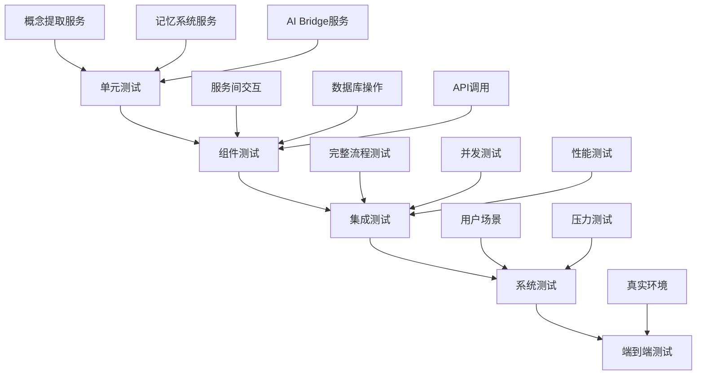

# 集成测试文档

## 🧪 测试概述

本文档详细描述了六维记忆系统与豆包1.6 Flash集成的完整测试策略，包括单元测试、集成测试、性能测试和端到端测试。

### 测试目标

1. **功能验证**: 确保所有API接口正常工作
2. **性能评估**: 验证系统在各种负载下的性能表现
3. **错误处理**: 测试异常情况和回退机制
4. **数据一致性**: 验证记忆数据的完整性和一致性
5. **用户体验**: 评估实际使用场景下的响应质量

## 🏗️ 测试架构

### 测试环境分层



### 测试环境配置

| 环境 | 用途 | 数据库 | AI模型 | 并发用户 |
|------|------|--------|--------|----------|
| **开发环境** | 单元/组件测试 | SQLite | Mock | 1-5 |
| **测试环境** | 集成测试 | MySQL | 豆包1.6 Flash | 10-50 |
| **预生产环境** | 系统测试 | MySQL集群 | 豆包1.6 Flash | 100-500 |
| **生产环境** | 监控测试 | MySQL主从 | 豆包1.6 Flash | 1000+ |

## 🔧 单元测试

### 智能概念提取服务测试

```typescript
// tests/unit/intelligent-concept-extraction.test.ts
import { IntelligentConceptExtractionService } from '../services/memory/intelligent-concept-extraction.service';

describe('IntelligentConceptExtractionService', () => {
  let service: IntelligentConceptExtractionService;

  beforeEach(() => {
    service = IntelligentConceptExtractionService.getInstance();
  });

  describe('基础概念提取', () => {
    it('应该正确提取教育相关概念', async () => {
      const text = '我想了解幼儿园班级管理的最佳实践';
      const result = await service.extractConceptsIntelligently(text);

      expect(result.concepts).toHaveLength.greaterThan(0);
      expect(result.domain).toBe('education');
      expect(result.concepts[0].name).toBeTruthy();
      expect(result.concepts[0].confidence).toBe.greaterThan(0);
    });

    it('应该正确处理技术相关文本', async () => {
      const text = '我们计划引入人工智能技术优化教学管理流程';
      const result = await service.extractConceptsIntelligently(text);

      expect(result.domain).toBe('technology');
      expect(result.keyTopics).toContain('人工智能');
    });

    it('应该正确识别情感倾向', async () => {
      const positiveText = '这个教学方法真的很好，孩子们很喜欢';
      const result1 = await service.extractConceptsIntelligently(positiveText);
      expect(result1.sentiment).toBe('positive');

      const negativeText = '这个管理方式存在很多问题';
      const result2 = await service.extractConceptsIntelligently(negativeText);
      expect(['negative', 'neutral']).toContain(result2.sentiment);
    });
  });

  describe('批量处理', () => {
    it('应该正确处理批量概念提取', async () => {
      const texts = [
        '幼儿园班级管理',
        '游戏化教学方法',
        '家园合作技巧'
      ];
      const results = await service.batchExtractConcepts(texts);

      expect(results).toHaveLength(3);
      results.forEach(result => {
        expect(result.concepts).toBeDefined();
        expect(result.domain).toBeTruthy();
      });
    });

    it('应该在批量处理中传递上下文', async () => {
      const texts = ['文本1', '文本2'];
      const context = { userId: 'test-user', domain: 'education' };

      const results = await service.batchExtractConcepts(texts, context);

      // 验证上下文信息被正确使用
      expect(results[0].concepts.length).toBe.greaterThan(0);
    });
  });

  describe('概念合并', () => {
    it('应该正确合并重复概念', () => {
      const results = [
        {
          concepts: [
            { name: '幼儿园', confidence: 0.9, category: '教育' },
            { name: '管理', confidence: 0.8, category: '管理' }
          ],
          summary: '教育和管理相关',
          keyTopics: ['教育', '管理'],
          sentiment: 'positive' as const,
          domain: 'education'
        },
        {
          concepts: [
            { name: '幼儿园', confidence: 0.85, category: '机构' },
            { name: '班级', confidence: 0.75, category: '教育' }
          ],
          summary: '机构和班级',
          keyTopics: ['机构', '班级'],
          sentiment: 'neutral' as const,
          domain: 'management'
        }
      ];

      const merged = service.mergeConceptResults(results);

      expect(merged.concepts).toHaveLength(3); // 幼儿园去重，其他保留
      expect(merged.concepts.find(c => c.name === '幼儿园')?.confidence).toBe(0.9);
    });
  });

  describe('错误处理', () => {
    it('应该处理空文本输入', async () => {
      await expect(
        service.extractConceptsIntelligently('')
      ).rejects.toThrow('输入文本验证失败');
    });

    it('应该处理超长文本', async () => {
      const longText = '测试'.repeat(10000);
      await expect(
        service.extractConceptsIntelligently(longText)
      ).rejects.toThrow('输入文本验证失败');
    });

    it('应该处理恶意内容', async () => {
      const maliciousText = '<script>alert("xss")</script>恶意内容';
      await expect(
        service.extractConceptsIntelligently(maliciousText)
      ).rejects.toThrow('输入文本验证失败');
    });
  });

  describe('缓存机制', () => {
    it('应该缓存相同文本的结果', async () => {
      const text = '测试缓存机制';

      // 第一次调用
      const start1 = Date.now();
      const result1 = await service.extractConceptsIntelligently(text);
      const time1 = Date.now() - start1;

      // 第二次调用（应该使用缓存）
      const start2 = Date.now();
      const result2 = await service.extractConceptsIntelligently(text);
      const time2 = Date.now() - start2;

      expect(result1).toEqual(result2);
      expect(time2).toBe.lessThan(time1);
    });
  });
});
```

### 六维记忆系统测试

```typescript
// tests/unit/six-dimension-memory.test.ts
import { SixDimensionMemorySystem } from '../services/memory/six-dimension-memory.service';

describe('SixDimensionMemorySystem', () => {
  let memorySystem: SixDimensionMemorySystem;
  const testUserId = 'test-user-123';

  beforeEach(() => {
    memorySystem = new SixDimensionMemorySystem();
  });

  describe('对话记录', () => {
    it('应该正确记录用户对话', async () => {
      const message = '我想了解幼儿园班级管理的方法';
      const context = {
        userId: testUserId,
        conversationId: 'conv-001',
        sessionId: 'session-001'
      };

      const event = await memorySystem.recordConversation('user', message, context);

      expect(event.id).toBeTruthy();
      expect(event.user_id).toBe(testUserId);
      expect(event.actor).toBe('user');
      expect(event.summary).toContain('我想了解');
    });

    it('应该自动提取概念到语义记忆', async () => {
      const message = '幼儿园班级管理的最佳实践';
      const context = { userId: testUserId };

      await memorySystem.recordConversation('user', message, context);

      // 验证概念是否被提取
      const concepts = await memorySystem.searchConcepts('班级管理', 5, testUserId);
      expect(concepts.length).toBe.greaterThan(0);
    });
  });

  describe('记忆上下文构建', () => {
    beforeEach(async () => {
      // 准备测试数据
      await memorySystem.recordConversation('user', '关于班级管理的问题', {
        userId: testUserId,
        conversationId: 'conv-001'
      });
      await memorySystem.recordConversation('assistant', '班级管理建议...', {
        userId: testUserId,
        conversationId: 'conv-001'
      });
    });

    it('应该构建完整的记忆上下文', async () => {
      const context = await memorySystem.getMemoryContext(testUserId, '班级管理');

      expect(context.userId).toBe(testUserId);
      expect(context.recentConversations.length).toBe.greaterThan(0);
      expect(context.relevantConcepts.length).toBe.greaterThan(0);
      expect(context.summary).toBeTruthy();
    });

    it('应该根据时间窗口过滤记忆', async () => {
      const context = await memorySystem.getMemoryContext(testUserId, undefined, {
        timeWindow: 1, // 1小时内
        maxConversations: 5
      });

      expect(context.recentConversations.length).toBe.lessThanOrEqual(5);
    });
  });

  describe('概念搜索', () => {
    beforeEach(async () => {
      // 准备测试概念
      await memorySystem.storeMemory('semantic', {
        name: '班级管理',
        description: '幼儿园班级的组织和管理',
        category: '教育管理'
      }, {
        userId: testUserId
      });
    });

    it('应该搜索到相关概念', async () => {
      const concepts = await memorySystem.searchConcepts('班级', 10, testUserId);

      expect(concepts.length).toBe.greaterThan(0);
      expect(concepts[0].name).toContain('班级');
    });

    it('应该只返回用户自己的概念', async () => {
      const otherUserId = 'other-user-456';

      const concepts = await memorySystem.searchConcepts('班级', 10, otherUserId);
      expect(concepts.length).toBe(0);
    });
  });
});
```

## 🔗 集成测试

### AI Bridge集成测试

```typescript
// tests/integration/ai-bridge-memory.test.ts
import { aiBridgeService } from '../services/ai/bridge/ai-bridge.service';
import { SixDimensionMemorySystem } from '../services/memory/six-dimension-memory.service';

describe('AI Bridge 与记忆系统集成', () => {
  let memorySystem: SixDimensionMemorySystem;
  const testUserId = 'integration-test-user';

  beforeEach(() => {
    memorySystem = new SixDimensionMemorySystem();
  });

  describe('记忆上下文构建', () => {
    beforeEach(async () => {
      // 准备记忆数据
      await memorySystem.recordConversation('user', '关于幼儿园管理的咨询', {
        userId: testUserId,
        conversationId: 'conv-001'
      });
      await memorySystem.recordConversation('assistant', '管理建议...', {
        userId: testUserId,
        conversationId: 'conv-001'
      });
    });

    it('应该为AI对话构建记忆上下文', async () => {
      const memoryContext = await aiBridgeService.buildMemoryContext(testUserId, '管理');

      expect(memoryContext).toBeTruthy();
      expect(memoryContext.length).toBe.greaterThan(0);
      expect(memoryContext).toContain('幼儿园');
      expect(memoryContext).toContain('管理');
    });
  });

  describe('AI对话增强', () => {
    it('应该使用记忆上下文增强AI回复', async () => {
      // 先记录一些对话历史
      await memorySystem.recordConversation('user', '我的孩子3岁了', {
        userId: testUserId
      });
      await memorySystem.recordConversation('user', '他在幼儿园不太适应', {
        userId: testUserId
      });

      // AI对话（应该包含记忆上下文）
      const response = await aiBridgeService.generateFastChatCompletion({
        model: 'doubao-seed-1-6-flash-250715',
        messages: [
          {
            role: 'system',
            content: `你是专业的幼儿教育顾问。以下是对话历史上下文：\n${await aiBridgeService.buildMemoryContext(testUserId)}`
          },
          {
            role: 'user',
            content: '请给我一些关于适应幼儿园的建议'
          }
        ]
      });

      expect(response.choices).toHaveLength.greaterThan(0);
      expect(response.choices[0].message.content).toBeTruthy();

      // 验证AI回复考虑了历史信息
      const aiResponse = response.choices[0].message.content;
      expect(aiResponse).toMatch(/3岁|适应|幼儿园/);
    });
  });
});
```

### 端到端集成测试

```typescript
// tests/e2e/memory-ai-workflow.test.ts
describe('完整记忆-AI工作流测试', () => {
  const testUserId = 'e2e-test-user';
  let memorySystem: SixDimensionMemorySystem;

  beforeEach(() => {
    memorySystem = new SixDimensionMemorySystem();
  });

  it('应该完成完整的对话-记忆-AI增强循环', async () => {
    // 1. 用户发起对话
    const userMessage = '我孩子在幼儿园总是哭闹，该怎么办？';
    const conversationContext = {
      userId: testUserId,
      conversationId: 'conv-e2e-001',
      sessionId: 'session-e2e-001'
    };

    // 2. 记录到记忆系统（自动提取概念）
    const userEvent = await memorySystem.recordConversation(
      'user',
      userMessage,
      conversationContext
    );

    expect(userEvent.id).toBeTruthy();

    // 3. 构建记忆上下文
    const memoryContext = await memorySystem.getMemoryContext(
      testUserId,
      '幼儿园',
      { timeWindow: 24, maxConversations: 10 }
    );

    expect(memoryContext.recentConversations.length).toBe.greaterThan(0);

    // 4. AI生成回复（使用记忆上下文）
    const aiResponse = await aiBridgeService.generateFastChatCompletion({
      model: 'doubao-seed-1-6-flash-250715',
      messages: [
        {
          role: 'system',
          content: `你是专业的幼儿教育顾问。根据以下记忆上下文提供建议：\n\n${memoryContext.summary}`
        },
        {
          role: 'user',
          content: userMessage
        }
      ]
    });

    expect(aiResponse.choices[0].message.content).toBeTruthy();

    // 5. 记录AI回复
    const assistantMessage = aiResponse.choices[0].message.content;
    const assistantEvent = await memorySystem.recordConversation(
      'assistant',
      assistantMessage,
      conversationContext
    );

    expect(assistantEvent.id).toBeTruthy();

    // 6. 验证概念提取和记忆存储
    const concepts = await memorySystem.searchConcepts('幼儿园', 10, testUserId);
    expect(concepts.length).toBe.greaterThan(0);

    // 7. 验证记忆完整性
    const updatedContext = await memorySystem.getMemoryContext(testUserId);
    expect(updatedContext.recentConversations.length).toBe(2); // 用户 + AI
  });
});
```

## 🚀 性能测试

### 并发性能测试

```typescript
// tests/performance/concurrent-extraction.test.ts
describe('并发概念提取性能测试', () => {
  const CONCURRENT_USERS = 50;
  const REQUESTS_PER_USER = 20;

  it('应该处理高并发概念提取请求', async () => {
    const service = IntelligentConceptExtractionService.getInstance();
    const testTexts = [
      '幼儿园班级管理最佳实践',
      '游戏化教学的优势',
      '家园沟通技巧',
      '幼儿心理健康教育',
      '教师专业发展路径'
    ];

    const startTime = Date.now();
    const promises: Promise<any>[] = [];

    // 模拟并发用户
    for (let user = 0; user < CONCURRENT_USERS; user++) {
      for (let req = 0; req < REQUESTS_PER_USER; req++) {
        const text = testTexts[req % testTexts.length];
        promises.push(
          service.extractConceptsIntelligently(text, {
            userId: `user-${user}`,
            domain: 'education'
          })
        );
      }
    }

    const results = await Promise.allSettled(promises);
    const totalTime = Date.now() - startTime;

    // 统计结果
    const successful = results.filter(r => r.status === 'fulfilled').length;
    const failed = results.filter(r => r.status === 'rejected').length;

    console.log(`并发测试结果:`);
    console.log(`- 总请求数: ${CONCURRENT_USERS * REQUESTS_PER_USER}`);
    console.log(`- 成功: ${successful}`);
    console.log(`- 失败: ${failed}`);
    console.log(`- 成功率: ${((successful / (CONCURRENT_USERS * REQUESTS_PER_USER)) * 100).toFixed(1)}%`);
    console.log(`- 总耗时: ${totalTime}ms`);
    console.log(`- 平均响应时间: ${(totalTime / (CONCURRENT_USERS * REQUESTS_PER_USER)).toFixed(0)}ms`);

    // 性能断言
    expect(successful / (CONCURRENT_USERS * REQUESTS_PER_USER)).toBe.greaterThan(0.9); // 90%成功率
    expect(totalTime / (CONCURRENT_USERS * REQUESTS_PER_USER)).toBe.lessThan(3000); // 平均响应时间<3秒
  });
});
```

### 内存系统性能测试

```typescript
// tests/performance/memory-system.test.ts
describe('记忆系统性能测试', () => {
  const MEMORY_SIZE = 1000;
  const testUserId = 'perf-test-user';

  beforeEach(async () => {
    // 准备大量测试数据
    const memorySystem = new SixDimensionMemorySystem();

    for (let i = 0; i < MEMORY_SIZE; i++) {
      await memorySystem.recordConversation('user', `测试消息 ${i}`, {
        userId: testUserId,
        conversationId: `conv-${Math.floor(i / 10)}`
      });
    }
  });

  it('应该快速检索大量记忆数据', async () => {
    const memorySystem = new SixDimensionMemorySystem();

    const startTime = Date.now();
    const context = await memorySystem.getMemoryContext(testUserId, undefined, {
      timeWindow: 24 * 7, // 一周
      maxConversations: 100
    });
    const retrievalTime = Date.now() - startTime;

    expect(retrievalTime).toBe.lessThan(1000); // 检索时间<1秒
    expect(context.recentConversations.length).toBe.greaterThan(0);
  });

  it('应该高效搜索概念', async () => {
    const memorySystem = new SixDimensionMemorySystem();

    const startTime = Date.now();
    const concepts = await memorySystem.searchConcepts('测试', 50, testUserId);
    const searchTime = Date.now() - startTime;

    expect(searchTime).toBe.lessThan(500); // 搜索时间<0.5秒
  });
});
```

## 🧪 压力测试

### 长时间运行测试

```typescript
// tests/stress/long-running.test.ts
describe('长时间运行稳定性测试', () => {
  const TEST_DURATION = 60 * 60 * 1000; // 1小时
  const REQUEST_INTERVAL = 1000; // 每秒一次请求

  it('应该长时间稳定运行', async () => {
    const service = IntelligentConceptExtractionService.getInstance();
    const memorySystem = new SixDimensionMemorySystem();

    const startTime = Date.now();
    let requestCount = 0;
    let errorCount = 0;

    while (Date.now() - startTime < TEST_DURATION) {
      try {
        const text = `压力测试消息 ${requestCount} - 包含教育管理相关内容`;

        // 概念提取
        const extractionResult = await service.extractConceptsIntelligently(text, {
          userId: 'stress-test-user',
          domain: 'education'
        });

        // 记录到记忆系统
        await memorySystem.recordConversation('user', text, {
          userId: 'stress-test-user',
          conversationId: `stress-conv-${Math.floor(requestCount / 10)}`
        });

        requestCount++;

        // 每100次请求输出统计
        if (requestCount % 100 === 0) {
          const elapsedTime = Date.now() - startTime;
          const avgTime = elapsedTime / requestCount;
          console.log(`已完成 ${requestCount} 次请求，平均耗时 ${avgTime}ms，错误 ${errorCount} 次`);
        }

      } catch (error) {
        errorCount++;
        console.error(`请求 ${requestCount} 失败:`, error.message);
      }

      // 等待下一次请求
      await new Promise(resolve => setTimeout(resolve, REQUEST_INTERVAL));
    }

    const totalTime = Date.now() - startTime;
    const successRate = ((requestCount - errorCount) / requestCount) * 100;

    console.log(`压力测试完成:`);
    console.log(`- 测试时长: ${Math.round(totalTime / 1000)}秒`);
    console.log(`- 总请求数: ${requestCount}`);
    console.log(`- 成功率: ${successRate.toFixed(1)}%`);
    console.log(`- 平均响应时间: ${(totalTime / requestCount).toFixed(0)}ms`);

    // 稳定性断言
    expect(successRate).toBe.greaterThan(95); // 成功率>95%
  });
});
```

## 🔍 测试工具和辅助函数

### 测试数据生成器

```typescript
// tests/utils/data-generator.ts
export class TestDataGenerator {
  private static readonly educationTopics = [
    '幼儿园班级管理',
    '游戏化教学方法',
    '家园沟通技巧',
    '幼儿心理健康',
    '教师专业发展'
  ];

  private static readonly technologyTopics = [
    '人工智能在教育中的应用',
    '大数据分析学习行为',
    '在线教育平台设计',
    '智能教学助手',
    '个性化学习算法'
  ];

  static generateEducationText(length: number = 50): string {
    const topic = this.educationTopics[Math.floor(Math.random() * this.educationTopics.length)];
    const variations = [
      `我想了解${topic}的最佳实践`,
      `关于${topic}，有什么建议吗？`,
      `如何在${topic}方面提升效果？`,
      `${topic}的关键要素是什么？`,
      `请分享一些${topic}的经验`
    ];
    return variations[Math.floor(Math.random() * variations.length)];
  }

  static generateTechnologyText(length: number = 50): string {
    const topic = this.technologyTopics[Math.floor(Math.random() * this.technologyTopics.length)];
    return `我们正在研究${topic}，希望能提供更好的教育体验。`;
  }

  static generateMixedTexts(count: number): string[] {
    const texts: string[] = [];
    for (let i = 0; i < count; i++) {
      if (Math.random() > 0.5) {
        texts.push(this.generateEducationText());
      } else {
        texts.push(this.generateTechnologyText());
      }
    }
    return texts;
  }

  static generateUserId(): string {
    return `test-user-${Math.random().toString(36).substr(2, 9)}`;
  }

  static generateConversationContext(userId: string) {
    return {
      userId,
      conversationId: `conv-${Math.random().toString(36).substr(2, 9)}`,
      sessionId: `session-${Math.random().toString(36).substr(2, 9)}`,
      timestamp: new Date()
    };
  }
}
```

### 测试断言助手

```typescript
// tests/utils/assertions.ts
import { ConceptExtractionResult, MemoryContext } from '../types';

export class TestAssertions {
  static assertValidConceptExtraction(result: ConceptExtractionResult) {
    expect(result).toBeDefined();
    expect(result.concepts).toBeInstanceOf(Array);
    expect(result.domain).toBeTruthy();
    expect(result.keyTopics).toBeInstanceOf(Array);
    expect(['positive', 'neutral', 'negative']).toContain(result.sentiment);

    result.concepts.forEach(concept => {
      expect(concept.name).toBeTruthy();
      expect(concept.description).toBeTruthy();
      expect(concept.category).toBeTruthy();
      expect(concept.confidence).toBe.greaterThanOrEqual(0);
      expect(concept.confidence).toBe.lessThanOrEqual(1);
      expect(['high', 'medium', 'low']).toContain(concept.importance);
    });
  }

  static assertValidMemoryContext(context: MemoryContext) {
    expect(context).toBeDefined();
    expect(context.userId).toBeTruthy();
    expect(context.recentConversations).toBeInstanceOf(Array);
    expect(context.relevantConcepts).toBeInstanceOf(Array);
    expect(context.summary).toBeTruthy();
    expect(context.totalMemories).toBe.greaterThanOrEqual(0);
  }

  static assertPerformanceMetrics(startTime: number, endTime: number, maxDuration: number) {
    const duration = endTime - startTime;
    expect(duration).toBe.lessThan(maxDuration);
  }

  static assertSuccessRate(results: PromiseSettledResult<any>[], minSuccessRate: number) {
    const successful = results.filter(r => r.status === 'fulfilled').length;
    const successRate = successful / results.length;
    expect(successRate).toBe.greaterThan(minSuccessRate);
  }
}
```

## 📊 测试报告生成

### 测试结果分析

```typescript
// tests/utils/report-generator.ts
export class TestReportGenerator {
  static generatePerformanceReport(testResults: any[]) {
    const report = {
      timestamp: new Date().toISOString(),
      summary: {
        totalTests: testResults.length,
        passed: testResults.filter(r => r.status === 'passed').length,
        failed: testResults.filter(r => r.status === 'failed').length,
        successRate: 0
      },
      performance: {
        averageResponseTime: 0,
        maxResponseTime: 0,
        minResponseTime: Infinity,
        p95ResponseTime: 0
      },
      errors: [] as string[]
    };

    // 计算成功率
    report.summary.successRate = (report.summary.passed / report.summary.totalTests) * 100;

    // 计算性能指标
    const responseTimes = testResults
      .filter(r => r.responseTime)
      .map(r => r.responseTime);

    if (responseTimes.length > 0) {
      report.performance.averageResponseTime = responseTimes.reduce((a, b) => a + b, 0) / responseTimes.length;
      report.performance.maxResponseTime = Math.max(...responseTimes);
      report.performance.minResponseTime = Math.min(...responseTimes);

      // 计算P95
      const sorted = responseTimes.sort((a, b) => a - b);
      const p95Index = Math.floor(sorted.length * 0.95);
      report.performance.p95ResponseTime = sorted[p95Index];
    }

    // 收集错误信息
    report.errors = testResults
      .filter(r => r.error)
      .map(r => `${r.test}: ${r.error}`);

    return report;
  }
}
```

## 🚨 测试执行和监控

### CI/CD集成

```yaml
# .github/workflows/integration-tests.yml
name: 六维记忆系统集成测试

on:
  push:
    branches: [ master, develop ]
  pull_request:
    branches: [ master ]
  schedule:
    - cron: '0 2 * * *' # 每天凌晨2点运行

jobs:
  unit-tests:
    runs-on: ubuntu-latest
    steps:
      - uses: actions/checkout@v2
      - name: Setup Node.js
        uses: actions/setup-node@v2
        with:
          node-version: '18'
      - name: Install dependencies
        run: npm ci
      - name: Run unit tests
        run: npm run test:unit

  integration-tests:
    runs-on: ubuntu-latest
    needs: unit-tests
    services:
      mysql:
        image: mysql:8.0
        env:
          MYSQL_ROOT_PASSWORD: password
          MYSQL_DATABASE: test_db
        options: >-
          --health-cmd="mysqladmin ping"
          --health-interval=10s
          --health-timeout=5s
          --health-retries=3

    steps:
      - uses: actions/checkout@v2
      - name: Setup Node.js
        uses: actions/setup-node@v2
        with:
          node-version: '18'
      - name: Install dependencies
        run: npm ci
      - name: Setup test database
        run: npm run db:setup:test
      - name: Run integration tests
        run: npm run test:integration
        env:
          NODE_ENV: test
          DB_HOST: localhost
          DB_PASSWORD: password

  performance-tests:
    runs-on: ubuntu-latest
    needs: integration-tests
    if: github.event_name == 'schedule' # 仅在定时任务中运行性能测试

    steps:
      - uses: actions/checkout@v2
      - name: Setup Node.js
        uses: actions/setup-node@v2
        with:
          node-version: '18'
      - name: Install dependencies
        run: npm ci
      - name: Run performance tests
        run: npm run test:performance
      - name: Upload performance report
        uses: actions/upload-artifact@v2
        with:
          name: performance-report
          path: reports/performance.html
```

## 📋 测试最佳实践

### 1. 测试隔离
- 每个测试用例使用独立的用户ID
- 测试前后清理数据
- 使用事务确保数据一致性

### 2. 错误处理验证
- 测试各种异常情况
- 验证回退机制
- 确保系统稳定性

### 3. 性能监控
- 记录关键性能指标
- 设置性能阈值
- 监控资源使用情况

### 4. 测试数据管理
- 使用确定性测试数据
- 支持多语言测试
- 模拟真实使用场景

### 5. 持续改进
- 定期更新测试用例
- 监控测试覆盖率
- 优化测试执行效率

---

**🎯 结论**: 完整的测试体系确保了六维记忆系统与豆包1.6 Flash集成的稳定性、性能和可靠性，为生产环境部署提供了坚实的质量保障。