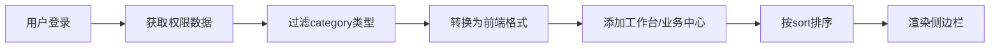

# 侧边栏页面说明文档

## 📋 目录

- [概述](#概述)
- [架构设计](#架构设计)
- [核心功能](#核心功能)
- [数据流程](#数据流程)
- [中心菜单配置](#中心菜单配置)
- [权限控制](#权限控制)
- [开发指南](#开发指南)
- [常见问题](#常见问题)

---

## 概述

### 系统简介

侧边栏是幼儿园管理系统的核心导航组件，采用**动态权限驱动**的设计模式，根据用户角色和权限从后端动态加载菜单结构。

### 核心特性

- ✅ **动态权限菜单** - 基于数据库权限表动态生成
- ✅ **角色自适应** - 不同角色显示不同的中心菜单
- ✅ **响应式设计** - 支持展开/收起、移动端适配
- ✅ **图标系统** - 使用Lucide图标库，统一视觉风格
- ✅ **路由集成** - 与Vue Router深度集成，支持路由高亮
- ✅ **性能优化** - 菜单缓存、懒加载、增量更新

### 技术栈

| 技术 | 版本 | 用途 |
|------|------|------|
| Vue 3 | 3.x | 组件框架 |
| TypeScript | 5.x | 类型系统 |
| Pinia | 2.x | 状态管理 |
| Vue Router | 4.x | 路由管理 |
| Element Plus | 2.x | UI组件库 |
| Lucide Icons | - | 图标库 |

---

## 架构设计

### 组件结构

```
client/src/layouts/components/Sidebar.vue
├── Template (模板层)
│   ├── sidebar-header (Logo区域)
│   └── sidebar-nav (导航菜单)
│       └── nav-item (菜单项) × N
├── Script (逻辑层)
│   ├── 状态管理 (activeItemId, expandedItems)
│   ├── 权限获取 (permissionsStore)
│   ├── 菜单生成 (filteredNavigation)
│   ├── 路由处理 (handleSectionClick)
│   └── 图标映射 (getSectionIcon)
└── Style (样式层)
    ├── 布局样式
    ├── 动画效果
    └── 响应式适配
```

### 数据模型

#### DynamicNavigationItem (菜单项)

```typescript
interface DynamicNavigationItem {
  id: string;           // 唯一标识
  title: string;        // 显示名称（中文）
  route: string;        // 路由路径
  icon: string;         // 图标名称
  component?: string;   // 组件路径
  children?: DynamicNavigationItem[];  // 子菜单
}
```

#### DynamicNavigationSection (菜单分组)

```typescript
interface DynamicNavigationSection {
  id: string;           // 分组ID
  title: string;        // 分组标题
  items: DynamicNavigationItem[];  // 菜单项列表
  order: number;        // 排序权重
}
```

---

## 核心功能

### 1. 动态菜单生成

#### 工作流程



#### 核心代码

```typescript
// 计算属性：动态生成菜单
const filteredNavigation = computed(() => {
  // 1. 获取权限数据
  const menuItems = permissionsStore.menuItems;
  
  // 2. 过滤category类型（一级分类）
  const centerCategories = menuItems.filter(item => item.type === 'category');
  
  // 3. 转换为前端菜单格式
  const centerMenus = centerCategories.map(category => ({
    id: category.code,
    title: category.chineseName,  // 使用中文名称
    route: category.path,
    icon: getCenterIcon(category.code),
    order: category.sort
  }));
  
  // 4. 添加固定菜单项
  return [dashboardItem, ...centerMenus];
});
```

### 2. 权限控制

#### 三级权限体系

| 级别 | 名称 | 数据源 | 用途 |
|------|------|--------|------|
| Level 1 | 菜单权限 | `/api/dynamic-permissions/user-permissions` | 侧边栏显示 |
| Level 2 | 页面权限 | `/api/dynamic-permissions/check-permission` | 路由守卫 |
| Level 4 | 按钮权限 | 权限代码列表 | 功能按钮显示 |

#### 权限验证流程

```typescript
// 初始化权限
onMounted(async () => {
  await permissionsStore.initializePermissions();
  updateActiveState();
});

// 权限检查
const hasPermission = (path: string): boolean => {
  if (isAdmin.value) return true;
  return checkMenuItems(menuItems.value, path);
};
```

### 3. 角色适配

#### 角色菜单映射

| 角色 | 显示菜单 | 特殊处理 |
|------|---------|---------|
| admin | 全部中心 | 显示业务中心 |
| principal | 管理中心 | 显示业务中心 |
| teacher | 教学中心 | 隐藏业务中心，使用教师专用菜单 |
| parent | 家长中心 | 仅显示相关功能 |

#### 教师角色特殊处理

```typescript
// 检查是否为教师中心路径
const isTeacherCenter = currentPath.startsWith('/teacher-center');

if (isTeacherCenter) {
  return generateTeacherCenterMenu();  // 返回教师专用菜单
}
```

### 4. 图标系统

#### 图标映射规则

```typescript
const getCenterIcon = (code: string, title: string): string => {
  const iconMap: Record<string, string> = {
    'PERSONNEL_CENTER': 'Users',
    'ACTIVITY_CENTER': 'Calendar',
    'ENROLLMENT_CENTER': 'School',
    'MARKETING_CENTER': 'TrendingUp',
    'FINANCE_CENTER': 'DollarSign',
    'SYSTEM_CENTER': 'Settings',
    'TASK_CENTER': 'CheckSquare',
    'TEACHING_CENTER': 'BookOpen',
    'SCRIPT_CENTER': 'MessageSquare',
    'MEDIA_CENTER': 'Video'
  };
  
  return iconMap[code] || 'Circle';
};
```

#### 图标使用

```vue
<LucideIcon
  :name="getSectionIcon(section.icon)"
  :size="collapsed ? 28 : 20"
  :stroke-width="1.5"
  class="nav-icon"
/>
```

---

## 数据流程

### 完整数据流

```
┌─────────────┐
│  用户登录   │
└──────┬──────┘
       │
       ▼
┌─────────────────────────────┐
│ permissionsStore.init()     │
│ - fetchMenuItems()          │
│ - fetchRoles()              │
│ - fetchPermissions()        │
└──────┬──────────────────────┘
       │
       ▼
┌─────────────────────────────┐
│ API: /user-permissions      │
│ 返回: MenuItem[]            │
└──────┬──────────────────────┘
       │
       ▼
┌─────────────────────────────┐
│ filteredNavigation计算      │
│ - 过滤category类型          │
│ - 转换为前端格式            │
│ - 添加固定菜单              │
└──────┬──────────────────────┘
       │
       ▼
┌─────────────────────────────┐
│ 渲染侧边栏                  │
│ - v-for遍历菜单             │
│ - 绑定点击事件              │
│ - 高亮当前路由              │
└─────────────────────────────┘
```

### API接口

#### 1. 获取用户权限菜单

**接口**: `GET /api/dynamic-permissions/user-permissions`

**响应示例**:
```json
{
  "success": true,
  "data": [
    {
      "id": 3002,
      "name": "Personnel Center",
      "chineseName": "人员中心",
      "code": "PERSONNEL_CENTER",
      "type": "category",
      "path": "#personnel-center",
      "icon": "Users",
      "sort": 1,
      "parentId": null,
      "children": []
    }
  ]
}
```

#### 2. 检查页面权限

**接口**: `POST /api/dynamic-permissions/check-permission`

**请求体**:
```json
{
  "path": "/centers/personnel",
  "permission": "PERSONNEL_CENTER_VIEW"
}
```

**响应**:
```json
{
  "success": true,
  "data": {
    "hasPermission": true
  }
}
```

---

## 中心菜单配置

### 当前活跃的7个中心 (2025-11-14更新)

| 序号 | 中心名称 | 英文名称 | Code | 路由 | 图标 | 排序 |
|------|---------|---------|------|------|------|------|
| 1 | 教师工作台 | Teacher Dashboard | TEACHER_CENTER_DIRECTORY | #teacher-dashboard | Monitor | 1 |
| 2 | 业务管理 | Business Management | BUSINESS_MANAGEMENT_CATEGORY | #business-management | Briefcase | 10 |
| 3 | 教学管理 | Teaching Management | TEACHING_MANAGEMENT_CATEGORY | #teaching-management | GraduationCap | 20 |
| 4 | 营销管理 | Marketing Management | MARKETING_MANAGEMENT_CATEGORY | #marketing-management | Megaphone | 30 |
| 5 | 财务管理 | Finance Management | FINANCE_MANAGEMENT_CATEGORY | #finance-management | DollarSign | 40 |
| 6 | 人员管理 | Personnel Management | PERSONNEL_MANAGEMENT_CATEGORY | #personnel-management | Users | 50 |
| 7 | 系统管理 | System Management | SYSTEM_MANAGEMENT_CATEGORY | #system-management | Settings | 60 |

### 数据库表结构

```sql
CREATE TABLE `permissions` (
  `id` int NOT NULL AUTO_INCREMENT,
  `name` varchar(100) NOT NULL COMMENT '英文名称',
  `chinese_name` varchar(100) DEFAULT NULL COMMENT '中文名称',
  `code` varchar(100) NOT NULL COMMENT '权限代码',
  `type` varchar(20) DEFAULT 'menu' COMMENT '类型: category/menu/button',
  `parent_id` int DEFAULT NULL COMMENT '父级ID',
  `path` varchar(255) DEFAULT NULL COMMENT '路由路径',
  `component` varchar(255) DEFAULT NULL COMMENT '组件路径',
  `icon` varchar(100) DEFAULT NULL COMMENT '图标名称',
  `sort` int DEFAULT 0 COMMENT '排序权重',
  `status` tinyint DEFAULT 1 COMMENT '状态: 1启用 0禁用',
  `created_at` timestamp NOT NULL,
  `updated_at` timestamp NOT NULL,
  PRIMARY KEY (`id`),
  UNIQUE KEY `code` (`code`)
);
```

### 添加新中心的步骤

1. **数据库插入**
```sql
INSERT INTO permissions (
  name, chinese_name, code, type, 
  path, icon, sort, parent_id, status
) VALUES (
  'New Center', '新中心', 'NEW_CENTER', 'category',
  '#new-center', 'Star', 30, NULL, 1
);
```

2. **添加中心页面**
```sql
INSERT INTO permissions (
  name, chinese_name, code, type,
  path, component, icon, sort, parent_id, status
) VALUES (
  'new-center-page', '新中心', 'NEW_CENTER_PAGE', 'menu',
  '/centers/new', 'pages/centers/NewCenter.vue', 'Star', 10,
  (SELECT id FROM permissions WHERE code='NEW_CENTER'), 1
);
```

3. **创建Vue组件**
```bash
# 创建中心页面组件
touch client/src/pages/centers/NewCenter.vue
```

4. **配置路由映射**
```typescript
// client/src/router/dynamic-routes.ts
const componentMap = {
  'pages/centers/NewCenter.vue': () => import('../pages/centers/NewCenter.vue')
};
```

5. **配置图标映射**
```typescript
// client/src/layouts/components/Sidebar.vue
const getCenterIcon = (code: string): string => {
  const iconMap = {
    'NEW_CENTER': 'Star',
    // ...其他映射
  };
  return iconMap[code] || 'Circle';
};
```

---

## 权限控制

### 权限数据结构

```typescript
// Pinia Store
interface PermissionsState {
  permissions: Permission[];      // 权限代码列表
  roles: Role[];                  // 角色列表
  menuItems: MenuItem[];          // 菜单项列表
  isAdmin: boolean;               // 是否管理员
}
```

### 权限检查方法

#### 1. 菜单权限检查

```typescript
// 检查是否有某个路径的权限
const hasPermission = (path: string): boolean => {
  if (isAdmin.value) return true;
  return checkMenuItems(menuItems.value, path);
};
```

#### 2. 角色权限检查

```typescript
// 检查是否有某个角色
const hasRole = (roleCode: string): boolean => {
  return userRoles.value.includes(roleCode);
};
```

#### 3. 按钮权限检查

```typescript
// 检查是否有某个权限代码
const hasPermissionCode = (code: string): boolean => {
  if (isAdmin.value) return true;
  return permissions.value.some(p => p.code === code);
};
```

### 路由守卫集成

```typescript
// client/src/router/index.ts
router.beforeEach(async (to, from, next) => {
  const permissionsStore = usePermissionsStore();
  
  // 检查页面权限
  const hasAccess = await permissionsStore.checkPagePermission(
    to.path,
    to.meta.permission
  );
  
  if (!hasAccess) {
    next('/403');  // 无权限，跳转403页面
  } else {
    next();
  }
});
```

---

## 开发指南

### 本地开发

```bash
# 启动前端开发服务器
cd client
npm run dev

# 启动后端服务器
cd server
npm run dev
```

### 调试技巧

#### 1. 查看权限数据

```javascript
// 浏览器控制台
const permissionsStore = usePermissionsStore();
console.log('菜单项:', permissionsStore.menuItems);
console.log('权限列表:', permissionsStore.permissions);
console.log('角色列表:', permissionsStore.roles);
```

#### 2. 查看路由配置

```javascript
// 浏览器控制台
import { useRouter } from 'vue-router';
const router = useRouter();
console.log('所有路由:', router.getRoutes());
```

#### 3. 模拟不同角色

```sql
-- 切换到教师角色
UPDATE users SET role = 'teacher' WHERE username = 'your_username';

-- 切换到管理员角色
UPDATE users SET role = 'admin' WHERE username = 'your_username';
```

### 常见开发任务

#### 修改中心名称

```sql
UPDATE permissions 
SET chinese_name = '新名称' 
WHERE code = 'CENTER_CODE';
```

#### 调整中心排序

```sql
UPDATE permissions 
SET sort = 新排序值 
WHERE code = 'CENTER_CODE';
```

#### 禁用某个中心

```sql
UPDATE permissions 
SET status = 0 
WHERE code = 'CENTER_CODE';
```

---

## 常见问题

### Q1: 侧边栏不显示某个中心？

**可能原因**:
1. 数据库中该中心的 `status = 0` (已禁用)
2. 用户角色没有该中心的权限
3. 前端缓存未更新

**解决方案**:
```sql
-- 检查中心状态
SELECT id, name, chinese_name, status 
FROM permissions 
WHERE code = 'CENTER_CODE';

-- 检查角色权限
SELECT rp.* 
FROM role_permissions rp
JOIN permissions p ON rp.permission_id = p.id
WHERE p.code = 'CENTER_CODE';
```

### Q2: 中心名称显示为英文？

**原因**: `chinese_name` 字段为空或包含英文字符

**解决方案**:
```sql
UPDATE permissions 
SET chinese_name = '正确的中文名称' 
WHERE code = 'CENTER_CODE';
```

### Q3: 点击中心后跳转404？

**可能原因**:
1. 路由路径配置错误
2. 组件文件不存在
3. 动态路由未正确生成

**解决方案**:
```typescript
// 检查路由配置
const componentMap = {
  'pages/centers/YourCenter.vue': () => import('../pages/centers/YourCenter.vue')
};

// 确保组件文件存在
// client/src/pages/centers/YourCenter.vue
```

### Q4: 权限更新后不生效？

**原因**: 前端缓存未清除

**解决方案**:
```javascript
// 清除权限缓存
localStorage.removeItem('permissions_cache');
location.reload();
```

### Q5: 如何添加子菜单？

**答**: 当前侧边栏设计为扁平化结构，不支持二级菜单。如需添加子功能，建议在中心页面内部使用Tab标签页实现。

---

## 相关文档

- [动态路由配置](../路由/动态路由说明.md)
- [权限系统设计](../权限/权限系统说明.md)
- [中心页面开发](../开发/中心页面开发指南.md)

---

## 角色权限统计 (2025-11-14)

### 各角色权限数量

| 角色 | 权限数量 | 说明 |
|------|---------|------|
| admin | 42个 | 管理员，拥有所有权限 |
| principal | 28个 | 园长，拥有管理权限 |
| teacher | 39个 | 教师，拥有教学相关权限 |
| parent | 41个 | 家长，拥有家长相关权限 |

### 家长角色权限详情 (16个PARENT_权限)

1. PARENT_ACTIVITIES - 活动列表
2. PARENT_AI_ASSISTANT - AI育儿助手
3. PARENT_ASSESSMENT - 能力测评
4. PARENT_CENTER - 家长中心
5. PARENT_CENTER_DIRECTORY - 家长中心目录
6. PARENT_COMMUNICATION - 智能沟通
7. PARENT_DASHBOARD - 家长工作台
8. PARENT_FEEDBACK - 意见反馈
9. PARENT_GAMES - 游戏大厅
10. PARENT_GROWTH_REPORT - 成长报告
11. PARENT_KINDERGARTEN_REWARDS - 推荐奖励
12. PARENT_PHOTO_ALBUM - 成长相册
13. PARENT_PROFILE - 我的信息
14. PARENT_SCHOOL_READINESS - 幼小衔接
15. PARENT_SHARE_STATS - 分享统计
16. PARENT_STUDENT_INFO - 学生信息

## 更新日志

### 2025-11-14
- ✅ 更新侧边栏配置为7个管理中心
- ✅ 更新角色权限统计
- ✅ 添加家长权限详情
- ✅ 修复教师菜单显示问题
- ✅ 修复家长权限漏洞

### 2025-10-07
- ✅ 修复所有中心名称为纯中文
- ✅ 移除智能中心、数据分析中心、督查中心
- ✅ 最终保留12个核心业务中心
- ✅ 完善侧边栏文档

### 2025-01-25
- ✅ 重构侧边栏为动态权限驱动
- ✅ 实现角色自适应菜单
- ✅ 优化图标系统

---

**文档维护**: AI Assistant (Augment Agent)
**最后更新**: 2025-11-14

