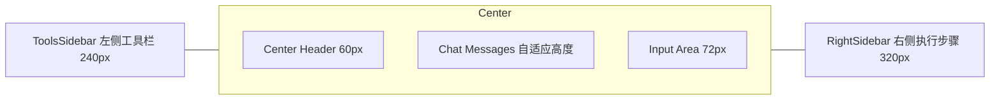

# AI助手 全屏样式文档 001

本规范用于将当前AI助手全屏页面重构为与“AI Desktop Assistant”完全一致的视觉与布局样式。目标是在不改变交互功能的前提下，实现统一、极简、工程化的三栏全屏体验（左工具栏/中对话区/右执行步骤）。

---

## 1. 页面结构总览（三栏全屏）

- 视口：Desktop ≥ 1280px（推荐 1440px~1920px）
- 栏目：左侧工具栏 + 中心对话区 + 右侧执行步骤
- 顶部：中心区包含 60px 高的头部（Logo/状态/操作）

---

## 2. 布局与尺寸规范

- 页面背景：#F9FAFB（暗色：#111827）
- 栏间边框：1px 实线 #E5E7EB（暗色：#374151）

### 2.1 左侧工具栏（ToolsSidebar）
- 宽度：240px（折叠时宽度=0，抽屉式隐藏）
- 折叠按钮：圆形 24×24，边框 1px #E5E7EB，悬停背景 #F3F4F6
- 内边距：垂直 20px，左右 0
- 区块标题行（Section Header）：
  - 行高：24px
  - 字体：12px/600；颜色 #6B7280（暗色：#9CA3AF）
  - 图标：14px
- 工具项（Tool Item）：
  - 高度：44px（上下内边距 10px，左右 16px）
  - 名称：13px/500，等宽体显示；颜色 #111827（暗色：#F9FAFB）
  - 描述：11px，颜色 #6B7280（暗色：#9CA3AF）
  - Hover：背景 #F9FAFB（暗色：#374151），左侧 3px 主色条 #3B82F6
- 滚动：Y 方向自动，隐藏横向滚动

### 2.2 中心区（Center）
- 头部（Center Header）：
  - 高度：60px；背景 #FFFFFF（暗色：#1F2937）
  - 左侧：Logo 图标 24px + 标题 18px/600；标题色 #111827（暗色：#F9FAFB）
  - 在线标签：小号 Tag，成功色，图标与文案间距 4px
  - 右侧操作按钮（图标按钮）：
    - 尺寸：36×36；圆角 8；边框 1px #E5E7EB（暗色：#374151）
    - Hover：背景 #F9FAFB（暗色：#374151），边框主色 #3B82F6
- 聊天消息区（Chat Messages）：
  - 内边距：20px；纵向间距 16px；溢出：Y 滚动
  - 消息项最大宽度：70%（自适应换行）
  - 头像：36×36 圆形；AI头像底色 #3B82F6；用户头像底色 #8B5CF6
  - 动画：messageSlideIn 300ms ease-out
- 输入区（Input Area）：
  - 高度：72px（含外边距/操作区）；背景 #FFFFFF（暗色：#1F2937）；上边框 1px #E5E7EB
  - 文本输入（textarea/输入框）：
    - 字号：14–16px；行高 1.5；圆角 8；内边距 12px
    - 高度：单行最小 44px，自动增高最大 160–180px
    - 占位提示色：#9CA3AF
  - 操作按钮：32×32 图标按钮（上传、语音等），间距 8px

### 2.3 右侧执行步骤（RightSidebar）
- 可见宽度：320px；背景 #FFFFFF（暗色：#1F2937）；左边框 1px #E5E7EB
- 顶部栏（Header）：高度 56px，含标题与收起按钮（36×36）
- AI Thinking 区块：
  - 背景主色浅蓝：#EFF6FF；文字主色 #1D4ED8；带旋转 Loading 图标
  - 圆角 10；内边距 12；图标大小 18–20px
- 会话统计（Session Stats）：
  - 三列卡片；标签 12px；数值 18px/700；颜色 #111827
- 历史列表（Tool Call History）：
  - 行高 44px；图标列 20px；名称 13px/500
  - 状态色：完成 #22C55E；错误 #EF4444；进行中 #3B82F6（旋转）
- 空状态：图标 + “暂无执行步骤”，次要文本 #6B7280

---

## 3. 字体、颜色与间距系统

### 3.1 字体层级（Desktop）
- H1：24px / 600（用于页面级标题）
- H2：20px / 600（用于分区标题）
- H3：18px / 600（用于小分区）
- 正文：14–16px / 400–500（聊天内容与说明）
- 代码：13px 等宽（Monaco/Menlo/Courier New）

### 3.2 颜色（Light / Dark）
- 背景：#FFFFFF / #1F2937
- 页面背景：#F9FAFB / #111827
- 文字主：#111827 / #F9FAFB
- 文字次：#6B7280 / #9CA3AF
- 边框：#E5E7EB / #374151
- 主色（蓝）：#3B82F6
- 用户气泡渐变：#667EEA → #764BA2
- 警告底色：#FEF3C7（文本 #92400E）

### 3.3 间距（Spacing Scale）
- 4 / 8 / 12 / 16 / 20 / 24 px（推荐以 8 为基础单位）

---

## 4. 消息样式与 Markdown 规范

### 4.1 消息卡片
- 用户消息：
  - 背景：线性渐变 #667EEA → #764BA2；文字 #FFFFFF
  - 内边距：12×16；圆角：12；阴影：0 2px 8px rgba(102,126,234,0.2)
- 助手消息：
  - 背景：#FFFFFF；文字 #374151；边框 1px #E5E7EB；圆角 12
- 欢迎消息卡：
  - 背景：线性渐变 #667EEA → #764BA2；文字 #FFFFFF；内边距 20；圆角 12
- 警告/提示：
  - 背景：#FEF3C7；文本 #92400E；左侧 4px 高亮条 #F59E0B

### 4.2 Markdown 渲染
- 引擎：marked + highlight.js
- 标题：H1 24/H2 20/H3 18；H1/H2 下边框 1px #E5E7EB（暗色 #374151）
- 段落：上下 8px；列表：外边距 8px，缩进 24px
- 行内代码：灰底 #F3F4F6，圆角 4，等宽字体，13px；暗色灰底 #374151
- 代码块：pre 背景 #1F2937；圆角 8；内边距 16；文字 #F9FAFB
- 表格：1px #E5E7EB 边框；表头灰底 #F9FAFB
- 链接：主色 #3B82F6，悬停下划线

---

## 5. 交互、动效与响应

- 侧栏开合：translateX，300ms cubic-bezier(0.4,0,0.2,1)
- 消息出现：messageSlideIn（Y:10px→0, 300ms）
- 右侧栏：无调用时隐藏；首次工具调用自动展开
- 键盘输入：Enter 发送，Shift+Enter 换行（与现有逻辑一致）
- 窄屏（<1280px）策略：优先隐藏右侧栏；必要时左侧折叠

---

## 6. 关键组件对照（实现对齐）

- 左栏：ToolsSidebar.vue（已提供）
- 中区：
  - 头部：现有 Center Header 结构，按尺寸/按钮样式调整
  - 消息区：MarkdownMessage.vue 渲染 + 新消息卡片样式
  - 输入区：InputArea 保持逻辑，仅按尺寸/圆角/间距统一
- 右栏：RightSidebar.vue（已改造为“执行步骤”样式）

---

## 7. 统一尺寸清单（便于开发核对）

- Left Sidebar：240px
- Right Sidebar：320px
- Center Header：60px
- Avatar：36×36
- Icon Button：36×36（头部、右侧栏折叠等）
- Small Icon Button：32×32（输入区功能按钮）
- Tool Item Row：44px
- History Row（右栏）：44px
- Input Textarea：最小 44px，高度自适应至 160–180px
- Message Max Width：70%
- Chat Padding：20px，Message Gap：16px

---

## 8. 主题与可访问性

- 暗色主题：颜色一一映射（见 3.2）
- 对比度：确保主文本与背景对比度 ≥ 4.5:1
- 点击域：按钮最小可点击区域 32×32

---

## 9. 重构实施备注

1) 以本文件为规范进行样式统一；
2) 先不改动核心业务逻辑，仅替换/新增样式与容器结构；
3) 完成后联调右侧自动展开、Markdown渲染与输入区交互；
4) 通过 E2E/视觉走查核对尺寸与状态；
5) 如需细节微调，以本规范为基准更新到 002 版。

