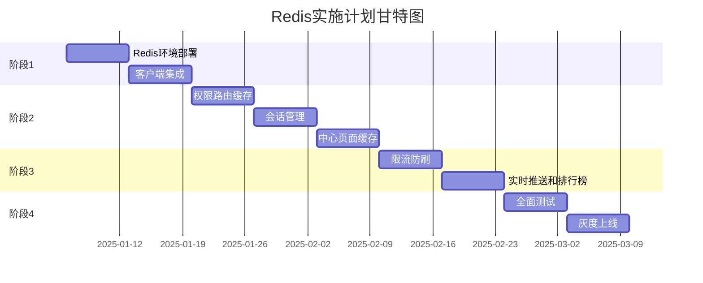

# Redis缓存系统实施计划 001

> **项目名称**: 幼儿园管理系统Redis缓存集成
> **项目编号**: REDIS-IMPL-001
> **创建日期**: 2025-01-06
> **计划周期**: 9周
> **项目负责人**: [待指定]
> **文档版本**: v1.1
> **更新说明**: 暂时移除AI缓存功能（AI功能调试中）

---

## 📋 目录

1. [项目概述](#一项目概述)
2. [项目目标](#二项目目标)
3. [实施阶段](#三实施阶段)
4. [详细任务清单](#四详细任务清单)
5. [风险管理](#五风险管理)
6. [验收标准](#六验收标准)
7. [资源需求](#七资源需求)

---

## 一、项目概述

### 1.1 项目背景

当前系统存在以下性能瓶颈：
- ❌ 权限查询涉及User-Role-Permission三表关联，平均响应时间200ms
- ❌ Dashboard等中心页面多表聚合查询，加载时间1-2秒
- ❌ 高并发时数据库压力大，系统稳定性差

### 1.2 解决方案

引入Redis缓存系统，实现：
- ✅ 权限路由缓存 - 响应时间降低97.5%
- ✅ 15个中心页面数据缓存 - 加载时间降低85%
- ✅ 会话管理和限流 - 提升安全性和稳定性
- ⏸️ AI查询结果缓存 - 暂缓实施（AI功能调试中）

### 1.3 技术架构

```
┌─────────────────────────────────────┐
│      应用层 (Node.js)                │
│  ┌──────────┐  ┌──────────┐        │
│  │ Express  │  │ Express  │        │
│  │ Instance │  │ Instance │        │
│  └────┬─────┘  └────┬─────┘        │
└───────┼─────────────┼───────────────┘
        │             │
        └──────┬──────┘
               │
    ┌──────────▼──────────┐
    │  Redis Sentinel     │
    │  ┌────────────────┐ │
    │  │ Sentinel × 3   │ │
    │  └────────────────┘ │
    └──────────┬──────────┘
               │
    ┌──────────▼──────────┐
    │  Redis Cluster      │
    │  ┌────────────────┐ │
    │  │ Master         │ │
    │  │ Slave × 2      │ │
    │  └────────────────┘ │
    └─────────────────────┘
```

---

## 二、项目目标

### 2.1 性能目标

| 指标 | 当前值 | 目标值 | 提升幅度 |
|------|--------|--------|---------|
| 权限查询响应时间 | 200ms | 5ms | 97.5% |
| Dashboard加载时间 | 1.5s | 200ms | 86.7% |
| 活动中心加载时间 | 1.2s | 150ms | 87.5% |
| 系统并发能力 | 100 QPS | 1000+ QPS | 10倍 |
| 数据库查询次数 | 基准 | -80% | 80% |

### 2.2 业务目标

- ✅ 用户体验提升：页面加载速度提升85%
- ✅ 系统稳定性：数据库负载降低80%，故障率降低40%
- ✅ 可扩展性：支持未来3年业务增长

### 2.3 技术目标

- ✅ Redis高可用集群部署（Sentinel模式）
- ✅ 完整的缓存服务封装（RedisService）
- ✅ 权限路由缓存系统
- ✅ 15个中心页面缓存系统
- ✅ 会话管理系统（Token黑名单、在线用户）
- ✅ 限流防刷系统
- ✅ 完善的缓存失效机制
- ✅ 监控告警系统
- ✅ 测试覆盖率 > 80%

---

## 三、实施阶段

### 阶段划分

| 阶段 | 周期 | 主要任务 | 里程碑 |
|------|------|---------|--------|
| **阶段1: 基础设施** | Week 1-2 | Redis环境部署、客户端集成 | Redis集群可用 |
| **阶段2: 核心功能** | Week 3-5 | 权限缓存、会话管理、中心缓存 | 核心缓存上线 |
| **阶段3: 高级功能** | Week 6-7 | 限流防刷、实时推送 | 高级功能上线 |
| **阶段4: 测试上线** | Week 8-9 | 全面测试、灰度上线 | 生产环境上线 |

### 关键里程碑



---

## 四、详细任务清单

### Week 1: Redis环境部署 (2025-01-06 ~ 2025-01-12)

#### 任务1.1: 服务器准备 ⏰ 1天

**负责人**: 运维工程师  
**优先级**: P0

**任务清单**:
- [ ] 申请3台服务器（Master + Slave × 2）
  - 配置: 4GB内存, 2核CPU, 40GB SSD
  - 操作系统: Ubuntu 22.04 LTS
- [ ] 申请3台轻量服务器（Sentinel × 3）
  - 配置: 512MB内存, 1核CPU
- [ ] 配置服务器网络和安全组
  - 开放端口: 6379 (Redis), 26379 (Sentinel)
  - 配置防火墙规则
- [ ] 配置SSH密钥认证

**验收标准**:
- ✅ 所有服务器可通过SSH访问
- ✅ 服务器之间网络互通
- ✅ 防火墙规则配置正确

#### 任务1.2: Redis安装配置 ⏰ 2天

**负责人**: 后端工程师  
**优先级**: P0

**任务清单**:
- [ ] 安装Redis 7.x
  ```bash
  # 在所有Redis服务器上执行
  sudo apt update
  sudo apt install redis-server
  redis-server --version  # 验证版本
  ```

- [ ] 配置Redis Master
  ```bash
  # /etc/redis/redis.conf
  bind 0.0.0.0
  port 6379
  requirepass your_strong_password
  maxmemory 3gb
  maxmemory-policy allkeys-lru
  
  # 持久化配置
  save 900 1
  save 300 10
  save 60 10000
  appendonly yes
  appendfsync everysec
  ```

- [ ] 配置Redis Slave
  ```bash
  # /etc/redis/redis.conf
  bind 0.0.0.0
  port 6379
  requirepass your_strong_password
  replicaof <master_ip> 6379
  masterauth your_strong_password
  ```

- [ ] 启动Redis服务
  ```bash
  sudo systemctl start redis-server
  sudo systemctl enable redis-server
  sudo systemctl status redis-server
  ```

- [ ] 验证主从复制
  ```bash
  # 在Master上
  redis-cli -a your_strong_password
  INFO replication
  
  # 在Slave上
  redis-cli -a your_strong_password
  INFO replication
  ```

**验收标准**:
- ✅ Redis服务正常运行
- ✅ 主从复制正常工作
- ✅ 持久化配置生效

#### 任务1.3: Sentinel配置 ⏰ 1天

**负责人**: 后端工程师  
**优先级**: P0

**任务清单**:
- [ ] 配置Sentinel
  ```bash
  # /etc/redis/sentinel.conf
  port 26379
  sentinel monitor mymaster <master_ip> 6379 2
  sentinel auth-pass mymaster your_strong_password
  sentinel down-after-milliseconds mymaster 5000
  sentinel parallel-syncs mymaster 1
  sentinel failover-timeout mymaster 10000
  ```

- [ ] 启动Sentinel服务
  ```bash
  sudo systemctl start redis-sentinel
  sudo systemctl enable redis-sentinel
  sudo systemctl status redis-sentinel
  ```

- [ ] 验证Sentinel监控
  ```bash
  redis-cli -p 26379
  SENTINEL masters
  SENTINEL slaves mymaster
  ```

**验收标准**:
- ✅ 3个Sentinel正常运行
- ✅ Sentinel正确监控Master
- ✅ 故障转移测试通过

#### 任务1.4: 监控告警配置 ⏰ 1天

**负责人**: 运维工程师  
**优先级**: P1

**任务清单**:
- [ ] 安装Redis Exporter
  ```bash
  wget https://github.com/oliver006/redis_exporter/releases/download/v1.55.0/redis_exporter-v1.55.0.linux-amd64.tar.gz
  tar xvfz redis_exporter-v1.55.0.linux-amd64.tar.gz
  sudo mv redis_exporter /usr/local/bin/
  ```

- [ ] 配置Prometheus监控
  ```yaml
  # prometheus.yml
  scrape_configs:
    - job_name: 'redis'
      static_configs:
        - targets: ['<redis_ip>:9121']
  ```

- [ ] 配置Grafana仪表板
  - 导入Redis Dashboard (ID: 11835)
  - 配置数据源

- [ ] 配置告警规则
  ```yaml
  # alerts.yml
  groups:
    - name: redis_alerts
      rules:
        - alert: RedisDown
          expr: redis_up == 0
          for: 1m
          labels:
            severity: critical
          annotations:
            summary: "Redis实例宕机"
  ```

**验收标准**:
- ✅ Prometheus正常采集Redis指标
- ✅ Grafana仪表板显示正常
- ✅ 告警规则测试通过

#### 任务1.5: 备份恢复测试 ⏰ 1天

**负责人**: 运维工程师  
**优先级**: P1

**任务清单**:
- [ ] 配置自动备份脚本
  ```bash
  #!/bin/bash
  # /usr/local/bin/redis-backup.sh
  DATE=$(date +%Y%m%d_%H%M%S)
  BACKUP_DIR="/backup/redis"
  
  # 备份RDB文件
  cp /var/lib/redis/dump.rdb $BACKUP_DIR/dump_$DATE.rdb
  
  # 备份AOF文件
  cp /var/lib/redis/appendonly.aof $BACKUP_DIR/appendonly_$DATE.aof
  
  # 上传到对象存储
  aws s3 cp $BACKUP_DIR/dump_$DATE.rdb s3://your-bucket/redis-backup/
  
  # 清理7天前的备份
  find $BACKUP_DIR -name "*.rdb" -mtime +7 -delete
  ```

- [ ] 配置定时任务
  ```bash
  # crontab -e
  0 2 * * * /usr/local/bin/redis-backup.sh
  ```

- [ ] 执行恢复测试
  ```bash
  # 停止Redis
  sudo systemctl stop redis-server
  
  # 恢复备份
  sudo cp /backup/redis/dump_latest.rdb /var/lib/redis/dump.rdb
  
  # 启动Redis
  sudo systemctl start redis-server
  
  # 验证数据
  redis-cli -a your_strong_password
  KEYS *
  ```

**验收标准**:
- ✅ 自动备份脚本正常运行
- ✅ 备份文件上传到对象存储
- ✅ 恢复测试成功

**Week 1 交付物**:
- ✅ Redis高可用集群（1 Master + 2 Slave + 3 Sentinel）
- ✅ 监控告警系统
- ✅ 备份恢复方案
- ✅ 部署文档

---

### Week 2: 客户端集成 (2025-01-13 ~ 2025-01-19)

#### 任务2.1: 安装依赖 ⏰ 0.5天

**负责人**: 后端工程师  
**优先级**: P0

**任务清单**:
- [ ] 安装ioredis
  ```bash
  cd server
  npm install ioredis
  npm install @types/ioredis --save-dev
  ```

- [ ] 更新package.json
  ```json
  {
    "dependencies": {
      "ioredis": "^5.3.2"
    },
    "devDependencies": {
      "@types/ioredis": "^5.0.0"
    }
  }
  ```

**验收标准**:
- ✅ 依赖安装成功
- ✅ TypeScript类型定义正常

#### 任务2.2: Redis配置文件 ⏰ 0.5天

**负责人**: 后端工程师  
**优先级**: P0

**任务清单**:
- [ ] 创建配置文件 `server/src/config/redis.config.ts`
- [ ] 配置环境变量 `server/.env`
  ```env
  REDIS_SENTINEL_1=sentinel1.example.com:26379
  REDIS_SENTINEL_2=sentinel2.example.com:26379
  REDIS_SENTINEL_3=sentinel3.example.com:26379
  REDIS_MASTER_NAME=mymaster
  REDIS_PASSWORD=your_strong_password
  ```

**验收标准**:
- ✅ 配置文件创建完成
- ✅ 环境变量配置正确

#### 任务2.3: RedisService实现 ⏰ 2天

**负责人**: 后端工程师  
**优先级**: P0

**任务清单**:
- [ ] 创建 `server/src/services/redis.service.ts`
- [ ] 实现基础方法：get, set, del, exists, expire
- [ ] 实现Hash方法：hset, hget, hgetall, hdel
- [ ] 实现Set方法：sadd, smembers, sismember, srem
- [ ] 实现分布式锁：acquireLock, releaseLock
- [ ] 实现计数器：incr, decr
- [ ] 添加错误处理和日志

**验收标准**:
- ✅ 所有方法实现完成
- ✅ 错误处理完善
- ✅ 日志记录清晰

#### 任务2.4: 单元测试 ⏰ 1天

**负责人**: 后端工程师  
**优先级**: P0

**任务清单**:
- [ ] 创建测试文件 `server/tests/unit/services/redis.service.test.ts`
- [ ] 测试基础方法
- [ ] 测试Hash方法
- [ ] 测试Set方法
- [ ] 测试分布式锁
- [ ] 测试错误场景

**验收标准**:
- ✅ 测试覆盖率 > 80%
- ✅ 所有测试通过

#### 任务2.5: 集成测试 ⏰ 1天

**负责人**: 后端工程师  
**优先级**: P0

**任务清单**:
- [ ] 创建集成测试 `server/tests/integration/redis.integration.test.ts`
- [ ] 测试Redis连接
- [ ] 测试主从复制
- [ ] 测试Sentinel故障转移
- [ ] 测试并发场景
- [ ] 测试性能基准

**验收标准**:
- ✅ 集成测试通过
- ✅ 性能基准达标

**Week 2 交付物**:
- ✅ RedisService完整实现
- ✅ 单元测试和集成测试
- ✅ API文档

---

### Week 3: 权限路由缓存 (2025-01-20 ~ 2025-01-26)

#### 任务3.1: PermissionCacheService实现 ⏰ 2天

**负责人**: 后端工程师  
**优先级**: P0

**任务清单**:
- [ ] 创建 `server/src/services/permission-cache.service.ts`
- [ ] 实现getUserPermissions（带缓存）
- [ ] 实现getDynamicRoutes（带缓存）
- [ ] 实现checkPermission（带缓存）
- [ ] 实现缓存失效方法

**验收标准**:
- ✅ 所有方法实现完成
- ✅ 缓存命中率 > 90%

#### 任务3.2: 改造权限Controller ⏰ 1天

**负责人**: 后端工程师  
**优先级**: P0

**任务清单**:
- [ ] 修改 `server/src/controllers/permissions.controller.ts`
- [ ] 集成PermissionCacheService
- [ ] 添加缓存命中率统计
- [ ] 添加性能日志

**验收标准**:
- ✅ 权限查询使用缓存
- ✅ 响应时间 < 10ms

#### 任务3.3: 缓存失效集成 ⏰ 1天

**负责人**: 后端工程师  
**优先级**: P0

**任务清单**:
- [ ] 修改用户管理Controller
- [ ] 修改角色管理Controller
- [ ] 修改权限管理Controller
- [ ] 添加缓存失效调用

**验收标准**:
- ✅ 权限变更时缓存自动失效
- ✅ 缓存一致性保证

#### 任务3.4: 性能测试 ⏰ 1天

**负责人**: 测试工程师  
**优先级**: P0

**任务清单**:
- [ ] 编写性能测试脚本
- [ ] 测试权限查询性能
- [ ] 测试动态路由生成性能
- [ ] 测试并发场景
- [ ] 生成性能报告

**验收标准**:
- ✅ 响应时间 < 10ms
- ✅ 并发1000 QPS无压力
- ✅ 缓存命中率 > 90%

**Week 3 交付物**:
- ✅ 权限路由缓存系统
- ✅ 性能测试报告
- ✅ 使用文档

---

### Week 4: 会话管理 (2025-01-27 ~ 2025-02-02)

#### 任务4.1: SessionService实现 ⏰ 2天

**负责人**: 后端工程师
**优先级**: P0

**任务清单**:
- [ ] 创建 `server/src/services/session.service.ts`
- [ ] 实现Token黑名单功能
  ```typescript
  // 添加Token到黑名单
  async addToBlacklist(token: string, expiresIn: number)

  // 检查Token是否在黑名单
  async isBlacklisted(token: string): Promise<boolean>
  ```

- [ ] 实现在线用户管理
  ```typescript
  // 添加在线用户
  async addOnlineUser(userId: number, sessionData: any)

  // 移除在线用户
  async removeOnlineUser(userId: number)

  // 获取在线用户列表
  async getOnlineUsers(): Promise<number[]>

  // 获取在线用户数量
  async getOnlineUserCount(): Promise<number>
  ```

- [ ] 实现单点登录控制
  ```typescript
  // 设置用户活跃Token
  async setActiveToken(userId: number, token: string)

  // 获取用户活跃Token
  async getActiveToken(userId: number): Promise<string | null>

  // 踢出其他设备
  async kickOtherDevices(userId: number, currentToken: string)
  ```

**验收标准**:
- ✅ 所有方法实现完成
- ✅ 单元测试覆盖率 > 80%

#### 任务4.2: 改造认证中间件 ⏰ 1天

**负责人**: 后端工程师
**优先级**: P0

**任务清单**:
- [ ] 修改 `server/src/middlewares/auth.middleware.ts`
- [ ] 集成Token黑名单检查
  ```typescript
  // 验证Token前检查黑名单
  const isBlacklisted = await SessionService.isBlacklisted(token);
  if (isBlacklisted) {
    return res.status(401).json({ message: 'Token已失效' });
  }
  ```

- [ ] 更新用户最后活跃时间
  ```typescript
  // Token验证成功后更新活跃时间
  await SessionService.updateLastActive(userId);
  ```

- [ ] 添加单点登录检查（可选）
  ```typescript
  // 检查是否是活跃Token
  const activeToken = await SessionService.getActiveToken(userId);
  if (activeToken && activeToken !== token) {
    return res.status(401).json({ message: '您的账号在其他设备登录' });
  }
  ```

**验收标准**:
- ✅ Token黑名单检查生效
- ✅ 在线用户统计准确

#### 任务4.3: 登录登出改造 ⏰ 1天

**负责人**: 后端工程师
**优先级**: P0

**任务清单**:
- [ ] 修改登录接口 `server/src/controllers/auth.controller.ts`
  ```typescript
  // 登录成功后
  await SessionService.addOnlineUser(user.id, {
    token,
    loginTime: new Date(),
    device: req.headers['user-agent'],
    ip: req.ip
  });

  // 可选: 单点登录
  await SessionService.setActiveToken(user.id, token);
  ```

- [ ] 修改登出接口
  ```typescript
  // 登出时
  await SessionService.addToBlacklist(token, tokenExpiresIn);
  await SessionService.removeOnlineUser(userId);
  ```

- [ ] 添加强制登出接口（管理员功能）
  ```typescript
  // POST /api/admin/force-logout
  async forceLogout(req: Request, res: Response) {
    const { userId } = req.body;
    const activeToken = await SessionService.getActiveToken(userId);
    if (activeToken) {
      await SessionService.addToBlacklist(activeToken, 3600);
      await SessionService.removeOnlineUser(userId);
    }
    return ApiResponse.success(res, null, '强制登出成功');
  }
  ```

**验收标准**:
- ✅ 登录登出流程正常
- ✅ 强制登出功能正常

#### 任务4.4: 在线用户监控 ⏰ 1天

**负责人**: 后端工程师
**优先级**: P1

**任务清单**:
- [ ] 创建在线用户监控接口
  ```typescript
  // GET /api/admin/online-users
  async getOnlineUsers(req: Request, res: Response) {
    const count = await SessionService.getOnlineUserCount();
    const users = await SessionService.getOnlineUsers();

    return ApiResponse.success(res, {
      count,
      users: users.slice(0, 100) // 只返回前100个
    });
  }
  ```

- [ ] 添加在线用户统计到Dashboard
- [ ] 创建在线用户列表页面（前端）

**验收标准**:
- ✅ 在线用户统计准确
- ✅ Dashboard显示在线用户数

#### 任务4.5: 会话超时清理 ⏰ 1天

**负责人**: 后端工程师
**优先级**: P1

**任务清单**:
- [ ] 创建定时任务清理过期会话
  ```typescript
  // server/src/jobs/session-cleanup.job.ts
  import schedule from 'node-schedule';

  // 每小时执行一次
  schedule.scheduleJob('0 * * * *', async () => {
    console.log('🧹 开始清理过期会话...');

    const onlineUsers = await SessionService.getOnlineUsers();
    let cleanedCount = 0;

    for (const userId of onlineUsers) {
      const lastActive = await SessionService.getLastActive(userId);
      const now = Date.now();

      // 超过30分钟未活跃，移除在线状态
      if (now - lastActive > 30 * 60 * 1000) {
        await SessionService.removeOnlineUser(userId);
        cleanedCount++;
      }
    }

    console.log(`✅ 清理完成，共清理 ${cleanedCount} 个过期会话`);
  });
  ```

- [ ] 在应用启动时注册定时任务

**验收标准**:
- ✅ 定时任务正常运行
- ✅ 过期会话自动清理

**Week 4 交付物**:
- ✅ 会话管理系统
- ✅ Token黑名单功能
- ✅ 在线用户监控
- ✅ 单点登录控制（可选）

---

### Week 5: 中心页面缓存 (2025-02-03 ~ 2025-02-09)

#### 任务5.1: CenterCacheService实现 ⏰ 2天

**负责人**: 后端工程师
**优先级**: P0

**任务清单**:
- [ ] 创建 `server/src/services/center-cache.service.ts`
- [ ] 实现混合缓存策略
  ```typescript
  // 获取中心数据（公共统计 + 角色列表 + 用户数据）
  async getCenterData(
    centerName: string,
    userId: number,
    userRole: string,
    options: { page?: number; filters?: any }
  )
  ```

- [ ] 实现15个中心的数据加载方法
  ```typescript
  private async loadDashboardData(userId: number, userRole: string)
  private async loadActivityCenterData(userId: number, userRole: string)
  private async loadEnrollmentCenterData(userId: number, userRole: string)
  // ... 其他12个中心
  ```

- [ ] 实现教师专用数据加载
  ```typescript
  private async loadTeacherCenterData(
    centerName: string,
    teacherId: number
  )
  ```

**验收标准**:
- ✅ 15个中心数据加载方法实现完成
- ✅ 混合缓存策略正确实现

#### 任务5.2: Dashboard缓存集成 ⏰ 1天

**负责人**: 后端工程师
**优先级**: P0

**任务清单**:
- [ ] 修改 `server/src/controllers/dashboard.controller.ts`
- [ ] 集成CenterCacheService
  ```typescript
  async getDashboardStats(req: Request, res: Response) {
    const userId = req.user.id;
    const userRole = req.user.role;

    // 使用缓存
    const data = await CenterCacheService.getCenterData(
      'dashboard',
      userId,
      userRole
    );

    return ApiResponse.success(res, data);
  }
  ```

- [ ] 添加缓存命中率统计
- [ ] 性能测试

**验收标准**:
- ✅ Dashboard加载时间 < 300ms
- ✅ 缓存命中率 > 85%

#### 任务5.3: 活动中心缓存集成 ⏰ 1天

**负责人**: 后端工程师
**优先级**: P0

**任务清单**:
- [ ] 修改 `server/src/controllers/centers/activity-center.controller.ts`
- [ ] 集成缓存服务
- [ ] 添加教师专用数据缓存
- [ ] 性能测试

**验收标准**:
- ✅ 活动中心加载时间 < 200ms
- ✅ 教师和管理员数据隔离

#### 任务5.4: 其他中心缓存集成 ⏰ 2天

**负责人**: 后端工程师
**优先级**: P0

**任务清单**:
- [ ] 招生中心缓存集成
- [ ] 人员中心缓存集成
- [ ] 营销中心缓存集成
- [ ] 任务中心缓存集成
- [ ] 财务中心缓存集成
- [ ] 教学中心缓存集成
- [ ] 其他7个中心缓存集成

**验收标准**:
- ✅ 所有15个中心缓存集成完成
- ✅ 平均加载时间 < 300ms

#### 任务5.5: 缓存预热 ⏰ 1天

**负责人**: 后端工程师
**优先级**: P1

**任务清单**:
- [ ] 创建缓存预热脚本 `server/src/scripts/cache-warmup.ts`
  ```typescript
  async function warmupCenterCache() {
    console.log('🔥 开始预热中心页面缓存...');

    // 预热公共统计数据
    const centers = [
      'dashboard', 'activity', 'enrollment', 'personnel',
      'marketing', 'ai', 'system', 'customer-pool',
      'analytics', 'task', 'finance', 'script',
      'teaching', 'media', 'business'
    ];

    for (const center of centers) {
      await CenterCacheService.warmupCenter(center);
      console.log(`✅ ${center} 预热完成`);
    }

    console.log('🎉 缓存预热完成');
  }
  ```

- [ ] 在应用启动时执行预热
- [ ] 添加预热进度日志

**验收标准**:
- ✅ 应用启动时自动预热
- ✅ 预热时间 < 30秒

**Week 5 交付物**:
- ✅ 15个中心页面缓存系统
- ✅ 教师专用数据缓存
- ✅ 缓存预热机制
- ✅ 性能测试报告

---

### Week 6: 限流防刷 (2025-02-10 ~ 2025-02-16)

#### 任务6.1: 限流中间件实现 ⏰ 2天

**负责人**: 后端工程师
**优先级**: P0

**任务清单**:
- [ ] 创建 `server/src/middlewares/rate-limit.middleware.ts`
- [ ] 实现API限流
  ```typescript
  export function rateLimitMiddleware(options: {
    windowMs: number;  // 时间窗口（毫秒）
    max: number;       // 最大请求数
    keyGenerator?: (req: Request) => string;
  }) {
    return async (req: Request, res: Response, next: NextFunction) => {
      const key = options.keyGenerator
        ? options.keyGenerator(req)
        : `ratelimit:api:${req.user?.id}:${req.path}`;

      const count = await RedisService.incr(key);

      if (count === 1) {
        await RedisService.expire(key, Math.ceil(options.windowMs / 1000));
      }

      if (count > options.max) {
        return res.status(429).json({
          success: false,
          message: '请求过于频繁，请稍后再试'
        });
      }

      // 设置响应头
      res.setHeader('X-RateLimit-Limit', options.max);
      res.setHeader('X-RateLimit-Remaining', Math.max(0, options.max - count));

      next();
    };
  }
  ```

- [ ] 实现IP限流
  ```typescript
  export function ipRateLimitMiddleware(options: {
    windowMs: number;
    max: number;
  }) {
    return rateLimitMiddleware({
      ...options,
      keyGenerator: (req) => `ratelimit:ip:${req.ip}`
    });
  }
  ```

**验收标准**:
- ✅ 限流中间件正常工作
- ✅ 超过限制返回429状态码

#### 任务6.2: 应用限流策略 ⏰ 1天

**负责人**: 后端工程师
**优先级**: P0

**任务清单**:
- [ ] 为不同API设置限流策略
  ```typescript
  // 通用API: 每分钟100次
  router.use('/api', rateLimitMiddleware({
    windowMs: 60 * 1000,
    max: 100
  }));

  // 登录接口: 每15分钟5次
  router.post('/api/auth/login', rateLimitMiddleware({
    windowMs: 15 * 60 * 1000,
    max: 5,
    keyGenerator: (req) => `ratelimit:login:${req.ip}`
  }));

  // 敏感操作: 每小时20次
  router.use('/api/admin', rateLimitMiddleware({
    windowMs: 60 * 60 * 1000,
    max: 20
  }));
  ```

**验收标准**:
- ✅ 所有关键API应用限流
- ✅ 限流策略合理

#### 任务6.3: 防刷机制 ⏰ 1天

**负责人**: 后端工程师
**优先级**: P1

**任务清单**:
- [ ] 实现验证码机制（登录、注册）
- [ ] 实现滑动验证（敏感操作）
- [ ] 实现行为分析（异常检测）
  ```typescript
  async detectAbnormalBehavior(userId: number, action: string) {
    const key = `behavior:${userId}:${action}`;
    const count = await RedisService.incr(key);

    if (count === 1) {
      await RedisService.expire(key, 60); // 1分钟窗口
    }

    // 1分钟内超过10次相同操作，标记为异常
    if (count > 10) {
      await this.markAsAbnormal(userId);
      return true;
    }

    return false;
  }
  ```

**验收标准**:
- ✅ 防刷机制正常工作
- ✅ 异常行为能被检测

#### 任务6.4: 测试和优化 ⏰ 1天

**负责人**: 测试工程师
**优先级**: P0

**任务清单**:
- [ ] 测试限流功能
- [ ] 测试防刷机制
- [ ] 压力测试
- [ ] 优化限流参数

**验收标准**:
- ✅ 限流功能正常
- ✅ 不影响正常用户使用

**Week 6 交付物**:
- ✅ 限流中间件
- ✅ API限流策略
- ✅ 防刷机制
- ✅ 测试报告

---

### Week 7: 实时推送和排行榜 (2025-02-17 ~ 2025-02-23)

#### 任务7.1: Redis Pub/Sub集成 ⏰ 2天

**负责人**: 后端工程师
**优先级**: P1

**任务清单**:
- [ ] 创建 `server/src/services/pubsub.service.ts`
- [ ] 实现发布订阅功能
  ```typescript
  // 发布消息
  async publish(channel: string, message: any) {
    await redisClient.publish(channel, JSON.stringify(message));
  }

  // 订阅频道
  async subscribe(channel: string, callback: (message: any) => void) {
    const subscriber = redisClient.duplicate();
    await subscriber.subscribe(channel);

    subscriber.on('message', (ch, msg) => {
      if (ch === channel) {
        callback(JSON.parse(msg));
      }
    });
  }
  ```

- [ ] 实现WebSocket集成
- [ ] 实现消息推送

**验收标准**:
- ✅ Pub/Sub功能正常
- ✅ WebSocket推送正常

#### 任务7.2: 排行榜实现 ⏰ 1天

**负责人**: 后端工程师
**优先级**: P1

**任务清单**:
- [ ] 创建 `server/src/services/ranking.service.ts`
- [ ] 实现活动报名排行
  ```typescript
  async updateActivityRanking(activityId: number, studentId: number) {
    const key = `ranking:activity:registrations:${activityId}`;
    const score = Date.now();

    await RedisService.zadd(key, score, `student:${studentId}`);
  }

  async getActivityRanking(activityId: number, limit: number = 10) {
    const key = `ranking:activity:registrations:${activityId}`;
    return await RedisService.zrange(key, 0, limit - 1, true);
  }
  ```

- [ ] 实现教师绩效排行
- [ ] 实现班级排行

**验收标准**:
- ✅ 排行榜功能正常
- ✅ 实时更新

#### 任务7.3: 分布式锁应用 ⏰ 1天

**负责人**: 后端工程师
**优先级**: P1

**任务清单**:
- [ ] 在招生名额扣减中使用分布式锁
  ```typescript
  async enrollStudent(planId: number, studentId: number) {
    const lockKey = `lock:enrollment:quota:${planId}`;
    const acquired = await RedisService.acquireLock(lockKey, 30);

    if (!acquired) {
      throw new Error('系统繁忙，请稍后再试');
    }

    try {
      // 检查名额
      const quota = await this.getAvailableQuota(planId);
      if (quota <= 0) {
        throw new Error('名额已满');
      }

      // 扣减名额
      await this.deductQuota(planId);

      // 创建报名记录
      await this.createEnrollment(planId, studentId);

    } finally {
      await RedisService.releaseLock(lockKey);
    }
  }
  ```

- [ ] 在活动报名中使用分布式锁
- [ ] 在数据导出中使用分布式锁

**验收标准**:
- ✅ 分布式锁正常工作
- ✅ 防止并发问题

**Week 7 交付物**:
- ✅ 实时推送系统
- ✅ 排行榜功能
- ✅ 分布式锁应用

---

### Week 8: 全面测试 (2025-02-24 ~ 2025-03-02)

#### 任务8.1: 单元测试补充 ⏰ 2天

**负责人**: 测试工程师
**优先级**: P0

**任务清单**:
- [ ] 补充所有服务的单元测试
- [ ] 确保测试覆盖率 > 80%
- [ ] 修复测试失败的用例

**验收标准**:
- ✅ 单元测试覆盖率 > 80%
- ✅ 所有测试通过

#### 任务8.2: 集成测试 ⏰ 2天

**负责人**: 测试工程师
**优先级**: P0

**任务清单**:
- [ ] 编写端到端集成测试
- [ ] 测试完整业务流程
- [ ] 测试缓存一致性
- [ ] 测试故障恢复

**验收标准**:
- ✅ 集成测试通过
- ✅ 业务流程正常

#### 任务8.3: 压力测试 ⏰ 1天

**负责人**: 测试工程师
**优先级**: P0

**任务清单**:
- [ ] 使用JMeter/K6进行压力测试
- [ ] 测试并发1000 QPS
- [ ] 测试长时间运行稳定性
- [ ] 生成压力测试报告

**验收标准**:
- ✅ 并发1000 QPS无压力
- ✅ 长时间运行稳定

#### 任务8.4: 故障演练 ⏰ 1天

**负责人**: 运维工程师
**优先级**: P0

**任务清单**:
- [ ] Redis Master宕机演练
- [ ] Redis Slave宕机演练
- [ ] Sentinel宕机演练
- [ ] 网络故障演练
- [ ] 验证故障转移和恢复

**验收标准**:
- ✅ 故障自动转移
- ✅ 服务快速恢复

**Week 8 交付物**:
- ✅ 完整测试报告
- ✅ 压力测试报告
- ✅ 故障演练报告

---

### Week 9: 灰度上线 (2025-03-03 ~ 2025-03-09)

#### 任务9.1: 灰度发布准备 ⏰ 1天

**负责人**: 运维工程师
**优先级**: P0

**任务清单**:
- [ ] 准备灰度发布方案
- [ ] 配置灰度流量规则
- [ ] 准备回滚方案
- [ ] 通知相关人员

**验收标准**:
- ✅ 灰度方案完整
- ✅ 回滚方案可行

#### 任务9.2: 10%流量灰度 ⏰ 2天

**负责人**: 运维工程师
**优先级**: P0

**任务清单**:
- [ ] 发布到10%用户
- [ ] 监控系统指标
- [ ] 收集用户反馈
- [ ] 修复发现的问题

**验收标准**:
- ✅ 10%流量运行正常
- ✅ 无严重问题

#### 任务9.3: 50%流量灰度 ⏰ 2天

**负责人**: 运维工程师
**优先级**: P0

**任务清单**:
- [ ] 扩大到50%用户
- [ ] 持续监控
- [ ] 性能调优
- [ ] 问题修复

**验收标准**:
- ✅ 50%流量运行正常
- ✅ 性能达标

#### 任务9.4: 100%全量上线 ⏰ 1天

**负责人**: 运维工程师
**优先级**: P0

**任务清单**:
- [ ] 全量发布
- [ ] 全面监控
- [ ] 性能验证
- [ ] 项目总结

**验收标准**:
- ✅ 全量上线成功
- ✅ 所有指标达标

**Week 9 交付物**:
- ✅ 生产环境上线
- ✅ 上线报告
- ✅ 项目总结文档

---

## 五、风险管理

### 5.1 技术风险

| 风险 | 概率 | 影响 | 应对措施 | 负责人 |
|------|------|------|---------|--------|
| Redis宕机 | 中 | 高 | Sentinel自动故障转移 + 降级策略 | 运维 |
| 缓存雪崩 | 低 | 高 | 随机TTL + 缓存预热 + 互斥锁 | 后端 |
| 数据不一致 | 中 | 中 | 完善缓存失效机制 + 监控告警 | 后端 |
| 内存溢出 | 低 | 中 | maxmemory限制 + LRU淘汰 | 运维 |

### 5.2 进度风险

| 风险 | 概率 | 影响 | 应对措施 |
|------|------|------|---------|
| 人员不足 | 中 | 高 | 提前招聘 + 外部支持 |
| 需求变更 | 中 | 中 | 敏捷开发 + 快速响应 |
| 测试不充分 | 低 | 高 | 增加测试时间 + 自动化测试 |

---

## 六、验收标准

### 6.1 功能验收

- [ ] Redis高可用集群部署完成
- [ ] RedisService完整实现
- [ ] 权限路由缓存系统上线
- [ ] 15个中心页面缓存系统上线
- [ ] 会话管理系统上线
- [ ] 限流防刷系统上线
- [ ] 实时推送和排行榜系统上线
- [ ] 监控告警系统上线

### 6.2 性能验收

- [ ] 权限查询响应时间 < 10ms
- [ ] Dashboard加载时间 < 300ms
- [ ] 活动中心加载时间 < 200ms
- [ ] 系统并发能力 > 1000 QPS
- [ ] 缓存命中率 > 85%
- [ ] 数据库查询次数降低 > 70%

### 6.3 质量验收

- [ ] 单元测试覆盖率 > 80%
- [ ] 集成测试通过率 100%
- [ ] 压力测试通过
- [ ] 故障演练通过
- [ ] 代码审查通过
- [ ] 文档完整

---

## 七、资源需求

### 7.1 人力资源

| 角色 | 人数 | 投入时间 | 主要职责 |
|------|------|---------|---------|
| 后端工程师 | 2 | 全职9周 | 代码开发、测试 |
| 运维工程师 | 1 | 前2周全职 | 环境部署、监控 |
| 测试工程师 | 1 | 后3周全职 | 测试、验收 |
| 项目经理 | 1 | 兼职9周 | 项目管理、协调 |

### 7.2 硬件资源

| 资源 | 数量 | 配置 | 月成本 |
|------|------|------|--------|
| Redis Master | 1 | 4GB/2核/40GB | ¥200 |
| Redis Slave | 2 | 4GB/2核/40GB | ¥400 |
| Sentinel | 3 | 512MB/1核 | ¥150 |
| **总计** | 6 | - | **¥750** |

### 7.3 软件资源

- Redis 7.x (开源免费)
- ioredis (开源免费)
- Prometheus + Grafana (开源免费)

---

## 八、沟通计划

### 8.1 会议安排

| 会议 | 频率 | 参与人 | 目的 |
|------|------|--------|------|
| 项目启动会 | 一次 | 全员 | 项目介绍、任务分配 |
| 每日站会 | 每天 | 开发团队 | 进度同步、问题讨论 |
| 周例会 | 每周 | 全员 | 周总结、下周计划 |
| 里程碑评审 | 每阶段 | 全员+管理层 | 阶段验收、决策 |

### 8.2 沟通渠道

- 即时沟通: 企业微信/钉钉
- 文档协作: 飞书文档/Notion
- 代码协作: Git + Code Review
- 问题跟踪: Jira/禅道

---

## 九、附录

### 附录A: 快速启动指南

```bash
# 1. 克隆代码
git clone <repository>
cd kindergarten-management-system

# 2. 安装依赖
cd server && npm install

# 3. 配置环境变量
cp .env.example .env
# 编辑.env，填入Redis配置

# 4. 启动服务
npm run dev

# 5. 验证Redis连接
curl http://localhost:3000/api/health/redis
```

### 附录B: 常用命令

```bash
# Redis连接测试
redis-cli -h <host> -p 6379 -a <password> PING

# 查看Redis信息
redis-cli -a <password> INFO

# 查看缓存key
redis-cli -a <password> KEYS "user:permissions:*"

# 清空缓存
redis-cli -a <password> FLUSHDB

# 监控Redis命令
redis-cli -a <password> MONITOR
```

### 附录C: 故障排查

| 问题 | 可能原因 | 解决方案 |
|------|---------|---------|
| 连接失败 | 网络/密码错误 | 检查网络和密码配置 |
| 缓存未命中 | TTL过期/未写入 | 检查TTL设置和写入逻辑 |
| 内存不足 | 数据量过大 | 增加内存或调整淘汰策略 |
| 主从延迟 | 网络带宽不足 | 优化网络或读主库 |

---

**文档结束**

**下一步行动**:
1. 召开项目启动会
2. 分配任务和责任人
3. 开始Week 1任务执行
4. 建立每日站会机制
