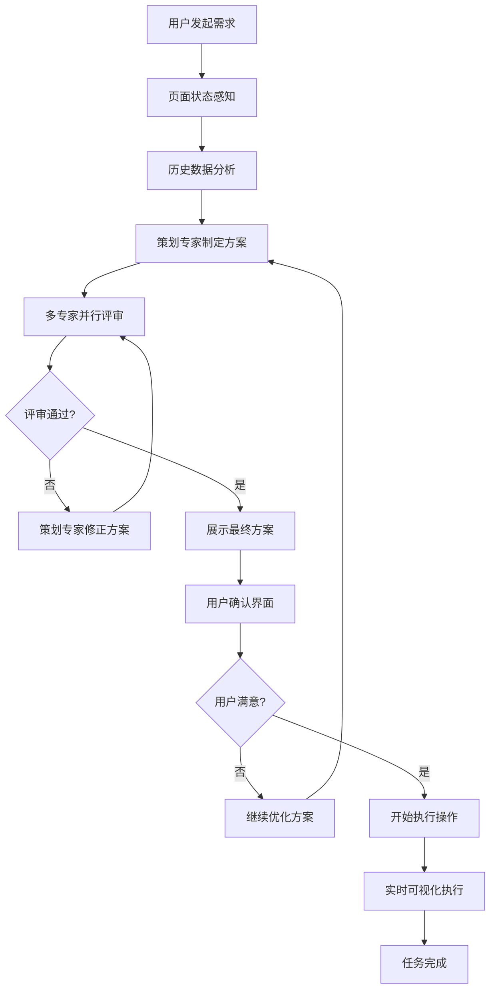

# 智能AI互动功能设计方案

## 📋 项目概述

基于豆包1.6模型的Function Call能力，构建一个具有"眼睛"和"手"的智能代理系统，能够感知页面状态、分析历史数据、多专家协作决策，并通过可视化的方式执行用户任务。

## 🎯 核心理念

让AI助手像真实的专家团队一样工作：
- **有眼睛**: 能够感知和理解当前页面状态及历史数据
- **有大脑**: 多专家协作思考，制定专业方案
- **有手**: 模拟真实用户操作，可视化执行过程
- **有反馈**: 实时显示工作过程，用户可控可信

## 🏗️ 系统架构

### 1. 感知层 ("眼睛")
- **页面状态感知**: 实时获取DOM结构、表单状态、数据内容
- **历史数据分析**: 从数据库提取相关历史记录作为上下文
- **用户意图理解**: 分析用户需求和当前业务场景

### 2. 多专家协作决策层 ("大脑")
**动态专家团队**: 根据不同业务场景自动配置相应的专家团队

#### 🎪 活动管理场景专家团队
- **活动策划专家**: 主导活动方案制定和优化
- **评审专家团队**:
  - 趣味性评审专家: 评估活动吸引力和参与度
  - 成本控制专家: 分析预算合理性和资源配置
  - 安全评估专家: 评估活动风险和安全措施
  - 教育价值专家: 评估教育意义和发展价值

#### 📈 招生中心场景专家团队
- **招生营销专家**: 主导招生策略制定和优化
- **评审专家团队**:
  - 市场分析专家: 分析目标客户群体和市场趋势
  - 渠道优化专家: 评估招生渠道效果和ROI
  - 内容营销专家: 优化宣传内容和广告创意
  - 转化率专家: 分析招生漏斗和提升转化策略
  - 教师绩效专家: 基于教师招生达标率给出任务分配建议

### 3. 用户确认层
- **方案展示**: 完整展示专家协作结果
- **评分可视化**: 显示各专家的评估分数
- **用户决策**: 满意确认或继续优化

### 4. 执行可视化层 ("手")
- **实时操作显示**: 模拟用户点击、输入、导航
- **打字效果**: 真实的输入体验
- **操作反馈**: 实时显示执行结果和错误处理

## 🔄 完整工作流程



## 🎭 用户体验设计

### 阶段1: 专家协作过程

#### 🎪 活动管理场景示例
```
🤖 AI专家团队正在为您服务...

👨‍💼 活动策划专家: 正在分析您的需求...
📊 已分析当前环境：春季，适合户外活动
📚 查询历史数据：发现3个成功的运动会案例
💡 初步方案：春季趣味运动会

🔍 正在提交专家评审...

🎯 趣味性专家: ✅ 亲子互动设计很棒 (9/10分)
💰 成本专家: ✅ 预算控制合理 (8/10分)
🛡️ 安全专家: ⚠️ 需要增加医疗保障措施 (7/10分)
🎓 教育专家: ✅ 教育价值丰富 (9/10分)

👨‍💼 活动策划专家: 正在根据专家意见优化方案...
```

#### 📈 招生中心场景示例
```
🤖 AI招生专家团队正在为您服务...

👨‍💼 招生营销专家: 正在分析您的招生需求...
📊 已分析当前招生状况：春季招生期，目标50名新生
📚 查询历史数据：
   • 去年同期招生数据：45名
   • 各渠道转化率：线上广告15%，老生推荐35%，地推活动25%
   • 教师招生达标率：张老师120%，李老师85%，王老师95%
💡 初步招生策略：多渠道整合营销方案

🔍 正在提交专家评审...

📈 市场分析专家: ✅ 目标客户定位准确 (9/10分)
🎯 渠道优化专家: ⚠️ 建议加大老生推荐渠道投入 (8/10分)
📝 内容营销专家: ✅ 宣传文案吸引力强 (9/10分)
📊 转化率专家: ⚠️ 需优化线索跟进流程 (7/10分)
👥 教师绩效专家: ✅ 任务分配合理，建议张老师带新人 (8/10分)

👨‍💼 招生营销专家: 正在根据专家意见优化策略...
```

### 阶段2: 用户确认界面
```
📋 最终活动方案

🎪 春季亲子趣味运动会
━━━━━━━━━━━━━━━━━━━━━━━━━━━━━━━━━━

📅 时间：2024年4月15日 9:00-11:30
📍 地点：幼儿园操场  
👥 参与：全园师生及家长(约200人)
💰 预算：2500元

📊 专家评分：
趣味性 ⭐⭐⭐⭐⭐ 10/10
成本控制 ⭐⭐⭐⭐⭐ 9/10  
安全保障 ⭐⭐⭐⭐⭐ 9/10
教育价值 ⭐⭐⭐⭐⭐ 10/10

┌─────────────────────────────────┐
│  🤔 您对这个方案满意吗？           │
│  [😊 满意，开始创建]  [🔄 继续优化] │
└─────────────────────────────────┘
```

### 阶段3: 执行可视化
```
✅ 用户确认方案，开始执行...

🖱️ 正在导航到活动管理页面...
✅ 页面加载完成
🖱️ 正在点击"创建活动"按钮...
⌨️ 正在输入活动标题: "春季亲子趣味运动会"
⌨️ 正在输入活动描述...
📅 正在设置活动时间: 2024-04-15 09:00
💰 正在输入预算: 2500元
✅ 活动创建成功！
```

## � 动态专家团队机制

### 核心理念
不同的业务场景需要不同领域的专家来提供专业建议。系统会根据用户当前所在的页面/模块，自动配置相应的专家团队。

### 专家团队映射规则
```javascript
const pageToExpertMapping = {
  '/centers/activity': 'activity',      // 活动管理 → 活动策划专家团队
  '/centers/enrollment': 'enrollment',  // 招生中心 → 招生营销专家团队
  '/centers/personnel': 'personnel',    // 人员中心 → 人力资源专家团队
  '/centers/student': 'education',      // 学生中心 → 教育专家团队
  '/centers/dashboard': 'analytics'     // 数据中心 → 数据分析专家团队
}
```

### 招生中心专家团队详解

#### 🎯 招生营销专家 (主策划)
**数据依赖**:
- 历史招生数据（按月份、渠道、年龄段分析）
- 各教师招生达标率和特长分析
- 广告投放效果和ROI数据
- 竞争对手分析数据

**核心能力**:
- 基于历史数据制定招生目标和策略
- 分析市场趋势和竞争态势
- 制定多渠道整合营销方案

#### 📊 评审专家团队
1. **市场分析专家**: 分析目标客户画像、市场容量、竞争格局
2. **渠道优化专家**: 基于历史转化数据优化渠道配置和预算分配
3. **内容营销专家**: 基于历史广告数据优化文案创意和素材
4. **转化率专家**: 分析招生漏斗，优化从线索到成交的转化路径
5. **教师绩效专家**: 基于教师历史表现分配招生任务和提供培训建议

### 上下文数据获取
```javascript
// 招生中心上下文数据示例
const enrollmentContext = {
  // 历史招生数据
  historicalData: {
    monthlyEnrollment: [...], // 按月招生数据
    channelPerformance: [...], // 各渠道效果
    ageGroupDistribution: [...] // 年龄段分布
  },

  // 教师绩效数据
  teacherPerformance: {
    achievementRates: [...], // 达标率
    specialties: [...], // 特长领域
    trainingNeeds: [...] // 培训需求
  },

  // 营销数据
  marketingData: {
    adCampaigns: [...], // 广告投放记录
    contentPerformance: [...], // 内容效果
    competitorAnalysis: [...] // 竞争分析
  }
}
```

## �🔧 技术实现方案

### 1. 前端可视化技术
- **Server-Sent Events (SSE)**: 实时推送AI思考流
- **WebSocket**: 双向实时通信
- **Canvas/SVG动画**: 鼠标轨迹和操作动画
- **CSS动画**: 元素高亮和过渡效果
- **Virtual DOM操作**: 实时页面状态同步

### 2. 后端AI处理
- **豆包1.6 Function Call**: 工具调用能力
- **多角色AI系统**: 不同专家的prompt设计
- **流式响应**: 实时输出思考过程
- **状态管理**: 任务执行状态追踪

### 3. 数据层
- **页面状态API**: 获取当前页面信息
- **历史数据查询**: 智能检索相关历史记录
- **操作记录**: 记录AI执行的每个步骤

## 📊 核心组件设计

### 1. 动态专家团队配置
```javascript
// 专家团队配置映射
const expertTeamConfigs = {
  // 活动管理场景
  activity: {
    planner: {
      name: "活动策划专家",
      role: "主导活动方案制定和优化",
      prompt: "你是资深活动策划专家，擅长制定各类幼儿园活动方案..."
    },
    reviewers: {
      funExpert: {
        name: "趣味性评审专家",
        role: "评估活动吸引力和参与度",
        prompt: "你是趣味性评审专家，专注评估活动的吸引力..."
      },
      costExpert: {
        name: "成本控制专家",
        role: "分析预算合理性和资源配置",
        prompt: "你是成本控制专家，精通预算分析..."
      },
      safetyExpert: {
        name: "安全评估专家",
        role: "评估活动风险和安全措施",
        prompt: "你是安全评估专家，专注活动安全风险评估..."
      },
      eduExpert: {
        name: "教育价值专家",
        role: "评估教育意义和发展价值",
        prompt: "你是教育价值专家，评估活动的教育意义..."
      }
    }
  },

  // 招生中心场景
  enrollment: {
    planner: {
      name: "招生营销专家",
      role: "主导招生策略制定和优化",
      prompt: "你是资深招生营销专家，基于历史招生数据、广告效果、教师绩效等制定招生策略..."
    },
    reviewers: {
      marketExpert: {
        name: "市场分析专家",
        role: "分析目标客户群体和市场趋势",
        prompt: "你是市场分析专家，擅长分析目标客户画像和市场竞争态势..."
      },
      channelExpert: {
        name: "渠道优化专家",
        role: "评估招生渠道效果和ROI",
        prompt: "你是渠道优化专家，基于历史招生渠道数据分析最优投放策略..."
      },
      contentExpert: {
        name: "内容营销专家",
        role: "优化宣传内容和广告创意",
        prompt: "你是内容营销专家，基于历史广告数据优化宣传文案和创意..."
      },
      conversionExpert: {
        name: "转化率专家",
        role: "分析招生漏斗和提升转化策略",
        prompt: "你是转化率专家，分析从线索到成交的完整转化路径..."
      },
      performanceExpert: {
        name: "教师绩效专家",
        role: "基于教师招生达标率给出任务分配建议",
        prompt: "你是教师绩效专家，基于各教师历史招生达标率和能力特长分配招生任务..."
      }
    }
  }
}

// 动态获取专家团队
function getExpertTeam(currentPage) {
  if (currentPage.includes('/centers/activity') || currentPage.includes('/activity')) {
    return expertTeamConfigs.activity
  } else if (currentPage.includes('/centers/enrollment') || currentPage.includes('/enrollment')) {
    return expertTeamConfigs.enrollment
  }
  // 可扩展其他场景...
  return expertTeamConfigs.activity // 默认
}
```

### 2. 动态协作决策引擎
```javascript
async function expertCollaboration(userRequest, currentPage) {
  // 根据页面动态获取专家团队
  const expertTeam = getExpertTeam(currentPage)
  const { planner, reviewers } = expertTeam

  // 获取页面相关的历史数据
  const contextData = await getContextData(currentPage)

  // 主策划专家制定方案
  const initialPlan = await callExpert(planner, {
    request: userRequest,
    context: contextData,
    action: 'createPlan'
  })

  // 多专家并行评审
  const reviewPromises = Object.values(reviewers).map(expert =>
    callExpert(expert, {
      plan: initialPlan,
      context: contextData,
      action: 'review'
    })
  )
  const reviews = await Promise.all(reviewPromises)

  // 优化迭代
  if (needsImprovement(reviews)) {
    const optimizedPlan = await callExpert(planner, {
      plan: initialPlan,
      reviews: reviews,
      context: contextData,
      action: 'optimize'
    })
    return expertCollaboration({ plan: optimizedPlan }, currentPage)
  }

  return { plan: initialPlan, reviews, expertTeam }
}

// 获取页面相关上下文数据
async function getContextData(currentPage) {
  if (currentPage.includes('enrollment')) {
    return {
      historicalEnrollment: await getHistoricalEnrollmentData(),
      teacherPerformance: await getTeacherPerformanceData(),
      advertisingEffects: await getAdvertisingData(),
      channelConversion: await getChannelConversionData()
    }
  } else if (currentPage.includes('activity')) {
    return {
      historicalActivities: await getHistoricalActivityData(),
      budgetHistory: await getBudgetHistoryData(),
      safetyRecords: await getSafetyRecordsData()
    }
  }
  return {}
}
```

### 3. 可视化执行器
```javascript
class VisualExecutor {
  async executeTask(plan) {
    // 显示执行开始
    this.streamMessage("✅ 用户确认方案，开始执行...")
    
    // 模拟页面操作
    await this.navigateToPage("/activities")
    await this.clickElement("#create-btn")
    await this.typeWithEffect("#title", plan.title)
    
    // 显示完成状态
    this.streamMessage("✅ 活动创建成功！")
  }
}
```

## 🎯 应用场景

### 1. 活动管理中心
**专家团队**: 活动策划专家 + 趣味性/成本/安全/教育价值评审专家
- 创建各类幼儿园活动（运动会、节日庆典、亲子活动等）
- 基于历史活动数据优化方案
- 活动执行跟踪和效果评估

### 2. 招生中心
**专家团队**: 招生营销专家 + 市场/渠道/内容/转化/绩效评审专家
- 制定招生策略和营销方案
- 基于历史招生数据、广告效果、教师绩效优化策略
- 招生渠道效果分析和预算分配
- 教师招生任务分配和绩效提升建议

### 3. 人员管理中心
**专家团队**: 人力资源专家 + 培训/绩效/薪酬/发展评审专家
- 教师招聘和培训方案
- 绩效考核体系优化
- 职业发展规划建议

### 4. 学生管理中心
**专家团队**: 教育专家 + 发展/健康/心理/家庭评审专家
- 学生信息录入和档案管理
- 个性化教育方案制定
- 成长轨迹分析和建议

### 5. 数据分析中心
**专家团队**: 数据分析专家 + 业务/财务/运营/预测评审专家
- 生成各类业务报表
- 数据趋势分析和预测
- 经营决策支持建议

## 💡 核心价值

1. **专业性保障**: 多专家协作确保方案质量
2. **透明化决策**: 用户看到完整的专家讨论过程  
3. **用户主导权**: 最终决策权在用户手中
4. **持续优化**: 不满意可以继续改进
5. **执行可视化**: 确认后的操作过程完全透明
6. **学习进化**: 系统记录操作模式，持续优化

## 🚀 开发计划

### Phase 1: 基础框架
- [ ] AI助手聊天界面优化
- [ ] 多专家角色系统设计
- [ ] 基础可视化组件

### Phase 2: 专家协作
- [ ] 策划专家功能实现
- [ ] 评审专家团队实现
- [ ] 协作决策引擎

### Phase 3: 执行可视化
- [ ] 页面操作模拟
- [ ] 实时状态同步
- [ ] 错误处理机制

### Phase 4: 场景扩展
- [ ] 活动管理场景
- [ ] 学生管理场景
- [ ] 数据分析场景

---

*本文档将随着开发进展持续更新和完善*
