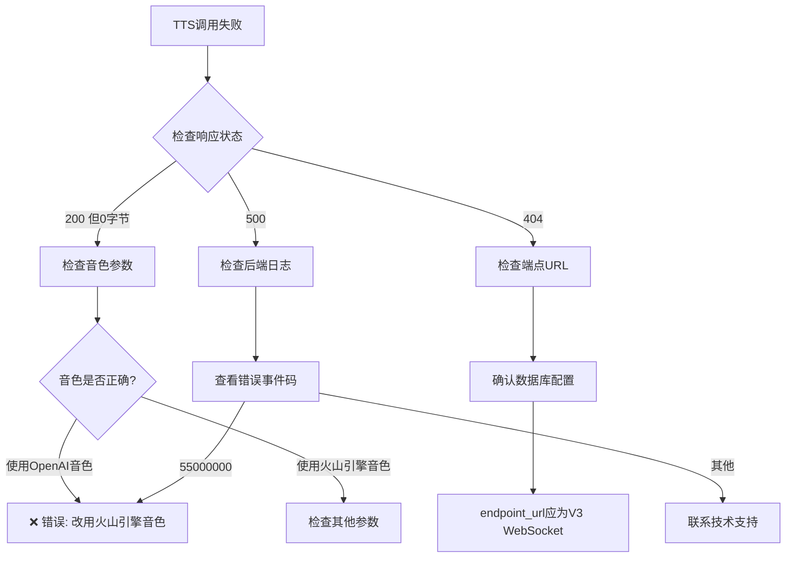

# 豆包TTS文字转语音 - 正确调用指南

## 📋 目录

- [概述](#概述)
- [常见问题](#常见问题)
- [正确调用方式](#正确调用方式)
- [音色参数说明](#音色参数说明)
- [完整示例](#完整示例)
- [故障排除](#故障排除)

---

## 概述

豆包（火山引擎）TTS服务使用V3 WebSocket双向流式协议，与OpenAI TTS API不兼容。

**关键要点**:
- ✅ 必须使用火山引擎专用音色名称
- ❌ 不能使用OpenAI音色名称（如 `nova`、`alloy`）
- ✅ 端点URL: `wss://openspeech.bytedance.com/api/v3/tts/bidirection`

---

## 常见问题

### ❌ 问题1: 返回0字节音频数据

**错误现象**:
```
HTTP 200 OK
Content-Length: 0
实际数据: 0 bytes
```

**根本原因**:
- 使用了错误的音色参数（OpenAI音色名称）
- 火山引擎V3协议返回错误事件码 `55000000`
- 请求超时（30秒）

**解决方案**:
使用火山引擎音色名称，参见[音色参数说明](#音色参数说明)

---

### ❌ 问题2: WebSocket连接超时

**错误日志**:
```
📨 [TTS V3] 收到事件: 50   (CONNECTION_STARTED)
📨 [TTS V3] 收到事件: 150  (SESSION_STARTED)
📨 [TTS V3] 收到事件: 55000000  ❌ 未知事件（错误码）
🔊 [文本转语音] 调用失败: TTS请求超时（30秒）
```

**根本原因**:
音色参数不匹配，导致协议错误

**解决方案**:
检查并修正音色参数

---

## 正确调用方式

### 前端调用

```typescript
import { request } from '@/utils/request'

// ✅ 正确示例
const response = await request.post('/ai/text-to-speech', {
  text: '欢迎来到我们的幼儿园，这里充满了欢声笑语。',
  voice: 'zh_female_cancan_mars_bigtts',  // 火山引擎音色
  speed: 1.0,
  format: 'mp3'
}, {
  responseType: 'blob'  // 重要：必须设置为blob
})

// 创建音频URL
const blob = new Blob([response], { type: 'audio/mp3' })
const audioUrl = URL.createObjectURL(blob)

// 播放音频
const audio = new Audio(audioUrl)
audio.play()
```

### 后端调用

```typescript
import { aiBridgeService } from '@/services/ai/bridge/ai-bridge.service'

// ✅ 正确示例
const audioResult = await aiBridgeService.textToSpeech({
  model: 'doubao-tts-bigmodel',
  input: '欢迎来到我们的幼儿园',
  voice: 'zh_female_cancan_mars_bigtts',  // 火山引擎音色
  response_format: 'mp3',
  speed: 1.0
}, {
  endpointUrl: 'wss://openspeech.bytedance.com/api/v3/tts/bidirection',
  apiKey: 'your-api-key'
})

// audioResult.audioData 是 Buffer 类型
// audioResult.contentType 是 'audio/mpeg'
```

---

## 音色参数说明

### 🎓 教育场景音色（推荐）

| 音色值 | 音色名称 | 特点 | 适用场景 |
|--------|----------|------|----------|
| `zh_female_yingyujiaoyu_mars_bigtts` | Tina老师 | 专业教育音色 | 教学、课程讲解 |
| `zh_female_shaoergushi_mars_bigtts` | 少儿故事 | 温柔亲切 | 讲故事、睡前故事 |
| `zh_male_tiancaitongsheng_mars_bigtts` | 天才童声 | 活泼可爱 | 儿童互动、游戏 |

### 👶 儿童音色

| 音色值 | 音色名称 | 特点 | 适用场景 |
|--------|----------|------|----------|
| `zh_female_cancan_mars_bigtts` | 灿灿（女声） | 温柔甜美 | 通用配音、视频 |
| `zh_female_qingxin_mars_bigtts` | 清新女声 | 清新自然 | 通知、提醒 |
| `zh_male_qingse_mars_bigtts` | 青涩男声 | 青春活力 | 活动宣传 |

### 🎭 专业音色

| 音色值 | 音色名称 | 特点 | 适用场景 |
|--------|----------|------|----------|
| `zh_female_xinwen_mars_bigtts` | 新闻女声 | 专业播报 | 新闻、公告 |
| `zh_male_xinwen_mars_bigtts` | 新闻男声 | 沉稳大气 | 正式通知 |
| `zh_female_kefu_mars_bigtts` | 客服女声 | 亲切专业 | 客服、咨询 |

### 🎤 情感音色

| 音色值 | 音色名称 | 特点 | 适用场景 |
|--------|----------|------|----------|
| `zh_female_wennuan_mars_bigtts` | 温暖女声 | 温暖治愈 | 心理辅导、安抚 |
| `zh_female_huoli_mars_bigtts` | 活力女声 | 充满活力 | 运动、活动 |
| `zh_male_chenwen_mars_bigtts` | 沉稳男声 | 成熟稳重 | 领导讲话 |

---

## 完整示例

### 示例1: 媒体中心配音

```vue
<script setup lang="ts">
import { ref } from 'vue'
import { request } from '@/utils/request'
import { ElMessage } from 'element-plus'

const formData = ref({
  text: '',
  voice: 'zh_female_cancan_mars_bigtts',  // 默认音色
  speed: 1.0,
  format: 'mp3'
})

const audioUrl = ref('')
const generating = ref(false)

// 生成语音
const generateSpeech = async () => {
  if (!formData.value.text.trim()) {
    ElMessage.warning('请输入文本内容')
    return
  }

  generating.value = true

  try {
    // ✅ 正确调用
    const response = await request.post('/ai/text-to-speech', {
      text: formData.value.text,
      voice: formData.value.voice,
      speed: formData.value.speed,
      format: formData.value.format
    }, {
      responseType: 'blob'
    })

    // 创建音频URL
    const blob = new Blob([response], { type: `audio/${formData.value.format}` })
    audioUrl.value = URL.createObjectURL(blob)

    ElMessage.success('语音生成成功！')
  } catch (error) {
    console.error('❌ 语音生成失败:', error)
    ElMessage.error('语音生成失败，请重试')
  } finally {
    generating.value = false
  }
}
</script>
```

### 示例2: 视频配音

```typescript
// 为视频场景生成配音
const generateNarration = async (sceneText: string) => {
  const response = await request.post('/ai/text-to-speech', {
    text: sceneText,
    voice: 'zh_female_yingyujiaoyu_mars_bigtts',  // 教育音色
    speed: 1.0,
    format: 'mp3'
  }, {
    responseType: 'blob'
  })

  return new Blob([response], { type: 'audio/mp3' })
}
```

### 示例3: 活动通知

```typescript
// 生成活动通知语音
const generateNotification = async (message: string) => {
  const response = await request.post('/ai/text-to-speech', {
    text: message,
    voice: 'zh_female_qingxin_mars_bigtts',  // 清新女声
    speed: 1.0,
    format: 'mp3'
  }, {
    responseType: 'blob'
  })

  return new Blob([response], { type: 'audio/mp3' })
}
```

---

## 故障排除

### 问题诊断流程



### 常见错误对照表

| 错误现象 | 可能原因 | 解决方案 |
|---------|---------|---------|
| Content-Length: 0 | 音色参数错误 | 使用火山引擎音色 |
| HTTP 404 | 端点URL错误 | 检查数据库配置 |
| 事件码 55000000 | 音色不支持 | 更换为支持的音色 |
| 超时（30秒） | 协议错误 | 检查所有参数 |
| 连接失败 | 网络问题 | 检查网络和防火墙 |

### 调试技巧

1. **启用详细日志**
   ```typescript
   // 后端日志会显示详细的WebSocket事件
   console.log('🔊 [文本转语音] 开始处理:', params)
   ```

2. **检查后端日志**
   ```bash
   # 查看后端服务日志
   npm run start:backend
   
   # 观察TTS相关日志
   # 正常流程应该看到:
   # 📨 [TTS V3] 收到事件: 50
   # 📨 [TTS V3] 收到事件: 150
   # 📨 [TTS V3] 收到事件: 350
   # 📨 [TTS V3] 收到事件: 352
   # 🎵 [TTS V3] 收到音频数据: xxx bytes
   ```

3. **使用测试脚本**
   ```bash
   # 测试TTS API
   node test-media-center-tts.cjs
   ```

4. **验证音频文件**
   ```bash
   # 播放生成的音频
   ffplay test-media-center-tts-output.mp3
   
   # 检查文件大小
   ls -lh test-media-center-tts-output.mp3
   ```

---

## 数据库配置

### 正确的模型配置

```sql
-- 查看当前配置
SELECT 
  id, name, model_type, status, endpoint_url
FROM ai_model_config
WHERE name = 'doubao-tts-bigmodel';

-- 应该看到:
-- model_type: 'speech'
-- status: 'active'
-- endpoint_url: 'wss://openspeech.bytedance.com/api/v3/tts/bidirection'
```

### 模型参数配置

```json
{
  "appKey": "7563592522",
  "accessKey": "jq3vA4Ep5EsN-FU4mKizV6ePioXR3Ol3",
  "resourceId": "volc.service_type.10029",
  "speaker": "zh_female_cancan_mars_bigtts",
  "sampleRate": 24000,
  "format": "mp3"
}
```

---

## 参考资料

### 相关文档
- [TTS返回0字节问题解决方案](../呼叫中心/TTS返回0字节问题解决方案.md)
- [火山引擎TTS V3协议文档](../呼叫中心/火山引擎TTS_V3双向流式协议.md)

### 测试脚本
- `test-media-center-tts.cjs` - 媒体中心TTS测试
- `test-local-tts-api.cjs` - 本地TTS API测试
- `check-tts-config.cjs` - 检查TTS配置

### 核心代码
- `server/src/controllers/text-to-speech.controller.ts` - TTS控制器
- `server/src/services/ai/bridge/ai-bridge.service.ts` - AI Bridge服务
- `server/src/services/volcengine/tts-v3-bidirection.service.ts` - V3双向流式服务
- `client/src/pages/principal/media-center/TextToSpeech.vue` - 媒体中心TTS页面

---

## 最佳实践

### ✅ 推荐做法

1. **使用正确的音色参数**
   ```typescript
   voice: 'zh_female_cancan_mars_bigtts'  // ✅ 火山引擎音色
   ```

2. **设置合适的语速**
   ```typescript
   speed: 1.0  // 正常语速，范围 0.5 - 2.0
   ```

3. **选择合适的格式**
   ```typescript
   format: 'mp3'  // 推荐使用mp3，兼容性好
   ```

4. **处理错误**
   ```typescript
   try {
     const response = await request.post('/ai/text-to-speech', params)
   } catch (error) {
     console.error('TTS调用失败:', error)
     ElMessage.error('语音生成失败，请重试')
   }
   ```

### ❌ 避免的做法

1. **不要使用OpenAI音色**
   ```typescript
   voice: 'nova'  // ❌ 错误：OpenAI音色
   ```

2. **不要忘记设置responseType**
   ```typescript
   // ❌ 错误：缺少responseType
   await request.post('/ai/text-to-speech', params)
   
   // ✅ 正确：设置responseType
   await request.post('/ai/text-to-speech', params, {
     responseType: 'blob'
   })
   ```

3. **不要使用过长的文本**
   ```typescript
   // ❌ 错误：文本过长
   text: '...' // 超过4096字符
   
   // ✅ 正确：限制文本长度
   text: text.substring(0, 4096)
   ```

---

**文档版本**: 1.0  
**创建时间**: 2025-10-14  
**最后更新**: 2025-10-14  
**维护者**: 开发团队

