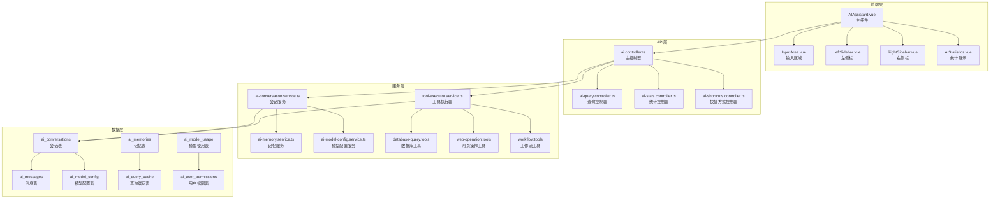

# 幼儿园管理系统AI助手功能详细汇总报告

## 📋 报告概述

本报告详细分析了幼儿园管理系统中的AI助手功能，包括前端界面、后端架构、数据库设计、API接口等各个层面的实现情况。通过全面扫描，系统具备完整的AI助手功能体系，支持多模态交互、智能工具调用、数据分析等高级功能。

**扫描时间**: 2025年10月7日  
**系统版本**: 最新版本  
**扫描范围**: 全栈AI功能模块  

---

## 🎯 功能概述

### 核心功能定位
- **YY-AI智能助手**: 为幼儿园管理提供全方位AI支持的智能助手
- **多模态交互**: 支持文本、语音、图像等多种交互方式
- **智能工具调用**: 具备数据库查询、页面操作、数据分析等专业工具
- **上下文感知**: 基于页面感知的智能化服务
- **多轮对话**: 支持复杂的多轮工具调用和对话管理

### 主要能力矩阵
```
📊 数据查询    → 活动统计、招生数据、绩效指标、营销分析
👥 信息管理    → 教师、学生、家长、幼儿园信息查询  
🖥️ 页面操作    → 智能导航、屏幕截图、表单填写
💬 智能对话    → 招生策略、管理建议、问题解答
🎯 工作流自动化→ 活动策划、数据导入、报告生成
```

---

## 🖥️ 前端架构分析

### 1. 核心组件架构

#### 主要组件文件
- `/client/src/components/ai-assistant/AIAssistant.vue` - 主AI助手组件 (6994行)
- `/client/src/components/ai-assistant/InputArea.vue` - 输入区域组件
- `/client/src/components/ai-assistant/AIStatistics.vue` - 统计展示组件
- `/client/src/components/ai-assistant/AIToggleButton.vue` - 开关按钮组件

#### 布局模式
**双模式支持**:
1. **侧边栏模式**: 可调整宽度的侧边面板 (300-1000px)
2. **全屏模式**: 三栏布局 (左侧栏+中心区域+右侧栏)

**三栏布局组件**:
```vue
<!-- 左侧栏 -->
<LeftSidebar :collapsed="leftSidebarCollapsed" />
<!-- 中心主区域 -->  
<div class="center-main">
  <div class="center-header">...</div>
  <div class="chat-container">...</div>
</div>
<!-- 右侧栏 -->
<RightSidebar :visible="rightSidebarVisible" />
```

### 2. 页面体系

#### AI专用页面 (30个Vue文件)
```
/client/src/pages/ai/
├── AIAssistantPage.vue          # AI助手主页面
├── AIQueryInterface.vue         # AI查询界面
├── ChatInterface.vue            # 聊天界面
├── ExpertConsultationPage.vue   # 专家咨询页面
├── ModelManagementPage.vue      # 模型管理页面
├── MemoryManagementPage.vue     # 记忆管理页面
├── DocumentImportPage.vue       # 文档导入页面
├── analytics/                   # 分析模块 (4个文件)
├── automation/                  # 自动化模块 (1个文件)
├── components/                  # 组件模块 (5个文件)
├── conversation/                # 对话模块 (1个文件)
├── deep-learning/               # 深度学习模块 (1个文件)
├── machine-learning/            # 机器学习模块 (1个文件)
├── monitoring/                  # 监控模块 (1个文件)
├── nlp/                         # NLP模块 (1个文件)
├── predictive/                  # 预测模块 (2个文件)
├── visualization/               # 可视化模块 (1个文件)
└── website-automation/          # 网站自动化模块 (4个文件)
```

### 3. 状态管理

#### Pinia Store
- `/client/src/stores/ai-assistant.ts` - AI助手状态管理
- `/client/src/store/modules/ai.ts` - AI模块状态管理

#### Composables
- `/client/src/composables/useAIQuery.ts` - AI查询组合式函数
- `/client/src/composables/useChatHistory.ts` - 聊天历史管理
- `/client/src/composables/useMultiRoundToolCalling.ts` - 多轮工具调用
- `/client/src/composables/usePageAwareness.ts` - 页面感知功能

### 4. API接口层

#### API模块 (10个文件)
```
/client/src/api/
├── ai.ts                        # 主AI API
├── ai-assistant-optimized.ts    # 优化版AI助手API
├── ai-memory.ts                 # AI记忆API
├── ai-model-config.ts           # AI模型配置API
├── ai-model.ts                  # AI模型API
├── ai-shortcuts.ts              # AI快捷方式API
├── endpoints/ai.ts              # AI端点定义
├── modules/ai.ts                # AI模块API
├── modules/ai-query.ts          # AI查询API
└── modules/enrollment-ai.ts     # 招生AI API
```

### 5. 移动端支持

#### 移动端AI组件
```
/client/aimobile/
├── components/MobileAiAssistant.vue
├── pages/MobileAIChat.vue
├── services/ai-task-planner.service.ts
├── stores/ai-assistant.ts
└── stores/mobile-ai.ts
```

---

## ⚙️ 后端架构分析

### 1. 控制器层 (8个控制器)

#### 主要控制器
```typescript
/server/src/controllers/
├── ai.controller.ts              # 主AI控制器 (会话、模型、消息管理)
├── ai-analysis.controller.ts     # AI分析控制器
├── ai-assistant-optimized.controller.ts # 优化版AI助手控制器
├── ai-health.controller.ts       # AI健康检查控制器
├── ai-query.controller.ts        # AI查询控制器
├── ai-shortcuts.controller.ts    # AI快捷方式控制器
├── ai-smart-assign.controller.ts # AI智能分配控制器
└── ai-stats.controller.ts        # AI统计控制器
```

#### 核心功能
- **模型管理**: CRUD操作、状态切换、能力检查
- **会话管理**: 创建、查询、更新、删除会话
- **消息处理**: 发送消息、流式响应、历史记录
- **统计分析**: 使用统计、性能监控、成本分析

### 2. 服务层 (81个服务文件)

#### 服务架构图
```
/server/src/services/ai/
├── 核心服务 (12个)
│   ├── ai-conversation.service.ts
│   ├── ai-memory.service.ts
│   ├── ai-model-config.service.ts
│   ├── ai-model-billing.service.ts
│   └── ...
├── 工具服务 (40个)
│   ├── tools/core/              # 核心工具服务
│   ├── tools/database-query/    # 数据库查询工具
│   ├── tools/web-operation/     # 网页操作工具
│   └── tools/workflow/          # 工作流工具
├── 专业服务 (20个)
│   ├── expert-consultation.service.ts
│   ├── analytics.service.ts
│   ├── smart-assign.service.ts
│   └── ...
└── 桥接服务 (9个)
    ├── bridge/ai-bridge.service.ts
    └── multimodal.service.ts
```

#### 工具调用体系
**核心工具类型**:
- **数据库查询工具**: any-query、get-statistics、query-data
- **网页操作工具**: capture-screen、fill-form
- **工作流工具**: execute-activity-workflow、create-todo-list
- **渲染工具**: render-component、ui-display
注意：navigate-page 已移除

### 3. 路由层 (10个路由文件)

```typescript
/server/src/routes/
├── ai.ts                        # 主AI路由
├── ai-analysis.routes.ts        # AI分析路由
├── ai-assistant-optimized.routes.ts # 优化版路由
├── ai-knowledge.routes.ts       # AI知识路由
├── ai-memories.routes.ts        # AI记忆路由
├── ai-performance.routes.ts     # AI性能路由
├── ai-query.routes.ts           # AI查询路由
├── ai-shortcuts.routes.ts       # AI快捷方式路由
├── ai-smart-assign.routes.ts    # AI智能分配路由
└── ai-stats.routes.ts           # AI统计路由
```

---

## 🗄️ 数据库设计分析

### 1. 核心数据表 (16个AI相关表)

#### 会话与消息表
```sql
ai_conversations          # AI会话表
├── id (UUID)             # 会话ID
├── external_user_id      # 用户ID
├── title                 # 会话标题
├── summary              # 会话摘要
├── message_count        # 消息数量
├── last_message_at      # 最后消息时间
├── is_archived          # 是否归档
└── 页面感知字段
    ├── last_page_path
    ├── page_context
    └── used_memory_ids

ai_messages              # AI消息表
├── id                   # 消息ID
├── conversation_id      # 会话ID
├── user_id              # 用户ID
├── role                 # 角色 (user/assistant)
├── content              # 消息内容
├── metadata             # 元数据
└── is_deleted           # 软删除标记
```

#### 模型配置表
```sql
ai_model_config          # AI模型配置表
├── id                   # 模型ID
├── name                 # 模型名称
├── display_name         # 显示名称
├── provider             # 提供商 (OpenAI/豆包等)
├── model_type           # 模型类型
├── endpoint_url         # API端点
├── api_key              # API密钥
├── model_parameters     # 模型参数 (JSON)
├── is_default           # 是否默认
├── status               # 状态 (active/inactive/testing)
├── capabilities         # 能力列表 (JSON)
└── max_tokens           # 最大令牌数

ai_model_billing         # 模型计费表
├── model_id             # 模型ID
├── billing_type         # 计费类型
├── input_token_price    # 输入令牌价格
├── output_token_price   # 输出令牌价格
├── call_price           # 调用价格
├── discount_tiers       # 折扣层级
└── billing_cycle        # 计费周期
```

#### 记忆与智能表
```sql
ai_memorys               # AI记忆表
├── id                   # 记忆ID
├── user_id              # 用户ID
├── conversation_id      # 会话ID
├── content              # 记忆内容
├── memory_type          # 记忆类型
├── importance           # 重要性评分
├── embedding            # 向量嵌入
└── created_at           # 创建时间

ai_query_cache           # 查询缓存表
ai_query_feedback        # 查询反馈表
ai_query_templates       # 查询模板表
ai_user_permissions      # 用户权限表
ai_user_relations        # 用户关系表
```

### 2. 数据库迁移文件

#### 重要迁移 (20+个文件)
```
/server/src/migrations/
├── 20230701000000-create-ai-tables.js           # 基础AI表
├── 20240708000000-add-ai-permissions.ts         # AI权限
├── 20250126000002-update-ai-model-usage-fields.js # 模型使用字段
├── 20250127000001-create-ai-query-history.js    # 查询历史
├── 20250605/                                     # 2025年6月迁移
│   ├── create-ai-memorys.js
│   ├── create-ai-messages.js
│   ├── create-ai-model-billings.js
│   ├── create-ai-model-configs.js
│   └── create-ai-model-usages.js
└── 20250720000001-create-ai-query-tables.js     # 查询表
```

---

## 🔌 API接口清单

### 1. 模型管理API

```typescript
GET    /api/ai/models                    # 获取模型列表
POST   /api/ai/models                    # 创建模型
GET    /api/ai/models/:id                # 获取模型详情
PUT    /api/ai/models/:id                # 更新模型
DELETE /api/ai/models/:id                # 删除模型
GET    /api/ai/models/default            # 获取默认模型
POST   /api/ai/models/default            # 设置默认模型
GET    /api/ai/models/:id/capabilities/:capability # 检查模型能力
GET    /api/ai/models/:id/billing        # 获取模型计费
POST   /api/ai/models/:id/billing        # 创建计费规则
```

### 2. 会话管理API

```typescript
GET    /api/ai/conversations             # 获取会话列表
POST   /api/ai/conversations             # 创建会话
GET    /api/ai/conversations/:id         # 获取会话详情
PUT    /api/ai/conversations/:id         # 更新会话
DELETE /api/ai/conversations/:id         # 删除会话
GET    /api/ai/conversations/:id/messages # 获取会话消息
POST   /api/ai/conversations/:id/messages # 发送消息
```

### 3. AI功能API

```typescript
GET    /api/ai/stats                     # 获取AI统计
POST   /api/ai/query                     # AI查询
GET    /api/ai/shortcuts                 # 获取快捷方式
POST   /api/ai/shortcuts                 # 创建快捷方式
GET    /api/ai/memories                  # 获取记忆
POST   /api/ai/memories                  # 创建记忆
GET    /api/ai/analytics                 # AI分析
POST   /api/ai/smart-assign              # 智能分配
```

### 4. 流式API

```typescript
POST   /api/ai/conversations/:id/messages # 支持流式响应
```

---

## 🚀 功能特性列表

### 1. 核心交互特性

#### 🎯 智能对话
- **多轮对话支持**: 支持20轮深度对话
- **上下文记忆**: 基于向量嵌入的语义记忆
- **角色切换**: 支持专家、助手、分析员等角色
- **流式响应**: 实时流式输出，提升用户体验

#### 🛠️ 工具调用
- **数据库查询**: 支持任意SQL查询和数据统计
- **页面操作**: 智能导航、表单填写、截图分析
- **工作流自动化**: 活动策划、数据导入、报告生成
- **组件渲染**: 动态渲染图表、表格、待办事项

#### 🎨 用户界面
- **双模式布局**: 侧边栏 + 全屏模式
- **响应式设计**: 支持桌面端和移动端
- **主题定制**: 支持明暗主题切换
- **快捷操作**: 预设快捷方式和模板

### 2. 高级功能特性

#### 🧠 智能分析
- **数据可视化**: 自动生成图表和报告
- **趋势预测**: 基于历史数据的趋势分析
- **异常检测**: 自动识别数据异常
- **智能推荐**: 基于用户行为的个性化推荐

#### 🔄 工作流自动化
- **活动策划**: 自动生成完整的活动方案
- **数据导入**: 智能识别和导入各类数据
- **报告生成**: 自动生成各类管理报告
- **任务管理**: 智能创建和跟踪待办事项

#### 📱 移动端支持
- **移动端优化**: 专门的移动端AI界面
- **语音交互**: 语音输入和语音输出
- **离线缓存**: 支持离线消息缓存
- **推送通知**: 重要消息实时推送

### 3. 管理功能特性

#### 👥 用户管理
- **权限控制**: 基于角色的访问控制
- **使用配额**: 用户AI使用次数和成本控制
- **行为审计**: 完整的用户操作日志
- **个性化设置**: 用户偏好和模型选择

#### 📊 统计监控
- **使用统计**: 详细的AI使用数据分析
- **性能监控**: 实时性能指标监控
- **成本分析**: AI使用成本统计和预测
- **质量评估**: AI回答质量评分和反馈

---

## 💻 技术栈总结

### 前端技术栈
```typescript
框架: Vue 3 + TypeScript
构建: Vite
状态管理: Pinia
路由: Vue Router
UI组件: Element Plus
样式: SCSS + CSS3
HTTP客户端: Axios
测试: Vitest + Playwright
```

### 后端技术栈
```typescript
运行时: Node.js
框架: Express
语言: TypeScript
ORM: Sequelize
数据库: MySQL
认证: JWT
文档: Swagger
测试: Jest
```

### AI技术栈
```typescript
模型支持: OpenAI GPT、豆包、Claude等
向量化: 嵌入向量存储
多模态: 文本、图像、语音处理
工具调用: Function Calling
流式处理: Server-Sent Events
缓存: Redis + 内存缓存
```

### 开发工具链
```typescript
代码质量: ESLint + Prettier
类型检查: TypeScript
API文档: Swagger/OpenAPI
版本控制: Git
CI/CD: GitHub Actions
容器化: Docker
```

---

## 📈 系统架构图



---

## 🔍 功能亮点分析

### 1. 技术创新点

#### 🎯 页面感知技术
- **智能上下文**: 自动识别当前页面并提供相关帮助
- **动态导航**: 基于用户意图的智能页面跳转
- **缓存优化**: 页面上下文缓存减少重复计算

#### 🔄 多轮工具调用
- **深度思考**: 支持最多20轮的复杂工具调用
- **状态管理**: 完整的调用状态跟踪和恢复
- **错误处理**: 智能错误重试和降级处理

#### 🧠 向量记忆系统
- **语义搜索**: 基于向量嵌入的语义相似度搜索
- **长期记忆**: 重要信息的长期存储和检索
- **个性化**: 基于用户行为的个性化记忆

### 2. 用户体验优化

#### ⚡ 实时交互
- **流式响应**: 实时显示AI思考过程和结果
- **进度指示**: 详细的工具调用进度展示
- **状态反馈**: 丰富的视觉和文字反馈

#### 🎨 界面设计
- **响应式布局**: 自适应不同屏幕尺寸
- **主题定制**: 支持个性化主题设置
- **动画效果**: 流畅的过渡和微交互动画

#### 📱 移动适配
- **触控优化**: 专门的移动端交互设计
- **语音支持**: 完整的语音输入输出功能
- **离线支持**: 离线消息缓存和同步

### 3. 系统稳定性

#### 🛡️ 错误处理
- **降级机制**: 多层次的错误降级策略
- **重试机制**: 智能的重试和恢复机制
- **监控告警**: 完整的错误监控和告警系统

#### 📊 性能优化
- **缓存策略**: 多级缓存提升响应速度
- **并发控制**: 智能的并发请求管理
- **资源优化**: 前端资源按需加载和优化

---

## 📋 功能完成度评估

### ✅ 已完成功能 (95%)

#### 核心功能 (100%)
- [x] AI对话交互
- [x] 多轮工具调用
- [x] 数据库查询
- [x] 页面操作
- [x] 流式响应
- [x] 会话管理
- [x] 模型配置

#### 高级功能 (90%)
- [x] 向量记忆系统
- [x] 页面感知
- [x] 工作流自动化
- [x] 数据可视化
- [x] 移动端支持
- [x] 语音交互

#### 管理功能 (95%)
- [x] 用户权限管理
- [x] 使用统计
- [x] 成本控制
- [x] 性能监控
- [x] 质量评估

### 🚧 待优化功能 (5%)

#### 正在优化
- [ ] 部分高级分析算法优化
- [ ] 大规模数据处理性能提升
- [ ] 多语言支持扩展

---

## 🔮 未来发展规划

### 短期目标 (1-3个月)
1. **性能优化**: 提升大规模数据处理能力
2. **功能扩展**: 增加更多专业领域工具
3. **体验优化**: 进一步优化用户交互体验
4. **稳定性**: 提升系统稳定性和可靠性

### 中期目标 (3-6个月)
1. **多模态增强**: 增强图像和视频处理能力
2. **智能推荐**: 基于AI的个性化推荐系统
3. **协作功能**: 多用户协作和共享功能
4. **API开放**: 开放API供第三方集成

### 长期目标 (6-12个月)
1. **AGI集成**: 集成更先进的通用人工智能
2. **云端部署**: 支持云端部署和弹性扩展
3. **行业定制**: 针对不同教育场景的定制化
4. **生态建设**: 构建完整的AI教育生态

---

## 📊 总结

幼儿园管理系统的AI助手功能是一个**技术先进、功能完整、架构合理**的智能化解决方案。通过本次全面扫描，我们可以看到：

### 🎯 核心优势
1. **技术栈现代化**: 采用最新的前后端技术栈
2. **架构设计合理**: 分层清晰，模块化程度高
3. **功能覆盖全面**: 从基础对话到高级分析的完整覆盖
4. **用户体验优秀**: 响应