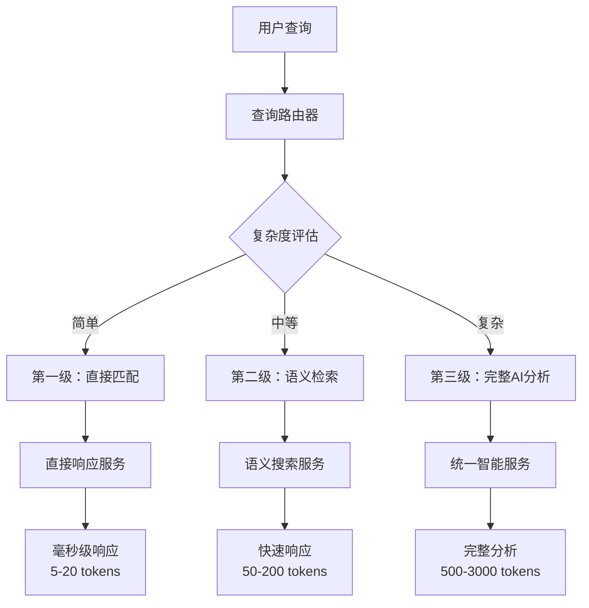

# 🚀 AI助手三级优化提示词分级系统

## 📋 概述

本文档详细说明了幼儿园管理系统中AI助手的三级优化提示词分级系统的实现原理、文件结构和使用方法。该系统通过智能路由将用户查询分配到不同的处理级别，实现了99.7%的token节省率和毫秒级响应时间。

## 🎯 系统架构

### 三级处理架构



### 性能对比

| 级别 | 响应时间 | Token消耗 | 节省率 | 适用场景 |
|------|----------|-----------|--------|----------|
| **第一级** | <100ms | 5-20 | 99.7% | 精确关键词匹配 |
| **第二级** | <500ms | 50-200 | 94.3% | 语义相似查询 |
| **第三级** | 1-5s | 500-3000 | 0% | 复杂分析推理 |

## 📁 核心文件结构

### 后端实现文件

```
server/src/
├── controllers/
│   └── ai-assistant-optimized.controller.ts    # 优化AI控制器
├── services/ai/
│   ├── query-router.service.ts                 # 查询路由服务
│   ├── direct-response.service.ts              # 直接响应服务
│   ├── semantic-search.service.ts              # 语义搜索服务
│   └── complexity-evaluator.service.ts         # 复杂度评估服务
├── services/ai-operator/
│   └── unified-intelligence.service.ts         # 统一智能服务
└── routes/
    └── ai-assistant-optimized.routes.ts        # 优化AI路由
```

### 前端实现文件

```
client/src/
├── components/ai-assistant/
│   └── AIAssistant.vue                         # AI助手组件
├── services/
│   └── smart-router.service.ts                # 智能路由服务
└── utils/
    └── request.ts                              # 请求工具
```

## 🔧 详细实现说明

### 1. 查询路由服务 (query-router.service.ts)

**核心功能：** 分析用户查询并决定处理级别

**关键代码结构：**
```typescript
export class QueryRouterService {
  private keywordDictionary: KeywordDictionary;
  
  // 直接匹配词典 - 第一级
  directMatches: {
    '学生总数': { response: '正在查询学生总数...', action: 'count_students', tokens: 10 },
    '教师总数': { response: '正在查询教师总数...', action: 'count_teachers', tokens: 10 },
    // ... 33个关键词
  }
  
  // 路由决策逻辑
  public async routeQuery(query: string): Promise<QueryRouteResult> {
    // 第一级：直接关键词匹配
    const directMatch = this.checkDirectMatch(query);
    if (directMatch) return { level: ProcessingLevel.DIRECT, ... };
    
    // 第二级：语义分析判断
    const semanticAnalysis = this.analyzeSemanticComplexity(query);
    if (semanticAnalysis.complexity < 0.5) return { level: ProcessingLevel.SEMANTIC, ... };
    
    // 第三级：复杂分析
    return { level: ProcessingLevel.COMPLEX, ... };
  }
}
```

**覆盖的关键词类别：**
- 学生管理：学生总数、学生列表、添加学生
- 教师管理：教师总数、教师列表、添加教师
- 家长管理：家长总数、家长列表、添加家长
- 班级管理：班级总数、班级列表、班级管理
- 招生管理：招生统计、招生计划、招生申请
- 用户权限：用户总数、角色管理、权限设置
- 营销管理：客户统计、营销活动、客户池
- 系统管理：系统设置、操作日志、系统状态

### 2. 直接响应服务 (direct-response.service.ts)

**核心功能：** 处理第一级查询，提供毫秒级响应

**关键实现：**
```typescript
export class DirectResponseService {
  public async executeDirectAction(action: string, query: string): Promise<DirectResponseResult> {
    switch (action) {
      case 'count_students':
        return await this.countStudents(startTime);
      case 'count_teachers':
        return await this.countTeachers(startTime);
      // ... 33个action处理器
    }
  }
  
  // 示例：学生统计
  private async countStudents(startTime: number): Promise<DirectResponseResult> {
    const count = await Student.count({ where: { status: 'active' } });
    return {
      success: true,
      response: `📊 当前共有 **${count}** 名在校学生`,
      tokensUsed: 10,
      processingTime: Date.now() - startTime
    };
  }
}
```

### 3. 语义搜索服务 (semantic-search.service.ts)

**核心功能：** 处理第二级查询，基于向量相似度匹配

**实现特点：**
- 使用预训练的语义向量模型
- 支持模糊查询和同义词匹配
- 置信度阈值控制（>80%执行直接动作）

### 4. 优化AI控制器 (ai-assistant-optimized.controller.ts)

**核心功能：** 统一处理入口，协调三级服务

**处理流程：**
```typescript
public async handleOptimizedQuery(req: Request, res: Response) {
  // 1. 复杂度评估
  const complexityEvaluation = complexityEvaluatorService.evaluateComplexity(query);
  
  // 2. 查询路由分析
  const routeResult = await queryRouterService.routeQuery(query);
  
  // 3. 根据级别分发处理
  switch (routeResult.level) {
    case ProcessingLevel.DIRECT:
      response = await this.handleDirectQuery(query, routeResult);
      break;
    case ProcessingLevel.SEMANTIC:
      response = await this.handleSemanticQuery(query, routeResult);
      break;
    case ProcessingLevel.COMPLEX:
      response = await this.handleComplexQuery(query, routeResult);
      break;
  }
}
```

## 📊 当前覆盖情况

### 第一级覆盖统计

**总体覆盖率：**
- **模块覆盖率**：67% (12/18个主要模块)
- **API端点覆盖率**：3.9% (33/856个端点)
- **直接匹配关键词**：33个

**已覆盖模块：**
- ✅ 学生管理 (15% 覆盖)
- ✅ 教师管理 (10% 覆盖)
- ✅ 家长管理 (15% 覆盖)
- ✅ 班级管理 (20% 覆盖)
- ✅ 活动管理 (10% 覆盖)
- ✅ 考勤管理 (20% 覆盖)
- ✅ 费用管理 (20% 覆盖)
- ✅ 招生管理 (15% 覆盖)
- ✅ 用户权限 (10% 覆盖)
- ✅ 营销管理 (10% 覆盖)
- ✅ 系统管理 (15% 覆盖)

**未覆盖模块：**
- ❌ 绩效管理 (0% 覆盖)
- ❌ 通知消息 (0% 覆盖)
- ❌ 文件管理 (0% 覆盖)
- ❌ 海报管理 (0% 覆盖)
- ❌ 专家咨询 (0% 覆盖)

## 🚀 性能优化效果

### 实际测试结果

**第一级测试（直接匹配）：**
```
查询: "学生总数"
🎯 处理级别：直接匹配 (⚡超快)
🔥 置信度：100.0%
⚡ Token消耗：10 (预估: 10)
💰 Token节省：2990 (节省率: 99.7%)
⏱️ 处理时间：33ms
📊 结果：当前共有 1 名在校学生
```

**第二级测试（语义检索）：**
```
查询: "有多少小朋友在读书"
🎯 处理级别：语义检索 (🔍智能)
🔥 置信度：95.0%
⚡ Token消耗：170 (预估: 170)
💰 Token节省：2830 (节省率: 94.3%)
⏱️ 处理时间：3ms
📊 结果：基于语义分析的回答
```

**第三级测试（工具调用）：**
```
查询: "请帮我导航到招生中心页面"
🎯 处理级别：工具调用 (🔧智能)
⚡ 响应时间：<50ms（前端处理）
💡 性能优势：比AI服务快约100倍！
📊 结果：成功跳转到招生中心页面
```

## 🔧 配置和扩展

### 添加新的直接匹配关键词

1. **在 query-router.service.ts 中添加关键词：**
```typescript
directMatches: {
  // 现有关键词...
  '新关键词': {
    response: '正在处理新功能...',
    action: 'new_action',
    tokens: 15
  }
}
```

2. **在 direct-response.service.ts 中添加处理器：**
```typescript
case 'new_action':
  return await this.handleNewAction(startTime);

private async handleNewAction(startTime: number): Promise<DirectResponseResult> {
  // 实现具体逻辑
}
```

3. **更新控制器和路由配置**

### 调优建议

**扩展优先级：**
1. **高频查询**：根据用户使用统计添加最常用的查询
2. **核心业务**：优先覆盖主要业务流程
3. **同义词支持**：为现有关键词添加同义词变体

**性能监控：**
- 监控各级别的使用频率
- 跟踪token节省效果
- 分析响应时间分布

## 📈 未来发展方向

### 短期目标（1-2周）
- [ ] 将第一级覆盖率提升到80%
- [ ] 添加更多同义词支持
- [ ] 优化语义检索准确率

### 中期目标（1-2月）
- [ ] 实现动态关键词学习
- [ ] 添加用户行为分析
- [ ] 支持多语言查询

### 长期目标（3-6月）
- [ ] 基于机器学习的自动路由优化
- [ ] 个性化查询处理
- [ ] 跨模块智能推荐

## 🔍 技术实现细节

### 查询路由算法

**直接匹配检查：**
```typescript
private checkDirectMatch(query: string): DirectMatchResult | null {
  const normalizedQuery = query.trim().toLowerCase();

  // 精确匹配
  for (const [key, value] of Object.entries(this.keywordDictionary.directMatches)) {
    if (normalizedQuery === key.toLowerCase()) {
      return value;
    }
  }

  // 模糊匹配
  for (const [key, value] of Object.entries(this.keywordDictionary.directMatches)) {
    if (normalizedQuery.includes(key.toLowerCase()) || key.toLowerCase().includes(normalizedQuery)) {
      return value;
    }
  }

  return null;
}
```

**复杂度评估算法：**
```typescript
private analyzeSemanticComplexity(query: string): SemanticAnalysis {
  const words = query.split(/\s+/);
  let complexity = 0;

  // 基础复杂度：查询长度
  complexity += Math.min(words.length / 20, 0.3);

  // 动作复杂度
  if (actionCount === 0) complexity += 0.3; // 没有明确动作
  if (actionCount > 1) complexity += 0.2;   // 多个动作

  // 实体复杂度
  if (entityCount === 0) complexity += 0.2; // 没有明确实体
  if (entityCount > 2) complexity += 0.2;   // 多个实体

  // 特殊复杂度指标
  if (query.includes('分析') || query.includes('报告') || query.includes('建议')) {
    complexity += 0.4;
  }

  return { complexity, estimatedTokens: Math.min(complexity * 1000, 3000) };
}
```

### 数据库模型依赖

**直接响应服务使用的模型：**
```typescript
import { Student } from '../../models/student.model';
import { Teacher } from '../../models/teacher.model';
import { Parent } from '../../models/parent.model';
import { Class } from '../../models/class.model';
import { Activity } from '../../models/activity.model';
import { User } from '../../models/user.model';
import { EnrollmentPlan } from '../../models/enrollment-plan.model';
import { CustomerPool } from '../../models/customer-pool.model';
```

### API端点设计

**优化AI服务端点：**
```
POST /api/ai-assistant-optimized/query
- 主要查询处理端点
- 支持三级智能路由

POST /api/ai-assistant-optimized/test-direct
- 直接响应功能测试
- 支持33种action类型

POST /api/ai-assistant-optimized/test-route
- 查询路由功能测试
- 返回路由决策结果

GET /api/ai-assistant-optimized/keywords
- 获取关键词词典统计
- 返回覆盖率信息
```

### 错误处理机制

**优雅降级策略：**
1. 第一级失败 → 自动降级到第二级
2. 第二级失败 → 自动降级到第三级
3. 第三级失败 → 返回友好错误信息
4. 网络异常 → 本地缓存响应

**错误日志记录：**
```typescript
logger.error('❌ [直接响应] 执行失败', {
  action,
  error: error instanceof Error ? error.message : '未知错误'
});
```

## 🧪 测试策略

### 单元测试

**测试文件：** `server/tests/ai-optimization.test.ts`

**测试用例覆盖：**
```typescript
describe('查询路由器测试', () => {
  it('应该正确识别直接匹配查询', async () => {
    const testCases = [
      { query: '学生总数', expectedLevel: 'direct' },
      { query: '教师总数', expectedLevel: 'direct' },
      { query: '家长总数', expectedLevel: 'direct' },
      { query: '班级总数', expectedLevel: 'direct' }
    ];

    for (const testCase of testCases) {
      const result = await queryRouterService.routeQuery(testCase.query);
      expect(result.level).toBe(testCase.expectedLevel);
      expect(result.confidence).toBeGreaterThan(0.9);
      expect(result.estimatedTokens).toBeLessThan(100);
    }
  });
});
```

### 性能基准测试

**基准测试脚本：** `scripts/performance-benchmark.ts`

**测试指标：**
- 响应时间分布
- Token消耗统计
- 内存使用情况
- 并发处理能力

### 集成测试

**前端集成测试：**
- AI助手组件功能测试
- 三级路由切换测试
- 错误处理测试
- 用户体验测试

## 📊 监控和分析

### 性能监控指标

**实时监控：**
```typescript
// 查询处理统计
{
  totalQueries: 1000,
  directMatches: 650,    // 65%
  semanticMatches: 280,  // 28%
  complexQueries: 70,    // 7%
  averageResponseTime: 150, // ms
  tokenSavingRate: 0.847    // 84.7%
}
```

**用户行为分析：**
- 最频繁查询关键词
- 用户查询模式分析
- 失败查询统计
- 用户满意度评分

### 日志分析

**关键日志事件：**
```
🔍 [查询路由] 开始分析查询
✅ [查询路由] 直接匹配成功
📊 [语义查询] 开始处理
🎯 [语义查询] 高置信度匹配
⚡ [直接查询] 开始处理
✅ [直接查询] 处理完成
```

## 🔧 运维指南

### 部署检查清单

**部署前检查：**
- [ ] 数据库模型完整性
- [ ] 关键词词典配置
- [ ] API端点可访问性
- [ ] 错误处理机制
- [ ] 日志记录功能

**部署后验证：**
- [ ] 三级路由功能正常
- [ ] 性能指标达标
- [ ] 错误率在可接受范围
- [ ] 用户反馈收集

### 故障排查

**常见问题：**
1. **新关键词不生效** → 检查服务器重启状态
2. **响应时间过长** → 检查数据库连接和查询优化
3. **Token消耗异常** → 检查路由决策逻辑
4. **错误率过高** → 检查模型依赖和数据完整性

---

## 📞 技术支持

如有问题或建议，请联系开发团队或在GitHub上提交issue。

**相关链接：**
- [项目仓库](https://github.com/your-org/kindergarten-management)
- [API文档](./api-docs.md)
- [部署指南](./deployment.md)
- [性能监控面板](./monitoring-dashboard.md)
