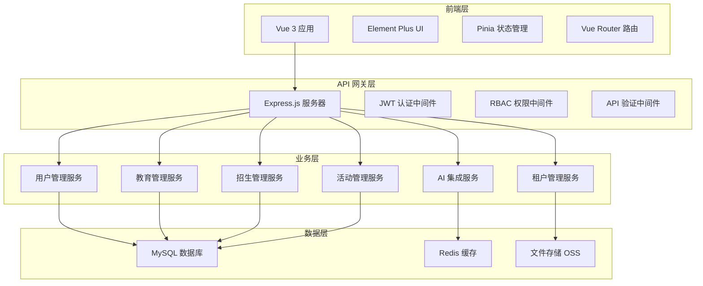

# 系统架构

## 🏗️ 整体架构

## 🎯 核心模块

### 统一租户架构
- **租户管理中心** (`rent.yyup.cc`)
- **租户业务系统** (`k.yyup.cc`)
- **跨租户认证** 和 **数据隔离**

### 动态权限系统
- **三级权限层次**：一级类目 → 二级页面 → 三级组件
- **动态路由**：基于权限的路由生成
- **细粒度控制**：页面级和功能级权限

### AI 集成架构
- **记忆系统**：六维记忆模型
- **智能助手**：多提供商 AI 模型
- **数据分析**：AI 渗透到各业务环节

## 📊 技术指标

- **代码规模**: ~150k 行
- **Vue 组件**: 80+ 个
- **页面数量**: 162+ 个
- **API 端点**: 155+ 个
- **数据模型**: 73+ 个
- **权限记录**: 95+ 个

---
*详细文档请参考 [Development Guide](Development-Guide.md)*
